# Cloudflare: A Comprehensive Practical Guide

_Last updated: 2026-03-21_

This guide explains Cloudflare from the practical operator view:

- where it sits in your architecture
- what each major product family is for
- how WAF, Tunnel, Access, and WARP fit together
- when Zero Trust and SASE matter
- how to start without overcomplicating the rollout

---

## Table of contents

1. [What Cloudflare is](#what-cloudflare-is)
2. [How Cloudflare works](#how-cloudflare-works)
3. [Cloudflare product map](#cloudflare-product-map)
4. [Who should use Cloudflare](#who-should-use-cloudflare)
5. [Common ways to start using Cloudflare](#common-ways-to-start-using-cloudflare)
6. [Path A: Put an existing website behind Cloudflare](#path-a-put-an-existing-website-behind-cloudflare)
7. [Path B: Publish a local or private service with Cloudflare Tunnel](#path-b-publish-a-local-or-private-service-with-cloudflare-tunnel)
8. [Path C: Deploy a frontend or full-stack app on Cloudflare Pages / Workers](#path-c-deploy-a-frontend-or-full-stack-app-on-cloudflare-pages--workers)
9. [Path D: Use Cloudflare R2 object storage](#path-d-use-cloudflare-r2-object-storage)
10. [Path E: Use Cloudflare Zero Trust for internal access](#path-e-use-cloudflare-zero-trust-for-internal-access)
11. [Path F: Use 1.1.1.1 / WARP as an individual](#path-f-use-1111--warp-as-an-individual)
12. [WAF explained simply](#waf-explained-simply)
13. [Zero Trust and SASE mental model](#zero-trust-and-sase-mental-model)
14. [Security fundamentals and best practices](#security-fundamentals-and-best-practices)
15. [Performance and caching fundamentals](#performance-and-caching-fundamentals)
16. [Developer platform overview](#developer-platform-overview)
17. [Pricing and plan selection guidance](#pricing-and-plan-selection-guidance)
18. [When Cloudflare is a good fit and when it is not](#when-cloudflare-is-a-good-fit-and-when-it-is-not)
19. [Troubleshooting checklist](#troubleshooting-checklist)
20. [Suggested learning path](#suggested-learning-path)
21. [Example adoption blueprints](#example-adoption-blueprints)
22. [Common mistakes to avoid](#common-mistakes-to-avoid)
23. [Glossary](#glossary)
24. [Recommended "first 30 minutes" checklist](#recommended-first-30-minutes-checklist)
25. [How to decide what to try first](#how-to-decide-what-to-try-first)
26. [Official references](#official-references)

---

## What Cloudflare is

Cloudflare is an edge network and application platform. Sometimes it sits in front of your existing servers. Sometimes it becomes the platform where parts of the application itself run.

In practical terms, Cloudflare can be:

- your DNS provider
- your reverse proxy and CDN
- your TLS and WAF layer
- your DDoS and rate-limiting layer
- your Zero Trust access layer
- your serverless app platform
- your object storage and edge data platform
- your personal DNS/privacy client through 1.1.1.1 and WARP

The simplest mental model is:

> Cloudflare is the globally distributed layer between users, applications, and private infrastructure.

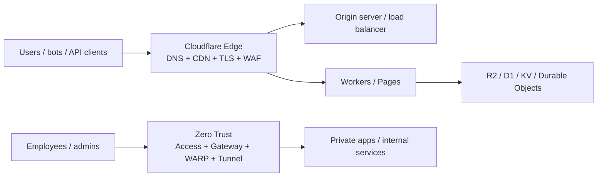

---

## How Cloudflare works

At a high level, Cloudflare usually fits into one of four models.

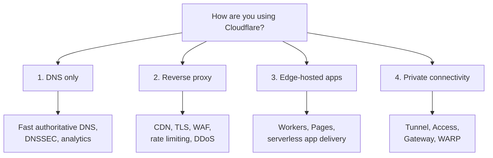

### 1. DNS only

You use Cloudflare as your authoritative DNS provider, but traffic still goes directly to your origin.

Use this when you want:

- faster DNS
- centralized record management
- DNSSEC
- no reverse-proxy behavior yet

### 2. Reverse proxy for web traffic

You proxy `A`, `AAAA`, or `CNAME` records. Users connect to Cloudflare first, then Cloudflare forwards the request to your origin.

This enables:

- CDN caching
- SSL/TLS management
- WAF
- bot and DDoS protection
- request rules and edge behavior

### 3. Edge-hosted applications

Instead of only protecting an origin, you deploy code directly on Cloudflare through Workers, Pages, and related data products.

This enables:

- serverless APIs
- frontend hosting
- middleware and request transformation
- background jobs and globally distributed app logic

### 4. Private connectivity and Zero Trust

Instead of exposing a service publicly, you connect private apps, networks, or users to Cloudflare with Tunnel, Access, Gateway, and WARP.

This enables:

- replacing VPN-heavy patterns
- identity-aware access
- outbound-only connectors
- filtering and securing user Internet traffic

### What a proxied request looks like

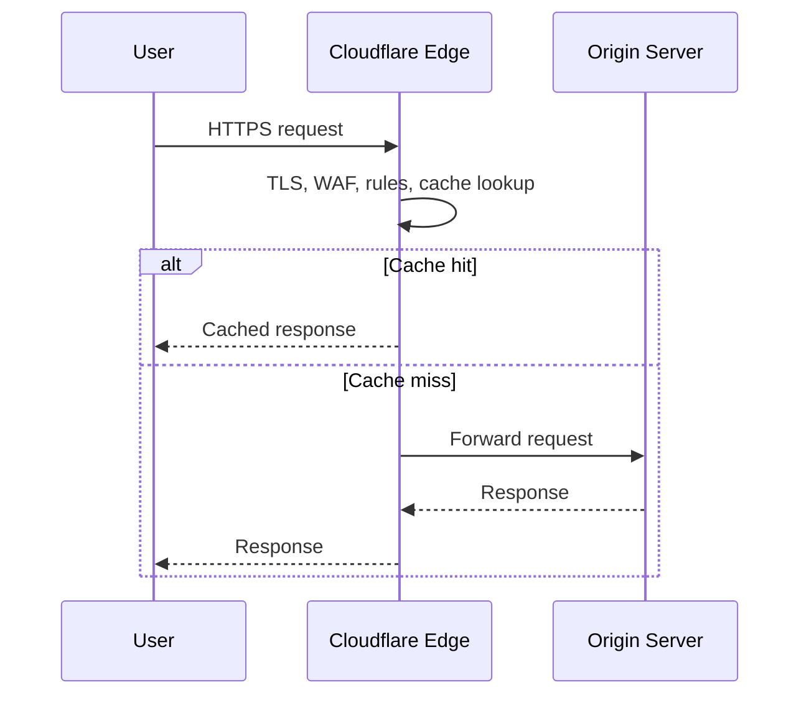

---

## Cloudflare product map

Cloudflare has a wide surface area. It becomes easier to understand if you group products by architectural role.

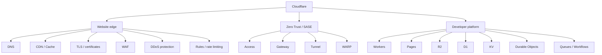

### Core website and network services

- **DNS**: authoritative DNS for your domain
- **Proxy / CDN / Cache**: reverse proxy and edge caching
- **SSL/TLS**: certificates and encrypted traffic management
- **WAF and rules**: HTTP request filtering and policy logic
- **DDoS protection**: network and app-layer mitigation

### Zero Trust and private connectivity

- **Access**: who can reach an app
- **Tunnel**: how a private app reaches Cloudflare without opening inbound ports
- **Gateway**: how user traffic is filtered on the way out
- **WARP**: how endpoints route traffic through policy enforcement

### Developer platform

- **Workers**: serverless edge compute
- **Pages**: frontend and static deployment
- **R2**: object storage
- **KV**: global read-heavy key-value data
- **Durable Objects**: coordinated stateful compute
- **D1**: SQL app data
- **Queues / Workflows**: background processing and orchestration

---

## Who should use Cloudflare

Cloudflare is useful for several very different audiences.

### Website owners

You want:

- better global performance
- HTTPS and certificate management
- WAF and bot protection
- DNS management
- DDoS mitigation

### Developers and startups

You want:

- frontend hosting
- serverless APIs
- edge logic
- storage and data services that sit near the app platform

### IT and security teams

You want:

- secure access to private apps
- less public exposure
- fewer VPN dependencies
- traffic filtering and identity-aware access control

### Individuals

You want:

- faster DNS
- privacy-minded DNS resolution
- a simpler secure connectivity client on your laptop or phone

---

## Common ways to start using Cloudflare

Most people should begin with the path that matches the outcome they want this week.

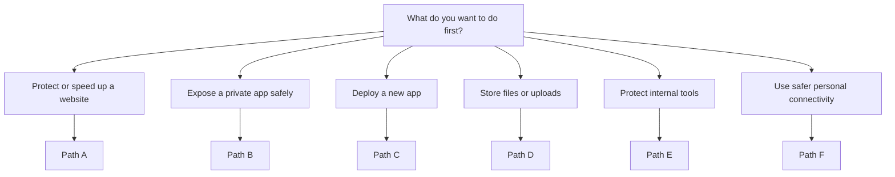

1. **Website path**: move DNS and proxy your domain through Cloudflare.
2. **Private service path**: expose an internal or local app through Cloudflare Tunnel.
3. **Developer path**: deploy a site or API with Pages or Workers.
4. **Storage path**: create an R2 bucket for assets or uploads.
5. **Zero Trust path**: protect internal apps behind Access.
6. **Personal path**: install 1.1.1.1 / WARP on a device.

If you are unsure where to begin, choose the one closest to your immediate goal:

- "I want to speed up and protect my website" -> Path A
- "I want to access a private/local app from the Internet safely" -> Path B
- "I want to deploy a new app" -> Path C
- "I need cloud object storage" -> Path D
- "I want SSO-gated access to internal apps" -> Path E
- "I want private DNS / safer browsing on my laptop or phone" -> Path F

---

## Path A: Put an existing website behind Cloudflare

This is the most common entry point.

### What happens architecturally

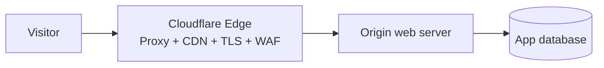

### What you need

- a Cloudflare account
- a domain you control
- access to your registrar or nameserver settings
- a working origin server or hosting provider

### What happens during setup

1. Add your domain to Cloudflare.
2. Cloudflare scans common DNS records.
3. Review and fix DNS records.
4. Update nameservers at your registrar.
5. Decide which records should be proxied.
6. Configure SSL/TLS mode.
7. Test the site.
8. Enable security and caching gradually.

### Proxied vs DNS-only records

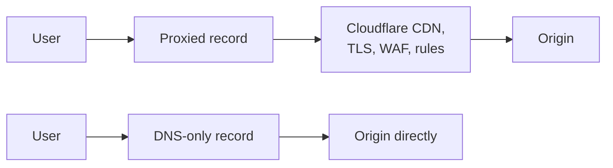

A proxied record sends web traffic through Cloudflare. This is where CDN, WAF, DDoS protection, rate limiting, and many rules apply.

A DNS-only record resolves directly to your origin and does not receive reverse-proxy protections.

### Recommended first settings

For a normal website:

- keep your main `A`, `AAAA`, or `CNAME` for `www` proxied
- use **Full (strict)** SSL/TLS if your origin has a valid certificate or Origin CA setup
- turn on automatic HTTPS redirects if appropriate
- enable WAF managed rules
- start with conservative caching rules
- set up DNSSEC if your registrar setup is clean

### SSL/TLS mode guidance

- **Flexible**: avoid unless you have no other option
- **Full**: encrypted to the origin, but certificate validation is looser
- **Full (strict)**: best default for production

### Important caution

If the app is proxied through Cloudflare but the origin is still publicly reachable, attackers may bypass some protections by hitting the origin directly.

Consider:

- firewall rules that allow only Cloudflare IP ranges
- Tunnel where possible
- Access for admin or staging routes

### Good first-week rollout plan

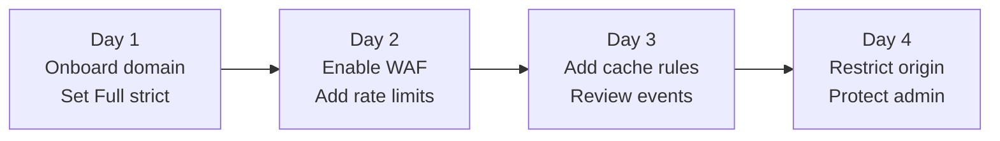

---

## Path B: Publish a local or private service with Cloudflare Tunnel

Cloudflare Tunnel is one of the easiest high-value products in the platform.

### Why use it

Instead of opening inbound firewall ports, you run `cloudflared` on your server or local machine. It creates outbound-only connections to Cloudflare, and Cloudflare routes traffic to your service.

This is excellent for:

- home lab dashboards
- internal web tools
- staging apps
- internal APIs
- SSH or RDP access patterns

### Basic concept

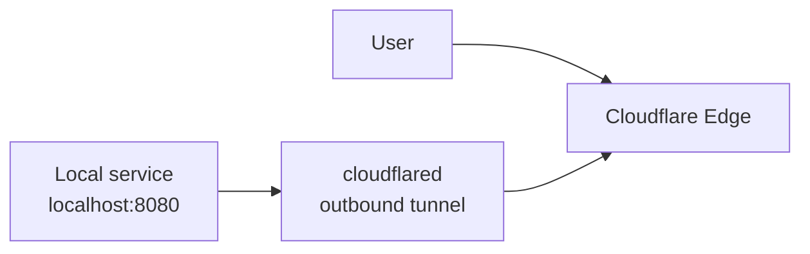

### Typical setup flow

1. Create or select a domain in Cloudflare.
2. Install `cloudflared` on the machine hosting the service.
3. Authenticate `cloudflared`.
4. Create a tunnel.
5. Map a hostname like `app.example.com` to the local service.
6. Start the tunnel.
7. Optionally protect the hostname with Access.

### Best-practice pattern

For sensitive services, combine Tunnel and Access.

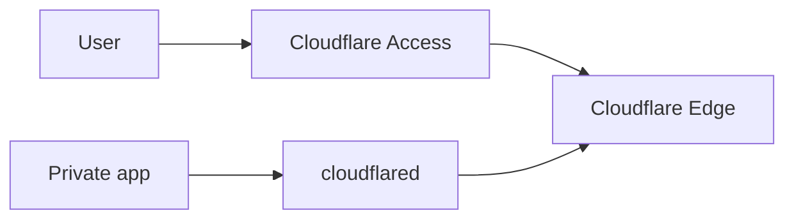

### When Tunnel is especially strong

Use Tunnel when you want:

- no public inbound ports
- a quick secure way to expose a development or internal app
- simpler origin security than a directly exposed server

---

## Path C: Deploy a frontend or full-stack app on Cloudflare Pages / Workers

This is the best path when you are building something new.

### Architecture pattern

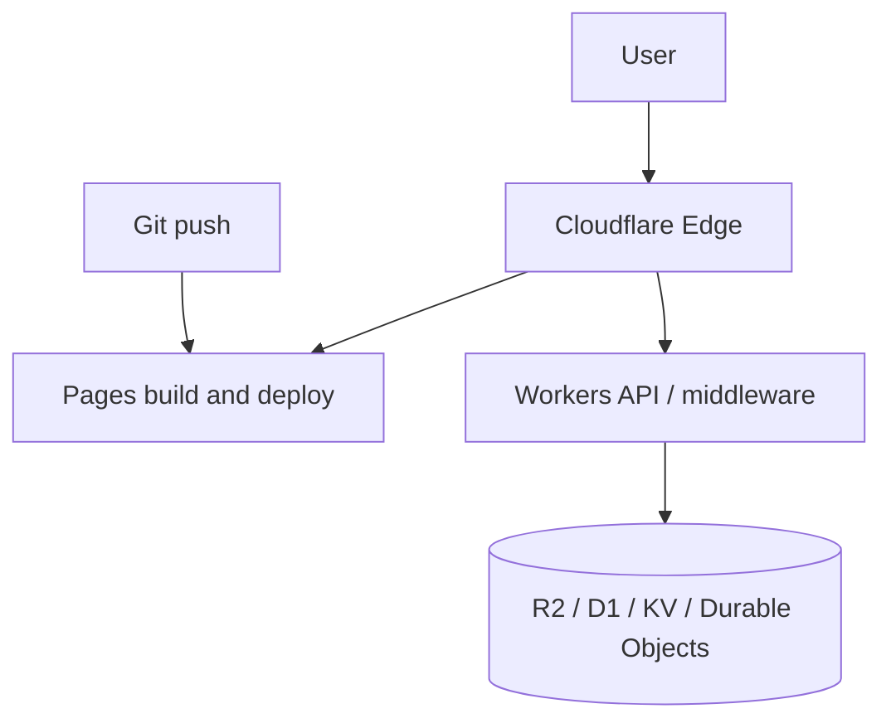

### Use Pages when

- you have a static site or framework frontend
- you want Git-based deploys and preview URLs
- you want simple hosting with optional functions

### Use Workers when

- you need request handlers or APIs
- you want edge logic close to users
- you need bindings to storage, queues, databases, or AI features
- you are building full-stack behavior directly on Cloudflare

### Typical Pages workflow

1. Create a repository.
2. Connect it to Cloudflare Pages, or use direct upload/C3.
3. Configure the build command and output directory.
4. Deploy to a `*.pages.dev` subdomain.
5. Attach your custom domain.
6. Enable preview deployments.

### Typical Workers workflow

1. Install Node.js.
2. Use the Cloudflare CLI workflow to create a project.
3. Run locally.
4. Configure bindings and secrets.
5. Deploy with the CLI.

### Common combinations

- **Pages only**: docs site, marketing site, frontend SPA
- **Workers only**: webhook endpoint, API gateway, signed URL service
- **Pages + Workers + data**: SaaS frontend, edge APIs, uploads, app state

---

## Path D: Use Cloudflare R2 object storage

R2 is Cloudflare's object storage service.

### A very common R2 pattern

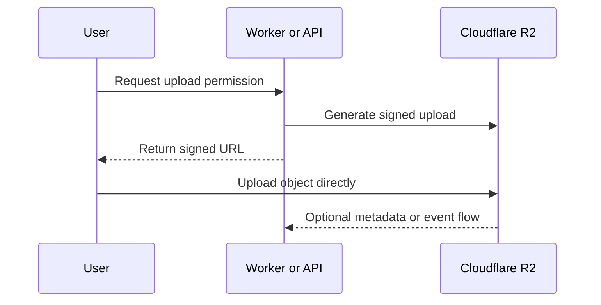

### Good use cases

- user uploads
- images and media assets
- build artifacts
- backups and archives
- application content storage

### Why people choose it

The appeal is usually:

- object storage integrated with the rest of Cloudflare
- good fit for uploads and public asset delivery
- cleaner application patterns when paired with Workers

### Typical setup flow

1. Create an R2 bucket.
2. Decide whether objects are private or public.
3. Upload via dashboard, CLI, S3-compatible tools, or Workers.
4. Optionally bind the bucket to a Worker.
5. Serve content intentionally through your application or public delivery pattern.

### Design notes

- R2 is object storage, not a file system
- object naming matters for organization
- access control design matters early
- binary data and metadata should be designed together

---

## Path E: Use Cloudflare Zero Trust for internal access

If you manage internal tools, this may be the most valuable part of Cloudflare.

### Main components

- **Access**: who can reach an app
- **Tunnel**: how the app connects to Cloudflare
- **Gateway**: what user traffic can reach on the Internet
- **WARP**: how devices route traffic into policy enforcement

### A very common first deployment

Protect an internal dashboard without opening it publicly.

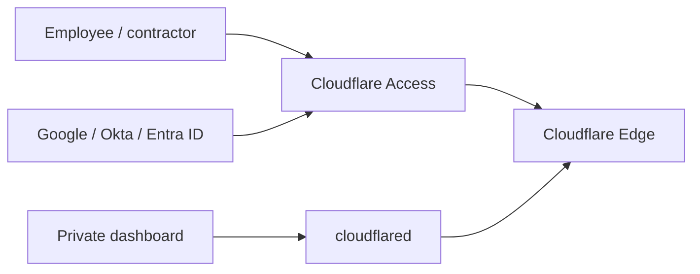

### Why teams like this model

- access is per app, not per network
- the origin does not need to be publicly open
- login can be delegated to your identity provider
- policy can include user, group, device, and context

### Good first targets for Access

- `/admin`
- `/staging`
- Grafana, Kibana, Jenkins, internal wiki, BI dashboards
- SSH access patterns
- private APIs

### Zero Trust onboarding notes

During initial setup, you create a team domain such as `your-team.cloudflareaccess.com`, connect an identity provider, and define access policies.

---

## Path F: Use 1.1.1.1 / WARP as an individual

This is the simplest way for a non-admin to use Cloudflare.

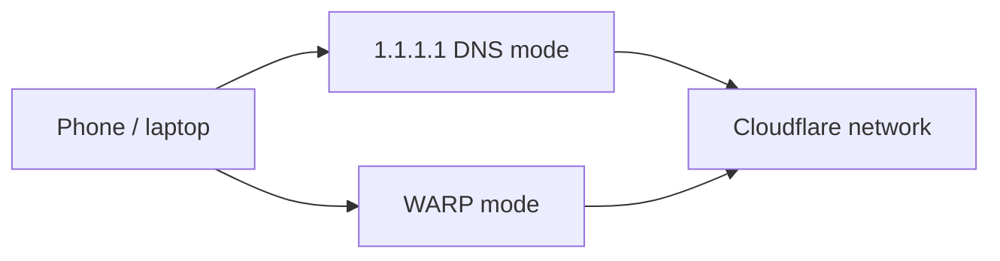

### 1.1.1.1

A public DNS resolver intended to improve speed and privacy compared with many default ISP DNS setups.

### WARP

A client that can route device traffic in ways intended to improve privacy and security. It is not best understood as a generic geo-unblocking VPN.

### Good use cases

- safer browsing on public Wi-Fi
- privacy-minded DNS usage
- simplified security for a personal device

---

## WAF explained simply

WAF stands for **Web Application Firewall**.

### Simple definition

A WAF protects your website or API from malicious HTTP/HTTPS traffic by inspecting and filtering requests before they reach your server.

### Where it sits

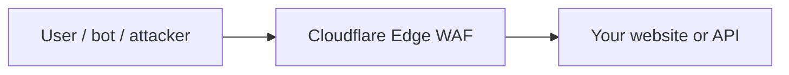

Think of it as a security guard in front of your app:

- every request goes through the WAF first
- the WAF checks if it looks dangerous
- if yes, it can block or challenge it
- if no, it forwards the request to the origin

### What the WAF actually does

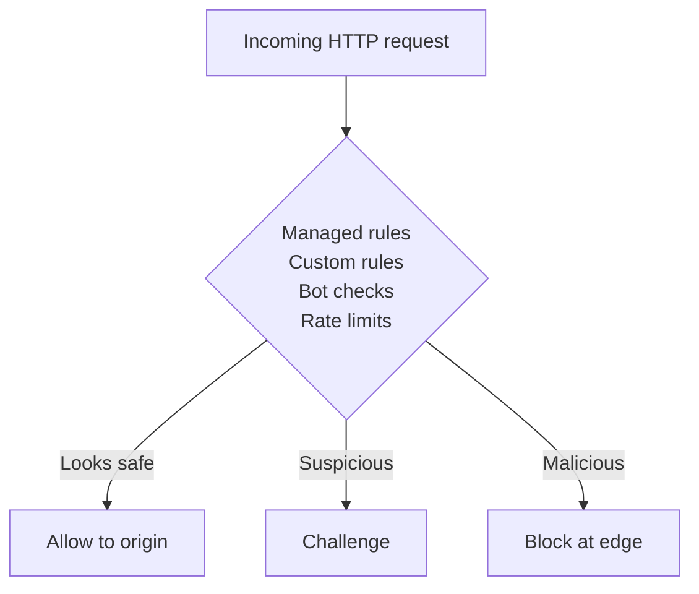

### What kinds of attacks it helps stop

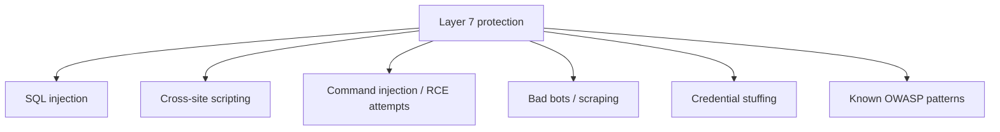

### Without WAF vs with WAF

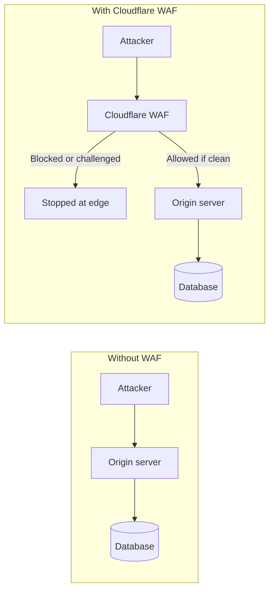

### Key Cloudflare WAF features

- managed rulesets for common attack patterns
- custom rules for your own logic
- bot protection
- rate limiting
- challenge pages such as JS or CAPTCHA-style checks

### Conceptual rule examples

```text
if request.query contains "SELECT * FROM"
-> block
```

```text
if country is unusual AND requests > 100/min
-> challenge
```

### Important nuance

A WAF is important, but it does not replace secure coding.

You still need:

- input validation
- authentication and authorization
- secure backend design
- patching and dependency hygiene

---

## Zero Trust and SASE mental model

These two are related, but they are not the same thing.

### Zero Trust: the core idea

Zero Trust is a security model built around one rule:

> Never trust, always verify.

### Traditional perimeter model

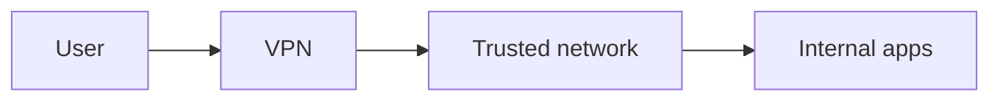

In this model, once someone is "inside", they are often trusted too broadly.

### Zero Trust model

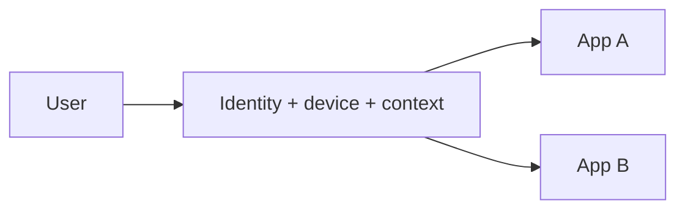

In this model:

- every request is verified
- there is no implicitly trusted network
- access is per app, per user, per request

### What Zero Trust checks

```mermaid
flowchart TB
    Request[Access request] --> Identity[Identity]
    Request --> Device[Device posture]
    Request --> Location[Location / IP]
    Request --> Context[Time / behavior / risk]
    Identity --> Decision[Allow / deny / step-up]
    Device --> Decision
    Location --> Decision
    Context --> Decision
```

### Cloudflare Zero Trust components

```mermaid
flowchart TB
    ZT[Cloudflare Zero Trust] --> Access[Access]
    ZT --> Gateway[Gateway]
    ZT --> WARP[WARP]
    ZT --> Tunnel[Tunnel]
```

### SASE: the broader architecture

SASE stands for **Secure Access Service Edge**. It is a cloud-delivered architecture that combines networking and security into one service plane.

```mermaid
flowchart LR
    User[Remote user] --> WARP[WARP client]
    Branch[Branch office] --> Edge[SASE edge\nZero Trust + Gateway + security]
    WARP --> Edge
    Edge --> Internet[Internet]
    Edge --> SaaS[SaaS apps]
    Edge --> Internal[Private apps]
```

### Key difference

| Concept | Meaning |
| --- | --- |
| **Zero Trust** | A security philosophy and access model |
| **SASE** | A broader cloud architecture that implements Zero Trust plus networking and security services |

Think of it like this:

- Zero Trust = the rule
- SASE = the system that enforces the rule at scale

### Where WAF fits

WAF protects public websites and APIs at the application layer.

Zero Trust and SASE protect internal access, user traffic, and broader identity-aware connectivity patterns.

They are complementary, not competing tools.

---

## Security fundamentals and best practices

This is where Cloudflare deployments become either genuinely strong or only partially complete.

### Separate public, admin, and internal surfaces

```mermaid
flowchart LR
    PublicUsers[Public users] --> Edge[Cloudflare proxy]
    Edge --> PublicApp[Public app]

    Admins[Admins] --> Access[Cloudflare Access]
    Access --> AdminApp[Admin / staging]

    InternalSvc[Private services] --> Tunnel[cloudflared]
    Tunnel --> Edge
```

### 1. Prefer Full (strict) SSL/TLS

Avoid insecure origin configurations.

### 2. Protect the origin, not just the edge

If your origin stays openly reachable, attackers may bypass Cloudflare controls.

Practical options:

- allowlist Cloudflare IP ranges at the firewall or load balancer
- use Tunnel instead of public ingress where possible
- require Access for sensitive paths and apps

### 3. Turn on managed WAF rules early

Start with managed protections before building lots of custom rules.

### 4. Add rate limiting to attack-prone endpoints

Especially:

- login
- signup
- password reset
- search
- contact forms
- token and OTP endpoints
- API routes vulnerable to abuse

### 5. Review logs and analytics after enabling protections

Security controls should be observed, not merely enabled.

### 6. Do not over-block on day one

Roll out in stages and watch for false positives.

### 7. Use Access for admin paths and internal tools

Protecting `/admin`, dashboards, and staging apps with identity checks is often one of the highest-value steps you can take.

---

## Performance and caching fundamentals

Cloudflare can improve speed, but only when caching is configured intentionally.

### Cache hit vs cache miss

```mermaid
sequenceDiagram
    participant User
    participant CF as Cloudflare cache
    participant Origin

    User->>CF: GET /app.js
    alt Cache hit
        CF-->>User: Return cached asset
    else Cache miss
        CF->>Origin: Fetch asset
        Origin-->>CF: Asset + cache headers
        CF-->>User: Return response
    end
```

### What Cloudflare caches well

- images
- CSS
- JavaScript
- fonts
- static downloads
- versioned assets

### What requires more thought

- dynamic HTML
- authenticated content
- personalized pages
- API responses

### Good performance practices

- use cache-friendly asset versioning
- enable compression where appropriate
- set sensible cache headers from the origin
- create cache rules deliberately instead of guessing
- measure results instead of assuming the edge fixed everything automatically

### Common mistake

People often expect "putting a site behind Cloudflare" to optimize everything automatically. In reality, the best results come from good origin headers, selective edge caching, and measurement.

---

## Developer platform overview

Cloudflare's developer platform is broad. The practical question is usually not "What exists?" but "Which product matches my workload?"

```mermaid
flowchart TD
    Need[What do you need?] --> Files[Files and media]
    Files --> R2[R2]

    Need --> ReadHeavy[Global read-heavy key/value]
    ReadHeavy --> KV[KV]

    Need --> Coord[Single logical coordinator]
    Coord --> DO[Durable Objects]

    Need --> SQL[Cloudflare-native SQL]
    SQL --> D1[D1]

    Need --> ExistingDB[Existing external database]
    ExistingDB --> Hyperdrive[Hyperdrive]

    Need --> Compute[Request-time code]
    Compute --> Workers[Workers]

    Need --> Frontend[Frontend deployment]
    Frontend --> Pages[Pages]
```

### Workers

Use for:

- APIs
- middleware
- redirects
- request transformation
- application backends

### Pages

Use for:

- frontend deployment
- static hosting
- preview workflows

### KV

Use for globally distributed read-heavy key-value data.

### Durable Objects

Use when you need strongly coordinated, stateful logic for rooms, counters, sessions, or real-time coordination.

### D1

Use when you want SQL-style application data with Cloudflare-native ergonomics.

### Hyperdrive

Use when you already have a database elsewhere and want Workers to talk to it more efficiently.

### R2

Use for object storage.

### Queues / Workflows

Use for asynchronous jobs, pipelines, and orchestrated flows.

---

## Pricing and plan selection guidance

Cloudflare offers multiple plan tiers across website services, while developer and Zero Trust products may have their own pricing dimensions.

### Free plan

Good for:

- personal websites
- hobby projects
- very small production sites
- learning Cloudflare

### Pro plan

Good for:

- professional websites
- startups
- sites that need stronger security and more tuning than Free

### Business plan

Good for:

- revenue-generating sites
- teams that need stronger support and operational control

### Enterprise

Good for:

- large organizations
- advanced contractual or compliance requirements
- complex security or network architecture

### Selection advice

Choose based on:

- traffic criticality
- support expectations
- WAF and rules complexity
- compliance needs
- operational risk tolerance

Start smaller unless business risk clearly justifies more.

---

## When Cloudflare is a good fit and when it is not

### Strong fit

Cloudflare is usually a strong fit when you want:

- a simple way to accelerate and protect a public website
- authoritative DNS plus reverse proxy in one platform
- app-level Zero Trust for internal resources
- edge or serverless deployment close to users
- object storage integrated with app delivery
- fewer publicly exposed origins

### Less ideal or needs extra evaluation

Cloudflare may be a weaker fit when:

- you need highly specialized legacy networking patterns
- your application assumes a traditional server-first hosting model everywhere
- your compliance or residency constraints need a very specific architecture review

Mixed architecture is often the right answer.

---

## Troubleshooting checklist

### DNS problems

Check:

- nameservers are correctly updated at the registrar
- records were imported correctly
- proxied vs DNS-only settings are intentional
- propagation expectations are realistic

### SSL/TLS problems

Check:

- SSL/TLS mode matches origin certificate reality
- origin certificate validity
- redirect loops from mismatched origin and Cloudflare settings
- whether both the origin and Cloudflare are forcing redirects in conflicting ways

### Site works unproxied but fails when proxied

Check:

- origin firewall rules
- client IP assumptions at the application layer
- unsupported traffic type on a proxied hostname
- host header handling at the origin

### Tunnel problems

Check:

- `cloudflared` authentication and tunnel config
- local service is actually listening
- hostname mapping is correct
- local firewall or OS security restrictions if relevant

### Access problems

Check:

- identity provider configuration
- user and group mapping
- policy order and precedence
- callback and redirect URI correctness

### Cache problems

Check:

- origin cache headers
- cache rules and bypass rules
- cookies or auth causing bypass
- asset URL versioning strategy

---

## Suggested learning path

If you want to really learn Cloudflare without getting overwhelmed, use a staged path.

```mermaid
flowchart LR
    L1[Level 1\nEdge model] --> L2[Level 2\nPublic website]
    L2 --> L3[Level 3\nPrivate resources]
    L3 --> L4[Level 4\nBuild on platform]
    L4 --> L5[Level 5\nPlatform-native architecture]
```

### Level 1: understand the edge model

Learn:

- DNS
- proxied vs DNS-only records
- SSL/TLS modes
- CDN and cache basics
- WAF basics

### Level 2: operate a public website safely

Do:

- onboard a domain
- enable Full (strict)
- turn on managed WAF rules
- add rate limiting
- review analytics and security events

### Level 3: secure private resources

Do:

- publish a service through Tunnel
- put Access in front of it
- add identity provider integration

### Level 4: build on the platform

Do:

- deploy a site with Pages
- deploy an API with Workers
- add R2 or another data service

### Level 5: adopt platform-native architecture

Explore:

- Durable Objects
- D1 / KV / Hyperdrive tradeoffs
- Queues / Workflows
- observability and scaling patterns

---

## Example adoption blueprints

These blueprints show how the pieces usually fit together in the real world.

### Blueprint 1: small business website

```mermaid
flowchart LR
    Visitors[Visitors] --> CF[DNS + Proxy + WAF]
    CF --> Site[Website origin]
    Admin[Admin] --> Access[Access for /admin]
    Access --> Site
```

Use:

- Cloudflare DNS
- proxied web records
- Full (strict)
- WAF managed rules
- basic caching rules
- Access for `/admin`

Outcome:

- faster site
- safer public exposure
- simpler HTTPS and basic hardening

### Blueprint 2: startup SaaS app

```mermaid
flowchart LR
    User[User] --> Pages[Pages frontend]
    User --> Worker[Workers API]
    Worker --> D1[(D1)]
    Worker --> R2[(R2 uploads)]
    Team[Internal team] --> Access[Access]
    Access --> Tunnel[Tunnel to internal tools]
```

Use:

- DNS + proxy + WAF
- Pages for frontend
- Workers for APIs and middleware
- R2 for uploads
- Access for internal dashboards
- Tunnel for private internal tooling

Outcome:

- clean split between public app and internal tooling
- modern app stack with fewer exposed services

### Blueprint 3: internal tool without VPN friction

```mermaid
flowchart LR
    User[Employee] --> Access[Access]
    IdP[Identity provider] --> Access
    Tool[Internal tool] --> Tunnel[cloudflared]
    Tunnel --> Access
```

Use:

- Tunnel
- Access
- identity provider integration
- optional WARP for device-aware policies

Outcome:

- secure internal web access without broad network exposure

---

## Common mistakes to avoid

1. Using Flexible SSL in production when better options exist.
2. Turning on Cloudflare without restricting direct origin exposure.
3. Expecting automatic caching of dynamic or personalized content.
4. Creating too many custom rules before understanding the defaults.
5. Treating WARP like a generic consumer streaming VPN.
6. Publishing sensitive services with Tunnel but skipping Access.
7. Choosing data products without matching them to access patterns.
8. Migrating too many features at once instead of staging the rollout.

---

## Glossary

### Anycast

A routing approach where users are directed to a nearby network location advertising the same IP ranges.

### Proxied record

A DNS record whose web traffic is routed through Cloudflare's reverse proxy.

### Origin

The upstream server or service that actually serves your application or content.

### Edge

Cloudflare's distributed network locations where traffic handling, caching, and code execution can occur.

### WAF

Web Application Firewall. Filters malicious or unwanted web requests.

### Tunnel

A secure outbound connector from your infrastructure to Cloudflare.

### Access

Identity-aware control over who can reach an application.

### Worker

A Cloudflare serverless program that handles requests or background tasks.

### R2 bucket

A container for storing objects in Cloudflare R2.

### Team domain

Your Zero Trust organization subdomain, such as `example.cloudflareaccess.com`.

### SASE

Secure Access Service Edge. A cloud architecture that combines networking and security services into one edge-delivered platform.

---

## Recommended "first 30 minutes" checklist

If you want a practical first session with Cloudflare, do this.

### For a website owner

- create account
- add domain
- verify DNS import
- switch nameservers
- set SSL/TLS to Full (strict)
- proxy `www`
- test site
- enable WAF managed rules

### For a developer

- create account
- deploy a simple Pages project
- deploy a hello-world Worker
- create an R2 bucket
- read about bindings and environment secrets

### For an internal tool admin

- create account or Zero Trust org
- set up a team domain
- connect an identity provider
- install `cloudflared`
- publish one internal app via Tunnel
- protect it with Access

### For an individual

- install the 1.1.1.1 / WARP app
- choose an appropriate mode
- verify connectivity and DNS behavior

---

## How to decide what to try first

Ask yourself one question:

### "What outcome do I want this week?"

- faster and safer website -> onboard your domain
- safer way to expose an internal app -> Tunnel + Access
- new app deployment workflow -> Pages + Workers
- file or object storage -> R2
- personal privacy or security on a device -> WARP

That is the best way to avoid getting lost in the size of the platform.

---

## Official references

This guide is based on Cloudflare's official documentation and product pages. The most useful reference areas to read next are:

- DNS and domain onboarding
- SSL/TLS and Origin CA
- WAF, rate limiting, and security analytics
- Tunnel and Access
- Gateway and WARP
- Pages, Workers, and R2
