# Cloudflare Architecture Examples with Mermaid Diagrams

> A practical guide to common architecture patterns you can build **with Cloudflare**, including websites, APIs, Zero Trust access, media delivery, edge applications, event-driven systems, and SaaS platforms.
>
> This guide is based on Cloudflare's current official product and reference-architecture documentation as of **2026-03-21**.

---

## Table of Contents

1. [How to read these architectures](#how-to-read-these-architectures)
2. [Cloudflare building blocks](#cloudflare-building-blocks)
3. [Pattern 1: Proxying a traditional website through Cloudflare](#pattern-1-proxying-a-traditional-website-through-cloudflare)
4. [Pattern 2: Static site on Pages with dynamic APIs on Workers](#pattern-2-static-site-on-pages-with-dynamic-apis-on-workers)
5. [Pattern 3: Global API at the edge with Workers + KV](#pattern-3-global-api-at-the-edge-with-workers--kv)
6. [Pattern 4: Stateful real-time app with Durable Objects](#pattern-4-stateful-real-time-app-with-durable-objects)
7. [Pattern 5: File uploads and user-generated content with R2](#pattern-5-file-uploads-and-user-generated-content-with-r2)
8. [Pattern 6: Image optimization pipeline with R2 + Image Resizing + cache](#pattern-6-image-optimization-pipeline-with-r2--image-resizing--cache)
9. [Pattern 7: Event-driven background processing with Workers + Queues](#pattern-7-event-driven-background-processing-with-workers--queues)
10. [Pattern 8: Edge frontend + relational data with Workers/Pages + D1](#pattern-8-edge-frontend--relational-data-with-workerspages--d1)
11. [Pattern 9: Edge app with external database via Hyperdrive](#pattern-9-edge-app-with-external-database-via-hyperdrive)
12. [Pattern 10: Zero Trust access to private apps with Tunnel + Access](#pattern-10-zero-trust-access-to-private-apps-with-tunnel--access)
13. [Pattern 11: Secure Internet egress and SaaS protection with Zero Trust](#pattern-11-secure-internet-egress-and-saas-protection-with-zero-trust)
14. [Pattern 12: Multi-tenant SaaS platform with Workers for Platforms](#pattern-12-multi-tenant-saas-platform-with-workers-for-platforms)
15. [Pattern 13: Hybrid origin protection with CDN + WAF + DDoS + Load Balancing](#pattern-13-hybrid-origin-protection-with-cdn--waf--ddos--load-balancing)
16. [Pattern 14: AI application at the edge with Workers AI + Vectorize + R2](#pattern-14-ai-application-at-the-edge-with-workers-ai--vectorize--r2)
17. [Pattern 15: SASE-style enterprise architecture](#pattern-15-sase-style-enterprise-architecture)
18. [How to choose the right data product](#how-to-choose-the-right-data-product)
19. [Reference architectures by use case](#reference-architectures-by-use-case)
20. [Common mistakes and anti-patterns](#common-mistakes-and-anti-patterns)
21. [A simple path to try Cloudflare quickly](#a-simple-path-to-try-cloudflare-quickly)

---

## How to read these architectures

Each pattern includes:

- **When to use it**
- **Why Cloudflare fits**
- **A Mermaid diagram**
- **Key services involved**
- **Strengths and tradeoffs**

These are **reference patterns**, not rigid templates. Most production systems combine multiple patterns.

---

## Cloudflare building blocks

Before the examples, it helps to group Cloudflare into a few architectural layers:

### 1) Edge network and application services

- DNS
- CDN / cache
- TLS
- WAF
- DDoS protection
- Rate limiting
- Load Balancing
- Argo / traffic optimization

### 2) Developer platform

- Workers
- Pages
- Durable Objects
- KV
- D1
- R2
- Queues
- Hyperdrive
- Workflows
- Vectorize
- Workers AI

### 3) Zero Trust / SASE

- Access
- Gateway
- Tunnel
- Browser Isolation
- CASB and SaaS controls
- WARP client

### 4) Network services

- Magic Transit
- Magic WAN
- Cloudflare One connectivity patterns

A useful mental model is:

- **Use Cloudflare proxy features** when you want to accelerate and protect traffic to an origin.
- **Use Workers/Pages** when you want to run code or host application logic on Cloudflare.
- **Use Zero Trust** when you want to control who can reach private apps, internal services, or the public Internet.
- **Use the storage/data products together**, not as mutually exclusive choices.

---

## Pattern 1: Proxying a traditional website through Cloudflare

### When to use it

You already have a website running on a VM, VPS, container platform, or traditional load balancer and want better performance and security without replatforming.

### Why Cloudflare fits

This is the most common entry point: point your DNS at Cloudflare, proxy your public records, and let Cloudflare sit in front of the origin for caching, TLS termination, WAF, and DDoS protection.

### Diagram

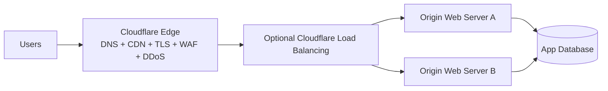

### Services involved

- Cloudflare DNS
- Proxy (orange-cloud)
- CDN/cache
- WAF / rate limiting / DDoS
- Load Balancing (optional)

### Strengths

- Fastest way to start using Cloudflare
- Improves resilience and origin offload
- Keeps your current hosting model

### Tradeoffs

- Your application still depends on the origin’s architecture
- Dynamic pages may need careful cache rules
- Origin hardening is still required

### Good fit

- WordPress, Drupal, Laravel, Rails, Express, Django, Spring, PHP apps

---

## Pattern 2: Static site on Pages with dynamic APIs on Workers

### When to use it

You want a JAMstack-style site or frontend app with dynamic APIs close to users.

### Diagram

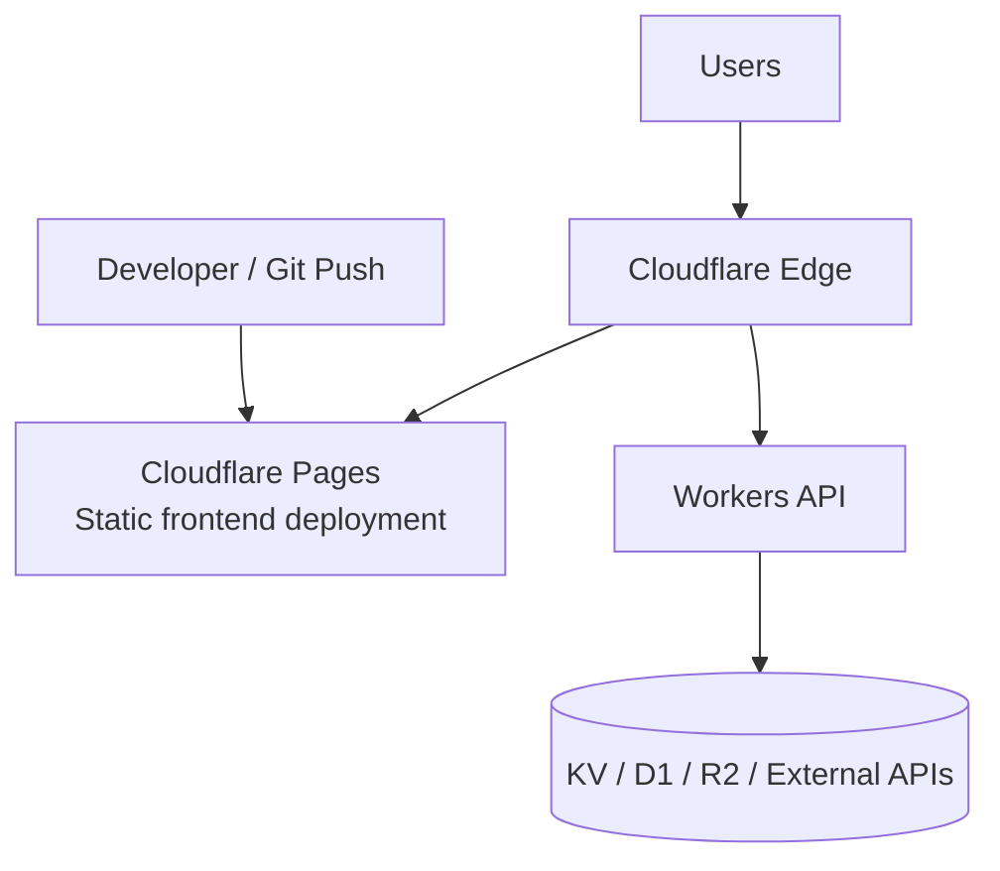

### Why this works well

Pages is ideal for deploying static assets and frontend frameworks, while Workers handles API routes, auth flows, feature flags, personalization, and backend integrations.

### Strengths

- Very fast global delivery for frontend assets
- Simple separation of frontend and backend concerns
- Easy CI/CD from Git

### Tradeoffs

- Full-stack complexity grows if you mix too many backend patterns too early
- You still need to choose the right data backend for your workload

### Typical examples

- Marketing sites with forms
- Docs portals
- Product frontends with a lightweight backend
- Admin dashboards

---

## Pattern 3: Global API at the edge with Workers + KV

### When to use it

You need a globally distributed API with **read-heavy** access patterns: config, flags, routing rules, session-adjacent data, cached API lookups, or edge personalization.

### Diagram

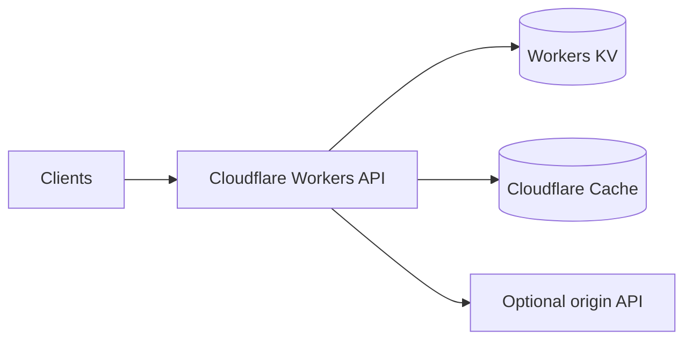

### Why Cloudflare fits

Workers runs code globally; KV provides globally distributed, low-latency reads and is particularly well suited for read-heavy workloads.

### Strengths

- Great latency worldwide
- Easy to scale for spikes
- Excellent for flags, config, routing, token lookup, content fragments

### Tradeoffs

- KV is not the right fit for strongly consistent transactional writes
- You need to design around eventual propagation patterns for some use cases

### Use this for

- A/B testing configuration
- Edge redirects and personalization
- API response caching and normalization
- Feature flag distribution

### Avoid this for

- Financial ledgers
- Strictly transactional workflows
- Single-record lock/coordination problems

### Private machine-to-machine variant: Worker APIs with no anonymous access

This is the pattern to use when your Worker API is **not** for browsers or public clients. Instead, it should only be called by:

- your external backend programs
- scheduled jobs
- CI/CD systems
- partner backends you explicitly trust
- other Workers you control

The design goal is simple:

> The API should return `403` or be blocked unless the caller is an explicitly authenticated machine.

### Recommended architecture

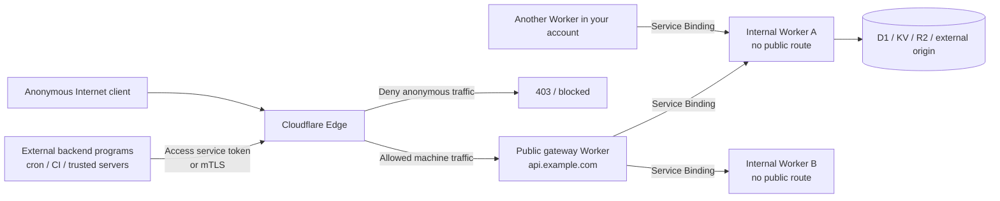

### Best default design

Use a **two-layer model**:

1. **One public entry Worker** on a stable API hostname such as `api.example.com`.
2. **Several internal Worker services** behind Service Bindings.

In this model:

- external backend programs call only the public entry Worker
- the public entry Worker authenticates and authorizes the machine caller
- internal Workers are not exposed to the public Internet
- other Workers call internal Workers through Service Bindings instead of public URLs

This keeps your machine-facing edge small and avoids turning every Worker into a separately exposed public API.

### Authentication choice by caller type

| Caller | Best default | Why |
| --- | --- | --- |
| Another Worker in the same Cloudflare account | Service Bindings | Private by design, no public URL, no shared secret in transit |
| External backend program that can send headers | Cloudflare Access service token | Designed for automated systems and service-to-service HTTP access |
| External backend or agent that can hold client certificates | API Shield mTLS | Strong machine identity at the TLS layer before the request reaches the Worker |
| Third-party sender that cannot use Access or mTLS | App-level HMAC/JWT validation inside the Worker | Fallback when you must control auth in application code |

### Worker-to-Worker inside Cloudflare: use Service Bindings first

If the caller is another Worker you control, do **not** call the target Worker over its public URL unless you truly need Internet-reachable behavior.

Service Bindings are the better default because they:

- keep the callee off the public Internet
- avoid anonymous access entirely
- avoid shared secrets for internal calls
- support both HTTP-style calls and RPC-style method calls

Minimal `wrangler.toml` example for the caller:

```toml
[[services]]
binding = "INTERNAL_API"
service = "internal-api-worker"
```

Then the caller can use the binding instead of a public hostname:

```js
const response = await env.INTERNAL_API.fetch(
  new Request("https://internal/do-work", request)
);
```

### External backend programs: put machine auth at the edge

If the caller lives outside Cloudflare, the strongest default is to require machine authentication **before** the request is treated as valid application traffic.

#### Option A: Cloudflare Access service tokens

This is a strong default for backend-to-backend HTTP calls.

Your external program sends:

```text
CF-Access-Client-Id: <CLIENT_ID>
CF-Access-Client-Secret: <CLIENT_SECRET>
```

Cloudflare Access can evaluate that request with a **Service Auth** policy instead of an end-user login flow.

Practical notes:

- this is for automated systems, not anonymous public callers
- if your client can only send one header, Access supports reading the service token from a single configured header
- if the Worker is behind Access, validate the `cf-access-jwt-assertion` header in the Worker using your Access team domain and AUD value

#### Option B: API Shield mTLS

This is a strong choice when the external backend program or agent can safely hold a client certificate.

Use it when:

- you want certificate-based machine identity
- you control the calling systems
- you want unauthenticated clients rejected during TLS rather than later in application code

In practice, this is especially attractive for fixed backend programs, internal agents, or controlled partner integrations on a custom API hostname.

#### Option C: Application-level HMAC or JWT validation

Use this only when Access service tokens or mTLS are not a good fit.

If you choose app-level auth:

- sign each request
- include timestamp and nonce data
- reject replays
- rotate secrets
- do not treat a long-lived static bearer secret as sufficient design on its own

### Recommended request flow

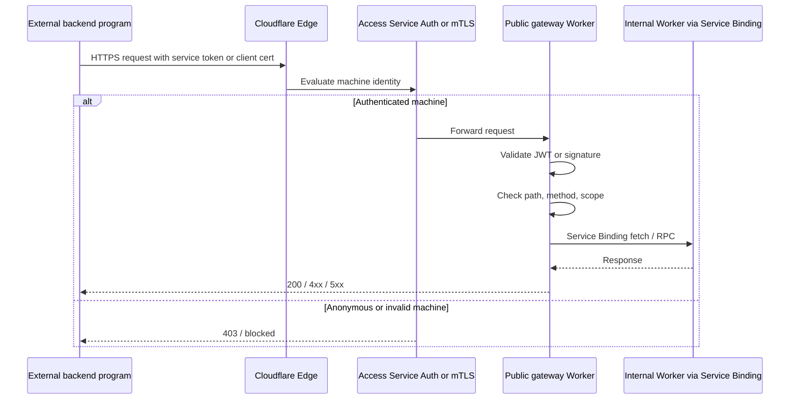

### Concrete design rules

If you want the API to be usable **only** by your backend programs and other Workers:

- do not leave internal Workers on public routes unless there is a real need
- do not rely on obscure paths like `/secret-api-123`
- do not assume "not linked from the frontend" means private
- reject missing auth immediately
- keep CORS closed or absent for machine-only routes
- apply rate limiting even to authenticated machine APIs
- log the machine identity, service token ID, or certificate identity for auditability

### Practical blueprint

The most maintainable version usually looks like this:

- `api.example.com` -> gateway Worker
- gateway Worker protected by Access service token or mTLS
- gateway Worker validates the caller and normalizes authorization rules
- gateway Worker fans into internal Workers over Service Bindings
- internal Workers hold business logic and data access
- browser clients never call these routes directly

This gives you one externally reachable API edge and a set of private Worker services behind it.

---

## Pattern 4: Stateful real-time app with Durable Objects

### When to use it

You need coordination among many clients: chat rooms, collaborative editing, lobbies, counters, live presence, or shared state.

### Diagram

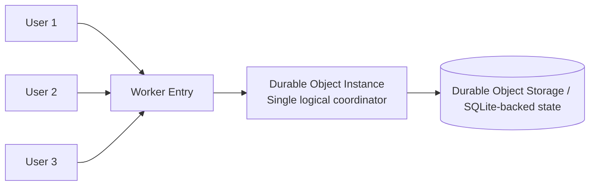

### Why Cloudflare fits

Durable Objects combine compute and state in a single logical instance, making them useful for coordination-heavy systems.

### Strengths

- Natural fit for per-room or per-entity coordination
- Good for WebSocket coordination and hibernation patterns
- Simplifies distributed locking and sequencing

### Tradeoffs

- You must model partition keys carefully
- A single object coordinates a specific scope, so hot-key design matters
- This is not a generic substitute for every database

### Examples

- Chat room by room-id
- Multiplayer game room
- Auction state coordinator
- Collaborative document session manager

---

## Pattern 5: File uploads and user-generated content with R2

### When to use it

You need scalable object storage for uploads, documents, images, logs, model outputs, or downloadable artifacts.

### Diagram

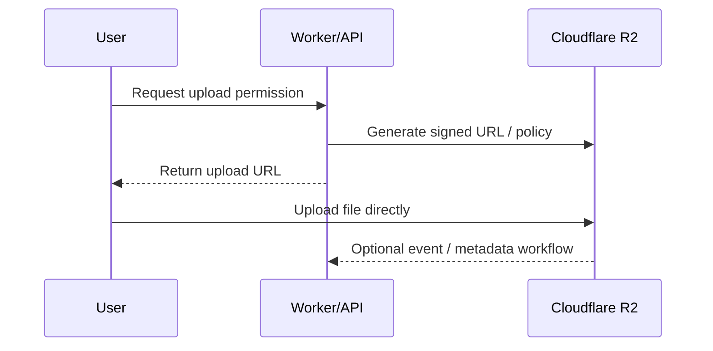

### Why Cloudflare fits

R2 is Cloudflare’s S3-compatible object storage and is designed for storing and serving unstructured data without egress fees.

### Strengths

- Good for large objects and static assets
- Direct upload patterns reduce load on your application servers
- Useful backbone for media, exports, documents, user uploads

### Tradeoffs

- R2 stores objects, not relational business logic
- You still need metadata, authorization, and lifecycle design

### Good pattern

Store the binary in **R2**, and store metadata/ownership in **D1**, **Durable Objects**, or an external SQL database.

---

## Pattern 6: Image optimization pipeline with R2 + Image Resizing + cache

### When to use it

You serve many images and want a fast, scalable way to store originals once and deliver optimized variants on demand.

### Diagram

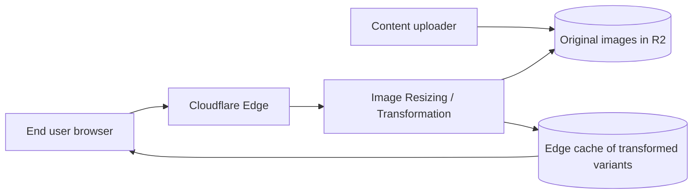

### Why Cloudflare fits

Cloudflare’s reference architectures explicitly highlight image delivery and image-resizing patterns with R2 and cache.

### Strengths

- Avoids pre-generating every size and format
- Strong cache efficiency
- Reduces origin and storage duplication

### Tradeoffs

- Requires URL design, cache policy, and transformation governance
- Image-heavy workloads still need cost/abuse planning

### Great for

- Ecommerce catalogs
- CMS-driven sites
- User profile images
- Editorial/media platforms

---

## Pattern 7: Event-driven background processing with Workers + Queues

### When to use it

A request should return quickly, but heavy work should happen asynchronously: email, indexing, thumbnails, notifications, ETL, retryable jobs.

### Diagram

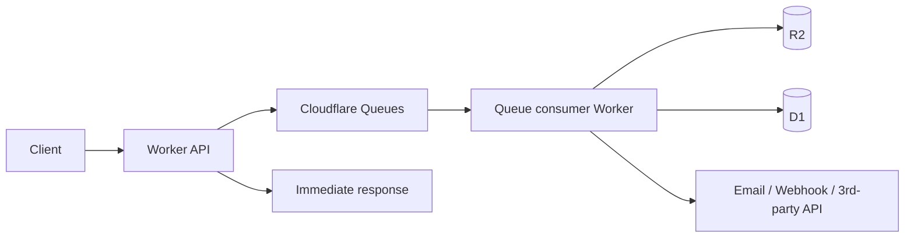

### Why Cloudflare fits

Queues integrates with Workers and is designed for guaranteed-delivery-style messaging, offloading work from request/response flows.

### Strengths

- Better p95/p99 latency for end users
- More resilient retries than inline processing
- Cleaner separation of API and background workers

### Tradeoffs

- Eventual completion model
- You need idempotency and replay-safe consumers
- Monitoring is essential

### Examples

- Send welcome emails after signup
- Process uploaded files
- Generate AI summaries or embeddings offline
- Fan out webhooks

---

## Pattern 8: Edge frontend + relational data with Workers/Pages + D1

### When to use it

You want a simple full-stack app on Cloudflare and your workload is relational: users, posts, products, tasks, comments, admin dashboards.

### Diagram

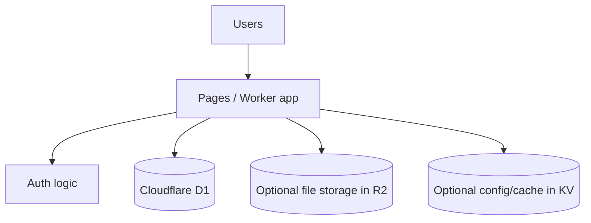

### Why Cloudflare fits

This is the easiest all-Cloudflare full-stack pattern for many small to mid-size applications.

### Strengths

- Cohesive developer experience
- Relational data model is intuitive for most apps
- Pairs well with R2 for files and KV for edge config

### Tradeoffs

- Not every workload belongs in edge-hosted relational storage
- You still need schema discipline, migrations, and performance testing

### Good for

- SaaS MVPs
- Internal tools
- Content back offices
- CRUD-style applications

---

## Pattern 9: Edge app with external database via Hyperdrive

### When to use it

You want Workers at the edge, but your system of record stays in an existing PostgreSQL or MySQL database.

### Diagram

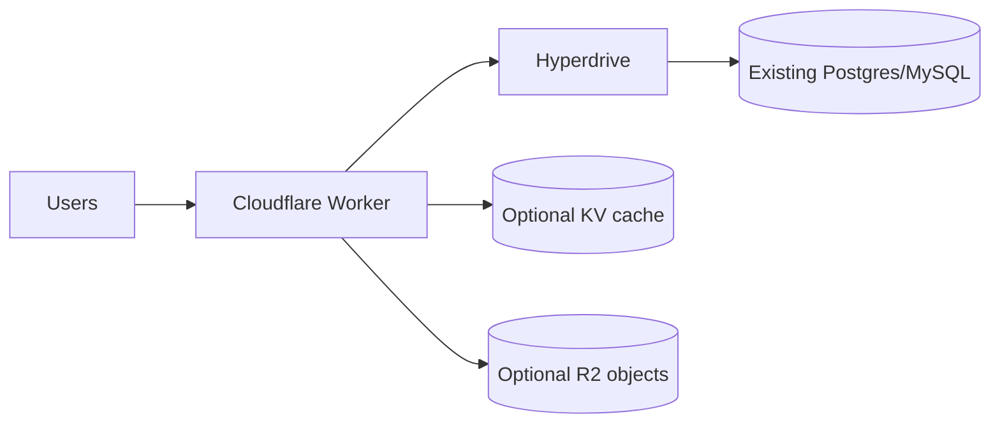

### Why Cloudflare fits

Hyperdrive is designed to accelerate database access from Workers to existing databases, making hybrid architectures practical.

### Strengths

- Keep your current database
- Add edge APIs without a full migration
- Good stepping stone from origin-centric apps to edge apps

### Tradeoffs

- Your app still depends on a centralized database
- Cross-region write-heavy workloads need careful design
- You must think through connection management and query patterns

### Best for

- Incremental modernization
- Existing SaaS backends
- Read-heavy global APIs over an existing SQL estate

---

## Pattern 10: Zero Trust access to private apps with Tunnel + Access

### When to use it

You want users to reach private web apps, SSH, RDP, APIs, or dashboards **without opening inbound firewall ports** and without relying on a broad VPN.

### Diagram

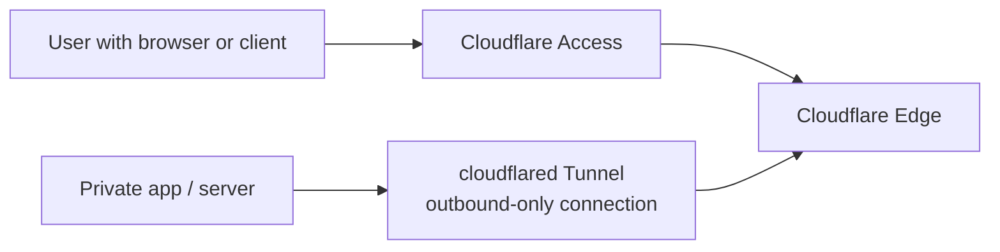

### Why Cloudflare fits

Cloudflare Tunnel publishes internal services using outbound-only connections from `cloudflared`, while Access enforces identity-aware policies in front of the application.

### Strengths

- Hide the origin from the public Internet
- Fine-grained access policies by identity, device posture, groups, etc.
- Much narrower trust model than “connect the whole network” VPN patterns

### Tradeoffs

- Requires identity integration and policy planning
- Legacy protocols and non-web apps may need extra design
- Operational maturity matters for device posture and service accounts

### Great for

- Internal admin panels
- Staging sites
- SSH to bastions
- Private APIs
- Vendor access to a single app

---

## Pattern 11: Secure Internet egress and SaaS protection with Zero Trust

### When to use it

You want to secure employee access to the public Internet and SaaS apps with policy enforcement, DNS/HTTP filtering, and identity-aware controls.

### Diagram

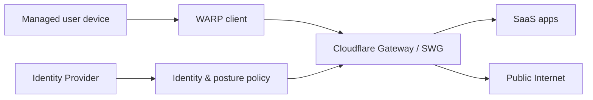

### Why Cloudflare fits

This maps to Cloudflare’s Zero Trust / SASE model: route traffic through Cloudflare, apply policy, and protect access to SaaS and the Internet.

### Strengths

- Strong replacement or complement for legacy secure web gateways
- Better visibility into user-to-Internet traffic
- Works well with device posture and IdP controls

### Tradeoffs

- Rollout design matters for user experience
- Exceptions, split tunnels, and app compatibility need testing
- Mature policies take iteration

### Good fit

- Remote-first companies
- Managed-device security programs
- SaaS access governance

---

## Pattern 12: Multi-tenant SaaS platform with Workers for Platforms

### When to use it

You are building a platform where customers bring custom code, custom routes, per-tenant apps, or programmable extensions.

### Diagram

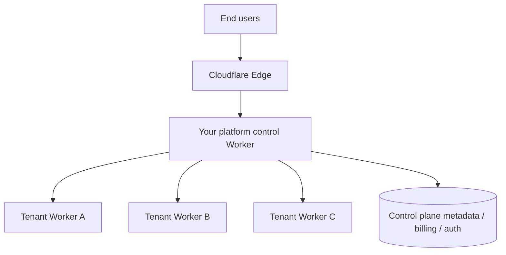

### Why Cloudflare fits

Cloudflare’s programmable-platform reference architecture highlights Workers for Platforms as a foundation for multi-tenant SaaS with isolation and global distribution.

### Strengths

- Strong model for tenant isolation
- Global execution close to users
- Flexible routing and extension points

### Tradeoffs

- Control-plane design becomes a major engineering challenge
- Multi-tenant observability, limits, and abuse controls are essential
- Not a beginner architecture

### Typical uses

- Website builders
- Commerce platforms
- Developer platforms with user code
- White-label edge apps

---

## Pattern 13: Hybrid origin protection with CDN + WAF + DDoS + Load Balancing

### When to use it

You run multiple origins across regions or clouds and need availability, failover, and application-layer protection.

### Diagram

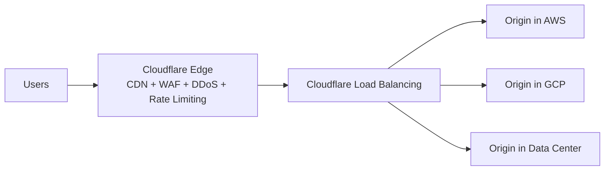

### Strengths

- Good availability posture
- Easier multi-cloud and hybrid traffic steering
- Protects origins behind a single edge layer

### Tradeoffs

- Health checks and failover logic need careful tuning
- State replication remains your responsibility
- Multi-origin consistency is still an application problem

### Best for

- Revenue-critical web properties
- Regional failover designs
- Enterprises with mixed hosting footprints

---

## Pattern 14: AI application at the edge with Workers AI + Vectorize + R2

### When to use it

You want an AI-backed application on Cloudflare: chat, semantic search, retrieval-augmented generation (RAG), classification, image generation, or document workflows.

### Diagram

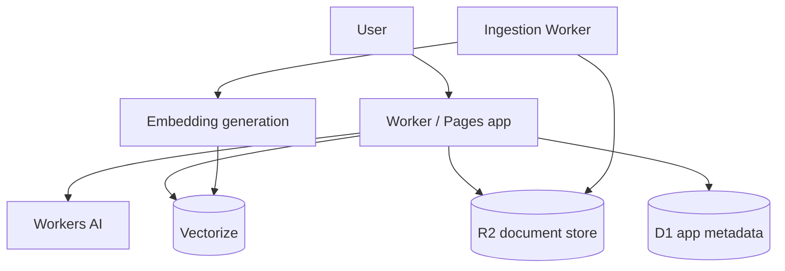

### Why Cloudflare fits

Cloudflare’s reference architectures now include AI solution patterns, and the platform combines edge app logic, storage, and AI inference primitives.

### Strengths

- Tight integration between app, storage, and inference
- Good for document/chat workflows with edge mediation
- Simple deployment model for smaller AI products

### Tradeoffs

- Retrieval quality still depends on chunking, metadata, and evals
- Large AI systems may need external model/data tooling too
- Cost/performance tuning matters early

### Examples

- Support bot over your docs
- Internal knowledge search
- Image or media moderation pipeline
- AI-generated content storage in R2

---

## Pattern 15: SASE-style enterprise architecture

### When to use it

You want to evolve from perimeter/VPN-centric security toward identity- and policy-driven access across users, branches, SaaS, Internet, and private apps.

### Diagram

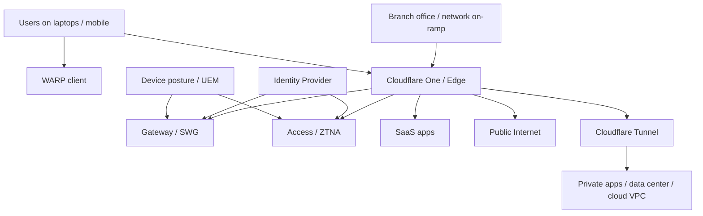

### Why Cloudflare fits

Cloudflare’s recent SASE reference architecture shows a request path that starts from the user/device/browser and continues through Cloudflare to private apps or the public Internet.

### Strengths

- Consistent policy across user-to-app and user-to-Internet paths
- Better fit for distributed work and cloud adoption than castle-and-moat models
- Identity and device posture become first-class controls

### Tradeoffs

- This is an organizational transformation, not just a product deployment
- Networking, identity, endpoint, and security teams must align
- Legacy protocols and workflows often require phased adoption

---

## How to choose the right data product

Cloudflare explicitly documents storage selection as a multi-product decision. A practical rule of thumb:

| Need | Usually start with | Notes |
|---|---|---|
| Global config / flags / read-heavy lookup | KV | Great for read-heavy workloads |
| Coordination / per-entity state / live sessions | Durable Objects | Best when one logical coordinator is needed |
| Relational app data | D1 | Good for many CRUD and app backends |
| Large files / media / exports / artifacts | R2 | Object storage |
| Existing external SQL | Hyperdrive | Good for hybrid migration |
| Async messaging / work offload | Queues | Pair with Worker consumers |
| Semantic retrieval | Vectorize | Pair with embeddings and metadata stores |

A strong Cloudflare architecture often uses **multiple** data products together:

- **R2** for files
- **D1** for metadata
- **KV** for configuration
- **Queues** for background work
- **Durable Objects** only where coordination is actually needed

---

## Reference architectures by use case

### Small company website

- Start with Pattern 1
- Add Pattern 6 if images matter
- Add Pattern 13 if uptime is critical

### SaaS MVP

- Start with Pattern 2 or 8
- Add Pattern 5 for uploads
- Add Pattern 7 for async jobs
- If an API is machine-only, use Pattern 3's private machine-to-machine variant instead of leaving the Worker anonymous

### Global realtime product

- Start with Pattern 4
- Add Pattern 7 for background processing
- Add Pattern 14 if AI features are involved

### Enterprise internal tools

- Start with Pattern 10
- Add Pattern 11 or 15 for broader user/network security

### Existing enterprise app modernization

- Start with Pattern 1 or 13
- Add Pattern 9 for edge APIs over existing databases
- Add Pattern 10 for private admin access
- For backend-to-backend APIs, prefer Service Bindings internally and Access service tokens or mTLS for external callers

---

## Common mistakes and anti-patterns

### 1) Using one product for everything

Do not try to force every problem into KV, D1, Durable Objects, or R2. They solve different problems.

### 2) Treating KV as a transactional database

KV shines for read-heavy distributed lookup workloads, not for strict transactional correctness.

### 3) Using Durable Objects without partition strategy

A bad object-key design creates hot spots. Model coordination scope explicitly.

### 4) Uploading files through your app server unnecessarily

For user uploads, prefer direct-to-R2 or signed upload patterns when feasible.

### 5) Forgetting origin hardening

Even behind Cloudflare, protect origins with allowlists, authenticated origin pulls, origin certificates, or private connectivity patterns where appropriate.

### 6) Rebuilding a VPN instead of using app-level access

For many internal tools, Access + Tunnel is simpler and safer than broad network-level access.

### 7) Ignoring cache design

Cloudflare’s value often depends on cache keys, cache eligibility, headers, image strategy, and static-vs-dynamic separation.

### 8) Exposing machine-only Worker APIs anonymously

If the endpoint is only meant for backend programs or other Workers, do not leave it as a public anonymous HTTP endpoint.

Prefer:

- Service Bindings for Worker-to-Worker calls
- Access service tokens for external automated callers
- mTLS for strong machine identity on supported API clients

Only fall back to app-level shared-secret verification when the caller cannot use the stronger patterns.

---

## A simple path to try Cloudflare quickly

If you want to **try Cloudflare** with minimal setup, choose one of these:

### Option A: Put an existing site behind Cloudflare

1. Add your domain to Cloudflare.
2. Move authoritative DNS to Cloudflare.
3. Proxy your public HTTP/S records.
4. Enable TLS, cache basics, and WAF rules.
5. Measure origin offload and page performance.

### Option B: Deploy a static site with Pages

1. Connect a Git repository.
2. Deploy a static site or frontend framework.
3. Add a Worker for one dynamic route.
4. Optionally add KV or D1.

### Option C: Publish one internal service with Tunnel + Access

1. Install `cloudflared`.
2. Create a Tunnel from your private host.
3. Publish one hostname.
4. Protect it with Access and your identity provider.

### Option D: Build a tiny API with Workers

1. Create a Worker.
2. Add one route.
3. Use KV for config or D1 for relational state.
4. Add Queues if anything becomes asynchronous.

---

## Notes on product fit

- **Workers** is the compute layer.
- **Pages** is the static/frontend deployment layer.
- **R2** is for objects.
- **D1** is for relational data.
- **KV** is for globally distributed read-heavy lookups.
- **Durable Objects** is for coordination-heavy state.
- **Queues** is for decoupled asynchronous work.
- **Hyperdrive** helps Workers talk efficiently to existing databases.
- **Service Bindings** are the default for private Worker-to-Worker calls.
- **Access + Tunnel** is a strong default for private app exposure.
- **Access service tokens** and **API Shield mTLS** are strong defaults for non-anonymous machine-to-machine API access.

---

## Source basis

This guide is grounded in Cloudflare’s official docs and reference architectures, especially the current pages for:

- Cloudflare Docs overview
- Workers overview
- Service Bindings docs
- Workers storage selection
- KV docs and how KV works
- Durable Objects overview, concepts, examples, and best practices
- R2 overview, how R2 works, and R2 demos/reference architectures
- Queues overview
- Hyperdrive overview
- Access service tokens and JWT validation docs
- API Shield mTLS docs
- Tunnel docs
- Cloudflare Reference Architecture hub, diagrams, design guides, implementation guides, SASE architecture, content-delivery/image-delivery patterns, storage patterns, and programmable platforms

---

## Final advice

Do not start by asking, “Which Cloudflare product should I use?”

Start by asking:

1. **Where should this request terminate?** Edge, private service, or origin?
2. **What kind of state does this workload need?** Object, relational, read-heavy lookup, or coordinated state?
3. **What needs to be synchronous, and what can be queued?**
4. **Is this public traffic, private access, or user Internet egress?**
5. **Can I solve this incrementally instead of replatforming everything?**

That mindset usually leads you to the right Cloudflare architecture much faster.
