# How to Build a Roblox Game: A Comprehensive Guide

Roblox games are built in **Roblox Studio** and scripted in **Luau**, Roblox’s scripting language. The official Creator Hub and Engine API reference are the canonical references for how Studio, services, classes, events, and publishing work. ([Creator Hub][1])

---

## 1. Start with the right mental model

A Roblox game is not “just a map with scripts.” It is a system made of:

* a **core loop** players repeat
* a **world** they move through
* **rules** enforced by the server
* **UI** that explains state and feedback
* **data** that may persist between sessions
* **testing and publishing** workflows

A strong beginner project is usually one of these:

* obby
* coin collector
* wave survival
* simple tycoon
* round-based mini-game

Pick one small loop and finish it.

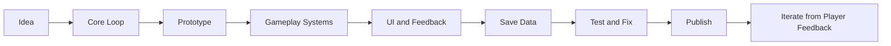

### A good first design brief

Use this format:

```md
## Game concept
Players run through a small obstacle course, reach checkpoints, avoid hazards, and finish as fast as possible.

## Core loop
Spawn -> move -> jump -> avoid danger -> reach checkpoint -> finish -> replay

## Win condition
Reach the final goal.

## MVP features
- 10 stages
- checkpoints
- kill bricks
- timer
- finish screen

## Nice-to-have later
- coin pickups
- cosmetic shop
- daily rewards
- badge rewards
```

---

## 2. Scope the game before you build it

Most Roblox projects fail because the idea is too large, not because the developer lacks talent.

Use this test:

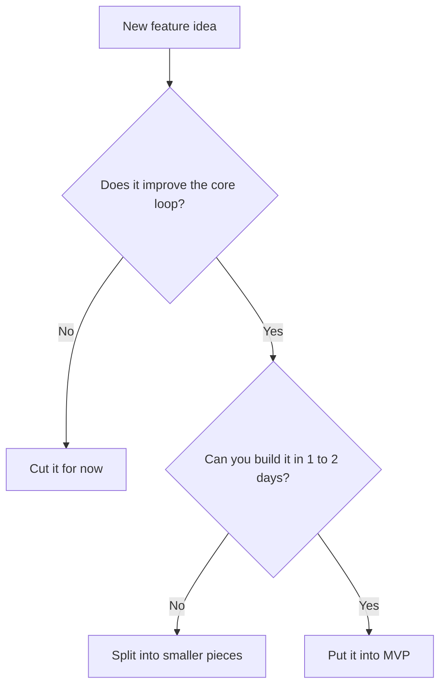

### Example MVPs

#### Obby MVP

* spawn
* platforms
* hazards
* checkpoints
* finish goal

#### Coin collector MVP

* map
* coins
* score
* simple timer
* end screen

#### Survival MVP

* enemy spawns
* player damage
* round timer
* win/lose screen

---

## 3. Understand where Roblox code belongs

This is the single most important architecture rule in Roblox:

* **Script** runs on the **server**
* **LocalScript** runs on the **client**
* **ModuleScript** is reusable code loaded with `require()`
* **ServerScriptService** is for server-only logic and does **not** replicate to clients
* **ReplicatedStorage** is shared between server and clients, so objects there are visible to both
* **ScreenGui** belongs in the UI pipeline; putting it in `StarterGui` causes it to be cloned into each player’s `PlayerGui` when they join/spawn ([Creator Hub][2])

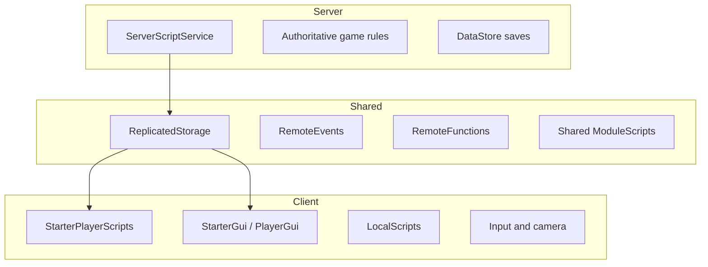

### Recommended project structure

This is a practical structure, not a requirement:

```text
Workspace
  Map
  SpawnLocation
  Coins
  Hazards

ReplicatedStorage
  Remotes
    BuyItem
    UpdateTimer
  Shared
    Config
    Types

ServerScriptService
  Main.server.lua
  Data.server.lua
  RoundManager.server.lua
  Services
    CoinService.lua
    ShopService.lua

StarterPlayer
  StarterPlayerScripts
    Input.client.lua
    Camera.client.lua

StarterGui
  HUD
    CoinsLabel
    TimerLabel
    HUD.client.lua
```

### Rule of thumb

* Put **truth** on the server.
* Put **input and presentation** on the client.
* Put **constants and reusable helpers** in ModuleScripts.

---

## 4. Build in layers, not all at once

A good build order looks like this:

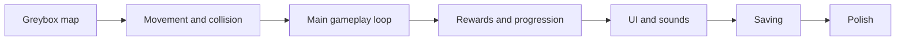

### What “greybox” means

Greyboxing is building the level out of simple parts first:

* blocks
* ramps
* spawn points
* hazards
* invisible barriers

Do **not** begin with detailed art. First make it playable.

---

## 5. Learn the event-driven scripting style

Roblox scripting is strongly event-driven. Objects and services expose events like `Touched`, `PlayerAdded`, and remote communication events. ([Creator Hub][3])

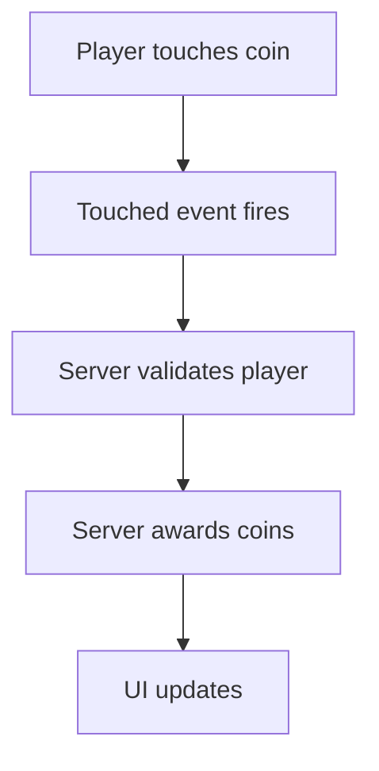

### Example: a simple coin pickup

Place this in a **Script** under a coin part.

```lua
local Players = game:GetService("Players")

local coin = script.Parent
local COIN_VALUE = 1
local cooldown = false

local function getPlayerFromHit(hit)
    local character = hit.Parent
    if not character then
        return nil
    end

    return Players:GetPlayerFromCharacter(character)
end

coin.Touched:Connect(function(hit)
    if cooldown then
        return
    end

    local player = getPlayerFromHit(hit)
    if not player then
        return
    end

    cooldown = true

    local leaderstats = player:FindFirstChild("leaderstats")
    local coins = leaderstats and leaderstats:FindFirstChild("Coins")

    if coins then
        coins.Value += COIN_VALUE
    end

    coin.Transparency = 1
    coin.CanTouch = false

    task.wait(3)

    coin.Transparency = 0
    coin.CanTouch = true
    cooldown = false
end)
```

### Why this works

* The **server** handles the reward.
* The script validates the touching object belongs to a player.
* It uses a **debounce/cooldown** so the event does not fire repeatedly and grant multiple rewards per touch. Roblox documents debounce patterns as a best practice for repeated triggers and collision-driven scripts. ([Creator Hub][4])

---

## 6. Use ModuleScripts to avoid duplication

`ModuleScript` is Roblox’s standard way to share reusable code. A ModuleScript returns one value from `require()`, runs once per Luau environment, and is useful for DRY code organization. ([Creator Hub][5])

### Example: shared config

**ReplicatedStorage/Shared/Config.lua**

```lua
local Config = {
    RoundLength = 120,
    CoinRespawnSeconds = 3,
    SpeedBoostAmount = 8,
    SwordPrice = 50,
}

return Config
```

**Server usage**

```lua
local ReplicatedStorage = game:GetService("ReplicatedStorage")
local Config = require(ReplicatedStorage.Shared.Config)

print("Round length:", Config.RoundLength)
```

### When to use a module

Use a module for:

* game constants
* helper functions
* service classes
* shared math and utility logic
* system APIs like `CoinService:AddCoins(player, amount)`

---

## 7. Never trust the client for game authority

Roblox’s client-server model exists for a reason: the **server should be the source of truth** for important gameplay state. Creator Hub guidance on the server authority model and securing the client-server boundary emphasizes validating client requests rather than trusting them blindly. ([Creator Hub][6])

### What the client should do

* read input
* animate UI
* move cameras
* request actions

### What the server should do

* validate actions
* award currency
* deal damage
* create authoritative game state
* save persistent progress

---

## 8. Use remotes correctly

Roblox provides:

* **RemoteEvent** for async, one-way communication that does not yield
* **RemoteFunction** for sync request/response communication that yields until a response arrives
* **UnreliableRemoteEvent** for unordered, unreliable one-way updates where perfect reliability is not required ([Creator Hub][7])

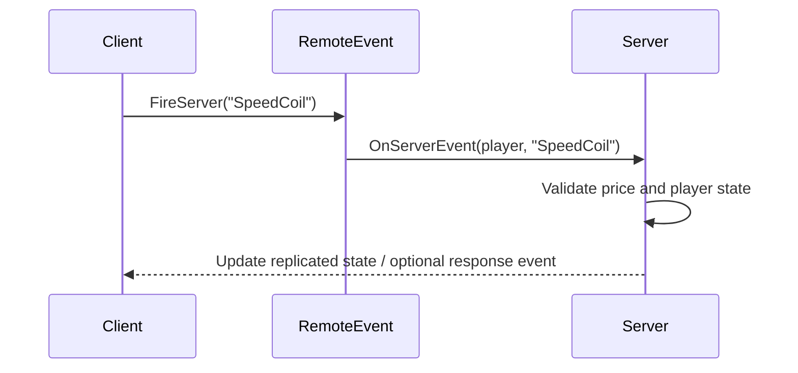

### Example: shop purchase with `RemoteEvent`

**ReplicatedStorage**

* create a `Folder` named `Remotes`
* create a `RemoteEvent` named `BuyItem`

**LocalScript** for button click:

```lua
local ReplicatedStorage = game:GetService("ReplicatedStorage")
local BuyItem = ReplicatedStorage.Remotes.BuyItem

script.Parent.MouseButton1Click:Connect(function()
    BuyItem:FireServer("SpeedCoil")
end)
```

**Server Script**:

```lua
local ReplicatedStorage = game:GetService("ReplicatedStorage")
local BuyItem = ReplicatedStorage.Remotes.BuyItem

local ITEM_COSTS = {
    SpeedCoil = 50,
}

BuyItem.OnServerEvent:Connect(function(player, itemName)
    local cost = ITEM_COSTS[itemName]
    if not cost then
        return
    end

    local leaderstats = player:FindFirstChild("leaderstats")
    local coins = leaderstats and leaderstats:FindFirstChild("Coins")

    if not coins then
        return
    end

    if coins.Value < cost then
        return
    end

    coins.Value -= cost

    -- Grant the item here.
    -- Example: clone a Tool into Backpack or mark ownership in player data.
end)
```

### Important security rule

The client should say:

> “I want to buy this item.”

The server should decide:

> “Is that valid, affordable, and allowed?”

Do **not** let the client decide price, damage, rewards, or inventory ownership. Creator Hub’s security guidance explicitly recommends validating positions, hits, and other client-reported state on the server. ([Creator Hub][8])

---

## 9. Build UI on the client

`ScreenGui` is the main on-screen UI container. A `ScreenGui` only displays when parented to `PlayerGui`, and putting it in `StarterGui` ensures it is cloned into each player’s `PlayerGui`. Roblox’s UI docs also note that on-screen UI code and objects live on the client side. ([Creator Hub][9])

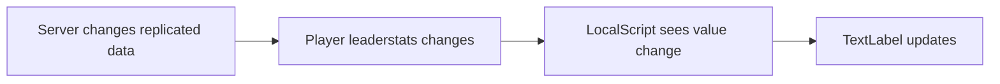

### Example: coins label

Create:

* `StarterGui/HUD/CoinsLabel` as a `TextLabel`
* a `LocalScript` under the label

```lua
local Players = game:GetService("Players")

local player = Players.LocalPlayer
local label = script.Parent

local leaderstats = player:WaitForChild("leaderstats")
local coins = leaderstats:WaitForChild("Coins")

local function refresh()
    label.Text = ("Coins: %d"):format(coins.Value)
end

refresh()
coins:GetPropertyChangedSignal("Value"):Connect(refresh)
```

### UI tips

* Show the most important information first.
* Avoid giant walls of text.
* Test on different device sizes.
* Respect safe areas and top-bar space. Roblox’s UI docs cover ScreenGui containers and safe-area behavior for different devices. ([Creator Hub][10])

---

## 10. Save player progress carefully

`DataStoreService` is Roblox’s persistent storage service for data across places in an experience. Roblox’s best-practice guidance recommends keeping the number of data stores small and grouping related data together where appropriate. ([Creator Hub][11])

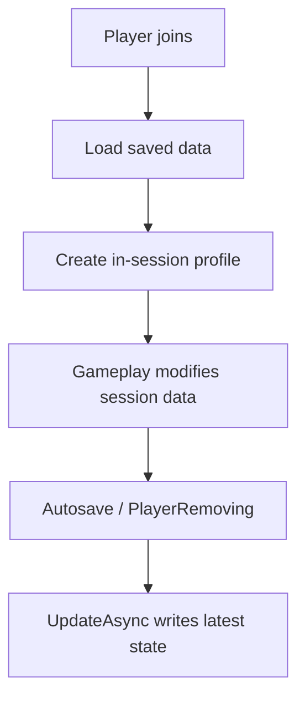

### Example: simple save system

```lua
local DataStoreService = game:GetService("DataStoreService")
local Players = game:GetService("Players")

local playerDataStore = DataStoreService:GetDataStore("PlayerData_v1")
local sessionData = {}

local DEFAULT_DATA = {
    Coins = 0,
    BestTime = 999999,
}

local function copyTable(t)
    local new = {}
    for k, v in pairs(t) do
        new[k] = v
    end
    return new
end

local function loadPlayer(player)
    local key = "player_" .. player.UserId
    local data = copyTable(DEFAULT_DATA)

    local success, result = pcall(function()
        return playerDataStore:GetAsync(key)
    end)

    if success and type(result) == "table" then
        for k, v in pairs(result) do
            data[k] = v
        end
    end

    sessionData[player] = data
end

local function savePlayer(player)
    local data = sessionData[player]
    if not data then
        return
    end

    local key = "player_" .. player.UserId

    local success, err = pcall(function()
        playerDataStore:UpdateAsync(key, function(oldValue)
            oldValue = type(oldValue) == "table" and oldValue or {}
            oldValue.Coins = data.Coins
            oldValue.BestTime = data.BestTime
            return oldValue
        end)
    end)

    if not success then
        warn("Save failed for", player.Name, err)
    end
end

Players.PlayerAdded:Connect(loadPlayer)

Players.PlayerRemoving:Connect(function(player)
    savePlayer(player)
    sessionData[player] = nil
end)

game:BindToClose(function()
    for _, player in ipairs(Players:GetPlayers()) do
        savePlayer(player)
    end
end)
```

### Save-data rules

* Always use `pcall()` around datastore access.
* Keep an in-memory session table.
* Save only what you need.
* Version your keys when breaking schema, for example `PlayerData_v2`.
* Test with small data first.

---

## 11. Add game state, not just isolated scripts

A real game is easier to manage when it has explicit states.

Example round-based state machine:

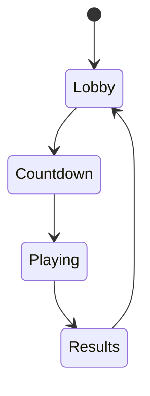

### Example state list

For a survival mini-game:

* `Lobby`
* `Countdown`
* `Playing`
* `SuddenDeath`
* `Results`

Then build systems around those states:

* UI changes by state
* spawning changes by state
* rewards happen on transitions
* music changes by state

This prevents “random script soup.”

---

## 12. Organize gameplay as services

Once a project grows beyond a few scripts, group responsibilities:

* `RoundManager`
* `CoinService`
* `DamageService`
* `ShopService`
* `DataService`

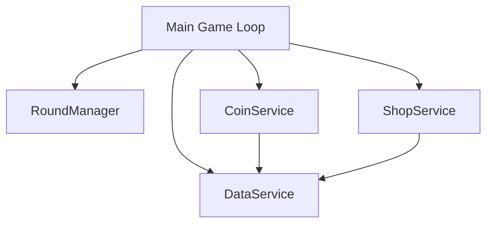

### Example service-style module

```lua
local CoinService = {}
CoinService.PlayerCoins = {}

function CoinService:InitPlayer(player)
    self.PlayerCoins[player] = 0
end

function CoinService:AddCoins(player, amount)
    self.PlayerCoins[player] = (self.PlayerCoins[player] or 0) + amount
end

function CoinService:GetCoins(player)
    return self.PlayerCoins[player] or 0
end

function CoinService:RemovePlayer(player)
    self.PlayerCoins[player] = nil
end

return CoinService
```

This is the beginning of scalable architecture.

---

## 13. Testing is not optional

Studio’s testing modes are important because **Test** and **Test Here** run separate client and server simulations, which is much closer to production behavior than assuming a single-process solo run tells the whole story. ([Creator Hub][12])

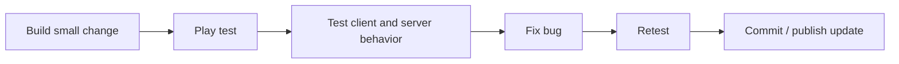

### What to test every time

* Can players spawn correctly?
* Does the server validate actions?
* Does UI update correctly on all clients?
* Do values reset properly on respawn?
* Does data save on leave?
* What happens if two players trigger the same event at once?

### Debugging habits

* Use `print()` and `warn()` early.
* Test with more than one player simulation when relevant.
* Reproduce bugs in the smallest scene possible.
* Keep scripts short and focused.

---

## 14. Publishing workflow

When you publish an experience, Roblox stores the place data model in the cloud. New experiences are private by default, and when you are ready, you can release them publicly and optionally mark them as beta. ([Creator Hub][13])

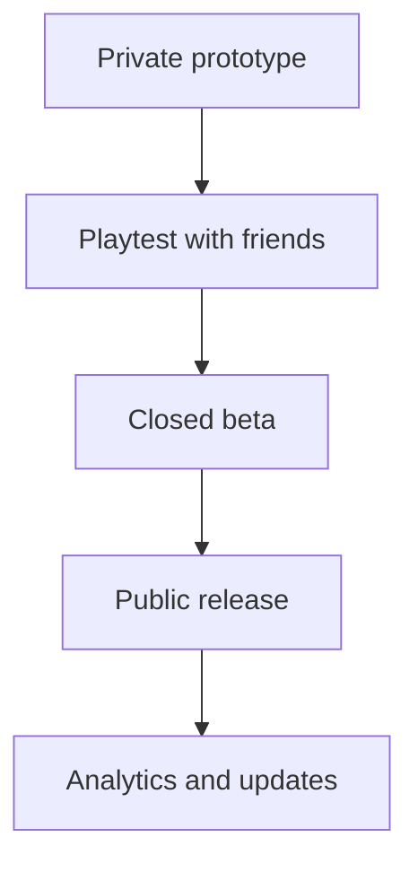

### Recommended release checklist

* remove unused assets
* test spawn points
* verify remotes
* verify save/load
* add thumbnail and icon
* write short game description
* set permissions correctly
* run a final multi-client test

---

## 15. Monetization: add it after the loop is fun

Roblox supports multiple monetization approaches, including subscriptions, access fees, in-experience purchases, private servers, and plugin sales. The important design rule is to monetize **value**, not frustration. ([Creator Hub][14])

### Good early monetization ideas

* cosmetics
* gamepasses for convenience
* private servers
* harmless VIP perks
* optional dev products for replay-heavy games

### Bad beginner monetization ideas

* selling power before the game is fun
* paywalls that block the core loop
* aggressive popups
* pricing before retention exists

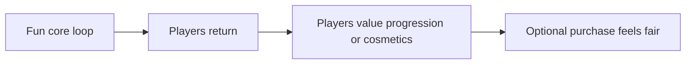

---

## 16. Common beginner mistakes

### 1. Putting everything in one script

Break systems into modules and services.

### 2. Trusting the client

Never let the client authoritatively decide money, damage, or rewards.

### 3. Using too many free models blindly

Free models can be messy, insecure, or full of hidden scripts.

### 4. Building art before gameplay

Greybox first, polish later.

### 5. Adding features before finishing the loop

The game should already be playable before you add a shop, daily rewards, or pets.

### 6. Saving too much data

Persist only what matters.

### 7. Ignoring UI clarity

Players need clear feedback:

* where am I?
* what is the goal?
* what did I just earn?
* what do I do next?

---

## 17. A practical 14-day beginner roadmap

### Days 1 to 2

* install Studio
* learn Explorer and Properties
* build a basic map

### Days 3 to 4

* add hazards
* add checkpoints
* add finish condition

### Days 5 to 6

* add coin pickups
* add score display

### Days 7 to 8

* refactor into server/client/module structure

### Days 9 to 10

* add shop with a RemoteEvent
* validate all purchases on server

### Days 11 to 12

* add save data
* test leave/rejoin

### Days 13 to 14

* polish sounds and UI
* publish private beta
* get feedback from a few players

---

## 18. A complete sample build order for your first Roblox game

### Project: Mini Obby Race

#### Step 1: map

* lobby
* 10 obstacle stages
* finish pad

#### Step 2: mechanics

* respawn
* kill bricks
* checkpoints

#### Step 3: progression

* timer
* best time
* coin rewards

#### Step 4: UI

* timer label
* coins label
* result panel

#### Step 5: persistence

* save best time
* save coins

#### Step 6: polish

* sounds
* particles
* better lighting
* thumbnail and icon

---

## 19. What to learn next after your first finished game

Once you finish one small game, the next valuable topics are:

* pathfinding for NPCs
* animation systems
* combat validation
* matchmaking and rounds
* better datastore architecture
* profile/session locking patterns
* optimization and memory use
* device-specific UI polish
* live operations and analytics

---

## 20. Official references

These are the most useful official docs to keep open while building:

* **Creator Hub / Documentation overview** — main docs hub for Studio, tutorials, production, monetization, and engine reference. ([Creator Hub][15])
* **Luau** — language overview and Studio support for scripting. ([Creator Hub][16])
* **Engine API Reference** — reference for classes, properties, methods, events, and callbacks. ([Creator Hub][17])
* **Script / LocalScript / ModuleScript** — where code runs and how reusable modules behave. ([Creator Hub][2])
* **ServerScriptService / ReplicatedStorage** — server-only vs shared storage. ([Creator Hub][18])
* **Events** — event-driven scripting basics. ([Creator Hub][3])
* **Client-server runtime** — architecture and communication model. ([Creator Hub][6])
* **Remote events and callbacks** — RemoteEvent, RemoteFunction, and related networking patterns. ([Creator Hub][19])
* **Securing the client-server boundary / security tactics** — validation guidance and cheat mitigation. ([Creator Hub][8])
* **ScreenGui / on-screen UI containers / UI tutorials** — UI structure and safe display patterns. ([Creator Hub][9])
* **DataStoreService / data store best practices** — saving persistent data correctly. ([Creator Hub][11])
* **Studio testing modes** — client/server-aware testing inside Studio. ([Creator Hub][12])
* **Publishing experiences and places** — publishing and release flow. ([Creator Hub][13])
* **Monetization** — official monetization options and production docs. ([Creator Hub][14])

---

## 21. Best final advice

Your first Roblox game should be:

* small
* playable quickly
* tested often
* server-authoritative for important logic
* modular enough to grow
* finished before you start the next one

The fastest way to improve is:

1. build one tiny complete game
2. refactor it
3. publish it
4. learn from real player behavior
5. build the next one slightly better

I can turn this into a **more advanced version for intermediate Roblox devs**, or rewrite it as a **step-by-step guide for building a specific game type** like an obby, tycoon, or wave survival game.

[1]: https://create.roblox.com/ "https://create.roblox.com/"
[2]: https://create.roblox.com/docs/reference/engine/classes/Script "https://create.roblox.com/docs/reference/engine/classes/Script"
[3]: https://create.roblox.com/docs/scripting/events "https://create.roblox.com/docs/scripting/events"
[4]: https://create.roblox.com/docs/en-us/scripting/debounce "https://create.roblox.com/docs/en-us/scripting/debounce"
[5]: https://create.roblox.com/docs/reference/engine/classes/ModuleScript "https://create.roblox.com/docs/reference/engine/classes/ModuleScript"
[6]: https://create.roblox.com/docs/projects/client-server "https://create.roblox.com/docs/projects/client-server"
[7]: https://create.roblox.com/docs/reference/engine/classes/RemoteEvent "https://create.roblox.com/docs/reference/engine/classes/RemoteEvent"
[8]: https://create.roblox.com/docs/en-us/scripting/security/client-server-boundary "https://create.roblox.com/docs/en-us/scripting/security/client-server-boundary"
[9]: https://create.roblox.com/docs/reference/engine/classes/ScreenGui "https://create.roblox.com/docs/reference/engine/classes/ScreenGui"
[10]: https://create.roblox.com/docs/tutorials/use-case-tutorials/ui/create-hud-meters "https://create.roblox.com/docs/tutorials/use-case-tutorials/ui/create-hud-meters"
[11]: https://create.roblox.com/docs/reference/engine/classes/DataStoreService "https://create.roblox.com/docs/reference/engine/classes/DataStoreService"
[12]: https://create.roblox.com/docs/studio/testing-modes "https://create.roblox.com/docs/studio/testing-modes"
[13]: https://create.roblox.com/docs/production/publishing/publish-experiences-and-places "https://create.roblox.com/docs/production/publishing/publish-experiences-and-places"
[14]: https://create.roblox.com/docs/en-us/production/monetization "https://create.roblox.com/docs/en-us/production/monetization"
[15]: https://create.roblox.com/docs "https://create.roblox.com/docs"
[16]: https://create.roblox.com/docs/luau "https://create.roblox.com/docs/luau"
[17]: https://create.roblox.com/docs/en-us/reference/engine "https://create.roblox.com/docs/en-us/reference/engine"
[18]: https://create.roblox.com/docs/reference/engine/classes/ServerScriptService "https://create.roblox.com/docs/reference/engine/classes/ServerScriptService"
[19]: https://create.roblox.com/docs/scripting/events/remote "https://create.roblox.com/docs/scripting/events/remote"
