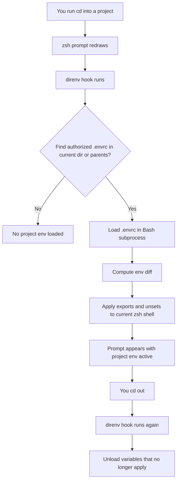
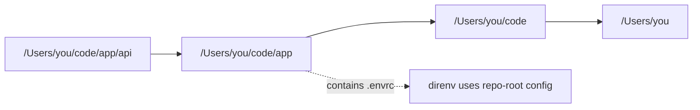
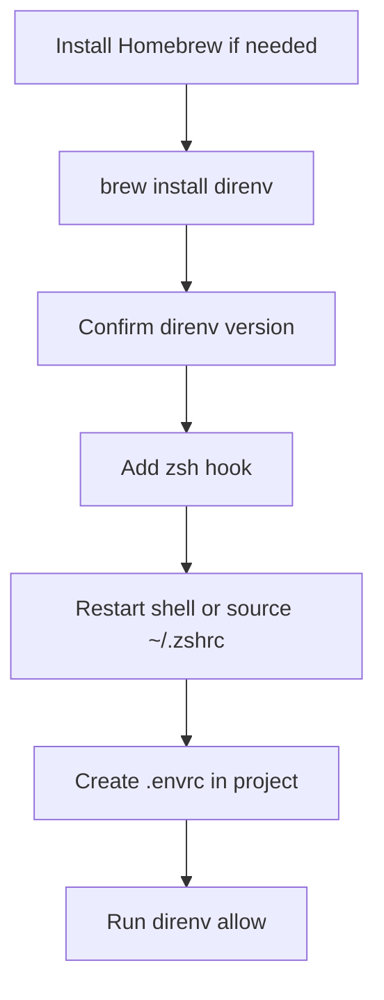
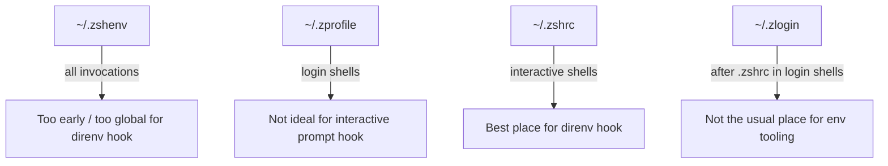
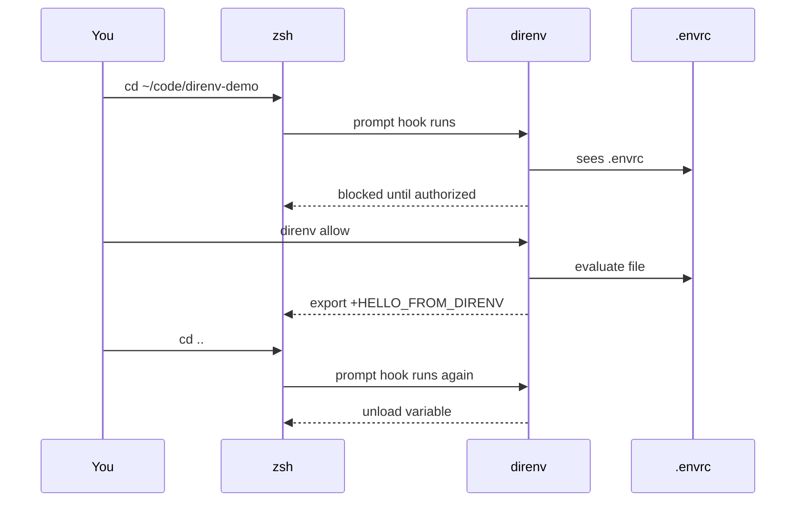
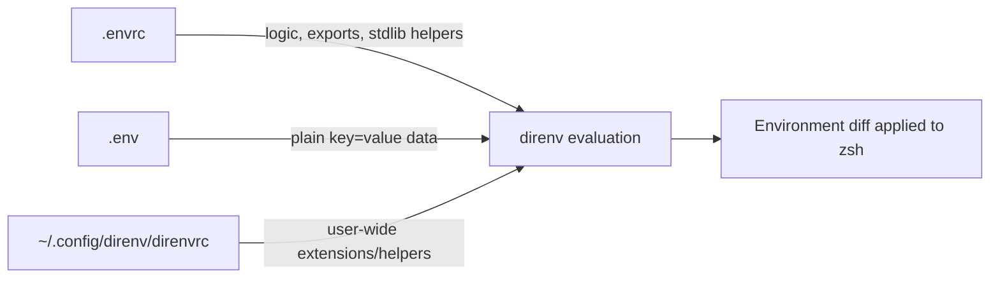
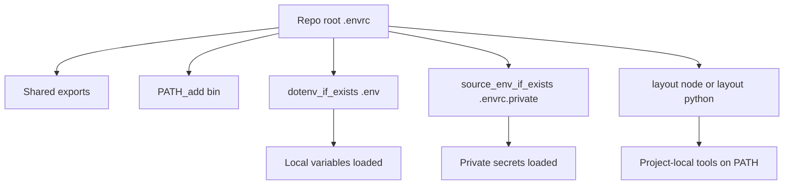
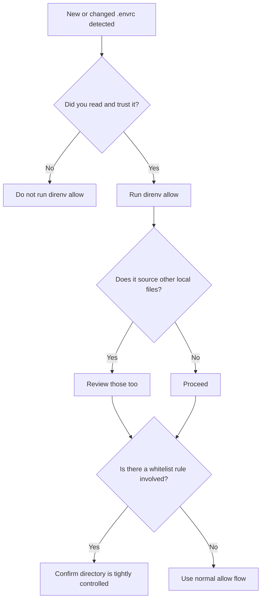

# `direnv` on macOS with zsh: a comprehensive guide

> A practical guide for macOS users who want project-specific environment variables to load automatically when entering a directory and disappear when leaving it.

---

## Table of contents

1. [What `direnv` is](#what-direnv-is)
2. [Why macOS + zsh users like it](#why-macos--zsh-users-like-it)
3. [How `direnv` works](#how-direnv-works)
4. [Install on macOS](#install-on-macos)
5. [Hook `direnv` into zsh correctly](#hook-direnv-into-zsh-correctly)
6. [Your first working example](#your-first-working-example)
7. [Understanding `.envrc`, `.env`, and authorization](#understanding-envrc-env-and-authorization)
8. [Common `.envrc` patterns](#common-envrc-patterns)
9. [A production-friendly project layout](#a-production-friendly-project-layout)
10. [Using `direnv` with Node.js, Python, and polyglot repos](#using-direnv-with-nodejs-python-and-polyglot-repos)
11. [Useful commands](#useful-commands)
12. [Configuration with `direnv.toml`](#configuration-with-direnvtoml)
13. [Security model and safe habits](#security-model-and-safe-habits)
14. [Troubleshooting on macOS + zsh](#troubleshooting-on-macos--zsh)
15. [Recipes](#recipes)
16. [Cheat sheet](#cheat-sheet)
17. [References](#references)

---

## What `direnv` is

`direnv` is an environment-variable manager that integrates with your shell so variables can be loaded and unloaded based on the current directory.[^direnv-man][^direnv-home] In practice, that means you can `cd` into a project and have its environment appear automatically, then `cd` out and have it disappear.

For macOS users working in Terminal, iTerm2, Warp, VS Code integrated terminals, or tmux sessions running zsh, this solves a very common problem: you want per-project configuration, but you do **not** want to permanently export project variables in your global shell startup files.

---

## Why macOS + zsh users like it

On macOS, zsh is a natural fit because interactive shell customizations belong in `~/.zshrc`, while login-shell-only setup belongs elsewhere.[^zsh-startup] Since `direnv` works by hooking into the interactive shell prompt, zsh users can keep the integration in the right place and avoid cluttering `~/.zprofile` or `~/.zshenv`.

`direnv` is especially useful on a Mac when you:

- switch between multiple AWS profiles or cloud accounts
- work across several repos with different secrets and endpoints
- want `PATH` additions to apply only inside one project
- want local development variables to disappear when you leave the repo
- use Node.js, Python, Ruby, or mixed-language repos and do not want one project's setup leaking into another

---

## How `direnv` works

According to the official docs and manual, before each prompt `direnv` checks the current directory and its parents for an authorized `.envrc` file, loads it in a Bash subprocess, captures the exported environment differences, and then applies only the resulting environment changes back to your current shell.[^direnv-home][^direnv-man]

That design matters because it explains three behaviors that surprise new users:

1. `direnv` is **not** simply sourcing `.envrc` directly into your live zsh session.[^direnv-home]
2. It can therefore work across multiple shells, including zsh, bash, fish, tcsh, and others.[^direnv-man][^direnv-hook]
3. Shell aliases and functions are not the main thing it exports; the focus is environment changes.[^direnv-home]

### Mental model



### Search behavior

`direnv` looks upward through parent directories, not just the current directory.[^direnv-home][^direnv-man] That lets you place one `.envrc` at a repo root and have it apply in subdirectories.



---

## Install on macOS

The official installation docs list Homebrew as the macOS package route, and the Homebrew formula page currently shows `brew install direnv` with a stable version of **2.37.1**.[^direnv-install][^brew-direnv]

### Recommended installation

```bash
brew install direnv
```

### Verify installation

```bash
direnv version
which direnv
```

### Why Homebrew is the simplest macOS path

- it is the package method explicitly listed in the official `direnv` installation docs for macOS[^direnv-install]
- the formula page documents current availability and versioning on supported macOS platforms[^brew-direnv]
- upgrades are straightforward:

```bash
brew upgrade direnv
```

### Installation flow



---

## Hook `direnv` into zsh correctly

The official setup docs say to add this line to the end of `~/.zshrc`:[^direnv-hook][^direnv-man]

```bash
eval "$(direnv hook zsh)"
```

### Why `~/.zshrc` and not `~/.zprofile`?

The zsh startup documentation says `~/.zshrc` is read for **interactive shells**, while `~/.zprofile` is for login-shell-only actions.[^zsh-startup] Since `direnv` integrates with your prompt behavior during interactive use, `~/.zshrc` is the correct place.

### Steps

Open your zsh config:

```bash
nano ~/.zshrc
```

Add this at the end:

```bash
eval "$(direnv hook zsh)"
```

Reload your shell:

```bash
source ~/.zshrc
```

Or close and reopen Terminal.

### If you use Oh My Zsh

The official setup page notes that Oh My Zsh has a core `direnv` plugin; you can add `direnv` to your `plugins=(...)` array.[^direnv-hook] For many users, though, the explicit `eval "$(direnv hook zsh)"` line is easier to reason about.

### zsh startup placement



---

## Your first working example

Create a demo project:

```bash
mkdir -p ~/code/direnv-demo
cd ~/code/direnv-demo
```

Create `.envrc`:

```bash
echo 'export HELLO_FROM_DIRENV="loaded"' > .envrc
```

At first, `direnv` should refuse to load it until you authorize it. The official quick demo shows this allow/deny security step explicitly.[^direnv-home][^direnv-man]

Authorize the file:

```bash
direnv allow
```

Check the variable:

```bash
echo "$HELLO_FROM_DIRENV"
```

Leave the directory:

```bash
cd ..
echo "$HELLO_FROM_DIRENV"
```

You should see it disappear when you leave.

### First-run lifecycle



---

## Understanding `.envrc`, `.env`, and authorization

### `.envrc`

`.envrc` is the primary project file `direnv` evaluates.[^direnv-home][^direnv-man] It is Bash code, which means you can do more than set fixed key-value pairs.

Example:

```bash
export APP_ENV=dev
export AWS_PROFILE=my-dev-profile
PATH_add bin
```

### `.env`

The docs also describe `.env` support, but with an important distinction: `.envrc` can use the `direnv` stdlib, while `.env` is only simple variable data and does **not** support those helper functions.[^direnv-home][^direnv-stdlib][^direnv-toml]

Useful patterns include:

- keep logic in `.envrc`
- keep plain secrets or local overrides in `.env` or another ignored file
- use `dotenv` or `dotenv_if_exists` from `.envrc` when you want both[^direnv-home][^direnv-stdlib]

Example:

```bash
# .envrc
export APP_ENV=dev
dotenv_if_exists .env
```

### Authorization model

A new or changed `.envrc` is not trusted automatically. You must approve it with `direnv allow`, and you can revoke trust with `direnv deny`.[^direnv-man]

That security model is the reason `direnv` is safer than blindly sourcing every project's shell file.

### File-role diagram



---

## Common `.envrc` patterns

The official stdlib includes helpers such as `dotenv`, `dotenv_if_exists`, `PATH_add`, `source_env`, `source_env_if_exists`, `env_vars_required`, `layout python`, `layout node`, `watch_file`, and `watch_dir`.[^direnv-stdlib]

### 1. Simple exports

```bash
# .envrc
export APP_ENV=dev
export AWS_PROFILE=myapp-dev
export AWS_REGION=ap-northeast-2
```

### 2. Load a `.env` file only if it exists

```bash
# .envrc
export APP_ENV=dev
dotenv_if_exists .env
```

### 3. Add project-local binaries to `PATH`

Using `PATH_add` is preferred to hand-editing `PATH` because the stdlib is designed to prepend safely.[^direnv-home][^direnv-stdlib]

```bash
# .envrc
PATH_add bin
PATH_add scripts
```

### 4. Require variables from a private file

```bash
# .envrc
source_env_if_exists .envrc.private
env_vars_required AWS_PROFILE AWS_REGION
```

This pattern is useful when a committed `.envrc` defines the shared structure, but each developer keeps secrets or machine-specific values in a private ignored file.[^direnv-stdlib]

### 5. Reload when a file changes

```bash
# .envrc
watch_file package.json
watch_file .nvmrc
```

The stdlib says `watch_file` adds files to the watch list so `direnv` reloads the environment on the next prompt if they change.[^direnv-stdlib]

### 6. Reload when an entire directory tree changes

```bash
# .envrc
watch_dir config
```

This is useful when you derive environment setup from generated or config files.[^direnv-stdlib]

---

## A production-friendly project layout

A nice macOS team setup is to keep a safe, readable `.envrc` in Git while putting secrets or machine-specific values in ignored files.

```text
my-project/
├─ .envrc
├─ .envrc.private      # gitignored
├─ .env                # optional, gitignored
├─ bin/
├─ package.json
└─ src/
```

### Example `.gitignore`

```gitignore
.env
.envrc.private
.direnv/
```

### Example committed `.envrc`

```bash
export APP_NAME=my-project
export APP_ENV=dev
PATH_add bin
source_env_if_exists .envrc.private
dotenv_if_exists .env
env_vars_required APP_ENV
```

### Why this layout works

- shared defaults live in version control
- secrets stay local
- `direnv` helpers keep the file expressive
- teammates can understand the environment structure without seeing your private values

---

## Using `direnv` with Node.js, Python, and polyglot repos

The official stdlib includes layout helpers for several ecosystems, including `layout node` and `layout python`.[^direnv-stdlib]

### Node.js project

`layout node` adds `node_modules/.bin` to `PATH`.[^direnv-stdlib]

```bash
# .envrc
layout node
dotenv_if_exists .env
watch_file package.json package-lock.json .nvmrc
```

Good fit when you want tools like `eslint`, `tsx`, `vite`, or `jest` available automatically inside the project.

### Python project

`layout python` creates and loads a virtual environment under `.direnv/` scoped to the project.[^direnv-stdlib]

```bash
# .envrc
layout python python3
dotenv_if_exists .env
watch_file requirements.txt pyproject.toml
```

### Mixed repo example

```bash
# .envrc
export APP_ENV=dev
PATH_add bin
layout node
source_env_if_exists .envrc.private
dotenv_if_exists .env
watch_file package.json .env .envrc.private
```

### Ecosystem view



---

## Useful commands

The `direnv` manual documents the main commands below.[^direnv-man]

### Allow a file

```bash
direnv allow
```

Trust the current `.envrc` or `.env` after creating or modifying it.

### Revoke trust

```bash
direnv deny
```

Useful if you want to block the current environment until you review it.

### Reload explicitly

```bash
direnv reload
```

Helpful after editing environment-related files when you want immediate feedback.

### Run one command inside another directory's environment

```bash
direnv exec /path/to/project env | rg '^AWS_'
```

The manual describes `direnv exec DIR COMMAND` as executing a command after loading the first `.envrc` or `.env` found in that directory.[^direnv-man]

### Inspect export output

```bash
direnv export zsh
```

The manual says `direnv export SHELL` prints the environment diff in a form suitable for a shell or other supported output targets.[^direnv-man]

---

## Configuration with `direnv.toml`

The `direnv.toml` manual says the config file lives at `$XDG_CONFIG_HOME/direnv/direnv.toml`, which is typically `~/.config/direnv/direnv.toml` on macOS.[^direnv-toml]

### Example config file

```toml
[global]
strict_env = true
hide_env_diff = false
warn_timeout = "5s"
```

### Why these settings matter

- `strict_env = true` loads `.envrc` with `set -euo pipefail`.[^direnv-toml]
- `hide_env_diff = true` can reduce noise if you dislike variable diff logs.[^direnv-toml]
- `warn_timeout` controls when `direnv` warns that evaluation is taking too long; the default is `5s`.[^direnv-toml]

### About automatic `.env` loading

The config option `load_dotenv = true` tells `direnv` to look for `.env` files in addition to `.envrc`; if both exist, `.envrc` is chosen first.[^direnv-toml]

```toml
[global]
load_dotenv = true
```

### About whitelist settings

`direnv.toml` also supports whitelist rules, but the official docs warn that trusted path prefixes and exact-path auto-allow rules should be used with great care because anyone who can write there may be able to execute arbitrary code on your machine.[^direnv-toml]

That is powerful for internal monorepos or tightly controlled local directories, but it should be an intentional decision.

---

## Security model and safe habits

`direnv`'s security story is one of its best features. The official docs require explicit authorization of `.envrc` changes with `direnv allow`, and the configuration docs warn carefully about auto-trusting directories.[^direnv-home][^direnv-man][^direnv-toml]

### The big rule

Treat `.envrc` as executable code, not as harmless text.

### Recommended habits

1. **Read `.envrc` before allowing it.**
2. **Commit only non-secret shared logic** when possible.
3. **Keep secrets in ignored local files** such as `.env`, `.envrc.private`, or a separate secrets manager workflow.
4. **Be careful with `source_env` and `source_up`** because the stdlib notes that sourced `.envrc` files are not checked by the security framework in the same way.[^direnv-stdlib]
5. **Be cautious with whitelist rules** in `direnv.toml`.[^direnv-toml]

### Security decision tree



---

## Troubleshooting on macOS + zsh

### `direnv` is installed but does nothing

Check that the hook is present in `~/.zshrc`:

```bash
rg 'direnv hook zsh' ~/.zshrc
```

Then reload zsh:

```bash
source ~/.zshrc
```

If needed, confirm your shell:

```bash
echo "$SHELL"
echo "$0"
```

### I added `.envrc` but variables do not load

Likely causes:

- you forgot `direnv allow`
- `.envrc` has a syntax error
- the hook is not loaded in the current terminal session
- the variables are defined in a child process rather than exported

Debug steps:

```bash
direnv status
direnv reload
direnv export zsh
```

### It works in one terminal app but not another

That usually means one app is starting an interactive zsh that reads `~/.zshrc`, and another is using a different shell mode or startup sequence. The zsh docs are a good reminder that startup files have distinct roles.[^zsh-startup]

### My prompt shows noisy environment diffs

You can configure `hide_env_diff` in `~/.config/direnv/direnv.toml`.[^direnv-toml]

```toml
[global]
hide_env_diff = true
```

### I changed a dependency file but `direnv` did not react

Use `watch_file` or `watch_dir` in `.envrc` for files that should trigger a reload on the next prompt.[^direnv-stdlib]

### My shell breaks because a variable is missing

If you want stricter behavior, set `strict_env = true` in `direnv.toml` or use `env_vars_required` in `.envrc`.[^direnv-toml][^direnv-stdlib]

---

## Recipes

### Recipe 1: AWS project on macOS

```bash
# .envrc
export AWS_PROFILE=myapp-dev
export AWS_REGION=ap-northeast-2
export APP_ENV=dev
env_vars_required AWS_PROFILE AWS_REGION APP_ENV
```

### Recipe 2: Shared repo config + local secrets

```bash
# .envrc
export APP_NAME=file-service
export APP_ENV=dev
PATH_add bin
source_env_if_exists .envrc.private
```

```bash
# .envrc.private
export AWS_PROFILE=team-dev
export JWT_SHARED_SECRET=local-only-secret
```

### Recipe 3: Node.js service

```bash
# .envrc
layout node
export NODE_ENV=development
dotenv_if_exists .env
watch_file package.json package-lock.json .env
```

### Recipe 4: Python service

```bash
# .envrc
layout python python3
export FLASK_ENV=development
dotenv_if_exists .env
watch_file pyproject.toml requirements.txt .env
```

### Recipe 5: Monorepo root config

Repo root:

```bash
# .envrc
export ORG_NAME=acme
PATH_add bin
```

Subproject:

```bash
# apps/api/.envrc
source_up
export SERVICE_NAME=api
source_env_if_exists .envrc.private
```

This pattern uses the root environment and extends it per subproject. Be careful and review all sourced files because stdlib notes that these helpers bypass the normal per-file security check behavior for nested sourced env files.[^direnv-stdlib]

---

## Cheat sheet

### Install

```bash
brew install direnv
```

### zsh hook

Add to `~/.zshrc`:

```bash
eval "$(direnv hook zsh)"
```

### Create and trust a project env

```bash
cd my-project
$EDITOR .envrc
direnv allow
```

### Common helpers

```bash
PATH_add bin
dotenv_if_exists .env
source_env_if_exists .envrc.private
env_vars_required AWS_PROFILE AWS_REGION
watch_file package.json .env
layout node
layout python python3
```

### Useful commands

```bash
direnv allow
direnv deny
direnv reload
direnv status
direnv exec /path/to/project env
direnv export zsh
```

---

## References

### Official `direnv` docs

1. `direnv` home page and quick demo: [direnv.net](https://direnv.net/)[^direnv-home]
2. Installation docs: [Installation | direnv](https://direnv.net/docs/installation.html)[^direnv-install]
3. Shell hook docs: [Setup | direnv](https://direnv.net/docs/hook.html)[^direnv-hook]
4. `direnv(1)` manual: [direnv man page](https://direnv.net/man/direnv.1.html)[^direnv-man]
5. `direnv-stdlib(1)` manual: [direnv stdlib man page](https://direnv.net/man/direnv-stdlib.1.html)[^direnv-stdlib]
6. `direnv.toml(1)` manual: [direnv.toml man page](https://direnv.net/man/direnv.toml.1.html)[^direnv-toml]

### macOS package source

7. Homebrew formula page: [direnv — Homebrew Formulae](https://formulae.brew.sh/formula/direnv)[^brew-direnv]

### zsh documentation

8. zsh startup-file overview: [An Introduction to the Z Shell — Startup Files](https://zsh.sourceforge.io/Intro/intro_3.html)[^zsh-startup]

---

## Footnotes

[^direnv-home]: `direnv` home page, including overview, quick demo, upward `.envrc` lookup, `.env` notes, stdlib notes, and FAQ: [direnv.net](https://direnv.net/).
[^direnv-install]: Official installation docs listing macOS Homebrew and noting installation plus shell hook setup: [Installation | direnv](https://direnv.net/docs/installation.html).
[^direnv-hook]: Official shell hook docs, including the zsh line `eval "$(direnv hook zsh)"` and Oh My Zsh plugin note: [Setup | direnv](https://direnv.net/docs/hook.html).
[^direnv-man]: Official `direnv(1)` manual describing how `direnv` loads authorized `.envrc` files before each prompt, the Bash subprocess model, zsh setup, and commands such as `allow`, `deny`, `exec`, `export`, and `reload`: [direnv man page](https://direnv.net/man/direnv.1.html).
[^direnv-stdlib]: Official `direnv-stdlib(1)` manual covering helpers such as `dotenv_if_exists`, `PATH_add`, `source_env_if_exists`, `env_vars_required`, `layout node`, `layout python`, `watch_file`, and `watch_dir`: [direnv stdlib man page](https://direnv.net/man/direnv-stdlib.1.html).
[^direnv-toml]: Official `direnv.toml(1)` manual covering config file location, `load_dotenv`, `strict_env`, `warn_timeout`, `hide_env_diff`, and whitelist behavior: [direnv.toml man page](https://direnv.net/man/direnv.toml.1.html).
[^brew-direnv]: Homebrew formula page for `direnv`, which currently shows `brew install direnv` and stable version `2.37.1`: [direnv — Homebrew Formulae](https://formulae.brew.sh/formula/direnv).
[^zsh-startup]: zsh startup-file documentation describing the roles of `~/.zshenv`, `~/.zprofile`, `~/.zshrc`, and `~/.zlogin`: [An Introduction to the Z Shell — Startup Files](https://zsh.sourceforge.io/Intro/intro_3.html).
