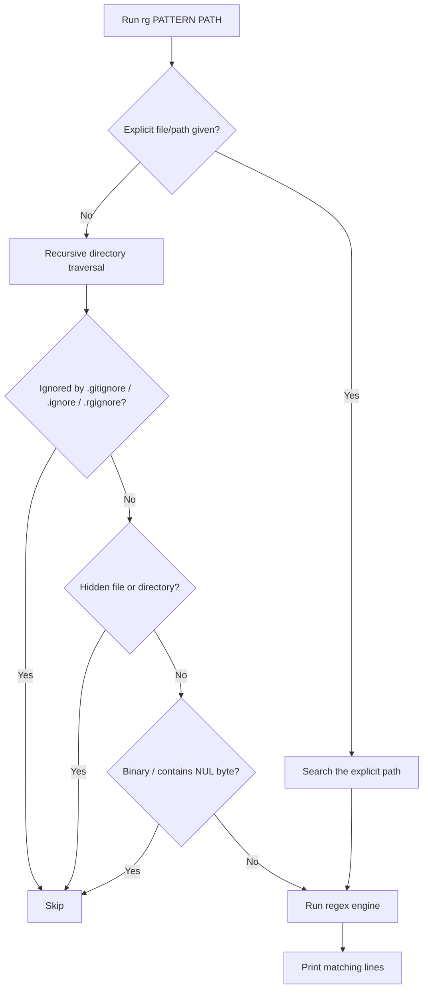
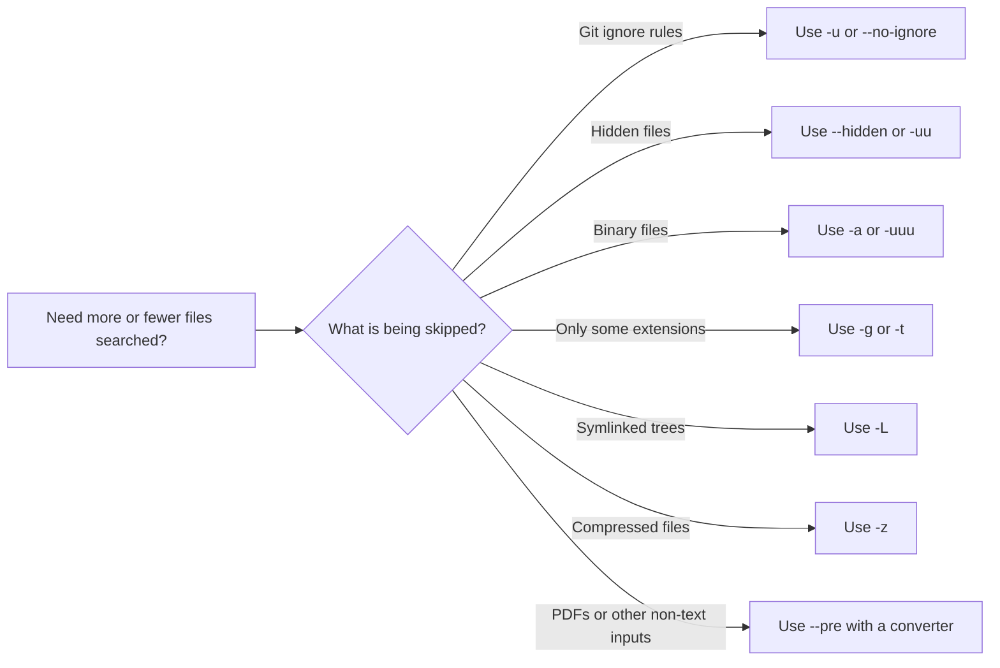

# ripgrep (`rg`) on macOS: A Practical Guide

> A detailed Markdown guide for Mac users who want to search code, logs, config files, and text-heavy directories quickly from Terminal.

## Table of Contents

1. [What ripgrep is](#what-ripgrep-is)
2. [Why macOS users like it](#why-macos-users-like-it)
3. [Install on macOS](#install-on-macos)
4. [Your first useful searches](#your-first-useful-searches)
5. [How ripgrep decides what to search](#how-ripgrep-decides-what-to-search)
6. [Patterns, literals, and regex engines](#patterns-literals-and-regex-engines)
7. [Filtering files and directories](#filtering-files-and-directories)
8. [Output modes you will actually use](#output-modes-you-will-actually-use)
9. [macOS-focused workflows](#macos-focused-workflows)
10. [Configuration on macOS](#configuration-on-macos)
11. [Troubleshooting](#troubleshooting)
12. [Cheat sheet](#cheat-sheet)
13. [References](#references)

---

## What ripgrep is

`ripgrep` (command name: `rg`) is a line-oriented search tool that recursively searches the current directory for a regex pattern. By default, it respects ignore rules, skips hidden files and directories, and skips binary files. It is available for macOS, Linux, and Windows. [R1]

That default behavior is the reason many people feel `rg` is "smarter" than a plain recursive `grep`: it usually searches the files you care about first and avoids a lot of noise.

A useful mental model is:

- `rg` is **recursive by default**.
- It is **regex-first**, but can also do literal searches.
- It is **opinionated by default** about what should be skipped.
- It is **comfortable for terminal use**, but also has output modes for editors and tooling such as JSON Lines and Vim-style output. [R1][R4]

---

## Why macOS users like it

For macOS users, `rg` is especially convenient because:

- it is easy to install with Homebrew using `brew install ripgrep`; [R2]
- the current Homebrew formula is published as `ripgrep` and also known as `rg`; [R2]
- the Homebrew formula currently publishes bottles for recent macOS Apple Silicon and Intel targets, and the formula currently lists stable version `15.1.0`; [R2]
- Homebrew installs to the default supported prefix `/opt/homebrew` on Apple Silicon and `/usr/local` on Intel macOS, which is helpful when you are checking paths or debugging shell setup. [R3]

That makes `rg` a strong fit for everyday Mac work such as:

- searching source trees;
- searching app logs under project directories;
- searching dotfiles and configs when you intentionally include hidden files;
- scanning large text collections without dumping binary junk into Terminal.

---

## Install on macOS

### With Homebrew

```sh
brew install ripgrep
```

That is the official install command shown on the Homebrew formula page. [R2]

### Verify the install

```sh
rg --version
which rg
```

If Homebrew is installed in the default supported location, the command usually resolves under:

- `/opt/homebrew/bin/rg` on Apple Silicon
- `/usr/local/bin/rg` on Intel macOS [R3]

### If Homebrew itself is not installed yet

Homebrew's installation documentation says the supported default prefixes are:

- `/opt/homebrew` for Apple Silicon
- `/usr/local` for macOS Intel [R3]

Once Homebrew is available and on your `PATH`, `brew install ripgrep` is usually all you need.

---

## Your first useful searches

### Search from the current directory downward

```sh
rg "TODO"
```

### Search a specific directory

```sh
rg "TODO" ~/Projects/my-app
```

### Search a specific file

```sh
rg "timeout" ./config/app.conf
```

### Show line numbers explicitly

```sh
rg -n "timeout"
```

### Search case-insensitively

```sh
rg -i "apikey"
```

### Use smart case

```sh
rg -S "apikey"
rg -S "APIKey"
```

With `--smart-case`, ripgrep searches case-insensitively when the pattern is all lowercase, and case-sensitively otherwise. [R4][R5]

### Search literal text instead of regex

```sh
rg -F "user.name=*"
```

`-F` treats patterns as literal strings, which is often the easiest choice when your search text contains regex metacharacters like `.` or `*`. [R4]

---

## How ripgrep decides what to search

The default search path is recursive directory traversal, but the important part is that ripgrep filters aggressively before it prints anything. The official guide emphasizes that one of ripgrep's most important features is what it does **not** search. [R6]

### Diagram: default search pipeline



This diagram is simplified, but it matches the practical behavior described in the official README, guide, and manual: by default ripgrep respects ignore rules, skips hidden files, skips binary files, and searches recursively. Explicitly named paths are handled more directly. [R1][R4][R6]

### A very useful default to remember

If you suspect ripgrep is hiding a result because of its filtering, try this progression:

```sh
rg "needle"
rg -u "needle"
rg -uu "needle"
rg -uuu "needle"
```

Repeated `-u` reduces filtering further:

- `-u` disables ignore-file filtering,
- `-uu` also searches hidden files and directories,
- `-uuu` also searches binary files. [R6][R7]

---

## Patterns, literals, and regex engines

### Default regex engine

By default, ripgrep uses Rust's regex engine. The manual describes it as roughly Perl-like regexes **without** look-around or backreferences, while also supporting features such as Unicode character classes. [R4]

This means many everyday searches work exactly as you expect:

```sh
rg "error|warn"
rg "^import "
rg "fast\w+"
```

### When to use `-F` for fixed strings

Use fixed-string mode when you want exact text and do not want to escape punctuation:

```sh
rg -F "com.example.service"
rg -F "[INFO] started"
```

This is often the cleanest choice for log messages, URLs, package names, plist keys, and shell snippets. [R4]

### When to use `-P` for PCRE2

Use `-P` when you need regex features such as:

- look-around,
- backreferences.

The manual documents `-P/--pcre2` for this purpose and notes that PCRE2 support is optional in ripgrep builds. [R4]

Example:

```sh
rg -P "(?<=user_id=)\d+"
```

The current Homebrew formula page lists `pcre2` as a dependency, which is a good sign for Mac users installing ripgrep via Homebrew, but the safest check is still:

```sh
rg --version
```

and, when needed, simply trying a small `-P` search. [R2][R4]

### Multiline matching

Use `-U` or `--multiline` when your pattern may span multiple lines. [R5]

```sh
rg -U "BEGIN[\s\S]*END" notes/
```

### Pattern starts with a dash

If your pattern begins with `-`, use `-e` or `--` so ripgrep does not mistake it for a flag. [R4]

```sh
rg -e -foo
rg -- -foo
```

---

## Filtering files and directories

Filtering is where `rg` becomes much more productive than a naive recursive search.

### Ignore files: `.gitignore`, `.ignore`, `.rgignore`

The guide explains that ripgrep respects more than just `.gitignore`. It also respects:

- repository-specific exclude rules such as `$GIT_DIR/info/exclude`,
- Git's global ignore rules,
- `.ignore`,
- `.rgignore`. [R6]

The precedence described in the guide is important:

- `.ignore` has higher precedence than `.gitignore`,
- `.rgignore` has higher precedence than `.ignore`. [R6]

That means you can keep something ignored by Git while still including it in ripgrep searches via `.ignore` or `.rgignore`.

### Hidden files and directories

By default, ripgrep skips hidden files and directories. To include them:

```sh
rg --hidden "alias"
```

This is particularly useful on macOS when searching dotfiles or hidden project folders. [R1][R6]

### Binary files

By default, ripgrep skips binary files. The guide says binary detection is based on the presence of a `NUL` byte. [R6]

To force text treatment:

```sh
rg -a "needle" somefile.bin
```

Be careful with `-a/--text`: binary output can make Terminal unpleasant if the file really is binary. [R6]

### Follow symlinks

By default, ripgrep does not follow symlinks. To follow them:

```sh
rg -L "needle"
```

The guide documents `--follow` (short form `-L`) for this. [R6]

### Include or exclude by glob

Use `-g` or `--glob` for ad hoc filtering. The guide gives an important shell tip: quote your globs so your shell does not expand `*` before ripgrep sees it. [R8]

```sh
rg "func main" -g '*.go'
rg "TODO" -g '!dist/*'
rg "clap" -g '*.toml'
```

### Filter by file type

Instead of repeating globs, use ripgrep's file type system:

```sh
rg "ViewController" -tswift
rg "SELECT" -tsql
rg "def " -tpy
```

You can see supported types with:

```sh
rg --type-list | less
```

The manual also supports adding types dynamically with `--type-add`, and the guide shows using types as a shorthand for frequently repeated globs. [R7][R8]

### Add your own file type

```sh
rg --type-add 'plist:*.plist' -tplist "CFBundleIdentifier"
```

or define a broader custom type in a config file, covered below. [R7][R9]

### Diagram: choosing the right filtering flags



---

## Output modes you will actually use

### Standard human-readable output

When stdout is a TTY, ripgrep changes its output format in user-friendly ways. The manual says it will normally enable colors, line numbers, and a heading format that lists the matching file path once per file. [R4]

### Files only

Sometimes you want the file list without matching lines:

```sh
rg -l "deprecated_api"
```

### Inspect what ripgrep would search

```sh
rg --files
```

The guide explicitly calls this out: it prints the files that ripgrep would search without actually searching them. [R5]

This is one of the best commands for debugging "Why didn't `rg` search my file?"

### Vim-style output

Use `--vimgrep` when you want one match per line, including line and column numbers. [R10]

```sh
rg --vimgrep "TODO"
```

This is good for quickfix-style workflows and editor integrations.

### JSON Lines output

Use `--json` when you want machine-readable results. The manual says ripgrep emits JSON Lines messages such as `begin`, `match`, `context`, `end`, and `summary`. [R11]

```sh
rg --json "panic" src/
```

This is ideal for wrappers, tooling, and scripts that need structured output.

### Replace in output (not in files)

ripgrep can rewrite its **displayed output** with `--replace`, but the guide is explicit that it will **not modify files**. [R9]

```sh
rg "fast\s+(\w+)" README.md -r 'fast-$1'
```

That makes `--replace` useful for previewing text transformations before using a real editor or a separate rewrite tool.

---

## macOS-focused workflows

This section keeps the commands practical for the way many Mac users actually work.

### 1) Search a codebase from a project root

```sh
cd ~/Projects/my-app
rg -n "TODO|FIXME"
```

This is the classic ripgrep workflow: recursive, fast, and respectful of project ignore rules. [R1][R6]

### 2) Search only Swift files

```sh
rg -n -tswift "UIViewController|NSViewController" .
```

If you are in a mixed repository, type filters reduce noise dramatically. [R7][R8]

### 3) Search dotfiles and hidden config

```sh
rg --hidden "alias gs" ~
```

By default those files are skipped, so `--hidden` is the key switch here. [R6]

### 4) Search ignored build output on purpose

```sh
rg -u "fatal error" .
```

Use this when a result may be sitting in a path ignored by Git or by ripgrep ignore files. [R6][R7]

### 5) Search compressed logs

```sh
rg -z "Exception|Traceback|panic" ./logs
```

The manual documents `-z/--search-zip` for compressed files including gzip, bzip2, xz, LZ4, LZMA, Brotli, and Zstd, assuming the required decompression binaries are available in your `PATH`. [R4][R5]

### 6) Search PDFs through a preprocessor

ripgrep itself is for text, but the manual documents `--pre` and `--pre-glob` so you can transform files before searching them. One example uses `pdftotext` for PDFs. [R4]

Example wrapper script:

```sh
#!/bin/sh
pdftotext "$1" -
```

Then search only PDFs with:

```sh
rg --pre ./pre-pdftotext --pre-glob '*.pdf' "invoice number" ./docs
```

This is an advanced but very powerful pattern on macOS when you need a single Terminal workflow for mixed text and PDF content.

### 7) Preview candidate files first

```sh
rg --files | rg '\.swift$'
```

This is a nice two-step pattern:

1. ask ripgrep which files it would search,
2. narrow that list with another ripgrep run.

Because `--files` honors ripgrep's file selection rules, this is often better than using a plain `find` when you want behavior that matches your eventual `rg` search. [R5]

### 8) Use explicit paths when you know exactly what you want

The manual says explicitly named file paths override glob and ignore rules. [R4]

```sh
rg "token" ./build/generated/config.txt
```

That is useful when a file is normally ignored but you want to inspect it directly.

---

## Configuration on macOS

ripgrep supports configuration files, but the guide is clear about one important detail: it does **not** automatically search a predetermined config location. Instead, ripgrep reads a config file only when `RIPGREP_CONFIG_PATH` is set and non-empty. [R4][R9]

### Minimal setup

Create a config file:

```sh
cat > "$HOME/.ripgreprc" <<'RC'
--smart-case
--hidden
--glob=!.git/*
RC
```

Then export the environment variable:

```sh
export RIPGREP_CONFIG_PATH="$HOME/.ripgreprc"
```

### Why this is useful on a Mac

If you regularly:

- search dotfiles,
- want smart case all the time,
- want custom file types,
- want output tuned for your terminal,

then a config file removes the need to remember the same flags over and over.

### Important config-file rules

The guide documents two formatting rules: [R9]

1. each line is a single shell argument after trimming whitespace;
2. lines beginning with `#` are comments.

It also notes that there is no escaping in the config format. For flags with values, either use `--flag=value` on one line or place the flag and value on separate lines. [R9]

### Example: add a custom type for web-ish files

```sh
# ~/.ripgreprc
--type-add
web:*.{html,css,js}*
--smart-case
--hidden
--glob=!.git/*
```

This exact style is illustrated in the official guide. [R9]

### Turn config off for one command

```sh
rg --no-config "needle"
```

The guide says `--no-config` prevents ripgrep from reading extra configuration from the environment. [R9]

---

## Troubleshooting

### "ripgrep didn't find a result I know exists"

Try this checklist:

1. **Check what files ripgrep would search**

   ```sh
   rg --files | less
   ```

2. **Reduce filtering**

   ```sh
   rg -u "needle"
   rg -uu "needle"
   rg -uuu "needle"
   ```

3. **Use `--debug`**

   The guide and manual both point to `--debug` as a good way to understand why a file was skipped. [R6][R11]

4. **Pass an explicit path**

   Explicit file paths override ignore and glob rules. [R4]

### "My glob didn't work"

Quote it:

```sh
rg "needle" -g '*.toml'
```

The guide explicitly warns that you should quote globs so your shell does not expand `*` first. [R8]

### "My advanced regex didn't work"

You may need PCRE2:

```sh
rg -P "(?<=user_id=)\d+"
```

The default engine does not support look-around or backreferences. [R4]

### "I need stable output for scripts"

Use:

```sh
rg --json "pattern" path/
```

The manual documents JSON Lines output for structured processing. [R11]

### "I want one match per line for an editor workflow"

Use:

```sh
rg --vimgrep "pattern"
```

The manual says this prints every match on its own line with line and column numbers. [R10]

### "I want plain old grep-like behavior"

Try:

```sh
rg -uuu "pattern"
```

The manual explicitly recommends `rg -uuu` when you want to disable smart filtering and behave more like classical `grep`. [R4]

---

## Cheat sheet

```sh
# install
brew install ripgrep

# basic search
rg "needle"

# exact string instead of regex
rg -F "literal.text[*]"

# case-insensitive / smart-case
rg -i "apikey"
rg -S "apikey"

# include hidden files
rg --hidden "alias"

# include ignored files
rg -u "fatal error"

# include hidden + ignored + binary files
rg -uuu "needle"

# search only certain file types
rg -tswift "ViewController"
rg -tpy "def main"

# ad hoc glob filtering
rg "TODO" -g '*.md'
rg "TODO" -g '!dist/*'

# preview the files rg would search
rg --files

# machine-readable output
rg --json "panic" src/

# editor-friendly output
rg --vimgrep "panic"

# compressed files
rg -z "Exception" logs/

# multiline search
rg -U "BEGIN[\s\S]*END" docs/

# advanced regex with PCRE2
rg -P "(?<=id=)\d+"

# config file
export RIPGREP_CONFIG_PATH="$HOME/.ripgreprc"
```

---

## References

These are the sources referred to in this document.

- **[R1]** BurntSushi, *ripgrep README*  
  <https://github.com/BurntSushi/ripgrep/blob/master/README.md>

- **[R2]** Homebrew Formulae, *ripgrep formula page*  
  <https://formulae.brew.sh/formula/ripgrep>

- **[R3]** Homebrew Documentation, *Installation*  
  <https://docs.brew.sh/Installation>

- **[R4]** `rg(1)` manual page  
  <https://man.archlinux.org/man/rg.1.en>

- **[R5]** BurntSushi, *ripgrep User Guide (GUIDE.md)*, common options and usage overview  
  <https://github.com/BurntSushi/ripgrep/blob/master/GUIDE.md>

- **[R6]** BurntSushi, *ripgrep User Guide (GUIDE.md)*, automatic filtering and binary-data behavior  
  <https://github.com/BurntSushi/ripgrep/blob/master/GUIDE.md>

- **[R7]** `rg(1)` manual page, type filtering and file-selection flags  
  <https://man.archlinux.org/man/rg.1.en>

- **[R8]** BurntSushi, *ripgrep User Guide (GUIDE.md)*, glob filtering and file-type filtering  
  <https://github.com/BurntSushi/ripgrep/blob/master/GUIDE.md>

- **[R9]** BurntSushi, *ripgrep User Guide (GUIDE.md)*, replacements and configuration file  
  <https://github.com/BurntSushi/ripgrep/blob/master/GUIDE.md>

- **[R10]** `rg(1)` manual page, `--vimgrep` behavior  
  <https://man.archlinux.org/man/rg.1.en>

- **[R11]** `rg(1)` manual page, `--json`, `--debug`, and output behavior  
  <https://man.archlinux.org/man/rg.1.en>
