# Computer Networking from First Principles  
## A Self-Study Book for Developers

**Audience:** international readers who want a clear, practical, and developer-friendly introduction to computer networks.  
**Format:** Markdown with Mermaid diagrams.  
**How to use this file:** open it in a Markdown viewer that supports Mermaid, such as GitHub, GitLab, Obsidian with a Mermaid plugin, Typora, or VS Code with a Mermaid preview extension.

> Network knowledge is not only for network engineers. It helps developers design reliable services, debug production incidents, understand cloud infrastructure, and communicate clearly with infrastructure, security, and operations teams.

---

## Table of Contents

- [How to Study This Book](#how-to-study-this-book)
- [Chapter 01. Getting Started with Computer Networks](#chapter-01-getting-started-with-computer-networks)
  - [01-1. Why You Should Learn Computer Networks](#01-1-why-you-should-learn-computer-networks)
  - [01-2. Looking at Networks Macroscopically](#01-2-looking-at-networks-macroscopically)
  - [01-3. Looking at Networks Microscopically](#01-3-looking-at-networks-microscopically)
- [Chapter 02. Physical Layer and Data Link Layer](#chapter-02-physical-layer-and-data-link-layer)
  - [02-1. Ethernet](#02-1-ethernet)
  - [02-2. NICs and Cables](#02-2-nics-and-cables)
  - [02-3. Hubs](#02-3-hubs)
  - [02-4. Switches](#02-4-switches)
- [Chapter 03. Network Layer](#chapter-03-network-layer)
  - [03-1. The Network Layer Beyond a LAN](#03-1-the-network-layer-beyond-a-lan)
  - [03-2. IP Addresses](#03-2-ip-addresses)
  - [03-3. Routing](#03-3-routing)
- [Chapter 04. Transport Layer](#chapter-04-transport-layer)
  - [04-1. Transport Layer Overview: IP Limitations and Ports](#04-1-transport-layer-overview-ip-limitations-and-ports)
  - [04-2. TCP and UDP](#04-2-tcp-and-udp)
  - [04-3. TCP Error, Flow, and Congestion Control](#04-3-tcp-error-flow-and-congestion-control)
- [Chapter 05. Application Layer](#chapter-05-application-layer)
  - [05-1. DNS and Resources](#05-1-dns-and-resources)
  - [05-2. HTTP](#05-2-http)
  - [05-3. HTTP Headers and HTTP-Based Technologies](#05-3-http-headers-and-http-based-technologies)
- [Chapter 06. Reviewing Networks Through Practice](#chapter-06-reviewing-networks-through-practice)
  - [06-1. Installing and Using Wireshark](#06-1-installing-and-using-wireshark)
  - [06-2. Protocol Analysis with Wireshark](#06-2-protocol-analysis-with-wireshark)
- [Chapter 07. Deeper Networking](#chapter-07-deeper-networking)
  - [07-1. Technologies for Reliability](#07-1-technologies-for-reliability)
  - [07-2. Technologies for Security](#07-2-technologies-for-security)
  - [07-3. Wireless Networks](#07-3-wireless-networks)
- [Answers and Explanations](#answers-and-explanations)
- [Index](#index)
- [Source Links](#source-links)

---

## How to Study This Book

This book is written for self-study. Each section follows the same pattern:

1. **Concept:** the simplest explanation first.
2. **Mechanism:** what happens step by step.
3. **Developer view:** why the idea matters in real software.
4. **Mermaid diagram:** a visual model of the idea.
5. **Key points:** the most important terms.
6. **Check-up questions:** short questions to verify understanding.
7. **Answers and explanations:** at the end of the book.

### Recommended Study Path

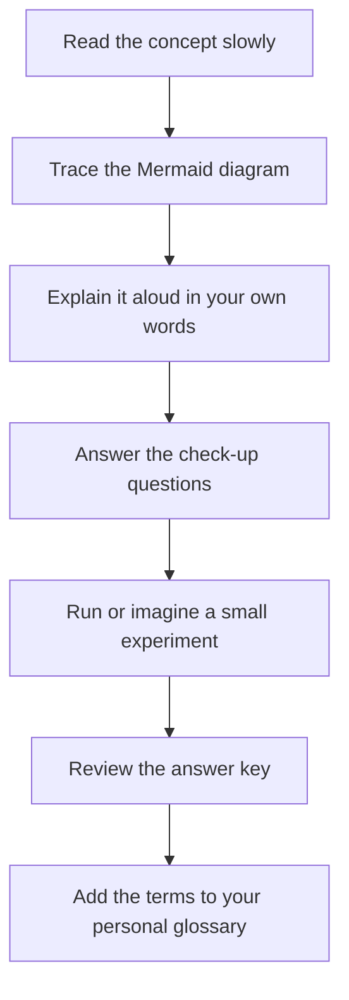

### A Note About Mermaid

Mermaid diagrams are text-based diagrams. In this Markdown file they appear in code blocks like this:

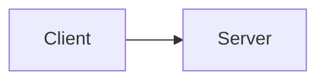

If your viewer does not render Mermaid, you can still read the diagram code. The arrows and labels are intentionally written to be understandable as plain text.

---

# Chapter 01. Getting Started with Computer Networks

## 01-1. Why You Should Learn Computer Networks

### The Internet: A Network of Networks

A **computer network** is a system in which computing devices exchange data. The **Internet** is not one giant cable or one central computer. It is a global interconnection of many independently operated networks: home networks, mobile networks, university networks, enterprise networks, cloud provider networks, content delivery networks, and Internet service provider networks.

When you open a web page, your device may contact a local router, a DNS resolver, an ISP, a backbone provider, a CDN edge server, an origin server, and many security and routing systems along the way. You experience it as one click, but the network performs many coordinated steps.

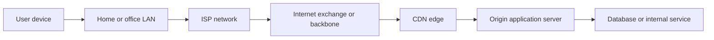

The Internet works because devices agree on **protocols**. A protocol is a shared rule for communication. It defines the shape of messages, the order of messages, the meaning of fields, and the behavior expected from participants.

### Why Developers Need Networking Knowledge

A developer does not need to memorize every cable standard or routing algorithm. However, a developer should understand the path from code to packet to service. Many production problems are network-shaped even when they look like application bugs.

#### When Building Programs

Network knowledge helps when you design and implement:

- web clients and servers,
- APIs and microservices,
- mobile apps,
- real-time chat and streaming systems,
- database connections,
- message queues,
- cloud-native services,
- authentication flows over HTTPS,
- observability and monitoring pipelines.

For example, a simple HTTP request from your application might require DNS lookup, TCP connection setup, TLS negotiation, HTTP request transmission, server processing, response transfer, caching decisions, and connection reuse.

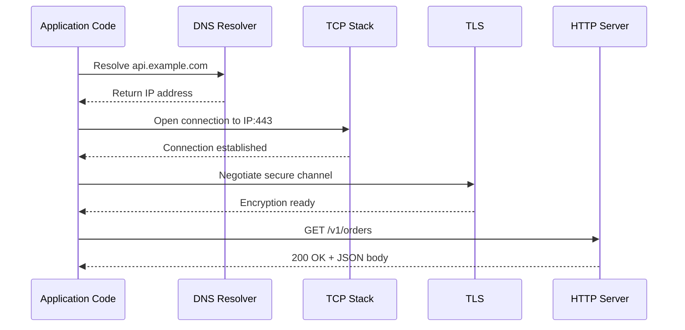

A developer who understands this chain can make better decisions about timeouts, retries, connection pooling, keep-alive, caching, idempotency, rate limiting, and error messages.

#### When Maintaining Programs

In maintenance and operations, networking knowledge helps you answer questions such as:

- Why does the service work locally but fail in production?
- Is the problem DNS, routing, firewall rules, TLS certificates, server load, or application logic?
- Why does a request sometimes take 50 ms and sometimes 5 seconds?
- Why do users in one region report errors while users in another region do not?
- Why does a POST request create duplicate records after a retry?
- Why does a container fail to connect to a database even though the database is running?

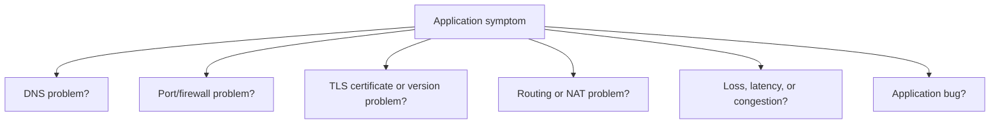

Good developers do not guess blindly. They form hypotheses and test them with logs, metrics, packet captures, command-line tools, and knowledge of protocol behavior.

### Core Points in 2 Keywords

| Keyword | Meaning |
|---|---|
| **Internet** | A global network of networks that uses shared protocols to move data. |
| **Protocol** | A rule system that defines how communication participants format, send, receive, and interpret messages. |

### Check-up Questions

1. Why is the Internet called a "network of networks"?
2. Name three situations where a developer uses network knowledge while building software.
3. Name three situations where a developer uses network knowledge while maintaining software.
4. What is a protocol?
5. Why can a network problem look like an application bug?

---

## 01-2. Looking at Networks Macroscopically

A macroscopic view looks at the big building blocks of a network. Before studying packet headers, you should know the objects that participate in communication.

### Basic Structure of a Network

A network usually includes **hosts**, **network devices**, **communication media**, and **messages**.

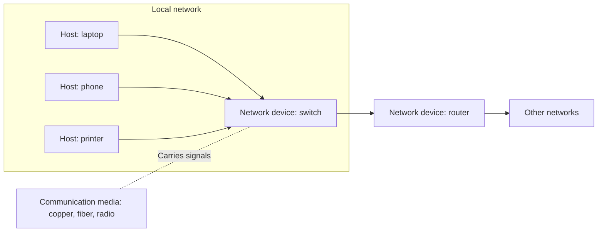

#### Host

A **host** is an end system that sends or receives user data. Examples include laptops, smartphones, servers, printers, virtual machines, containers, and IoT devices.

A host usually has:

- a network interface,
- one or more addresses,
- software that implements protocols,
- applications that consume or provide network services.

#### Network Devices

A **network device** forwards, filters, translates, or manages traffic between hosts and networks. Common examples include:

- **hub:** repeats signals to all ports,
- **switch:** forwards Ethernet frames inside a LAN,
- **router:** forwards IP packets between networks,
- **firewall:** permits or blocks traffic by policy,
- **load balancer:** distributes requests across backends,
- **wireless access point:** bridges wireless clients to a wired network.

#### Communication Media

A **communication medium** carries signals. It may be copper cable, fiber-optic cable, or radio waves. The medium affects speed, distance, interference, cost, and installation difficulty.

#### Message

A **message** is the information being transmitted. Depending on the layer, the same user data may be called a frame, packet, segment, datagram, request, response, or payload.

### Classification by Scope

Networks can be classified by the area they cover.

#### LAN: Local Area Network

A **LAN** usually covers a limited area such as a home, office, building, or campus. Ethernet and Wi-Fi are common LAN technologies. In a LAN, devices often share the same administrative owner and can communicate at high speed with low latency.

#### WAN: Wide Area Network

A **WAN** connects networks across cities, countries, or continents. The Internet is the largest practical WAN. WAN links are often operated by service providers and may have higher latency, lower reliability, and higher cost than LAN links.

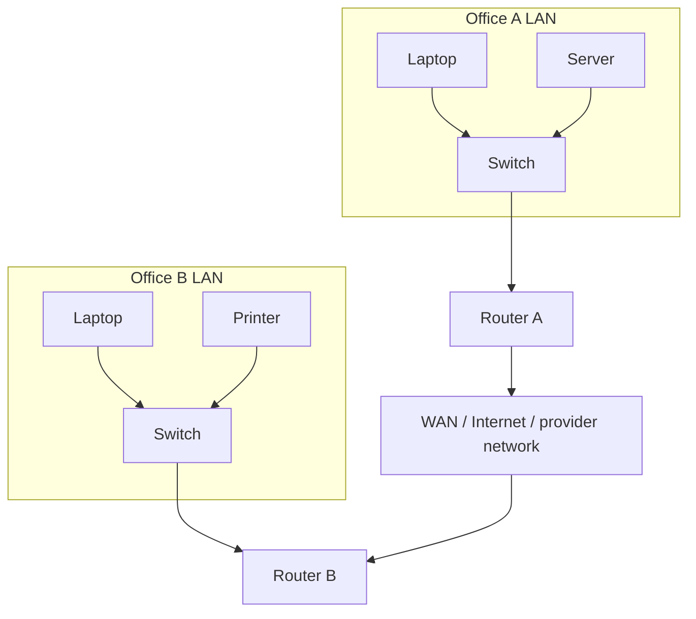

### Classification by Message Exchange Method

#### Circuit Switching

In **circuit switching**, a dedicated path is established before communication begins. Traditional telephone networks are a classic example. The reserved path provides predictable capacity, but unused capacity is wasted while the circuit is idle.

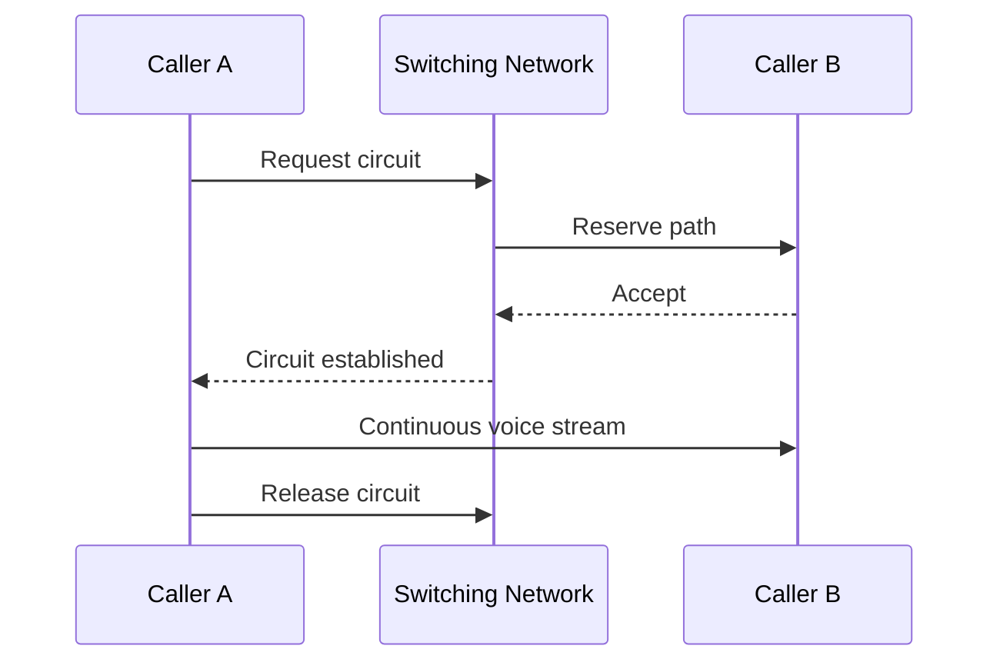

#### Packet Switching

In **packet switching**, data is divided into packets. Each packet includes addressing information and can be forwarded independently. The Internet uses packet switching because it allows many flows to share infrastructure efficiently.

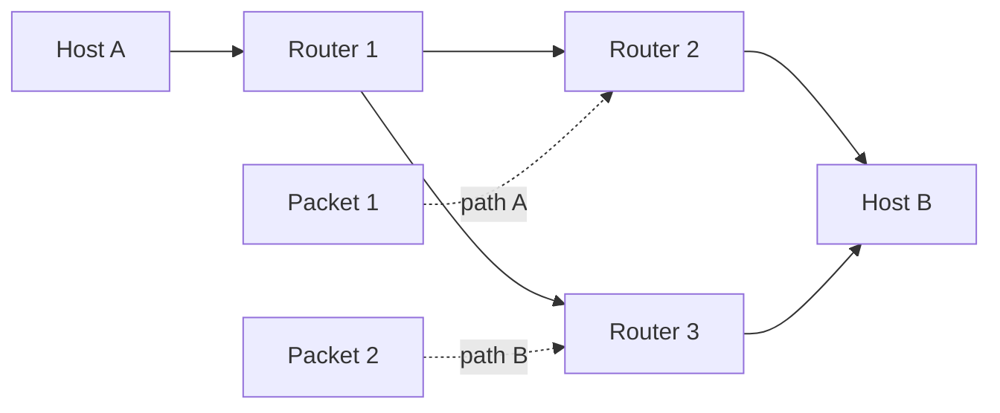

Packet switching is efficient but introduces challenges: packets can be delayed, dropped, duplicated, or reordered. Higher-layer protocols and applications must handle these realities.

### More: Transmission Types by Address and Destination

| Type | Destination | Typical Example |
|---|---|---|
| **Unicast** | One sender to one receiver | A browser requesting a web page from one server |
| **Broadcast** | One sender to all hosts in a broadcast domain | ARP request in an IPv4 LAN |
| **Multicast** | One sender to a subscribed group | Streaming or routing protocol updates |
| **Anycast** | One sender to the nearest or best member of a group | Public DNS services and CDN edge routing |

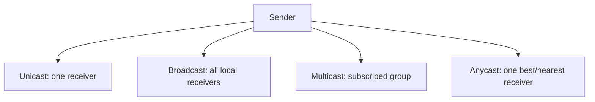

### Core Points in 6 Keywords

| Keyword | Meaning |
|---|---|
| **Host** | End system that sends or receives data. |
| **Network device** | Intermediate device that forwards, filters, translates, or manages traffic. |
| **Communication medium** | Physical or wireless path that carries signals. |
| **LAN** | Local network covering a small area. |
| **WAN** | Wide-area network connecting distant networks. |
| **Packet switching** | Communication method that divides data into independently forwarded packets. |

### Check-up Questions

1. What is the difference between a host and a network device?
2. Why is a switch usually considered a LAN device?
3. What is the main difference between a LAN and a WAN?
4. How does circuit switching differ from packet switching?
5. Why is packet switching efficient for the Internet?
6. Compare unicast, broadcast, multicast, and anycast.

---

## 01-3. Looking at Networks Microscopically

A microscopic view looks inside the communication process: protocols, layers, headers, encapsulation, and performance metrics.

### Protocols

A **protocol** defines how devices communicate. A useful protocol usually specifies:

- message format,
- field meanings,
- valid message order,
- error handling,
- timing rules,
- participant responsibilities.

For example, HTTP defines requests and responses. TCP defines connection management, sequence numbers, acknowledgments, and reliable byte streams. IP defines addressing and packet forwarding.

### Network Reference Models

Reference models help people divide a complex network into understandable layers. The two most common models are the OSI model and the TCP/IP model.

#### OSI Model

The OSI model has seven layers:

| Layer | Name | Main Idea |
|---:|---|---|
| 7 | Application | User-facing network services and application protocols |
| 6 | Presentation | Data representation, encoding, compression, encryption concepts |
| 5 | Session | Dialog management concepts |
| 4 | Transport | End-to-end process communication |
| 3 | Network | Logical addressing and routing |
| 2 | Data Link | Local delivery over one link |
| 1 | Physical | Signals, bits, media |

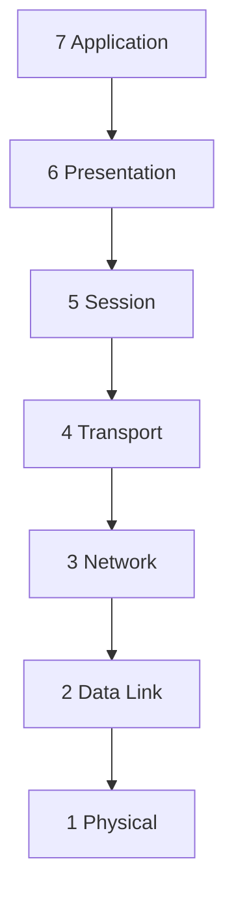

#### TCP/IP Model

The TCP/IP model is closer to how Internet protocols are commonly discussed.

| TCP/IP Layer | Typical Protocols / Technologies |
|---|---|
| Application | HTTP, DNS, SMTP, SSH, TLS as used by apps |
| Transport | TCP, UDP, QUIC above UDP |
| Internet | IP, ICMP |
| Link | Ethernet, Wi-Fi, ARP-related local delivery |

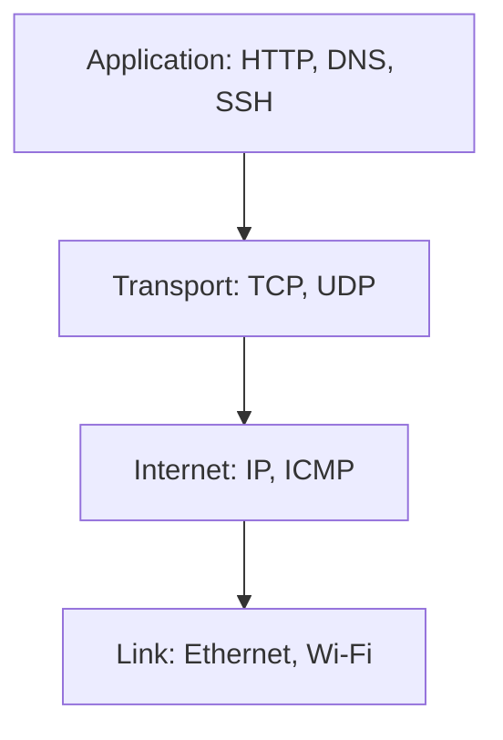

### Encapsulation and Decapsulation

#### Encapsulation

When data travels down the protocol stack, each layer adds its own header, and sometimes a trailer. This process is called **encapsulation**.

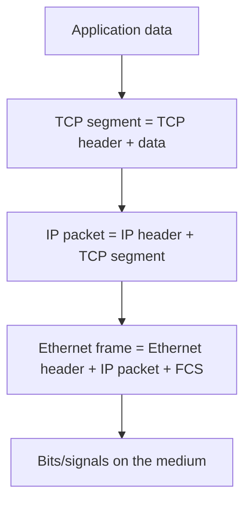

#### Decapsulation

At the receiver, each layer reads and removes the header/trailer intended for that layer. This reverse process is called **decapsulation**.

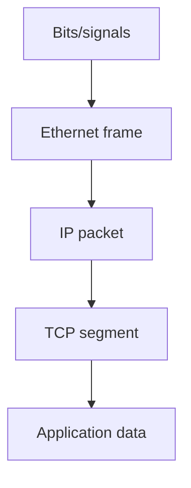

### PDU: Protocol Data Unit

A **PDU** is the data unit handled by a layer.

| Layer | Common PDU Name |
|---|---|
| Application | Message, request, response |
| Transport | Segment for TCP, datagram for UDP |
| Network / Internet | Packet, datagram |
| Data Link | Frame |
| Physical | Bits or signals |

### More: OSI 7 Layers and TCP/IP 4 Layers Do Not Send Packets by Themselves

The OSI and TCP/IP models are models. They do not literally move packets. Real operating systems, NIC drivers, routers, switches, and applications implement protocols and perform the work.

This is important because models simplify reality. For example, TLS is often described between application and transport. ARP is often discussed near the link layer but helps IPv4 local delivery. QUIC provides transport-like features but runs over UDP. Real networks are practical engineering systems, not perfect textbook boxes.

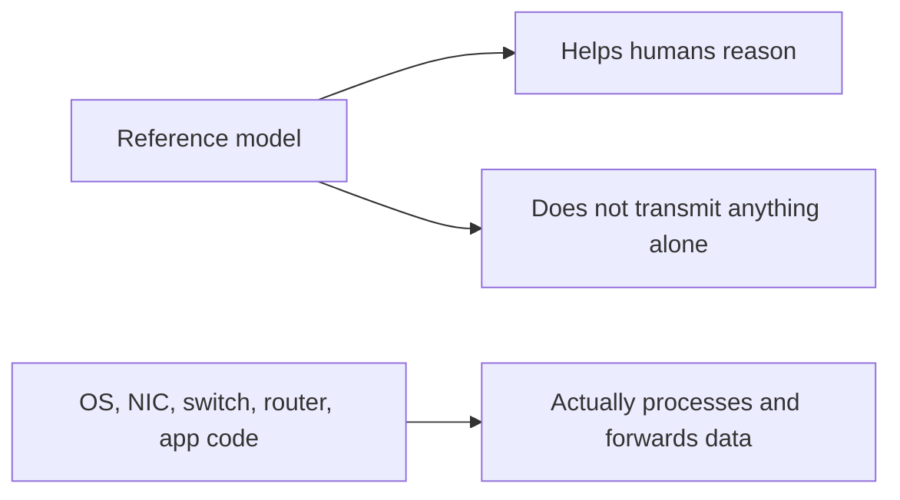

### More: Traffic and Network Performance Metrics

#### Throughput

**Throughput** is the actual amount of useful data delivered per unit time. It is what your application experiences.

#### Bandwidth

**Bandwidth** is the theoretical or configured capacity of a link or path. A 1 Gbit/s link does not guarantee 1 Gbit/s application throughput.

#### Packet Loss

**Packet loss** occurs when packets do not arrive. Loss may happen because of congestion, wireless interference, faulty cables, overloaded devices, routing changes, or security filtering.

#### Latency and Jitter

Although not in the chapter title, two extra terms are useful:

- **Latency** is time delay from sender to receiver or request to response.
- **Jitter** is variation in latency.

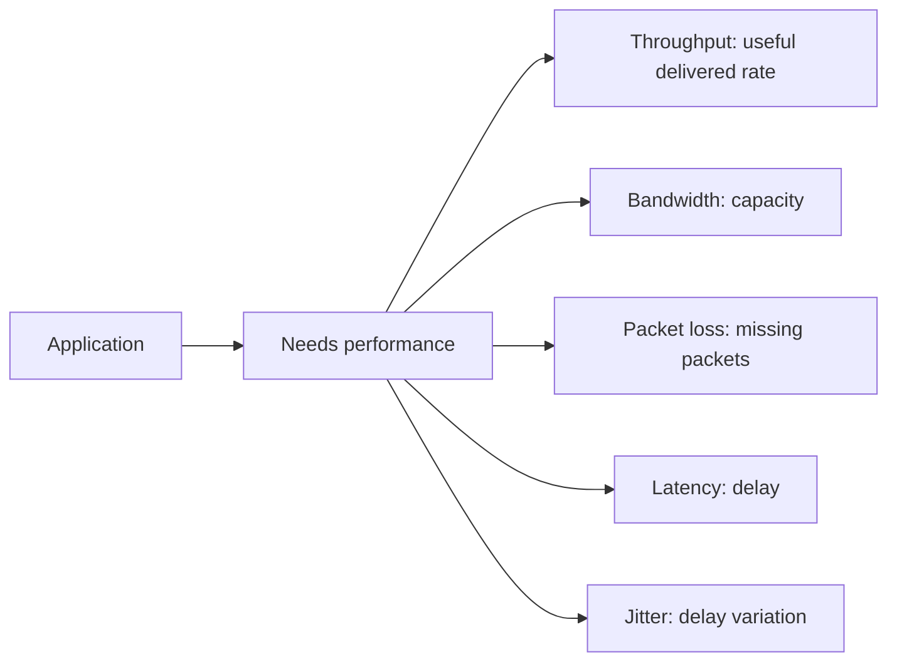

### Core Points in 7 Keywords

| Keyword | Meaning |
|---|---|
| **Protocol** | Rules for message format and behavior. |
| **OSI model** | Seven-layer reference model for network concepts. |
| **TCP/IP model** | Practical Internet-oriented layer model. |
| **Encapsulation** | Adding headers/trailers while sending. |
| **Decapsulation** | Removing headers/trailers while receiving. |
| **PDU** | Data unit handled by a protocol layer. |
| **Throughput** | Actual useful data delivery rate. |

### Check-up Questions

1. What does a protocol define?
2. Name the seven OSI layers from top to bottom.
3. Name the four TCP/IP model layers.
4. What happens during encapsulation?
5. Why are reference models useful even though they do not transmit packets themselves?
6. Explain the difference between bandwidth and throughput.
7. What are three possible causes of packet loss?

### Chapter 01 Sources

- [RFC 791: Internet Protocol](https://www.rfc-editor.org/rfc/rfc791)
- [RFC 9293: Transmission Control Protocol](https://www.rfc-editor.org/rfc/rfc9293.html)
- [RFC 9110: HTTP Semantics](https://www.rfc-editor.org/rfc/rfc9110)
- [RFC 8200: IPv6 Specification](https://www.rfc-editor.org/rfc/rfc8200.html)
- [IANA Protocol Registries](https://www.iana.org/protocols)

---

# Chapter 02. Physical Layer and Data Link Layer

## 02-1. Ethernet

Ethernet is the dominant wired LAN technology. It defines how devices send frames over a local link, how MAC addresses identify interfaces, and how frame fields are interpreted. Ethernet has evolved from shared coaxial cable to switched twisted-pair and fiber networks with speeds from megabits per second to hundreds of gigabits and beyond.

### Ethernet Standards

Ethernet is standardized by the IEEE 802.3 working group. The family includes many physical media and speed variants. Names such as `100BASE-TX`, `1000BASE-T`, and `10GBASE-SR` encode information about speed and medium.

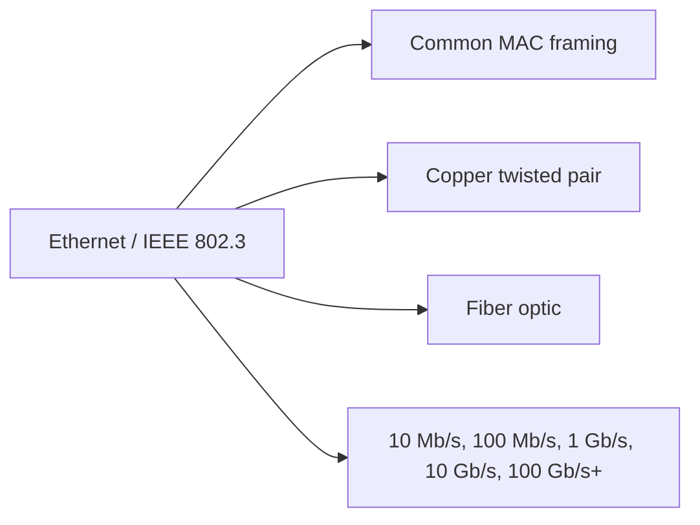

### Communication Media Naming

Ethernet physical media names often follow this pattern:

```text
<speed><BASE or BROAD><medium code>
```

Examples:

| Name | Meaning |
|---|---|
| **10BASE-T** | 10 Mb/s baseband over twisted pair |
| **100BASE-TX** | 100 Mb/s Fast Ethernet over twisted pair |
| **1000BASE-T** | 1 Gb/s Ethernet over twisted pair |
| **10GBASE-SR** | 10 Gb/s short-range fiber |
| **10GBASE-LR** | 10 Gb/s long-range fiber |

The naming scheme is historical and not perfectly uniform across all standards, but it remains useful for reading product specifications.

### Communication Media Types

Ethernet commonly uses:

- copper twisted-pair cables,
- fiber-optic cables,
- older coaxial cable in legacy systems.

Copper is inexpensive and convenient. Fiber supports longer distances and high speeds and is less affected by electromagnetic interference.

### Ethernet Frame

An Ethernet frame contains addresses, a type/length field, payload, and an error-checking trailer.

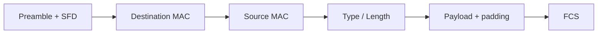

#### Preamble

The **preamble** helps receivers synchronize with the incoming bit stream. It is followed by the Start Frame Delimiter, which marks the start of the frame.

#### Destination and Source MAC Addresses

A **MAC address** is a link-layer address, commonly 48 bits long in Ethernet. The destination MAC identifies the next receiver on the local link. The source MAC identifies the interface that sent the frame on that link.

Important: the destination MAC may change at every router hop. The destination IP address usually remains the final destination, but the destination MAC address is for the next local delivery step.

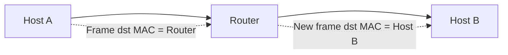

#### Type/Length

This field identifies the payload type or length, depending on the frame format. In Ethernet II, the EtherType commonly identifies the upper-layer protocol, such as IPv4 or IPv6.

#### Data

The data field carries the upper-layer payload, such as an IP packet. Ethernet has minimum and maximum frame size rules, so padding may be added if the payload is too small.

#### FCS

The **Frame Check Sequence** is used for error detection. If a receiver detects a corrupted frame, it discards it. Ethernet itself does not normally request retransmission; higher layers may recover.

### More: Token Ring

Token Ring was a LAN technology associated with IEEE 802.5. Instead of Ethernet-style contention, a special frame called a token circulated around the network. A host could transmit when it held the token. Token Ring is mostly historical today, but it is useful for understanding that Ethernet was not the only LAN design.

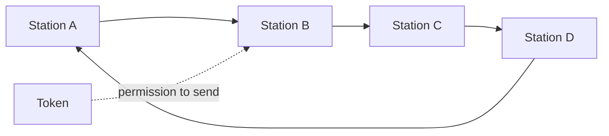

### Core Points in 4 Keywords

| Keyword | Meaning |
|---|---|
| **Ethernet** | Dominant wired LAN technology standardized by IEEE 802.3. |
| **MAC address** | Link-layer address used for local frame delivery. |
| **EtherType** | Field value identifying the upper-layer payload. |
| **FCS** | Frame Check Sequence used to detect corrupted frames. |

### Check-up Questions

1. What does Ethernet mainly provide in a LAN?
2. What is the purpose of a MAC address?
3. Why can the destination MAC address change at each router hop?
4. What does the FCS do?
5. Why is Token Ring mostly a historical topic today?

---

## 02-2. NICs and Cables

### NIC

A **Network Interface Card** or **Network Interface Controller** is the hardware interface through which a host connects to a network. It may be a physical card, a motherboard chip, a USB adapter, a virtual interface in a VM, or a software-defined interface in a container host.

#### What a NIC Looks Like

A physical NIC may have an RJ45 copper port, fiber transceiver slot, antenna connection, or integrated wireless radio. A server may have multiple NICs for redundancy, throughput, management, or network separation.

```mermaid
flowchart TD
    Host["Computer or server"] --> NIC["NIC"]
    NIC --> Port1["RJ45 copper port"]
    NIC --> Port2["SFP/SFP+ fiber transceiver"]
    NIC --> MAC["Burned-in or assigned MAC address"]
    NIC --> Driver["Operating system driver"]
```

#### Role of a NIC

A NIC performs tasks such as:

- sending and receiving signals,
- recognizing frames addressed to it,
- checking FCS,
- providing a MAC address,
- offloading some work from the CPU,
- supporting speed and duplex negotiation,
- connecting driver software to physical media.

### Twisted-Pair Cable

Twisted-pair cable contains pairs of copper wires twisted together. Twisting reduces electromagnetic interference because noise tends to affect both wires similarly and can be canceled by differential signaling.

```mermaid
flowchart LR
    Pair1["Twisted pair 1"] --> Cable["Cable jacket"]
    Pair2["Twisted pair 2"] --> Cable
    Pair3["Twisted pair 3"] --> Cable
    Pair4["Twisted pair 4"] --> Cable
```

#### Classification by Shielding

| Type | Meaning | Typical Use |
|---|---|---|
| **UTP** | Unshielded twisted pair | Common office Ethernet |
| **STP** | Shielded twisted pair | Noisy environments |
| **FTP / F-UTP** | Foil shielding around pairs or cable | EMI-sensitive installations |
| **S/FTP** | Braided shield plus foil around pairs | Higher protection needs |

#### Classification by Category

| Category | Common Capability | Notes |
|---|---|---|
| **Cat 5e** | Often used for 1 Gb/s | Very common in older offices |
| **Cat 6** | 1 Gb/s and sometimes 10 Gb/s at limited distances | Better performance than Cat 5e |
| **Cat 6a** | 10 Gb/s up to longer distances | More shielding/quality |
| **Cat 7 / Cat 8** | Higher-frequency specialized use | Connector and deployment details matter |

Cable category does not automatically guarantee speed. Device support, distance, termination quality, and installation environment also matter.

### Fiber-Optic Cable

Fiber-optic cable transmits light through glass or plastic fiber. It is useful for long distances, high speeds, and electrically noisy environments.

```mermaid
flowchart TD
    Light["Light pulses"] --> Core["Fiber core"]
    Core --> Cladding["Cladding keeps light guided"]
    Cladding --> Jacket["Protective jacket"]
```

#### Single-Mode Fiber

**Single-mode fiber** has a small core and carries light in a single main path. It supports long distances and is common in provider, campus backbone, and data center interconnect environments.

#### Multi-Mode Fiber

**Multi-mode fiber** has a larger core and allows multiple light paths. It is often used for shorter distances inside buildings or data centers.

```mermaid
flowchart LR
    SMF["Single-mode fiber"] --> Long["Longer distance"]
    SMF --> Laser["Laser optics"]
    MMF["Multi-mode fiber"] --> Short["Shorter distance"]
    MMF --> LEDLaser["LED or VCSEL optics"]
```

### Core Points in 5 Keywords

| Keyword | Meaning |
|---|---|
| **NIC** | Hardware or virtual interface connecting a host to a network. |
| **Twisted pair** | Copper cable with twisted wire pairs to reduce interference. |
| **Shielding** | Protection against electromagnetic interference. |
| **Fiber** | Cable that carries light rather than electrical signals. |
| **Single-mode** | Fiber type optimized for longer distances. |

### Core Points as a Table

| Feature | Twisted Pair | Single-Mode Fiber | Multi-Mode Fiber |
|---|---|---|---|
| Signal | Electrical | Light | Light |
| Distance | Short to medium | Long | Short to medium |
| Cost | Usually lower | Optics can be higher | Moderate |
| EMI resistance | Limited | Excellent | Excellent |
| Common use | Desks, offices, access switches | Backbone, carrier, long data center links | Data center and building links |

### Check-up Questions

1. What is the role of a NIC?
2. Why are copper wire pairs twisted?
3. What is the difference between UTP and STP?
4. Why is fiber useful in high-interference environments?
5. Compare single-mode and multi-mode fiber.

---

## 02-3. Hubs

### The Physical Layer Has No Address Concept

The physical layer sends and receives signals. It does not understand MAC addresses, IP addresses, ports, or application data. It only deals with bits, voltages, light, radio waves, timing, and physical encoding.

```mermaid
flowchart TD
    Physical["Physical layer"] --> Bits["Bits and signals"]
    Physical -. "does not understand" .-> MAC["MAC addresses"]
    Physical -. "does not understand" .-> IP["IP addresses"]
    Physical -. "does not understand" .-> HTTP["HTTP messages"]
```

### Hub

A **hub** is a simple physical-layer device. When it receives a signal on one port, it repeats the signal out all other ports. It does not learn MAC addresses and does not selectively forward frames.

```mermaid
flowchart LR
    A["Host A"] --> Hub["Hub"]
    Hub --> B["Host B"]
    Hub --> C["Host C"]
    Hub --> D["Host D"]
    A -. "signal repeated to all" .-> B
    A -. "signal repeated to all" .-> C
    A -. "signal repeated to all" .-> D
```

#### Characteristics of Hubs

- They operate at the physical layer.
- They repeat signals.
- All connected hosts share the same bandwidth.
- All ports are in the same collision domain.
- They are largely obsolete in modern Ethernet networks.

### Collision Domain

A **collision domain** is a network area where simultaneous transmissions can interfere with each other. With hubs, if two hosts transmit at the same time, their signals can collide.

```mermaid
flowchart TD
    A["Host A sends"] --> Hub["Hub"]
    B["Host B sends"] --> Hub
    Hub --> Collision["Collision: signals interfere"]
```

### CSMA/CD

**CSMA/CD** stands for Carrier Sense Multiple Access with Collision Detection. It was used in shared half-duplex Ethernet environments.

The basic idea:

1. Listen before sending.
2. If the medium is idle, send.
3. If a collision is detected, stop.
4. Wait for a random backoff time.
5. Try again.

```mermaid
flowchart TD
    Start["Need to send"] --> Listen["Carrier sense: is medium idle?"]
    Listen -- "No" --> Wait["Wait"]
    Wait --> Listen
    Listen -- "Yes" --> Send["Transmit"]
    Send --> Collision{"Collision detected?"}
    Collision -- "No" --> Done["Success"]
    Collision -- "Yes" --> Jam["Send jam signal"]
    Jam --> Backoff["Random backoff"]
    Backoff --> Listen
```

Modern switched full-duplex Ethernet does not need CSMA/CD in normal operation because each link is point-to-point and can send and receive simultaneously.

### Core Points in 5 Keywords

| Keyword | Meaning |
|---|---|
| **Physical layer** | Layer that handles bits and signals. |
| **Hub** | Device that repeats incoming signals to all other ports. |
| **Collision domain** | Area where simultaneous transmissions can collide. |
| **Half-duplex** | Communication where sending and receiving cannot happen simultaneously on the same link. |
| **CSMA/CD** | Legacy Ethernet method for detecting and recovering from collisions. |

### Check-up Questions

1. Why does a hub not use MAC addresses?
2. What happens when a hub receives a signal?
3. What is a collision domain?
4. What is the main purpose of CSMA/CD?
5. Why is CSMA/CD usually unnecessary in modern switched Ethernet?

---

## 02-4. Switches

### Switch

A **switch** is a data-link-layer device that forwards Ethernet frames based on MAC addresses. Unlike a hub, a switch learns which MAC addresses are reachable through which ports and forwards frames selectively.

```mermaid
flowchart LR
    A["Host A\nMAC AA"] --> S["Switch"]
    B["Host B\nMAC BB"] --> S
    C["Host C\nMAC CC"] --> S
    S --> T["MAC table\nAA -> port1\nBB -> port2\nCC -> port3"]
```

#### Characteristics of Switches

- They operate mainly at the data link layer.
- They learn source MAC addresses.
- They forward frames based on destination MAC addresses.
- Each switch port is usually its own collision domain.
- Modern switches support full-duplex links.
- Managed switches may support VLANs, spanning tree, port security, monitoring, and quality of service.

### MAC Address Learning

A switch learns by observing the **source MAC address** of incoming frames.

```mermaid
sequenceDiagram
    participant A as Host A
    participant S as Switch
    participant B as Host B

    A->>S: Frame src=AA dst=BB
    Note over S: Learn AA is on port 1
    S->>B: Forward if BB location is known
    B->>S: Frame src=BB dst=AA
    Note over S: Learn BB is on port 2
    S->>A: Forward to port 1
```

If the destination MAC is unknown, the switch floods the frame out ports in the same VLAN except the receiving port. Once it learns the destination, it forwards selectively.

### VLAN

A **Virtual LAN** divides one physical switched network into multiple logical networks. VLANs reduce broadcast scope and improve separation between groups.

```mermaid
flowchart TD
    subgraph Switch["One physical switch"]
        P1["Port 1: VLAN 10"]
        P2["Port 2: VLAN 10"]
        P3["Port 3: VLAN 20"]
        P4["Port 4: VLAN 20"]
    end
    A["Host A"] --> P1
    B["Host B"] --> P2
    C["Host C"] --> P3
    D["Host D"] --> P4
    P1 -. "same VLAN" .- P2
    P3 -. "same VLAN" .- P4
    P1 -. "separated by VLAN" .- P3
```

#### Port-Based VLAN

In a **port-based VLAN**, VLAN membership is assigned by switch port. A device connected to a port belongs to that port's VLAN.

#### MAC-Based VLAN

In a **MAC-based VLAN**, VLAN membership is assigned by the device's MAC address. This can preserve VLAN assignment even when the device moves ports, but it requires more management and accurate MAC information.

```mermaid
flowchart LR
    Device["Device MAC AA:BB"] --> Switch["Switch"]
    Switch --> Rule["MAC AA:BB belongs to VLAN 30"]
    Rule --> VLAN["Place traffic in VLAN 30"]
```

### Core Points in 4 Keywords

| Keyword | Meaning |
|---|---|
| **Switch** | Device that forwards frames based on MAC addresses. |
| **MAC table** | Mapping between MAC addresses and switch ports. |
| **Flooding** | Sending a frame out multiple ports when destination is unknown or broadcast. |
| **VLAN** | Logical LAN segmentation over shared switching infrastructure. |

### Check-up Questions

1. How is a switch different from a hub?
2. How does a switch learn MAC addresses?
3. What happens when a switch does not know the destination MAC address?
4. What problem does a VLAN solve?
5. Compare port-based VLAN and MAC-based VLAN.

### Chapter 02 Sources

- [IEEE 802.3 Ethernet Working Group](https://www.ieee802.org/3/)
- [IEEE 802.1Q Overview Tutorial](https://www.ieee802.org/802_tutorials/2013-03/8021-IETF-tutorial-final.pdf)
- [IANA EtherType Registry](https://www.iana.org/assignments/ieee-802-numbers/ieee-802-numbers.xhtml)
- [Wireshark Wiki: Ethernet](https://wiki.wireshark.org/Ethernet)

---

# Chapter 03. Network Layer

## 03-1. The Network Layer Beyond a LAN

The data link layer is excellent for local delivery, but it has limits. Ethernet frames are designed for one local network, not for global end-to-end delivery across many independent networks. The network layer solves this by providing logical addressing and routing.

### Limits of the Data Link Layer

A data link layer address, such as a MAC address, is useful on a local link. But it does not describe where a device is in the global Internet. MAC addresses are not hierarchical in a way that global routers can aggregate efficiently.

The network layer provides:

- logical addresses,
- routing between networks,
- packet forwarding,
- fragmentation-related behavior,
- error/control support through companion protocols such as ICMP.

```mermaid
flowchart LR
    A["Host A in LAN 1"] --> SW1["Switch"]
    SW1 --> R1["Router"]
    R1 --> Internet["Many networks"]
    Internet --> R2["Router"]
    R2 --> SW2["Switch"]
    SW2 --> B["Host B in LAN 2"]

    A -. "Ethernet local delivery" .-> R1
    R1 -. "IP routing" .-> R2
    R2 -. "Ethernet local delivery" .-> B
```

### Internet Protocol

The **Internet Protocol**, or **IP**, provides best-effort packet delivery between hosts identified by IP addresses. Best effort means IP tries to deliver packets, but it does not guarantee delivery, order, uniqueness, or timing. Those responsibilities are handled by upper layers or applications when needed.

#### IP Address Form

- **IPv4** addresses are 32 bits, often written in dotted decimal: `192.0.2.10`.
- **IPv6** addresses are 128 bits, written in hexadecimal groups separated by colons: `2001:db8::10`.

```mermaid
flowchart TD
    IP["IP address"] --> IPv4["IPv4: 32 bits\nExample: 192.0.2.10"]
    IP --> IPv6["IPv6: 128 bits\nExample: 2001:db8::10"]
```

#### Functions of IP

IP primarily provides:

1. **Addressing:** identifies source and destination hosts.
2. **Forwarding:** routers move packets toward the destination.
3. **Fragmentation behavior:** IPv4 can fragment packets; IPv6 handles fragmentation differently and relies more on path MTU discovery.
4. **Best-effort service:** no built-in reliability guarantee.

#### IPv4

IPv4 is widely deployed and uses a 32-bit address space. Because the public IPv4 address space is limited, NAT and private addresses are common.

Simplified IPv4 header fields:

```mermaid
flowchart LR
    V["Version"] --> IHL["IHL"]
    IHL --> DS["DSCP/ECN"]
    DS --> Len["Total Length"]
    Len --> ID["Identification"]
    ID --> Frag["Flags + Fragment Offset"]
    Frag --> TTL["TTL"]
    TTL --> Proto["Protocol"]
    Proto --> Csum["Header Checksum"]
    Csum --> Src["Source IP"]
    Src --> Dst["Destination IP"]
    Dst --> Opt["Options if any"]
```

#### IPv6

IPv6 uses 128-bit addresses and a simpler base header than IPv4. It removes the IPv4 header checksum, changes fragmentation behavior, and uses extension headers for optional information.

Simplified IPv6 header fields:

```mermaid
flowchart LR
    V["Version"] --> TC["Traffic Class"]
    TC --> FL["Flow Label"]
    FL --> PL["Payload Length"]
    PL --> NH["Next Header"]
    NH --> HL["Hop Limit"]
    HL --> Src["Source IPv6"]
    Src --> Dst["Destination IPv6"]
```

### ARP

**Address Resolution Protocol** maps an IPv4 address to a MAC address on a local network. If a host wants to send an IPv4 packet to another local host or to its default gateway, it needs the next-hop MAC address.

```mermaid
sequenceDiagram
    participant A as Host A
    participant LAN as Local LAN
    participant B as Host B

    A->>LAN: ARP Request: Who has 192.0.2.20?
    LAN-->>B: Broadcast request
    B-->>A: ARP Reply: 192.0.2.20 is at BB:BB
    A->>B: Ethernet frame dst=BB:BB carrying IP packet
```

IPv6 uses Neighbor Discovery Protocol rather than ARP.

### More: How to Avoid IP Fragmentation

Fragmentation can reduce performance and complicate troubleshooting. Good practice is to avoid fragmentation when possible.

Common techniques:

- Use **Path MTU Discovery** to learn the largest packet size that can travel without fragmentation.
- For TCP, use **Maximum Segment Size (MSS)** so TCP segments fit inside the path MTU.
- Avoid sending large UDP datagrams unless the application has a reason and can handle loss.
- Be careful with tunnels and VPNs because they add headers and reduce effective MTU.
- Do not block all ICMP blindly; some ICMP messages are important for path MTU discovery.

```mermaid
flowchart TD
    Sender["Sender wants to send large packet"] --> MTU{"Larger than path MTU?"}
    MTU -- "No" --> Send["Send normally"]
    MTU -- "Yes" --> Discover["Use PMTUD / reduce size"]
    Discover --> Smaller["Send smaller packets or TCP segments"]
```

### Core Points in 7 Keywords

| Keyword | Meaning |
|---|---|
| **Network layer** | Layer for logical addressing and routing between networks. |
| **IP** | Best-effort packet delivery protocol. |
| **IPv4** | 32-bit IP version still widely used. |
| **IPv6** | 128-bit IP version designed for a much larger address space. |
| **Router** | Device that forwards IP packets between networks. |
| **ARP** | IPv4 local mapping from IP address to MAC address. |
| **MTU** | Maximum Transmission Unit, the largest packet size a link can carry. |

### Check-up Questions

1. Why is Ethernet alone not enough for the global Internet?
2. What does "best effort" mean in IP?
3. Compare IPv4 and IPv6 address sizes.
4. What problem does ARP solve?
5. Why can fragmentation be undesirable?
6. How can TCP MSS help avoid fragmentation?
7. Why can blocking ICMP break path MTU discovery?

---

## 03-2. IP Addresses

### Network Address and Host Address

An IP address has two conceptual parts:

- the **network part**, which identifies the network,
- the **host part**, which identifies a host/interface within that network.

A subnet mask or prefix length determines the boundary.

```mermaid
flowchart LR
    IP["192.168.10.34/24"] --> Net["Network part: 192.168.10"]
    IP --> Host["Host part: 34"]
```

With `/24`, the first 24 bits are the network prefix and the remaining 8 bits identify hosts.

### Classful Addressing

Early IPv4 used classful addressing.

| Class | First Bits | Original Default Mask | Rough Range |
|---|---|---|---|
| A | 0 | /8 | 0.0.0.0 to 127.255.255.255 |
| B | 10 | /16 | 128.0.0.0 to 191.255.255.255 |
| C | 110 | /24 | 192.0.0.0 to 223.255.255.255 |

Classful addressing was simple but wasteful. It could not flexibly match organization sizes and contributed to routing table growth.

### Classless Addressing

Classless addressing uses arbitrary prefix lengths such as `/20`, `/24`, or `/27`. It is also called CIDR: Classless Inter-Domain Routing.

#### Subnet Mask

A **subnet mask** marks which bits belong to the network prefix.

Example:

```text
IP address:  192.168.10.34
Mask:        255.255.255.0
CIDR:        /24
Network:     192.168.10.0
```

#### Subnetting: Bitwise AND

To calculate a network address, perform a bitwise AND between the IP address and subnet mask.

```mermaid
flowchart TD
    IP["IP: 192.168.10.34"] --> AND["Bitwise AND"]
    Mask["Mask: 255.255.255.0"] --> AND
    AND --> Network["Network: 192.168.10.0"]
```

Binary view of the last octet:

```text
34  = 00100010
0   = 00000000
AND = 00000000
```

#### CIDR Notation

CIDR writes the prefix length after a slash.

| CIDR | Subnet Mask | Addresses | Usable Hosts in Traditional IPv4 Subnet |
|---|---|---:|---:|
| /24 | 255.255.255.0 | 256 | 254 |
| /25 | 255.255.255.128 | 128 | 126 |
| /26 | 255.255.255.192 | 64 | 62 |
| /27 | 255.255.255.224 | 32 | 30 |
| /30 | 255.255.255.252 | 4 | 2 |

The "usable hosts" column follows traditional IPv4 subnet rules, excluding network and broadcast addresses. Point-to-point and special cases may differ.

### Public and Private IP Addresses

#### Public IP Address

A **public IP address** is globally reachable on the public Internet when routing and policy allow it. Public addresses must be allocated and routed in a coordinated way.

#### Private IP Address and NAT

**Private IPv4 addresses** are reserved for internal networks and are not globally routed on the public Internet. The common private ranges are:

| Range | CIDR |
|---|---|
| 10.0.0.0 to 10.255.255.255 | 10.0.0.0/8 |
| 172.16.0.0 to 172.31.255.255 | 172.16.0.0/12 |
| 192.168.0.0 to 192.168.255.255 | 192.168.0.0/16 |

**NAT** translates addresses, often allowing many private hosts to share one public IPv4 address.

```mermaid
sequenceDiagram
    participant PC as Private host 192.168.1.10:51500
    participant NAT as NAT router public 203.0.113.5
    participant Web as Web server 198.51.100.20:443

    PC->>NAT: src 192.168.1.10:51500 dst 198.51.100.20:443
    NAT->>Web: src 203.0.113.5:40001 dst 198.51.100.20:443
    Web-->>NAT: dst 203.0.113.5:40001
    NAT-->>PC: dst 192.168.1.10:51500
```

### Static and Dynamic IP Addresses

#### Static Assignment

A **static IP address** is manually assigned or fixed by configuration. Servers, network devices, and infrastructure endpoints often use static or reserved addresses.

#### Dynamic Assignment and DHCP

**DHCP** dynamically provides configuration to clients, including IP address, subnet mask, default gateway, DNS servers, and lease time.

```mermaid
sequenceDiagram
    participant C as DHCP Client
    participant S as DHCP Server

    C->>S: DHCPDISCOVER
    S-->>C: DHCPOFFER
    C->>S: DHCPREQUEST
    S-->>C: DHCPACK
```

### More: Reserved Addresses: 0.0.0.0 vs 127.0.0.1

`0.0.0.0` and `127.0.0.1` are often confused.

| Address | Common Meaning |
|---|---|
| **0.0.0.0** | "This host" or "all local IPv4 addresses" depending on context, such as server binding. |
| **127.0.0.1** | Loopback address, meaning the local host itself. |

Examples:

- A server listening on `0.0.0.0:8080` often means it listens on all IPv4 interfaces.
- Connecting to `127.0.0.1:8080` means connecting to a service on the same machine.
- `127.0.0.0/8` is reserved for loopback.

```mermaid
flowchart LR
    App["App binds 0.0.0.0:8080"] --> Interfaces["Accept on local interfaces"]
    Client["Client connects 127.0.0.1:8080"] --> Loopback["Stay inside same host"]
```

### Core Points in 9 Keywords

| Keyword | Meaning |
|---|---|
| **Network part** | Prefix identifying the network. |
| **Host part** | Bits identifying a host/interface inside a network. |
| **Classful** | Old fixed IPv4 class system. |
| **Classless** | Flexible prefix-length addressing. |
| **Subnet mask** | Bit mask separating network and host bits. |
| **CIDR** | Slash notation and route aggregation strategy. |
| **Private IP** | Address reserved for internal use. |
| **NAT** | Translation between address spaces. |
| **DHCP** | Dynamic host configuration protocol. |

### Check-up Questions

1. What does `/24` mean?
2. How do you calculate a network address?
3. Why did classless addressing replace classful addressing?
4. List the three private IPv4 ranges.
5. What does NAT do?
6. What is the basic DHCP message sequence?
7. When would you prefer a static IP address?
8. What is the difference between binding to `0.0.0.0` and connecting to `127.0.0.1`?
9. Why is CIDR useful for routing aggregation?

---

## 03-3. Routing

### Router

A **router** forwards IP packets between networks. A host usually sends non-local traffic to its **default gateway**, which is a router on the local network.

```mermaid
flowchart LR
    Host["Host\n192.168.1.10/24"] --> Gateway["Default gateway\n192.168.1.1"]
    Gateway --> ISP["ISP router"]
    ISP --> Internet["Internet"]
```

A router makes forwarding decisions using a routing table.

### Routing Table

A **routing table** contains routes. Each route commonly includes:

- destination prefix,
- next hop,
- outgoing interface,
- metric or preference.

Example:

| Destination | Next Hop | Interface | Meaning |
|---|---|---|---|
| 192.168.1.0/24 | direct | eth0 | Local LAN |
| 10.0.0.0/8 | 192.168.1.254 | eth0 | Corporate private network |
| 0.0.0.0/0 | 192.168.1.1 | eth0 | Default route |

Routers use **longest prefix match**. The most specific matching route wins.

```mermaid
flowchart TD
    Packet["Packet dst 10.1.2.3"] --> Match1["10.1.0.0/16 matches"]
    Packet --> Match2["10.0.0.0/8 matches"]
    Packet --> Match3["0.0.0.0/0 matches"]
    Match1 --> Winner["Choose /16 because longest prefix"]
```

### Static and Dynamic Routing

#### Static Routing

In **static routing**, an administrator manually configures routes. Static routes are predictable and simple for small networks, but they do not automatically adapt to failures.

```mermaid
flowchart LR
    Admin["Admin"] --> Route["Configure route"]
    Route --> Router["Router uses fixed next hop"]
```

#### Dynamic Routing

In **dynamic routing**, routers exchange information using routing protocols and update routes automatically.

```mermaid
sequenceDiagram
    participant R1 as Router 1
    participant R2 as Router 2
    participant R3 as Router 3

    R1->>R2: Advertise reachable prefixes
    R2->>R3: Advertise best paths
    R3-->>R2: Advertise changes
    R2-->>R1: Update route choices
```

Dynamic routing is essential for large networks because topology and reachability change over time.

### Routing Protocols

#### IGP: RIP and OSPF

An **Interior Gateway Protocol** runs inside one administrative domain, such as an enterprise or provider network.

- **RIP** is a distance-vector protocol that uses hop count. It is simple but limited.
- **OSPF** is a link-state protocol. Routers build a view of network topology and compute shortest paths.

```mermaid
flowchart TD
    IGP["Interior Gateway Protocol"] --> RIP["RIP\nsimple, hop-count"]
    IGP --> OSPF["OSPF\nlink-state, scalable"]
```

#### EGP: BGP

An **Exterior Gateway Protocol** runs between administrative domains. The dominant interdomain routing protocol is **BGP**. BGP exchanges reachability information between autonomous systems and applies policy.

```mermaid
flowchart LR
    AS1["AS 64501\nProvider A"] <--> BGP["BGP peering"]
    BGP <--> AS2["AS 64502\nProvider B"]
    AS2 <--> AS3["AS 64503\nCloud provider"]
```

BGP is not merely shortest-path routing. It is policy-based routing. Business relationships, filtering, traffic engineering, and security practices all affect route selection.

### Core Points in 5 Keywords

| Keyword | Meaning |
|---|---|
| **Router** | Device that forwards IP packets between networks. |
| **Routing table** | Data structure used to choose the next hop. |
| **Default route** | Route used when no more specific route matches. |
| **IGP** | Routing protocol used inside one administrative domain. |
| **BGP** | Interdomain routing protocol used between autonomous systems. |

### Check-up Questions

1. What does a router do?
2. What is a default gateway?
3. What information is commonly found in a routing table?
4. What is longest prefix match?
5. Compare static and dynamic routing.
6. Why is BGP policy-based rather than simply shortest-path?
7. Which is usually more suitable for a large internal network: RIP or OSPF? Why?

### Chapter 03 Sources

- [RFC 791: Internet Protocol](https://www.rfc-editor.org/rfc/rfc791)
- [RFC 8200: IPv6 Specification](https://www.rfc-editor.org/rfc/rfc8200.html)
- [RFC 826: Address Resolution Protocol](https://www.rfc-editor.org/rfc/rfc826)
- [RFC 4632: CIDR](https://www.rfc-editor.org/rfc/rfc4632.html)
- [RFC 1918: Private IPv4 Address Allocation](https://www.rfc-editor.org/rfc/rfc1918)
- [RFC 2131: DHCP](https://www.rfc-editor.org/rfc/rfc2131.html)
- [RFC 3022: Traditional NAT](https://www.rfc-editor.org/rfc/rfc3022)
- [IANA IPv4 Special-Purpose Address Registry](https://www.iana.org/assignments/iana-ipv4-special-registry)
- [IANA IPv6 Special-Purpose Address Registry](https://www.iana.org/assignments/iana-ipv6-special-registry/iana-ipv6-special-registry.xhtml)

---

# Chapter 04. Transport Layer

## 04-1. Transport Layer Overview: IP Limitations and Ports

### Unreliable and Connectionless Communication

IP is connectionless and best-effort. It does not establish an end-to-end session before sending packets, and it does not guarantee delivery, ordering, or duplicate suppression.

This is not a flaw. It is a design choice. A simple network layer allows different transport and application protocols to choose the reliability model they need.

```mermaid
flowchart TD
    IP["IP best-effort delivery"] --> NoGuarantee["No delivery guarantee"]
    IP --> NoOrder["No order guarantee"]
    IP --> NoConnection["No built-in connection"]
    IP --> NoProcess["No application process identity"]
```

### Transport Layer Complements IP

The transport layer adds process-to-process communication. TCP adds reliable byte streams. UDP adds lightweight datagram delivery. QUIC, used by HTTP/3, runs over UDP and adds modern transport features in user space.

```mermaid
flowchart LR
    App1["Browser process"] --> TCP["TCP connection"]
    TCP --> IP["IP packets"]
    IP --> TCP2["TCP at server"]
    TCP2 --> App2["Web server process"]
```

### Ports: The Bridge to the Application Layer

#### Definition of Port

A **port** is a 16-bit number used by transport protocols to identify an application endpoint on a host. IP identifies the host/interface; port identifies the process or service.

A network conversation is commonly identified by a tuple such as:

```text
source IP, source port, destination IP, destination port, protocol
```

Example:

```text
192.168.1.10:51500 -> 93.184.216.34:443 TCP
```

```mermaid
flowchart TD
    Host["Host with one IP"] --> P22["Port 22: SSH"]
    Host --> P53["Port 53: DNS"]
    Host --> P80["Port 80: HTTP"]
    Host --> P443["Port 443: HTTPS"]
    Host --> Ephemeral["Ephemeral ports: client connections"]
```

#### Port Classification

IANA manages service name and port number registries. A common conceptual classification is:

| Range | Name | Typical Use |
|---:|---|---|
| 0-1023 | Well-known ports | Common services such as HTTP 80, HTTPS 443, DNS 53 |
| 1024-49151 | Registered ports | Registered services and applications |
| 49152-65535 | Dynamic/private ports | Often used as ephemeral client ports |

Actual operating system ephemeral port ranges vary.

### Port-Based NAT

#### NAT Translation Table

When many private clients share one public IP, the NAT device must remember which internal flow corresponds to which external translated port.

```mermaid
flowchart TD
    NAT["NAT router"] --> Table["Translation table"]
    Table --> R1["192.168.1.10:51500 <-> 203.0.113.5:40001"]
    Table --> R2["192.168.1.11:51500 <-> 203.0.113.5:40002"]
```

#### NAPT

**NAPT** translates both IP addresses and port numbers. It is the common "many private hosts share one public IPv4 address" behavior used by home routers.

```mermaid
sequenceDiagram
    participant A as Host A 192.168.1.10:50000
    participant B as Host B 192.168.1.11:50000
    participant N as NAT 203.0.113.5
    participant S as Server 198.51.100.20:443

    A->>N: 192.168.1.10:50000 -> server:443
    N->>S: 203.0.113.5:40001 -> server:443
    B->>N: 192.168.1.11:50000 -> server:443
    N->>S: 203.0.113.5:40002 -> server:443
```

### More: Port Forwarding

**Port forwarding** configures a NAT device to send inbound traffic for a public port to an internal host and port.

Example:

```text
203.0.113.5:2222 -> 192.168.1.50:22
```

```mermaid
flowchart LR
    InternetClient["Internet client"] --> Public["Public IP:2222"]
    Public --> NAT["NAT router rule"]
    NAT --> Internal["Internal server 192.168.1.50:22"]
```

Port forwarding can expose internal services to the Internet, so it must be paired with authentication, patching, firewall policy, and monitoring.

### More: ICMP

**ICMP** is used for IP-layer error and control messages. Ping uses ICMP Echo Request and Echo Reply. Traceroute often relies on ICMP or UDP behavior depending on implementation. ICMP can also carry messages needed for path MTU discovery.

```mermaid
sequenceDiagram
    participant H as Host
    participant R as Router
    participant D as Destination

    H->>R: IP packet too large with DF set
    R-->>H: ICMP Fragmentation Needed / Packet Too Big
    H->>D: Send smaller packet
```

### Core Points in 6 Keywords

| Keyword | Meaning |
|---|---|
| **Connectionless** | Communication without a pre-established session at IP layer. |
| **Best effort** | Delivery is attempted but not guaranteed. |
| **Port** | Transport-layer identifier for an application endpoint. |
| **Socket tuple** | Combination of addresses, ports, and protocol identifying a flow. |
| **NAPT** | NAT that translates ports as well as addresses. |
| **ICMP** | Control and error messaging companion to IP. |

### Check-up Questions

1. What does it mean that IP is best-effort?
2. Why are ports needed?
3. What is a socket tuple?
4. What is the difference between NAT and NAPT?
5. What is port forwarding used for?
6. Why should ICMP not be blocked blindly?

---

## 04-2. TCP and UDP

### TCP Communication Stages and Segment Structure

TCP provides a reliable, ordered byte stream between two endpoints. It uses sequence numbers, acknowledgments, retransmissions, flow control, and congestion control.

A simplified TCP segment:

```mermaid
flowchart LR
    SP["Source Port"] --> DP["Destination Port"]
    DP --> Seq["Sequence Number"]
    Seq --> Ack["Acknowledgment Number"]
    Ack --> Off["Data Offset"]
    Off --> Flags["Control Bits"]
    Flags --> Win["Window"]
    Win --> Sum["Checksum"]
    Sum --> Urg["Urgent Pointer"]
    Urg --> Opt["Options"]
    Opt --> Data["Data"]
```

#### Control Bits

Common TCP flags include:

| Flag | Meaning |
|---|---|
| **SYN** | Synchronize sequence numbers; used to open a connection |
| **ACK** | Acknowledgment field is valid |
| **FIN** | Sender has finished sending |
| **RST** | Reset connection |
| **PSH** | Push data to application promptly |
| **URG** | Urgent pointer is significant, rarely important in modern apps |

#### Sequence Number and Acknowledgment Number

TCP numbers bytes, not messages. The sequence number identifies byte positions in the stream. The acknowledgment number indicates the next byte expected.

```mermaid
sequenceDiagram
    participant A as Sender
    participant B as Receiver

    A->>B: Seq=1000, data length=500
    B-->>A: Ack=1500
    A->>B: Seq=1500, data length=300
    B-->>A: Ack=1800
```

### TCP Connection Establishment and Termination

#### Establishment: Three-Way Handshake

```mermaid
sequenceDiagram
    participant C as Client
    participant S as Server

    C->>S: SYN, Seq=x
    S-->>C: SYN+ACK, Seq=y, Ack=x+1
    C->>S: ACK, Ack=y+1
    Note over C,S: Connection established
```

The handshake verifies reachability in both directions and establishes initial sequence numbers.

#### Connection Termination

TCP connection termination often uses FIN messages. Each direction of the byte stream is closed separately.

```mermaid
sequenceDiagram
    participant A as Endpoint A
    participant B as Endpoint B

    A->>B: FIN
    B-->>A: ACK
    B->>A: FIN
    A-->>B: ACK
    Note over A,B: Both directions closed
```

### TCP States

TCP implementations use states to manage connection lifecycle.

#### Not Established

- **CLOSED**
- **LISTEN**
- **SYN-SENT**
- **SYN-RECEIVED**

#### Established

- **ESTABLISHED**

#### Closing

- **FIN-WAIT-1**
- **FIN-WAIT-2**
- **CLOSE-WAIT**
- **CLOSING**
- **LAST-ACK**
- **TIME-WAIT**

```mermaid
stateDiagram-v2
    [*] --> CLOSED
    CLOSED --> LISTEN: passive open
    CLOSED --> SYN_SENT: active open
    LISTEN --> SYN_RECEIVED: receive SYN
    SYN_SENT --> ESTABLISHED: receive SYN+ACK / send ACK
    SYN_RECEIVED --> ESTABLISHED: receive ACK
    ESTABLISHED --> FIN_WAIT_1: active close
    ESTABLISHED --> CLOSE_WAIT: receive FIN
    FIN_WAIT_1 --> FIN_WAIT_2: receive ACK
    FIN_WAIT_2 --> TIME_WAIT: receive FIN / send ACK
    CLOSE_WAIT --> LAST_ACK: app closes / send FIN
    LAST_ACK --> CLOSED: receive ACK
    TIME_WAIT --> CLOSED: timeout
```

### UDP Datagram Structure

UDP is lightweight and connectionless. It provides ports and checksums but does not provide reliability, ordering, or congestion control by itself.

Simplified UDP datagram:

```mermaid
flowchart LR
    SP["Source Port"] --> DP["Destination Port"]
    DP --> Len["Length"]
    Len --> Sum["Checksum"]
    Sum --> Data["Data"]
```

UDP is useful when applications prefer low overhead or implement their own behavior, such as DNS queries, real-time media, game traffic, telemetry, and QUIC.

### TCP vs UDP

| Feature | TCP | UDP |
|---|---|---|
| Connection | Connection-oriented | Connectionless |
| Reliability | Built-in retransmission and ordering | Not built-in |
| Data model | Byte stream | Datagram messages |
| Overhead | Higher | Lower |
| Common uses | Web, SSH, databases, email | DNS, media, games, QUIC |

### Core Points in 9 Keywords

| Keyword | Meaning |
|---|---|
| **TCP** | Reliable, ordered byte-stream transport. |
| **UDP** | Lightweight datagram transport. |
| **Segment** | TCP protocol data unit. |
| **Datagram** | UDP protocol data unit. |
| **SYN** | TCP flag used during connection setup. |
| **ACK** | Acknowledgment of received bytes. |
| **FIN** | TCP flag for graceful close. |
| **Sequence number** | Byte position in TCP stream. |
| **TIME-WAIT** | TCP state that helps handle delayed duplicate segments. |

### Check-up Questions

1. What service does TCP provide that IP does not?
2. Why does TCP use sequence numbers?
3. Draw or describe the three-way handshake.
4. Why can TCP termination require four messages?
5. What does UDP provide?
6. What does UDP not provide?
7. Give two examples of applications or protocols that may use UDP.
8. What is the difference between a TCP byte stream and UDP datagrams?
9. Why is TIME-WAIT useful?

---

## 04-3. TCP Error, Flow, and Congestion Control

### Error Control: Retransmission Techniques

TCP detects likely loss using acknowledgments, duplicate acknowledgments, checksums, and timers. If data appears lost, TCP retransmits.

#### Error Detection and Retransmission

```mermaid
sequenceDiagram
    participant S as Sender
    participant R as Receiver

    S->>R: Segment 1
    S->>R: Segment 2 lost
    S->>R: Segment 3
    R-->>S: ACK expecting Segment 2
    R-->>S: Duplicate ACK expecting Segment 2
    S->>R: Retransmit Segment 2
    R-->>S: ACK all received
```

### ARQ: Automatic Repeat reQuest

ARQ is a family of retransmission strategies. TCP uses more sophisticated behavior, but studying ARQ helps build intuition.

#### Stop-and-Wait ARQ

The sender sends one frame/packet and waits for acknowledgment before sending the next. It is simple but inefficient over high-latency paths.

```mermaid
sequenceDiagram
    participant S as Sender
    participant R as Receiver
    S->>R: Data 1
    R-->>S: ACK 1
    S->>R: Data 2
    R-->>S: ACK 2
```

#### Go-Back-N ARQ

The sender may send several packets within a window. If one is lost, the sender retransmits from the lost packet onward.

```mermaid
sequenceDiagram
    participant S as Sender
    participant R as Receiver
    S->>R: 1
    S->>R: 2 lost
    S->>R: 3
    S->>R: 4
    R-->>S: ACK 2 expected
    S->>R: Retransmit 2
    S->>R: Retransmit 3
    S->>R: Retransmit 4
```

#### Selective Repeat ARQ

The receiver can accept out-of-order packets and the sender retransmits only missing packets.

```mermaid
sequenceDiagram
    participant S as Sender
    participant R as Receiver
    S->>R: 1
    S->>R: 2 lost
    S->>R: 3 accepted and buffered
    S->>R: 4 accepted and buffered
    R-->>S: Need 2
    S->>R: Retransmit 2 only
```

### Flow Control: Sliding Window

**Flow control** prevents a fast sender from overwhelming a slow receiver. TCP uses a receive window to advertise how much data the receiver can accept.

```mermaid
flowchart LR
    Sender["Sender"] --> Window["May send up to advertised window"]
    Receiver["Receiver buffer"] --> Advertise["Advertise available space"]
    Advertise --> Sender
```

A sliding window allows multiple bytes or segments to be in flight before acknowledgment, improving efficiency compared with stop-and-wait.

```mermaid
flowchart LR
    B1["Sent + ACKed"] --> B2["In flight"]
    B2 --> B3["Can send now"]
    B3 --> B4["Cannot send yet"]
    Window["Sliding window"] -. "covers in-flight + allowed bytes" .-> B2
    Window -.-> B3
```

### Congestion Control

**Congestion control** prevents senders from overwhelming the network. It is different from flow control:

- flow control protects the receiver,
- congestion control protects the network path.

TCP congestion control uses a congestion window and algorithms such as slow start, congestion avoidance, fast retransmit, and fast recovery. Exact behavior depends on the TCP implementation and congestion control algorithm.

```mermaid
flowchart TD
    Start["Connection begins"] --> Slow["Slow start: grow quickly"]
    Slow --> Detect{"Loss or congestion signal?"}
    Detect -- "No" --> Avoid["Congestion avoidance: grow cautiously"]
    Avoid --> Detect
    Detect -- "Yes" --> Reduce["Reduce congestion window"]
    Reduce --> Recover["Recover and continue"]
    Recover --> Avoid
```

### More: ECN, Explicit Congestion Notification

**ECN** lets network devices mark packets to signal congestion before dropping them, if both endpoints and the path support it. Instead of using loss as the only congestion signal, ECN allows earlier feedback.

```mermaid
sequenceDiagram
    participant S as Sender
    participant Rtr as ECN-capable Router
    participant R as Receiver

    S->>Rtr: ECN-capable packet
    Rtr->>R: Mark congestion instead of dropping
    R-->>S: ACK with ECN feedback
    S->>S: Reduce sending rate
```

### Core Points in 6 Keywords

| Keyword | Meaning |
|---|---|
| **Retransmission** | Sending data again when loss is detected or suspected. |
| **ARQ** | Family of acknowledgment-based retransmission strategies. |
| **Sliding window** | Technique allowing multiple bytes/segments in flight. |
| **Flow control** | Receiver protection. |
| **Congestion control** | Network path protection. |
| **ECN** | Congestion signaling without necessarily dropping packets. |

### Check-up Questions

1. What events can cause TCP to retransmit?
2. Why is stop-and-wait inefficient on long-latency links?
3. Compare Go-Back-N and Selective Repeat.
4. What does a receive window protect?
5. What does a congestion window protect?
6. What is the advantage of ECN?

### Chapter 04 Sources

- [RFC 9293: Transmission Control Protocol](https://www.rfc-editor.org/rfc/rfc9293.html)
- [RFC 768: User Datagram Protocol](https://www.rfc-editor.org/rfc/rfc768)
- [IANA Service Name and Transport Protocol Port Number Registry](https://www.iana.org/assignments/service-names-port-numbers/service-names-port-numbers.xhtml)
- [RFC 3022: Traditional NAT](https://www.rfc-editor.org/rfc/rfc3022)
- [RFC 792: ICMP](https://www.rfc-editor.org/rfc/rfc792)
- [RFC 4443: ICMPv6](https://www.rfc-editor.org/rfc/rfc4443)
- [RFC 3168: ECN](https://www.rfc-editor.org/rfc/rfc3168)
- [RFC 5681: TCP Congestion Control](https://www.rfc-editor.org/rfc/rfc5681)

---

# Chapter 05. Application Layer

## 05-1. DNS and Resources

### Domain Names and Name Servers

Humans prefer names such as `www.example.com`. Networks forward packets using IP addresses. **DNS**, the Domain Name System, maps names to data such as IP addresses, mail exchangers, and service information.

A **name server** stores or retrieves DNS information. A **resolver** asks DNS questions on behalf of a client.

```mermaid
sequenceDiagram
    participant Browser
    participant Resolver
    participant DNS as DNS hierarchy
    participant Server

    Browser->>Resolver: What is www.example.com?
    Resolver->>DNS: Recursive/iterative resolution
    DNS-->>Resolver: IP address
    Resolver-->>Browser: IP address
    Browser->>Server: Connect to returned IP
```

### Hierarchical Name Servers

DNS is hierarchical. The root points to top-level domains. TLD servers point to authoritative servers for domains. Authoritative servers provide records for the zone.

```mermaid
flowchart TD
    Root["Root servers"] --> TLD["TLD servers\n.com, .org, .net, country TLDs"]
    TLD --> Auth["Authoritative server\nexample.com"]
    Auth --> Record["Records\nwww.example.com A/AAAA"]
```

A simplified DNS resolution for `www.example.com`:

```mermaid
sequenceDiagram
    participant R as Recursive Resolver
    participant Root as Root Server
    participant TLD as .com Server
    participant Auth as example.com Authoritative
    R->>Root: Where is .com?
    Root-->>R: Ask .com TLD servers
    R->>TLD: Where is example.com?
    TLD-->>R: Ask authoritative server
    R->>Auth: Address for www.example.com?
    Auth-->>R: A/AAAA record
```

### URI: Identifying Resources

A **URI** identifies a resource. A **URL** is a URI that tells where and how to access a resource. A **URN** is a URI intended to name a resource persistently.

#### URL

Example:

```text
https://www.example.com:443/docs/page.html?lang=en#section2
```

Parts:

| Part | Example | Meaning |
|---|---|---|
| Scheme | `https` | Protocol or access method |
| Host | `www.example.com` | Server name |
| Port | `443` | Transport endpoint |
| Path | `/docs/page.html` | Resource path |
| Query | `lang=en` | Extra parameters |
| Fragment | `section2` | Client-side identifier |

```mermaid
flowchart LR
    URL["URL"] --> Scheme["scheme"]
    URL --> Host["host"]
    URL --> Port["port"]
    URL --> Path["path"]
    URL --> Query["query"]
    URL --> Fragment["fragment"]
```

#### URN

A URN names a resource without necessarily giving a network location. Example:

```text
urn:isbn:9780131103627
```

### More: DNS Record Types

| Type | Purpose |
|---|---|
| **A** | Maps a name to an IPv4 address |
| **AAAA** | Maps a name to an IPv6 address |
| **CNAME** | Alias from one name to another canonical name |
| **MX** | Mail exchange servers for a domain |
| **NS** | Name servers for a zone |
| **TXT** | Text data, often used for verification and email security |
| **SOA** | Start of authority record for a zone |
| **SRV** | Service location information |
| **CAA** | Certificate authority authorization |

```mermaid
flowchart TD
    Domain["example.com"] --> A["A: IPv4"]
    Domain --> AAAA["AAAA: IPv6"]
    Domain --> MX["MX: mail server"]
    Domain --> NS["NS: name server"]
    Domain --> TXT["TXT: text/security metadata"]
    Domain --> CAA["CAA: allowed certificate authorities"]
```

### Core Points in 7 Keywords

| Keyword | Meaning |
|---|---|
| **DNS** | Distributed naming system for Internet resources. |
| **Resolver** | Client-side or recursive component that asks DNS questions. |
| **Authoritative server** | Server that has authority for a DNS zone. |
| **Domain name** | Human-readable hierarchical name. |
| **URI** | Identifier for a resource. |
| **URL** | Locator describing how/where to access a resource. |
| **DNS record** | Typed DNS data such as A, AAAA, MX, or TXT. |

### Check-up Questions

1. Why do we need DNS?
2. What is the difference between a resolver and an authoritative server?
3. Describe the DNS hierarchy.
4. What is a URI?
5. How is a URL different from a URN?
6. What are A and AAAA records used for?
7. What is a CNAME?

---

## 05-2. HTTP

HTTP is the application protocol at the center of the Web. It defines messages, methods, status codes, headers, caching rules, and semantics shared across versions.

### Characteristics of HTTP

#### Request-Response Protocol

HTTP is based on requests and responses. A client sends a request, and a server returns a response.

```mermaid
sequenceDiagram
    participant C as Client
    participant S as Server
    C->>S: GET /index.html HTTP/1.1
    S-->>C: 200 OK + HTML
```

#### Media-Independent Protocol

HTTP can transfer many media types: HTML, JSON, images, video chunks, CSS, JavaScript, binary files, and more. The `Content-Type` header tells the recipient how to interpret the representation.

#### Stateless Protocol

HTTP is stateless at the protocol level: each request can be understood independently. Applications create state with cookies, sessions, tokens, databases, and other mechanisms.

```mermaid
flowchart LR
    Req1["Request 1"] --> Server["Server"]
    Req2["Request 2"] --> Server
    Server -. "HTTP itself does not remember user state" .-> State["App state via cookie/session/token"]
```

#### Persistent Connections

HTTP/1.1 commonly reuses TCP connections. HTTP/2 multiplexes streams over one TCP connection. HTTP/3 maps HTTP semantics over QUIC.

```mermaid
flowchart TD
    HTTP["HTTP evolution"] --> H09["HTTP/0.9: very simple"]
    HTTP --> H10["HTTP/1.0: headers, status"]
    HTTP --> H11["HTTP/1.1: persistent connections"]
    HTTP --> H2["HTTP/2: multiplexed streams over TCP"]
    HTTP --> H3["HTTP/3: HTTP over QUIC"]
```

### HTTP Message Structure

#### Request

```text
GET /products/42 HTTP/1.1
Host: example.com
Accept: application/json

(optional body)
```

#### Response

```text
HTTP/1.1 200 OK
Content-Type: application/json
Content-Length: 27

{"id":42,"name":"Router"}
```

```mermaid
flowchart TD
    Req["HTTP Request"] --> Start["Start line: method path version"]
    Req --> Headers["Headers"]
    Req --> Body["Optional body"]

    Res["HTTP Response"] --> Status["Status line: version code reason"]
    Res --> RHeaders["Headers"]
    Res --> RBody["Optional body"]
```

### HTTP Methods

| Method | Simple Meaning | Common Properties |
|---|---|---|
| **GET** | "Please retrieve." | Safe, usually cacheable |
| **HEAD** | "Headers only." | Like GET without response body |
| **POST** | "Please process this." | Often creates subordinate resources or triggers action |
| **PUT** | "Replace at this URI." | Idempotent if implemented correctly |
| **PATCH** | "Partially modify." | Not necessarily idempotent |
| **DELETE** | "Delete." | Idempotent in intended semantics |

```mermaid
flowchart LR
    Method["HTTP method"] --> GET["GET: read"]
    Method --> HEAD["HEAD: metadata"]
    Method --> POST["POST: process/create"]
    Method --> PUT["PUT: replace"]
    Method --> PATCH["PATCH: partial update"]
    Method --> DELETE["DELETE: remove"]
```

Developer warning: HTTP method semantics matter for retries. Retrying a failed GET is usually safer than retrying a POST that charges a credit card, unless the API uses idempotency keys or other protection.

### HTTP Status Codes

#### 200 Range: Success

| Code | Meaning |
|---|---|
| 200 | OK |
| 201 | Created |
| 204 | No Content |

#### 300 Range: Redirection

| Code | Meaning |
|---|---|
| 301 | Moved Permanently |
| 302 | Found |
| 304 | Not Modified |
| 307 | Temporary Redirect |
| 308 | Permanent Redirect |

#### 400 Range: Client Error

| Code | Meaning |
|---|---|
| 400 | Bad Request |
| 401 | Unauthorized |
| 403 | Forbidden |
| 404 | Not Found |
| 409 | Conflict |
| 429 | Too Many Requests |

#### 500 Range: Server Error

| Code | Meaning |
|---|---|
| 500 | Internal Server Error |
| 502 | Bad Gateway |
| 503 | Service Unavailable |
| 504 | Gateway Timeout |

```mermaid
flowchart TD
    Code["HTTP status code"] --> S2["2xx success"]
    Code --> S3["3xx redirection"]
    Code --> S4["4xx client error"]
    Code --> S5["5xx server error"]
```

### More: Evolution from HTTP/0.9 to HTTP/3

- **HTTP/0.9:** extremely simple, only retrieving HTML-like documents.
- **HTTP/1.0:** introduced richer messages with headers and status codes.
- **HTTP/1.1:** persistent connections, host header, better caching semantics, chunked transfer.
- **HTTP/2:** binary framing and multiplexing over one TCP connection.
- **HTTP/3:** maps HTTP semantics over QUIC, which runs over UDP and includes modern stream and security features.

```mermaid
timeline
    title HTTP Evolution
    1991 : HTTP/0.9
    1996 : HTTP/1.0
    1997-1999 : HTTP/1.1
    2015 : HTTP/2
    2022 : HTTP/3 standardized in RFC 9114
```

### Core Points in 4 Keywords

| Keyword | Meaning |
|---|---|
| **Request-response** | Client sends request, server sends response. |
| **Stateless** | HTTP itself does not remember user session state. |
| **Method** | Verb-like request semantics such as GET or POST. |
| **Status code** | Three-digit result category and meaning. |

### Check-up Questions

1. What is the basic HTTP communication pattern?
2. Why is HTTP called media-independent?
3. What does stateless mean in HTTP?
4. Why are cookies or tokens needed for login sessions?
5. Compare GET and POST.
6. Which status code range represents client errors?
7. What problem does HTTP/2 multiplexing address?
8. What transport does HTTP/3 use underneath?

---

## 05-3. HTTP Headers and HTTP-Based Technologies

### HTTP Headers

HTTP headers carry metadata about a request or response. They can describe content type, caching, authentication, compression, language, cookies, connection behavior, and more.

```mermaid
flowchart TD
    Header["HTTP Header"] --> Req["Request headers"]
    Header --> Res["Response headers"]
    Header --> Both["General/representation headers"]
```

#### Headers Used in Requests

| Header | Purpose |
|---|---|
| **Host** | Target host name and optional port |
| **Accept** | Media types the client can handle |
| **Accept-Language** | Preferred languages |
| **Authorization** | Credentials or bearer token |
| **User-Agent** | Client software information |
| **Cookie** | Cookies sent to the server |

#### Headers Used in Responses

| Header | Purpose |
|---|---|
| **Content-Type** | Media type of response body |
| **Content-Length** | Body length in bytes |
| **Set-Cookie** | Ask client to store a cookie |
| **Location** | Redirect target or created resource URI |
| **Server** | Server software information, often minimized |
| **WWW-Authenticate** | Authentication challenge |

#### Headers Used in Both Requests and Responses

| Header | Purpose |
|---|---|
| **Cache-Control** | Caching directives |
| **Content-Encoding** | Compression or encoding such as gzip or br |
| **Content-Language** | Language of representation |
| **ETag** | Entity tag for validation |
| **Date** | Message timestamp |
| **Connection** | Connection handling in HTTP/1.x |

### Cache

A **cache** stores a response and reuses it for later requests when allowed. Caching can reduce latency, bandwidth, server load, and cost.

```mermaid
sequenceDiagram
    participant C as Client
    participant Cache as HTTP Cache
    participant O as Origin Server

    C->>Cache: GET /logo.png
    Cache->>O: Cache miss: request origin
    O-->>Cache: 200 OK + Cache-Control
    Cache-->>C: 200 OK
    C->>Cache: GET /logo.png again
    Cache-->>C: 200 OK from cache
```

Common cache headers:

| Header | Example | Meaning |
|---|---|---|
| Cache-Control | `max-age=3600` | Fresh for 3600 seconds |
| ETag | `"abc123"` | Validator for resource version |
| If-None-Match | `"abc123"` | Client asks if cached version is still valid |
| Last-Modified | timestamp | Older validator |
| Vary | `Accept-Encoding` | Cache key must include header value |

```mermaid
sequenceDiagram
    participant C as Client
    participant S as Server

    C->>S: GET /data with If-None-Match: "v1"
    S-->>C: 304 Not Modified
    Note over C: Reuse cached body
```

### Cookie

A **cookie** is a small piece of data set by the server and stored by the client. The client sends matching cookies back on later requests.

```mermaid
sequenceDiagram
    participant B as Browser
    participant S as Server

    B->>S: GET /login
    S-->>B: Set-Cookie: session=abc; HttpOnly; Secure
    B->>S: GET /account with Cookie: session=abc
    S-->>B: Account page
```

Important cookie attributes:

| Attribute | Purpose |
|---|---|
| **Secure** | Send cookie only over HTTPS |
| **HttpOnly** | Hide cookie from JavaScript access |
| **SameSite** | Control cross-site sending behavior |
| **Expires / Max-Age** | Set lifetime |
| **Domain / Path** | Limit where cookie is sent |

### Content Negotiation and Representation

The same resource can have multiple representations. For example, `/manual` may be available as English HTML, Korean HTML, JSON, or compressed data. Clients express preferences with headers, and servers select a representation.

```mermaid
sequenceDiagram
    participant C as Client
    participant S as Server

    C->>S: GET /manual\nAccept: text/html\nAccept-Language: en\nAccept-Encoding: br,gzip
    S-->>C: 200 OK\nContent-Type: text/html\nContent-Language: en\nContent-Encoding: br
```

### Core Points in 4 Keywords

| Keyword | Meaning |
|---|---|
| **Header** | Metadata field in HTTP messages. |
| **Cache** | Store and reuse responses when valid. |
| **Cookie** | Client-stored data sent back to matching servers. |
| **Content negotiation** | Selecting a representation based on client/server preferences. |

### Check-up Questions

1. What are HTTP headers used for?
2. Name three common request headers.
3. Name three common response headers.
4. How can caching reduce latency?
5. What does `304 Not Modified` mean?
6. Why are `Secure` and `HttpOnly` useful cookie attributes?
7. What is content negotiation?

### Chapter 05 Sources

- [RFC 1034: DNS Concepts and Facilities](https://www.rfc-editor.org/rfc/rfc1034)
- [RFC 1035: DNS Implementation and Specification](https://www.rfc-editor.org/rfc/rfc1035)
- [RFC 3986: URI Generic Syntax](https://www.rfc-editor.org/rfc/rfc3986)
- [RFC 9110: HTTP Semantics](https://www.rfc-editor.org/rfc/rfc9110)
- [RFC 9111: HTTP Caching](https://www.rfc-editor.org/rfc/rfc9111)
- [RFC 9112: HTTP/1.1](https://www.rfc-editor.org/rfc/rfc9112)
- [RFC 9113: HTTP/2](https://www.rfc-editor.org/rfc/rfc9113)
- [RFC 9114: HTTP/3](https://www.rfc-editor.org/rfc/rfc9114.html)
- [RFC 9000: QUIC](https://www.rfc-editor.org/rfc/rfc9000.html)
- [MDN Web Docs: HTTP](https://developer.mozilla.org/en-US/docs/Web/HTTP)
- [MDN Web Docs: HTTP Caching](https://developer.mozilla.org/en-US/docs/Web/HTTP/Guides/Caching)
- [MDN Web Docs: Content Negotiation](https://developer.mozilla.org/en-US/docs/Web/HTTP/Guides/Content_negotiation)

---

# Chapter 06. Reviewing Networks Through Practice

## 06-1. Installing and Using Wireshark

Wireshark is a packet analyzer. It lets you capture, inspect, filter, save, and compare network traffic. Used carefully, it is one of the best learning tools for understanding protocols.

> Ethical note: capture only traffic you own or are authorized to inspect. Many networks have legal, privacy, or policy restrictions.

### Installing Wireshark

#### Windows

1. Download Wireshark from the official website.
2. Run the installer.
3. Install Npcap when prompted; it is needed for packet capture.
4. Start Wireshark as a normal user or administrator depending on capture permissions.
5. Select an interface and start capturing.

#### macOS

1. Download Wireshark from the official website.
2. Install the application.
3. Install the capture support package if prompted.
4. Grant permissions as needed.
5. Select an interface and start capturing.

```mermaid
flowchart TD
    Download["Download official installer"] --> Install["Install Wireshark"]
    Install --> CaptureDriver["Install capture support\nNpcap or permissions"]
    CaptureDriver --> ChooseInterface["Choose active interface"]
    ChooseInterface --> Capture["Start capture"]
```

### How to Use Wireshark

#### Packet Capture

Choose an interface with active traffic, such as Wi-Fi or Ethernet. Start capture, generate traffic by opening a website or pinging a host, and stop capture after a short period.

```mermaid
flowchart LR
    Start["Start capture"] --> Generate["Generate traffic"]
    Generate --> Stop["Stop capture"]
    Stop --> Inspect["Inspect packets"]
    Inspect --> Filter["Apply display filters"]
    Filter --> Save["Save .pcapng file"]
```

#### Wireshark Screen Layout

Wireshark commonly shows:

- **Packet List:** one row per packet.
- **Packet Details:** decoded protocol fields.
- **Packet Bytes:** raw bytes in hexadecimal and ASCII.
- **Status/Expert information:** helpful warnings and summaries.

```mermaid
flowchart TD
    UI["Wireshark UI"] --> List["Packet List"]
    UI --> Details["Packet Details"]
    UI --> Bytes["Packet Bytes"]
    UI --> FilterBar["Display Filter Bar"]
```

#### Packet Filtering

Wireshark has capture filters and display filters.

- **Capture filter:** decides what to capture before capture starts.
- **Display filter:** hides or shows packets after capture.

Useful display filters:

| Goal | Display Filter |
|---|---|
| Show DNS | `dns` |
| Show HTTP | `http` |
| Show TCP | `tcp` |
| Show UDP | `udp` |
| Show IPv4 traffic for a host | `ip.addr == 192.0.2.10` |
| Show TCP port 443 | `tcp.port == 443` |
| Show retransmissions | `tcp.analysis.retransmission` |
| Show ICMP | `icmp` |
| Show IPv6 | `ipv6` |

#### Saving and Opening Capture Files

Wireshark capture files are commonly saved as `.pcapng`. A saved capture lets you review traffic later, share a minimal sanitized sample, or compare before/after behavior.

Be careful: capture files may contain sensitive data, including internal IPs, DNS names, cookies, tokens, unencrypted payloads, and metadata.

### Core Points in 2 Keywords

| Keyword | Meaning |
|---|---|
| **Capture** | Recording packets from a network interface. |
| **Display filter** | Wireshark expression used to show relevant packets after capture. |

### Check-up Questions

1. Why should you capture only traffic you are authorized to inspect?
2. What is the difference between a capture filter and a display filter?
3. Which Wireshark pane shows decoded protocol fields?
4. What filter shows DNS traffic?
5. Why can packet captures contain sensitive information?

---

## 06-2. Protocol Analysis with Wireshark

This section gives guided analysis exercises. You can perform them on your own network or read them as mental models.

### IP Analysis

#### IPv4 Fragmentation + ICMP

To observe fragmentation, you may use a controlled lab environment and ping with a large payload and "do not fragment" behavior depending on OS. Modern networks may block or alter these packets, so results vary.

Conceptual flow:

```mermaid
sequenceDiagram
    participant H as Host
    participant R as Router
    participant D as Destination

    H->>R: IPv4 packet with DF set, too large
    R-->>H: ICMP fragmentation needed
    H->>D: Retry with smaller packet
```

Wireshark clues:

- IPv4 flags and fragment offset,
- ICMP destination unreachable / fragmentation needed,
- packet length,
- MTU-related messages.

#### IPv6 Fragmentation + UDP

IPv6 routers do not fragment packets in transit like IPv4 routers. IPv6 fragmentation is performed by the source using an extension header. Path MTU discovery is important.

```mermaid
flowchart TD
    IPv6Source["IPv6 source"] --> PMTU["Learns path MTU"]
    PMTU --> Fragment{"Need fragmentation?"}
    Fragment -- "No" --> Normal["Send normal IPv6 packet"]
    Fragment -- "Yes" --> Ext["Use Fragment extension header at source"]
```

### TCP Analysis

#### TCP Connection Establishment

Display filter:

```text
tcp.flags.syn == 1
```

Expected pattern:

```mermaid
sequenceDiagram
    participant C as Client
    participant S as Server
    C->>S: SYN
    S-->>C: SYN, ACK
    C->>S: ACK
```

In Wireshark, inspect:

- source/destination ports,
- sequence and acknowledgment numbers,
- SYN and ACK flags,
- TCP options such as MSS, window scale, SACK permitted.

#### TCP Connection Termination

Filter:

```text
tcp.flags.fin == 1 or tcp.flags.reset == 1
```

Expected graceful close:

```mermaid
sequenceDiagram
    participant C as Client
    participant S as Server
    C->>S: FIN, ACK
    S-->>C: ACK
    S->>C: FIN, ACK
    C-->>S: ACK
```

A reset is different. `RST` abruptly tears down the connection.

#### TCP Retransmission

Filter:

```text
tcp.analysis.retransmission or tcp.analysis.fast_retransmission
```

Conceptual pattern:

```mermaid
flowchart LR
    Sent["Segment sent"] --> Lost["Lost or delayed"]
    Lost --> DupACK["Duplicate ACKs or timeout"]
    DupACK --> Retransmit["Retransmission"]
    Retransmit --> Recovery["Connection recovers or fails"]
```

### HTTP Analysis

For unencrypted HTTP traffic, Wireshark can show methods, paths, headers, and bodies. For HTTPS, payload is encrypted, but you can still observe DNS, IPs, TCP/TLS behavior, SNI in some cases, certificate information, timing, and sizes.

Useful filters:

| Goal | Filter |
|---|---|
| HTTP traffic | `http` |
| HTTP request | `http.request` |
| HTTP response | `http.response` |
| TLS traffic | `tls` |
| DNS plus TLS | `dns or tls` |

```mermaid
sequenceDiagram
    participant B as Browser
    participant DNS as DNS
    participant S as HTTPS Server

    B->>DNS: Query name
    DNS-->>B: Address
    B->>S: TCP handshake
    B->>S: TLS handshake
    B->>S: Encrypted HTTP request
    S-->>B: Encrypted HTTP response
```

### Core Points in 5 Keywords

| Keyword | Meaning |
|---|---|
| **IPv4 fragmentation** | Splitting IPv4 packets when necessary, unless blocked by DF. |
| **IPv6 fragment header** | Source-side IPv6 fragmentation mechanism. |
| **TCP handshake** | Three-message setup for TCP connections. |
| **Retransmission** | Sending lost or suspected-lost data again. |
| **HTTP analysis** | Inspecting application-layer request/response behavior when visible. |

### Check-up Questions

1. Which Wireshark fields help identify IPv4 fragmentation?
2. How is IPv6 fragmentation different from IPv4 router fragmentation?
3. What three messages form the TCP handshake?
4. What does a TCP RST indicate?
5. Why can Wireshark show HTTP details for HTTP but not normally for HTTPS payloads?
6. What filter can show TCP retransmissions?

### Chapter 06 Sources

- [Wireshark User's Guide](https://www.wireshark.org/docs/wsug_html_chunked/)
- [Wireshark Display Filter Reference](https://www.wireshark.org/docs/dfref/)
- [Wireshark Wiki](https://wiki.wireshark.org/)
- [Npcap User Guide](https://npcap.com/guide/)

---

# Chapter 07. Deeper Networking

## 07-1. Technologies for Reliability

### Availability

**Availability** means a system is usable when needed. A highly available service keeps working despite failures, maintenance, traffic spikes, and partial network problems.

Availability is often expressed as a percentage over time:

| Availability | Approximate Downtime per Year |
|---|---:|
| 99% | 3.65 days |
| 99.9% | 8.76 hours |
| 99.99% | 52.6 minutes |
| 99.999% | 5.26 minutes |

High availability requires more than good servers. It requires network design, monitoring, failover, redundancy, deployment discipline, and operational practice.

### Redundancy

**Redundancy** means having backup components so one failure does not stop the service.

Examples:

- multiple network links,
- multiple switches or routers,
- multiple DNS servers,
- multiple application instances,
- multiple availability zones or regions,
- replicated databases.

```mermaid
flowchart TD
    User["User"] --> LB["Load balancer"]
    LB --> App1["App instance A"]
    LB --> App2["App instance B"]
    LB --> App3["App instance C"]
    App1 --> DB1["Database primary"]
    App2 --> DB1
    App3 --> DB1
    DB1 --> DB2["Database replica"]
```

Redundancy must avoid single points of failure. A system with three application servers but one shared failing switch may still be unavailable.

### Load Balancing

A **load balancer** distributes traffic across multiple backend servers. It can improve capacity, availability, maintenance flexibility, and user experience.

Common strategies:

| Strategy | Idea |
|---|---|
| Round robin | Rotate through backends |
| Least connections | Send to backend with fewer active connections |
| Weighted routing | Send more traffic to stronger or preferred backends |
| Health-check based | Avoid unhealthy backends |
| Geographic | Send users to nearby regions |

```mermaid
sequenceDiagram
    participant C1 as Client 1
    participant C2 as Client 2
    participant LB as Load Balancer
    participant A as App A
    participant B as App B

    C1->>LB: Request
    LB->>A: Forward request
    C2->>LB: Request
    LB->>B: Forward request
```

Layer 4 load balancers use transport-layer information such as IP and port. Layer 7 load balancers understand application protocols such as HTTP and can route by host, path, header, or cookie.

```mermaid
flowchart TD
    LB["Load balancer"] --> L4["Layer 4\nIP + port + TCP/UDP"]
    LB --> L7["Layer 7\nHTTP host/path/header/cookie"]
```

### More: Forward Proxy and Reverse Proxy

A **forward proxy** acts on behalf of clients. It is often used for filtering, privacy, caching, or corporate egress control.

A **reverse proxy** acts on behalf of servers. It is often used for TLS termination, load balancing, caching, compression, security filtering, and routing to internal services.

```mermaid
flowchart LR
    subgraph Forward["Forward proxy pattern"]
        Client["Client"] --> FP["Forward proxy"] --> Internet["Internet servers"]
    end
```

```mermaid
flowchart LR
    subgraph Reverse["Reverse proxy pattern"]
        User["User"] --> RP["Reverse proxy"] --> App["Internal application"]
    end
```

### Core Points in 4 Keywords

| Keyword | Meaning |
|---|---|
| **Availability** | Ability of a service to remain usable when needed. |
| **Redundancy** | Backup components to survive failures. |
| **Load balancing** | Distributing traffic across backends. |
| **Proxy** | Intermediary that sends requests on behalf of another party. |

### Check-up Questions

1. What is availability?
2. Why is redundancy not enough if all redundant components share one failure point?
3. What does a load balancer do?
4. Compare Layer 4 and Layer 7 load balancing.
5. What is the difference between a forward proxy and a reverse proxy?

---

## 07-2. Technologies for Security

### Ciphers and Certificates

Security in networking often aims to provide:

- **confidentiality:** attackers cannot read data,
- **integrity:** attackers cannot modify data undetected,
- **authentication:** parties can verify identities,
- **replay protection:** old messages cannot be reused maliciously.

```mermaid
flowchart TD
    Security["Network security goals"] --> Confidentiality["Confidentiality"]
    Security --> Integrity["Integrity"]
    Security --> Authentication["Authentication"]
    Security --> Replay["Replay protection"]
```

#### Symmetric-Key and Public-Key Cryptography

In **symmetric-key cryptography**, the same secret key encrypts and decrypts data. It is fast but requires both parties to share a secret safely.

In **public-key cryptography**, a public key and private key are mathematically related. The public key can be shared widely; the private key must remain secret. Public-key cryptography helps with key exchange, authentication, and digital signatures.

```mermaid
flowchart LR
    Sym["Symmetric key"] --> Same["Same secret for encrypt/decrypt"]
    Pub["Public-key crypto"] --> Pair["Public key + private key pair"]
    Pair --> Exchange["Key exchange"]
    Pair --> Signature["Digital signature"]
```

Modern secure protocols often use public-key cryptography to authenticate and agree on shared secrets, then symmetric encryption for bulk data.

#### Certificates and Digital Signatures

A **certificate** binds an identity, such as a domain name, to a public key. A Certificate Authority signs the certificate. Clients verify the signature chain to decide whether to trust the binding.

```mermaid
sequenceDiagram
    participant CA as Certificate Authority
    participant S as Server
    participant C as Client

    S->>CA: Request certificate for example.com
    CA-->>S: Signed certificate
    C->>S: Connect to example.com
    S-->>C: Certificate chain
    C->>C: Verify signatures, validity, name, policy
```

A **digital signature** proves that someone with the private key signed data and that the signed data has not been modified.

```mermaid
flowchart LR
    Data["Data"] --> Hash["Hash"]
    Hash --> Sign["Sign with private key"]
    Sign --> Signature["Signature"]
    Signature --> Verify["Verify with public key"]
```

### HTTPS: SSL and TLS

**HTTPS** is HTTP over TLS. TLS provides a secure channel for application protocols. SSL is the older predecessor name; modern systems should use TLS, not obsolete SSL.

Simplified TLS handshake idea:

```mermaid
sequenceDiagram
    participant C as Client
    participant S as Server

    C->>S: ClientHello: supported versions, cipher suites, random
    S-->>C: ServerHello + certificate + key exchange data
    C->>C: Verify certificate
    C->>S: Key exchange / finished
    S-->>C: Finished
    Note over C,S: Encrypted application data
```

TLS 1.3 simplifies and improves the handshake compared with older TLS versions. Real TLS has many details, but the developer-level mental model is:

1. Agree on cryptographic parameters.
2. Authenticate the server certificate.
3. Establish shared keys.
4. Encrypt and authenticate application data.

```mermaid
flowchart TD
    HTTPS["HTTPS request"] --> TCP["TCP connection"]
    TCP --> TLS["TLS handshake"]
    TLS --> Verify["Certificate verification"]
    Verify --> Keys["Shared encryption keys"]
    Keys --> HTTP["Encrypted HTTP messages"]
```

Common HTTPS failure causes:

- expired certificate,
- wrong hostname in certificate,
- missing intermediate certificate,
- unsupported TLS version or cipher,
- system clock incorrect,
- corporate interception proxy,
- DNS or routing to the wrong server.

### Core Points in 8 Keywords

| Keyword | Meaning |
|---|---|
| **Confidentiality** | Keep data secret from unauthorized readers. |
| **Integrity** | Detect unauthorized modification. |
| **Authentication** | Verify identity. |
| **Symmetric key** | Same secret key used by both sides. |
| **Public key** | Public/private key pair system. |
| **Certificate** | Signed binding between identity and public key. |
| **Digital signature** | Cryptographic proof of origin and integrity. |
| **TLS** | Protocol providing secure communication channels. |

### Check-up Questions

1. What are confidentiality, integrity, and authentication?
2. Why is symmetric encryption useful for bulk data?
3. Why is public-key cryptography useful for authentication?
4. What does a certificate bind together?
5. What does a Certificate Authority do?
6. Why is "SSL" considered an outdated term for modern HTTPS?
7. Name three common HTTPS certificate failure causes.
8. What happens after a TLS handshake succeeds?

---

## 07-3. Wireless Networks

### Radio Waves and Frequency

Wireless networks send data using electromagnetic waves. A **frequency** is how many cycles occur per second, measured in hertz. Wi-Fi commonly uses unlicensed bands such as 2.4 GHz, 5 GHz, and 6 GHz depending on region, device, and standard support.

Higher frequency can support wider channels and higher data rates, but may have shorter range and weaker wall penetration. Real performance depends on channel width, interference, antenna design, device capability, distance, and regulatory rules.

```mermaid
flowchart LR
    Radio["Radio frequency"] --> Band24["2.4 GHz\nlonger range, crowded"]
    Radio --> Band5["5 GHz\nmore channels, shorter range"]
    Radio --> Band6["6 GHz\nnewer, wide channels, device support needed"]
```

### Wi-Fi and 802.11

Wi-Fi products are based on the IEEE 802.11 family of standards. The standard defines MAC and PHY behavior for wireless LANs. Wi-Fi Alliance certification and branding help users identify interoperable products.

```mermaid
flowchart TD
    IEEE["IEEE 802.11 standards"] --> PHY["Physical layer radio behavior"]
    IEEE --> MAC["MAC layer coordination"]
    WiFi["Wi-Fi products"] --> Interop["Interoperability certification/branding"]
    IEEE --> WiFi
```

Wi-Fi differs from wired Ethernet in important ways:

- the medium is shared radio space,
- interference and signal strength vary,
- stations cannot always hear each other,
- mobility matters,
- encryption and authentication are essential,
- half-duplex behavior is typical.

### AP and Service Set

An **Access Point** bridges wireless clients to a wired network. A **service set** describes a group of wireless devices associated with a network.

Common terms:

| Term | Meaning |
|---|---|
| **SSID** | Network name visible to users, such as `Office-WiFi` |
| **BSS** | Basic Service Set, usually one AP and associated clients |
| **BSSID** | MAC address identifying a BSS, often the AP radio MAC |
| **ESS** | Extended Service Set, multiple APs sharing one SSID for larger coverage |
| **Station** | Wireless client device |

```mermaid
flowchart TD
    subgraph ESS["ESS: Office-WiFi"]
        subgraph BSS1["BSS 1"]
            AP1["AP 1\nBSSID 00:11:22:33:44:55"]
            C1["Client A"]
            C2["Client B"]
            AP1 --> C1
            AP1 --> C2
        end
        subgraph BSS2["BSS 2"]
            AP2["AP 2\nBSSID 00:11:22:33:44:66"]
            C3["Client C"]
            AP2 --> C3
        end
    end
    AP1 --> Wired["Wired LAN"]
    AP2 --> Wired
```

Roaming occurs when a client moves from one AP to another within the same ESS.

```mermaid
sequenceDiagram
    participant Client
    participant AP1 as AP 1
    participant AP2 as AP 2

    Client->>AP1: Associated
    Note over Client: Moves through building
    Client->>AP2: Reassociate
    AP2-->>Client: Continue network access
```

### Core Points in 9 Keywords

| Keyword | Meaning |
|---|---|
| **Radio wave** | Electromagnetic wave used for wireless communication. |
| **Frequency** | Cycles per second, measured in hertz. |
| **Wi-Fi** | Wireless LAN technology based on IEEE 802.11. |
| **802.11** | IEEE standard family for wireless LAN MAC/PHY. |
| **AP** | Access point connecting wireless clients to a network. |
| **SSID** | Human-readable wireless network name. |
| **BSS** | One basic wireless cell, often one AP plus clients. |
| **BSSID** | MAC identifier for a BSS. |
| **ESS** | Multiple BSSs forming one extended network. |

### Check-up Questions

1. What is frequency?
2. Why can 2.4 GHz have better range but more congestion than higher bands?
3. What does IEEE 802.11 define?
4. What is an access point?
5. Compare SSID and BSSID.
6. What is an ESS?
7. What is Wi-Fi roaming?
8. Why is wireless performance more variable than wired Ethernet?
9. Why is encryption important in wireless networks?

### Chapter 07 Sources

- [RFC 8446: TLS 1.3](https://www.rfc-editor.org/rfc/rfc8446)
- [RFC 5280: X.509 Public Key Infrastructure Certificate Profile](https://www.rfc-editor.org/rfc/rfc5280)
- [NIST SP 800-52 Rev. 2: Guidelines for TLS Implementations](https://csrc.nist.gov/pubs/sp/800/52/r2/final)
- [MDN Web Docs: Transport Layer Security](https://developer.mozilla.org/en-US/docs/Web/Security/Defenses/Transport_Layer_Security)
- [IEEE 802.11 Working Group](https://ieee802.org/11/)
- [Cloudflare Docs: Load Balancing](https://developers.cloudflare.com/load-balancing/)
- [Cloudflare Docs: Proxy Modes for Load Balancing](https://developers.cloudflare.com/load-balancing/understand-basics/proxy-modes/)

---

# Answers and Explanations

## Chapter 01 Answers

### 01-1

1. The Internet is called a network of networks because it interconnects many independently operated networks, such as ISPs, enterprises, universities, homes, mobile networks, and cloud networks.
2. Examples: designing APIs, setting timeouts and retries, using DNS, implementing HTTP clients, securing traffic with TLS, designing real-time services.
3. Examples: diagnosing DNS failures, firewall problems, TLS certificate errors, latency, packet loss, routing problems, NAT issues, and connection pool exhaustion.
4. A protocol is a set of rules for message format, order, meaning, and behavior.
5. A network problem can look like an application bug because applications depend on DNS, routing, ports, TLS, packet delivery, and server reachability. If any of these fail, the app may show a generic error.

### 01-2

1. A host is an endpoint that sends or receives data. A network device forwards, filters, translates, or manages traffic.
2. A switch operates inside a local network and forwards Ethernet frames between local devices.
3. A LAN covers a local area under one organization or home. A WAN connects distant networks over provider or public infrastructure.
4. Circuit switching reserves a path before communication. Packet switching divides data into packets that share the network.
5. Packet switching efficiently shares links among many flows and does not reserve unused capacity.
6. Unicast is one-to-one, broadcast is one-to-all local delivery, multicast is one-to-many group delivery, and anycast is one-to-nearest/best member delivery.

### 01-3

1. A protocol defines message format, field meaning, ordering, timing, and behavior.
2. Application, Presentation, Session, Transport, Network, Data Link, Physical.
3. Application, Transport, Internet, Link.
4. Each lower layer adds its own header or trailer around upper-layer data.
5. Reference models help humans reason about responsibilities, even though real software and hardware implement the actual protocols.
6. Bandwidth is capacity; throughput is actual useful delivered data rate.
7. Congestion, wireless interference, faulty cables, overloaded devices, routing changes, and filtering can cause packet loss.

## Chapter 02 Answers

### 02-1

1. Ethernet provides local wired LAN framing, addressing, and media access behavior.
2. A MAC address identifies a network interface for local link-layer delivery.
3. Each router creates a new link-layer frame for the next hop, so the MAC destination changes while the IP destination remains the final target.
4. FCS detects corrupted frames so receivers can discard them.
5. Token Ring is historical because switched Ethernet became dominant due to cost, speed, simplicity, and ecosystem adoption.

### 02-2

1. A NIC connects a host to a network and handles frame transmission/reception, MAC addressing, FCS checking, and driver interaction.
2. Twisting reduces electromagnetic interference through differential signaling.
3. UTP has no shielding; STP has shielding to reduce interference.
4. Fiber carries light and is not affected by electrical interference in the same way copper is.
5. Single-mode supports longer distances with a smaller core; multi-mode is often used for shorter distances with a larger core.

### 02-3

1. A hub is a physical-layer repeater. It does not inspect data-link-layer MAC addresses.
2. It repeats the signal out all other ports.
3. A collision domain is an area where simultaneous transmissions can interfere.
4. CSMA/CD detects and recovers from collisions in shared half-duplex Ethernet.
5. Modern switched full-duplex Ethernet gives each link its own collision domain and allows simultaneous sending/receiving.

### 02-4

1. A hub repeats signals to all ports; a switch learns MAC addresses and forwards frames selectively.
2. It records the source MAC address and receiving port of incoming frames.
3. It floods the frame to appropriate ports in the same VLAN except the receiving port.
4. VLANs separate broadcast domains and logical networks over shared switch infrastructure.
5. Port-based VLAN membership depends on switch port. MAC-based VLAN membership depends on device MAC address.

## Chapter 03 Answers

### 03-1

1. Ethernet handles local delivery only; global delivery needs logical addressing and routing across many networks.
2. IP attempts delivery but does not guarantee delivery, order, uniqueness, or timing.
3. IPv4 is 32 bits; IPv6 is 128 bits.
4. ARP maps an IPv4 address to a MAC address on a local network.
5. Fragmentation can increase overhead, reduce performance, and complicate loss/reassembly behavior.
6. TCP MSS limits segment size so packets fit the path MTU.
7. ICMP can carry Packet Too Big or Fragmentation Needed messages; blocking them can prevent endpoints from discovering usable packet sizes.

### 03-2

1. `/24` means the first 24 bits are the network prefix.
2. Perform bitwise AND between the IP address and subnet mask.
3. Classless addressing is flexible and supports better address conservation and route aggregation.
4. `10.0.0.0/8`, `172.16.0.0/12`, and `192.168.0.0/16`.
5. NAT translates addresses, and often ports, between address spaces.
6. DHCPDISCOVER, DHCPOFFER, DHCPREQUEST, DHCPACK.
7. Static IPs are useful for servers, routers, printers, and infrastructure that must be predictably reachable.
8. Binding to `0.0.0.0` usually listens on all local IPv4 interfaces; connecting to `127.0.0.1` connects to the local machine.
9. CIDR allows aggregation of many addresses under one prefix, reducing routing table growth.

### 03-3

1. A router forwards IP packets between networks.
2. A default gateway is the router a host sends traffic to when the destination is outside the local network.
3. Destination prefix, next hop, outgoing interface, and metric/preference.
4. Longest prefix match chooses the most specific matching route.
5. Static routing is manually configured; dynamic routing adapts using routing protocols.
6. BGP reflects administrative policy, business relationships, and traffic engineering, not only path length.
7. OSPF is usually more suitable than RIP for large internal networks because it scales better and uses richer topology information.

## Chapter 04 Answers

### 04-1

1. Best-effort means IP tries to deliver but does not guarantee success, order, or timing.
2. Ports identify application endpoints on a host.
3. A socket tuple combines source/destination IPs, source/destination ports, and protocol.
4. NAT translates addresses; NAPT translates addresses and ports.
5. Port forwarding exposes an internal service through a public address/port mapping.
6. ICMP supports diagnostics and essential control messages such as path MTU discovery.

### 04-2

1. TCP provides reliable, ordered byte-stream communication.
2. Sequence numbers let TCP order bytes and detect missing data.
3. Client sends SYN; server replies SYN+ACK; client replies ACK.
4. Each direction of the byte stream closes independently, often requiring FIN and ACK in each direction.
5. UDP provides ports, length, checksum, and datagram delivery.
6. UDP does not provide built-in reliability, ordering, retransmission, or congestion control.
7. DNS, real-time media, games, telemetry, and QUIC may use UDP.
8. TCP is a continuous byte stream; UDP preserves datagram boundaries.
9. TIME-WAIT helps handle delayed duplicate segments and ensures the final ACK can be retransmitted if necessary.

### 04-3

1. Timeouts, duplicate ACKs, loss detection, or checksum failure can lead to retransmission.
2. Stop-and-wait leaves the path idle while waiting for each ACK, especially bad on long-latency links.
3. Go-Back-N retransmits from the missing packet onward; Selective Repeat retransmits only missing packets.
4. The receive window protects the receiver's buffer.
5. The congestion window protects the network path from overload.
6. ECN can signal congestion before packet loss occurs.

## Chapter 05 Answers

### 05-1

1. DNS maps human-readable names to data such as IP addresses.
2. A resolver asks questions for clients; an authoritative server provides official answers for a zone.
3. Root servers point to TLD servers, TLD servers point to authoritative servers, and authoritative servers answer for zones.
4. A URI identifies a resource.
5. A URL locates a resource and describes how to access it; a URN names a resource persistently.
6. A records map to IPv4 addresses; AAAA records map to IPv6 addresses.
7. A CNAME is an alias from one DNS name to another canonical name.

### 05-2

1. A client sends a request and a server sends a response.
2. HTTP can transfer many media types, not just HTML.
3. Stateless means each HTTP request can be understood independently by the protocol.
4. Cookies or tokens carry application state across otherwise independent requests.
5. GET retrieves; POST asks the server to process a request, often creating or changing state.
6. 4xx represents client errors.
7. HTTP/2 multiplexing allows multiple streams over one connection, reducing some head-of-line blocking at the HTTP layer.
8. HTTP/3 uses QUIC over UDP.

### 05-3

1. Headers carry metadata about HTTP messages.
2. Examples: Host, Accept, Authorization, User-Agent, Cookie.
3. Examples: Content-Type, Content-Length, Set-Cookie, Location, WWW-Authenticate.
4. Caching can serve responses without contacting the origin server again.
5. `304 Not Modified` means the cached representation is still valid.
6. `Secure` limits cookies to HTTPS; `HttpOnly` prevents JavaScript from reading them.
7. Content negotiation selects a representation based on headers such as Accept, Accept-Language, and Accept-Encoding.

## Chapter 06 Answers

### 06-1

1. Packet captures may contain private data and may be legally restricted.
2. Capture filters limit what is recorded before capture; display filters hide/show packets after capture.
3. The Packet Details pane.
4. `dns`.
5. Captures can include IPs, hostnames, tokens, cookies, payloads, and user behavior metadata.

### 06-2

1. IPv4 flags, fragment offset, identification, packet length, and related ICMP messages.
2. IPv6 routers do not fragment packets in transit; the source uses a Fragment extension header if needed.
3. SYN, SYN+ACK, ACK.
4. RST indicates an abrupt reset/termination of a TCP connection.
5. HTTPS encrypts HTTP payloads inside TLS, so normal packet captures cannot read the HTTP body and headers unless decryption keys are available.
6. `tcp.analysis.retransmission` or `tcp.analysis.fast_retransmission`.

## Chapter 07 Answers

### 07-1

1. Availability is the ability of a system to remain usable when needed.
2. Shared failure points can break all redundant components at once.
3. A load balancer distributes traffic across backend servers and can avoid unhealthy targets.
4. Layer 4 uses transport information such as IP and port; Layer 7 understands application data such as HTTP host, path, and headers.
5. A forward proxy acts for clients; a reverse proxy acts for servers.

### 07-2

1. Confidentiality hides data, integrity detects modification, and authentication verifies identity.
2. Symmetric encryption is fast and efficient for bulk data.
3. Public-key cryptography supports identity verification, digital signatures, and secure key exchange.
4. A certificate binds an identity, such as a domain name, to a public key.
5. A Certificate Authority signs certificates and participates in a trust chain.
6. SSL refers to older obsolete protocols; modern secure web traffic uses TLS.
7. Expired certificate, wrong hostname, missing intermediate, unsupported TLS version, incorrect system clock.
8. The peers exchange encrypted and integrity-protected application data.

### 07-3

1. Frequency is cycles per second, measured in hertz.
2. 2.4 GHz often travels farther and penetrates walls better, but it has fewer non-overlapping channels and more interference.
3. IEEE 802.11 defines wireless LAN MAC and PHY behavior.
4. An access point connects wireless clients to a network.
5. SSID is the network name; BSSID identifies a specific BSS, commonly an AP radio MAC.
6. An ESS is multiple BSSs sharing a network identity for broader coverage.
7. Roaming is moving from one AP to another while staying on the same extended wireless network.
8. Wireless is affected by interference, distance, obstacles, shared medium contention, and device capabilities.
9. Wireless signals can be received by nearby devices, so encryption protects confidentiality and access.

---

# Index

| Term | Where to Study |
|---|---|
| 0.0.0.0 | 03-2 |
| 127.0.0.1 | 03-2 |
| Access Point | 07-3 |
| ARP | 03-1 |
| Availability | 07-1 |
| Bandwidth | 01-3 |
| BGP | 03-3 |
| Broadcast | 01-2 |
| Cache | 05-3 |
| Certificate | 07-2 |
| CIDR | 03-2 |
| Circuit switching | 01-2 |
| Collision domain | 02-3 |
| Congestion control | 04-3 |
| Cookie | 05-3 |
| CSMA/CD | 02-3 |
| DHCP | 03-2 |
| DNS | 05-1 |
| Ethernet | 02-1 |
| FCS | 02-1 |
| Fiber | 02-2 |
| Flow control | 04-3 |
| Forward proxy | 07-1 |
| HTTP | 05-2 |
| HTTP status code | 05-2 |
| Hub | 02-3 |
| ICMP | 04-1 |
| IP | 03-1 |
| IPv4 | 03-1 |
| IPv6 | 03-1 |
| LAN | 01-2 |
| Load balancer | 07-1 |
| MAC address | 02-1 |
| NAT | 03-2, 04-1 |
| NIC | 02-2 |
| OSI model | 01-3 |
| Packet switching | 01-2 |
| Port | 04-1 |
| Protocol | 01-1, 01-3 |
| Reverse proxy | 07-1 |
| Router | 03-3 |
| Routing table | 03-3 |
| SSID | 07-3 |
| Switch | 02-4 |
| TCP | 04-2 |
| TLS | 07-2 |
| Throughput | 01-3 |
| UDP | 04-2 |
| URI | 05-1 |
| VLAN | 02-4 |
| WAN | 01-2 |
| Wi-Fi | 07-3 |
| Wireshark | 06-1 |

---

# Source Links

This book is original explanatory material written for study. The following public standards and documentation were used as authoritative references.

## Standards and Protocols

- [RFC 768: User Datagram Protocol](https://www.rfc-editor.org/rfc/rfc768)
- [RFC 791: Internet Protocol](https://www.rfc-editor.org/rfc/rfc791)
- [RFC 792: Internet Control Message Protocol](https://www.rfc-editor.org/rfc/rfc792)
- [RFC 826: Address Resolution Protocol](https://www.rfc-editor.org/rfc/rfc826)
- [RFC 1034: Domain Names - Concepts and Facilities](https://www.rfc-editor.org/rfc/rfc1034)
- [RFC 1035: Domain Names - Implementation and Specification](https://www.rfc-editor.org/rfc/rfc1035)
- [RFC 1122: Requirements for Internet Hosts - Communication Layers](https://www.rfc-editor.org/rfc/rfc1122)
- [RFC 1918: Address Allocation for Private Internets](https://www.rfc-editor.org/rfc/rfc1918)
- [RFC 2131: Dynamic Host Configuration Protocol](https://www.rfc-editor.org/rfc/rfc2131.html)
- [RFC 3022: Traditional IP Network Address Translator](https://www.rfc-editor.org/rfc/rfc3022)
- [RFC 3168: Explicit Congestion Notification](https://www.rfc-editor.org/rfc/rfc3168)
- [RFC 3986: Uniform Resource Identifier Generic Syntax](https://www.rfc-editor.org/rfc/rfc3986)
- [RFC 4443: ICMPv6](https://www.rfc-editor.org/rfc/rfc4443)
- [RFC 4632: Classless Inter-domain Routing](https://www.rfc-editor.org/rfc/rfc4632.html)
- [RFC 5280: X.509 PKI Certificate and CRL Profile](https://www.rfc-editor.org/rfc/rfc5280)
- [RFC 5681: TCP Congestion Control](https://www.rfc-editor.org/rfc/rfc5681)
- [RFC 8200: IPv6 Specification](https://www.rfc-editor.org/rfc/rfc8200.html)
- [RFC 8446: TLS 1.3](https://www.rfc-editor.org/rfc/rfc8446)
- [RFC 9000: QUIC](https://www.rfc-editor.org/rfc/rfc9000.html)
- [RFC 9110: HTTP Semantics](https://www.rfc-editor.org/rfc/rfc9110)
- [RFC 9111: HTTP Caching](https://www.rfc-editor.org/rfc/rfc9111)
- [RFC 9112: HTTP/1.1](https://www.rfc-editor.org/rfc/rfc9112)
- [RFC 9113: HTTP/2](https://www.rfc-editor.org/rfc/rfc9113)
- [RFC 9114: HTTP/3](https://www.rfc-editor.org/rfc/rfc9114.html)
- [RFC 9293: Transmission Control Protocol](https://www.rfc-editor.org/rfc/rfc9293.html)

## Registries

- [IANA Protocol Registries](https://www.iana.org/protocols)
- [IANA Service Name and Transport Protocol Port Number Registry](https://www.iana.org/assignments/service-names-port-numbers/service-names-port-numbers.xhtml)
- [IANA IPv4 Special-Purpose Address Registry](https://www.iana.org/assignments/iana-ipv4-special-registry)
- [IANA IPv6 Special-Purpose Address Registry](https://www.iana.org/assignments/iana-ipv6-special-registry/iana-ipv6-special-registry.xhtml)
- [IANA IEEE 802 Numbers](https://www.iana.org/assignments/ieee-802-numbers/ieee-802-numbers.xhtml)

## IEEE and LAN/WLAN

- [IEEE 802.3 Ethernet Working Group](https://www.ieee802.org/3/)
- [IEEE 802.11 Working Group](https://ieee802.org/11/)
- [IEEE 802.1 Tutorials](https://www.ieee802.org/802_tutorials/)

## HTTP and Web Documentation

- [MDN Web Docs: HTTP](https://developer.mozilla.org/en-US/docs/Web/HTTP)
- [MDN Web Docs: HTTP Request Methods](https://developer.mozilla.org/en-US/docs/Web/HTTP/Reference/Methods)
- [MDN Web Docs: HTTP Headers](https://developer.mozilla.org/en-US/docs/Web/HTTP/Reference/Headers)
- [MDN Web Docs: HTTP Caching](https://developer.mozilla.org/en-US/docs/Web/HTTP/Guides/Caching)
- [MDN Web Docs: Content Negotiation](https://developer.mozilla.org/en-US/docs/Web/HTTP/Guides/Content_negotiation)
- [MDN Web Docs: TLS](https://developer.mozilla.org/en-US/docs/Web/Security/Defenses/Transport_Layer_Security)

## Tools and Practice

- [Wireshark User's Guide](https://www.wireshark.org/docs/wsug_html_chunked/)
- [Wireshark Display Filter Reference](https://www.wireshark.org/docs/dfref/)
- [Wireshark Wiki](https://wiki.wireshark.org/)
- [Npcap User Guide](https://npcap.com/guide/)

## Reliability and Security Operations

- [Cloudflare Docs: Load Balancing](https://developers.cloudflare.com/load-balancing/)
- [Cloudflare Docs: Proxy Modes for Load Balancing](https://developers.cloudflare.com/load-balancing/understand-basics/proxy-modes/)
- [NIST SP 800-52 Rev. 2: Guidelines for TLS Implementations](https://csrc.nist.gov/pubs/sp/800/52/r2/final)

---

## Final Study Advice

Networking becomes easier when you repeatedly connect three views:

1. **Human view:** "I opened a website."
2. **Application view:** "The browser made an HTTPS request."
3. **Packet view:** "DNS, TCP, TLS, HTTP, IP, Ethernet/Wi-Fi all participated."

When debugging, move carefully from the outside inward:

```mermaid
flowchart TD
    Symptom["User symptom"] --> DNS["Name resolution"]
    DNS --> Connect["TCP/UDP reachability"]
    Connect --> TLS["TLS/certificate"]
    TLS --> HTTP["HTTP request/response"]
    HTTP --> App["Application logic"]
    App --> Data["Database or dependency"]
    Data --> Fix["Fix, verify, monitor"]
```

The best network learners do not memorize isolated facts. They learn to trace a message from one process, through layers and devices, to another process, and back again.
