# Ghostty for iTerm2 Users

A comprehensive migration and reference guide for macOS developers, terminal power users, and teams moving from iTerm2 to Ghostty.

**Last reviewed:** 2026-04-29  
**Ghostty baseline:** 1.3.1  
**Primary audience:** people who already know iTerm2 and want to understand Ghostty without losing their muscle memory.

> Mermaid note: this document uses fenced `mermaid` blocks. GitHub, Obsidian, many Markdown previewers, and several docs sites render these automatically. If your editor does not, install a Mermaid preview extension or paste the blocks into Mermaid Live Editor.

---

## Table of contents

1. [Executive summary](#executive-summary)
2. [What Ghostty is trying to be](#what-ghostty-is-trying-to-be)
3. [The iTerm2-to-Ghostty mental model](#the-iterm2-to-ghostty-mental-model)
4. [Install and first launch](#install-and-first-launch)
5. [Configuration model](#configuration-model)
6. [Core terminology mapping](#core-terminology-mapping)
7. [Feature migration matrix](#feature-migration-matrix)
8. [Starter config for former iTerm2 users](#starter-config-for-former-iterm2-users)
9. [Tabs, splits, windows, and layout habits](#tabs-splits-windows-and-layout-habits)
10. [Keybindings and muscle-memory migration](#keybindings-and-muscle-memory-migration)
11. [Themes, fonts, transparency, and appearance](#themes-fonts-transparency-and-appearance)
12. [Shell integration](#shell-integration)
13. [SSH, `TERM`, terminfo, and remote hosts](#ssh-term-terminfo-and-remote-hosts)
14. [tmux and session persistence](#tmux-and-session-persistence)
15. [What to do about iTerm2-only workflows](#what-to-do-about-iterm2-only-workflows)
16. [Recommended migration plan](#recommended-migration-plan)
17. [Troubleshooting](#troubleshooting)
18. [Appendix: config snippets](#appendix-config-snippets)

---

## Executive summary

Ghostty is best understood as a **fast, native, modern terminal emulator with a text-first configuration model**. It is not a clone of iTerm2.

For an iTerm2 user, the practical difference is this:

- **iTerm2** gives you a very deep macOS GUI configuration system: profiles, triggers, automatic profile switching, smart selection, shell integration UI, tmux control-mode integration, scripting, and many app-level features.
- **Ghostty** gives you strong defaults, native platform behavior, GPU-accelerated rendering, a simple config file, native tabs and splits, shell integration, quick terminal support, and a modern terminal-protocol focus.

The migration mindset should be:

1. Start with Ghostty mostly unconfigured.
2. Port only the habits you actively use.
3. Let shell tools such as `zsh`, `fish`, `tmux`, `starship`, `fzf`, `direnv`, `atuin`, and `ripgrep` do more of the workflow work.
4. Keep iTerm2 installed if you depend on iTerm2-specific features such as triggers, advanced profile automation, native `tmux -CC` integration, or Python API scripts.

---

## What Ghostty is trying to be

Ghostty has three visible design goals:

1. **Fast**: it aims to sit in the class of fast terminal emulators, with GPU acceleration and a Zig core.
2. **Feature-rich**: it supports modern terminal features such as tabs, splits, Kitty graphics protocol, hyperlinks, light/dark theme switching, shell integration, and quick terminal workflows.
3. **Native**: on macOS it uses native Apple UI technology; on Linux it uses GTK. The idea is that the terminal should feel like it belongs on the platform instead of behaving like a custom cross-platform island.

### Architecture at a glance

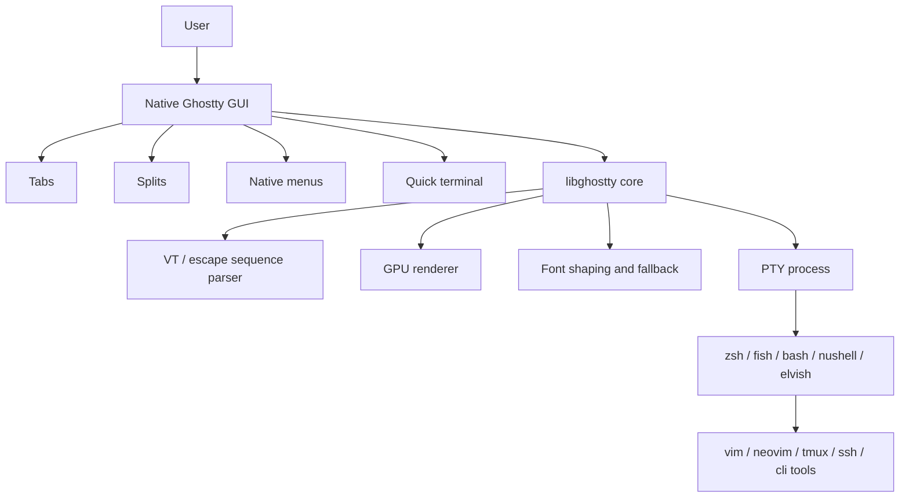

For iTerm2 users, this means Ghostty is not just “a faster settings panel.” It is a different product philosophy: smaller surface area, strong defaults, and a configuration file that you can version-control.

---

## The iTerm2-to-Ghostty mental model

### The big shift

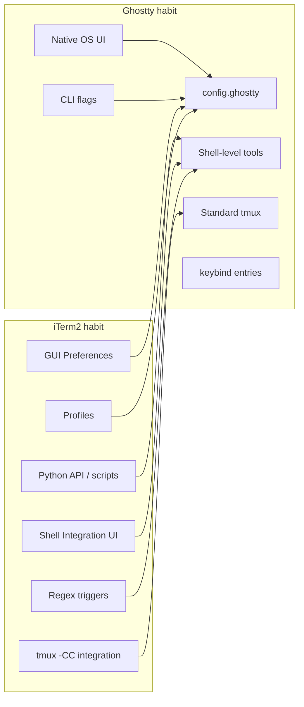

### The practical translation

| If you did this in iTerm2 | Think this way in Ghostty |
|---|---|
| Create profiles for different work contexts | Use separate config files, shell functions, CLI flags, or different launch commands |
| Use GUI settings for fonts, colors, padding, cursor | Edit `config.ghostty` |
| Use iTerm2 hotkey window | Use Ghostty quick terminal plus a global keybinding |
| Use iTerm2 triggers | Prefer shell hooks, prompt tools, aliases, `direnv`, `atuin`, `starship`, `zsh` widgets, or external automation |
| Use iTerm2 native `tmux -CC` integration | Use normal tmux inside Ghostty, or decide whether iTerm2 remains better for that workflow |
| Use shell integration for prompt marks and directory tracking | Let Ghostty auto-inject shell integration, or source it manually |
| Use profile-based SSH colors | Use shell prompt context, `ssh` aliases, separate launch configs, or prompt theming |

---

## Install and first launch

### macOS

Ghostty provides official macOS binaries. The normal install path is:

```bash
brew install --cask ghostty
```

Or install the `.dmg` manually and drag Ghostty into `/Applications`.

Ghostty’s macOS build is a universal binary for Apple Silicon and Intel Macs and requires macOS Ventura or newer.

### Linux

Linux availability depends on your distribution. Many distributions package Ghostty directly; otherwise you may need a community package or a source build.

Common examples:

```bash
# Arch Linux
sudo pacman -S ghostty

# Alpine testing repository
sudo apk add ghostty

# Snap
sudo snap install ghostty --classic

# NixOS / Nixpkgs on Linux
nix run nixpkgs#ghostty
```

### First launch advice

Do **not** immediately port your entire iTerm2 setup. Launch Ghostty with defaults first.

Ghostty’s defaults are intentionally usable: default font, default keybindings, shell integration detection, sensible native behavior, and a minimal configuration story.

---

## Configuration model

Ghostty is configured primarily with a text file.

### Main config locations

On all platforms, Ghostty checks XDG-style paths:

```text
$XDG_CONFIG_HOME/ghostty/config.ghostty
$XDG_CONFIG_HOME/ghostty/config
```

If `XDG_CONFIG_HOME` is unset, this usually means:

```text
~/.config/ghostty/config.ghostty
~/.config/ghostty/config
```

On macOS, Ghostty also supports:

```text
~/Library/Application Support/com.mitchellh.ghostty/config.ghostty
~/Library/Application Support/com.mitchellh.ghostty/config
```

A good recommendation for dotfile users is:

```text
~/.config/ghostty/config.ghostty
```

### Config load order

Later files can override earlier values when both exist.

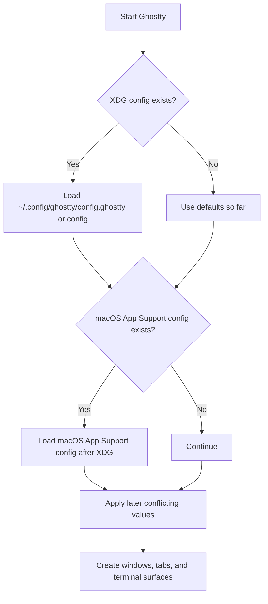

### Syntax

Ghostty config is simple `key = value` syntax:

```ini
# Comments must be on their own line
font-size = 14
theme = Catppuccin Mocha
window-padding-x = 6
window-padding-y = 4

# Repeated options are allowed where documented
keybind = cmd+d=new_split:right
keybind = cmd+shift+d=new_split:down
```

Important syntax facts:

- Keys are lowercase and case-sensitive.
- Values can often be quoted or unquoted.
- Many config keys can also be supplied as CLI flags.
- Some options can be reloaded at runtime; some affect only new windows, tabs, or terminal surfaces.
- On macOS, the default reload shortcut is `Cmd+Shift+,`.

### Split your config into multiple files

This is the closest equivalent to “profiles,” if you think in dotfile terms.

```ini
# ~/.config/ghostty/config.ghostty
config-file = appearance.ghostty
config-file = keybindings.ghostty
config-file = ?local.ghostty
```

Use `?` for optional machine-local files that should not break your config if they are absent.

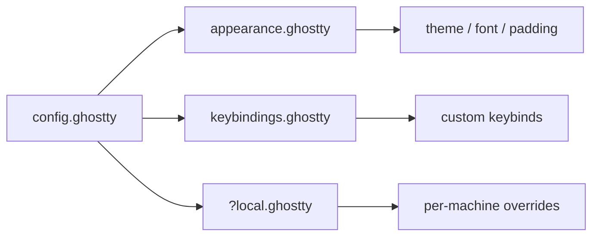

---

## Core terminology mapping

| iTerm2 term | Ghostty equivalent | Notes |
|---|---|---|
| Window | Window | Same broad concept. |
| Tab | Tab | Native tab support exists. |
| Pane | Split / terminal surface | Ghostty action names usually say `split` or `surface`. |
| Profile | Config file, CLI flags, launch wrapper | Ghostty does not center the UX around GUI profiles. |
| Hotkey window | Quick terminal | Requires binding `toggle_quick_terminal`. |
| Preferences | `config.ghostty` | Text-first configuration. |
| Marks | Prompt markers via shell integration | Ghostty supports prompt jumping when shell integration is active. |
| Triggers | No direct one-to-one replacement | Use shell hooks or external tools. |
| Smart Selection | Partial overlap through selection behavior | Not a direct clone of iTerm2 Smart Selection. |
| tmux Integration | Standard tmux usage | iTerm2’s `tmux -CC` native UI workflow is a distinct iTerm2 feature. |
| Python API | No direct equivalent | Use shell scripts, OS automation, or external launchers. |

---

## Feature migration matrix

### Day-one features most iTerm2 users care about

| Area | iTerm2 | Ghostty | Migration recommendation |
|---|---:|---:|---|
| Native macOS app feel | Strong | Strong | Ghostty feels especially native because it uses platform UI conventions. |
| Fast rendering | Good | Strong | Try Ghostty on large scrollback, TUIs, and editor workflows. |
| Tabs | Yes | Yes | Use normally. |
| Splits | Yes | Yes | Map iTerm2 split shortcuts if needed. |
| Config UI | Extensive | Minimal / text-first | Move config into dotfiles. |
| Profiles | Extensive | Indirect | Use config includes, CLI flags, wrapper scripts, or shell prompts. |
| Hotkey window | Yes | Yes, via quick terminal | Bind `toggle_quick_terminal`. |
| Shell integration | Deep | Present and useful | Ghostty supports auto-injection for common shells. |
| Prompt navigation | Yes | Yes, with shell integration | Bind `jump_to_prompt`. |
| Remote file upload/download UI | Yes | Not equivalent | Keep iTerm2 or use `scp`, `rsync`, `trzsz`, `rclone`, or editor integration. |
| Triggers | Yes | No direct equivalent | Replace with shell hooks or external automation. |
| Coprocesses | Yes | No direct equivalent | Replace with scripts, aliases, or tmux panes. |
| Native tmux control mode | Yes | Not the same workflow | Use normal tmux, or keep iTerm2 for `tmux -CC`. |
| Advanced scripting | Python API, AppleScript | AppleScript support exists on macOS, but not equivalent to iTerm2 Python API | Port simple launch/open workflows; keep complex ones in iTerm2 if needed. |
| Built-in AI chat | iTerm2 has AI Chat docs | Not a Ghostty focus | Use external tools or editor/CLI AI tools. |

### Ghostty strengths for iTerm2 users

- Minimal config to get started.
- Modern terminal protocol support.
- Simple key-value config file.
- Native UI rather than a custom cross-platform widget system.
- Built-in themes sourced from the iTerm2 color-schemes ecosystem.
- Strong shell integration story for common shells.
- Quick terminal support with global keybindings on macOS.

### Ghostty tradeoffs for iTerm2 users

- Fewer GUI knobs.
- No iTerm2-style profile management UI.
- No direct replacement for several iTerm2 automation features.
- Less “terminal as a programmable macOS workstation” and more “terminal as a fast, native, correct terminal emulator.”

---

## Starter config for former iTerm2 users

Create:

```bash
mkdir -p ~/.config/ghostty
$EDITOR ~/.config/ghostty/config.ghostty
```

Start with this conservative macOS-friendly config:

```ini
# ~/.config/ghostty/config.ghostty
# Ghostty starter config for former iTerm2 users.

# ----- Font -----
# Ghostty already ships with a usable default, so only set this if you care.
# Use `ghostty +list-fonts` to see valid installed font names.
font-size = 14
# font-family = JetBrainsMono Nerd Font

# ----- Theme -----
# Use `ghostty +list-themes` to list built-in themes.
theme = dark:Catppuccin Mocha,light:Catppuccin Latte
window-theme = system

# ----- Window feel -----
window-padding-x = 6
window-padding-y = 4
window-save-state = always
window-new-tab-position = end

# ----- macOS keyboard behavior -----
# Helpful if you used Option as Alt in iTerm2 or terminal programs.
# Use `true`, `false`, `left`, or `right` depending on your Unicode input habits.
macos-option-as-alt = left

# ----- Shell integration -----
# Default is detect, but keeping this explicit makes the intent obvious.
shell-integration = detect

# Useful for remote hosts. Read the SSH section before enabling on a large fleet.
# shell-integration-features = ssh-env,ssh-terminfo

# ----- Clipboard and paste safety -----
clipboard-paste-protection = true
clipboard-trim-trailing-spaces = true
copy-on-select = clipboard

# ----- Quick terminal, similar to an iTerm2 hotkey window -----
quick-terminal-position = top
quick-terminal-size = 35%
quick-terminal-screen = main
quick-terminal-autohide = true
keybind = global:cmd+backquote=toggle_quick_terminal

# ----- iTerm2-ish split muscle memory -----
keybind = cmd+d=new_split:right
keybind = cmd+shift+d=new_split:down
keybind = cmd+shift+enter=toggle_split_zoom

# ----- Split navigation examples -----
# Adjust these if they conflict with your editor, tmux, or OS shortcuts.
keybind = cmd+alt+left=goto_split:left
keybind = cmd+alt+right=goto_split:right
keybind = cmd+alt+up=goto_split:up
keybind = cmd+alt+down=goto_split:down

# ----- Prompt navigation, requires shell integration -----
keybind = cmd+shift+up=jump_to_prompt:-1
keybind = cmd+shift+down=jump_to_prompt:1
```

Then reload with:

```text
Cmd+Shift+,
```

And verify keybindings with:

```bash
ghostty +list-keybinds --default
```

---

## Tabs, splits, windows, and layout habits

Ghostty supports the same basic workspace primitives that iTerm2 users expect: windows, tabs, and splits.

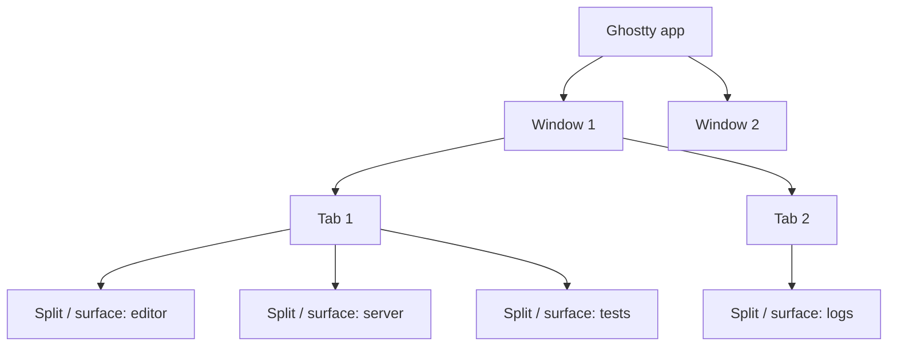

### Former iTerm2 habit: `Cmd+D` and `Cmd+Shift+D`

In iTerm2:

- `Cmd+D` usually splits vertically.
- `Cmd+Shift+D` usually splits horizontally.

In Ghostty, bind the exact behavior you want:

```ini
keybind = cmd+d=new_split:right
keybind = cmd+shift+d=new_split:down
```

Ghostty’s `new_split` action supports directions such as `right`, `down`, `left`, `up`, and `auto`.

### Former iTerm2 habit: maximize pane

```ini
keybind = cmd+shift+enter=toggle_split_zoom
```

### Former iTerm2 habit: navigate panes by direction

```ini
keybind = cmd+alt+left=goto_split:left
keybind = cmd+alt+right=goto_split:right
keybind = cmd+alt+up=goto_split:up
keybind = cmd+alt+down=goto_split:down
```

### Former iTerm2 habit: equalize panes

Ghostty has an `equalize_splits` action:

```ini
keybind = cmd+alt+0=equalize_splits
```

### Working directory inheritance

Shell integration allows new tabs and splits to inherit the working directory of the previously focused terminal. This is one of the most important “it just feels right” features to verify after migration.

---

## Keybindings and muscle-memory migration

### How Ghostty keybindings work

The basic format is:

```ini
keybind = trigger=action
```

Examples:

```ini
keybind = cmd+d=new_split:right
keybind = cmd+shift+d=new_split:down
keybind = cmd+shift+enter=toggle_split_zoom
```

A trigger can include modifiers:

```text
shift
ctrl / control
alt / opt / option
super / cmd / command
```

### Keybinding routing model

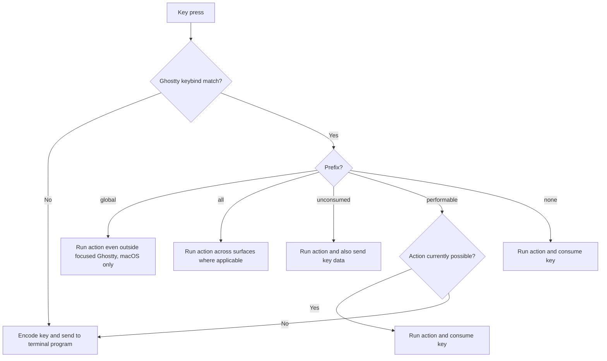

### Useful commands while migrating

```bash
# See default keybindings
ghostty +list-keybinds --default

# See fonts Ghostty can use
ghostty +list-fonts

# See built-in themes
ghostty +list-themes

# Show default config reference locally
ghostty +show-config --default --docs
```

### Recommended keybinding migration method

1. Export or screenshot only the iTerm2 shortcuts you actually use.
2. Group them into categories: windows/tabs, splits, navigation, search, copy/paste, prompt navigation.
3. Recreate only the top 10 first.
4. Run `ghostty +list-keybinds --default` before overriding defaults.
5. Avoid stealing shortcuts from Neovim, tmux, shell widgets, or macOS unless you really want Ghostty to win.

---

## Themes, fonts, transparency, and appearance

### Themes

Ghostty ships with many built-in themes, including themes sourced from the iTerm2 color-schemes ecosystem.

List themes:

```bash
ghostty +list-themes
```

Set a theme:

```ini
theme = Catppuccin Mocha
```

Set separate dark and light themes:

```ini
theme = dark:Catppuccin Mocha,light:Catppuccin Latte
```

### Custom theme files

A theme file is just another Ghostty configuration file that usually sets colors:

```ini
# ~/.config/ghostty/themes/my-theme
background = #1e1e2e
foreground = #cdd6f4
cursor-color = #f5e0dc
selection-background = #45475a
selection-foreground = #cdd6f4
palette = 0=#45475a
palette = 1=#f38ba8
palette = 2=#a6e3a1
palette = 3=#f9e2af
palette = 4=#89b4fa
palette = 5=#f5c2e7
palette = 6=#94e2d5
palette = 7=#bac2de
palette = 8=#585b70
palette = 9=#f38ba8
palette = 10=#a6e3a1
palette = 11=#f9e2af
palette = 12=#89b4fa
palette = 13=#f5c2e7
palette = 14=#94e2d5
palette = 15=#a6adc8
```

Then:

```ini
theme = my-theme
```

### Fonts

If you used a Nerd Font in iTerm2, you can use the same font in Ghostty if it is installed:

```ini
font-family = JetBrainsMono Nerd Font
font-size = 14
```

List installed fonts as Ghostty sees them:

```bash
ghostty +list-fonts
```

### Cursor

```ini
cursor-style = block
cursor-style-blink = false
```

Note: shell integration can change the prompt cursor to a bar. Disable that behavior if you want a fixed cursor style:

```ini
shell-integration-features = no-cursor
```

### Transparency and blur

```ini
background-opacity = 0.92
background-blur = true
```

On macOS, native fullscreen can affect background opacity behavior. If transparency is essential to your setup, test it in normal windows and fullscreen separately.

---

## Shell integration

Shell integration is one of the main features you should verify early, because it unlocks several “iTerm2-like” conveniences.

### What it enables in Ghostty

- New tabs and splits can start in the previous terminal’s working directory.
- Prompt marking enables prompt navigation with `jump_to_prompt`.
- Closing a terminal at a clean prompt can avoid unnecessary confirmation.
- Complex prompts can repaint better on resize.
- Prompt-aware selection and click-to-move features become possible.
- SSH and sudo terminfo compatibility can be improved with optional features.

### Shell integration sequence

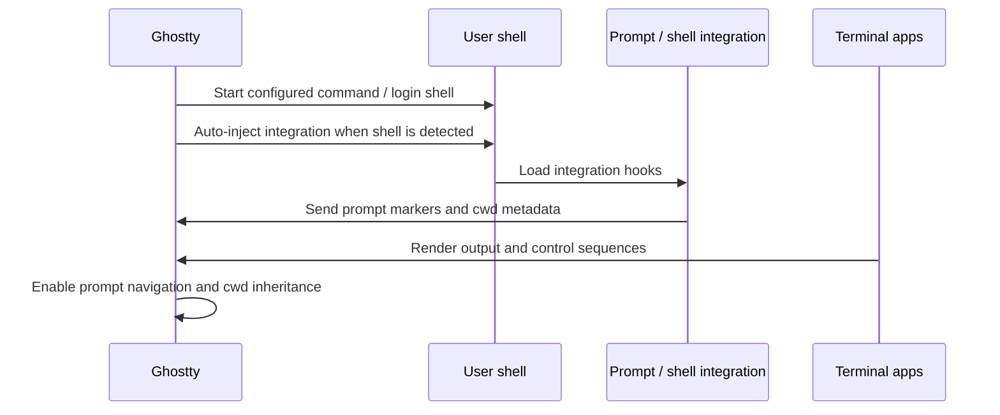

### Supported shells for auto-injection

Ghostty can automatically inject shell integration for:

- `bash`
- `elvish`
- `fish`
- `nushell`
- `zsh`

Default behavior:

```ini
shell-integration = detect
```

Force a specific shell integration:

```ini
shell-integration = zsh
```

Disable automatic injection:

```ini
shell-integration = none
```

### Manual shell integration

Manual sourcing is useful if:

- you switch shells inside Ghostty,
- you use `nix-shell`, `direnv`, or subshell-heavy workflows,
- auto-detection fails,
- you use macOS’s older system Bash.

For zsh, add near the top of `~/.zshrc`:

```zsh
if [[ -n "$GHOSTTY_RESOURCES_DIR" ]]; then
  source "$GHOSTTY_RESOURCES_DIR/shell-integration/zsh/ghostty-integration"
fi
```

For bash, add near the top of `~/.bashrc`:

```bash
if [ -n "${GHOSTTY_RESOURCES_DIR}" ]; then
  builtin source "${GHOSTTY_RESOURCES_DIR}/shell-integration/bash/ghostty.bash"
fi
```

### Prompt navigation bindings

```ini
keybind = cmd+shift+up=jump_to_prompt:-1
keybind = cmd+shift+down=jump_to_prompt:1
```

---

## SSH, `TERM`, terminfo, and remote hosts

Ghostty uses `xterm-ghostty` as its `TERM` value. That is good for correctness when the remote host knows about Ghostty, but some remote hosts may not yet have the Ghostty terminfo entry installed.

### The problem

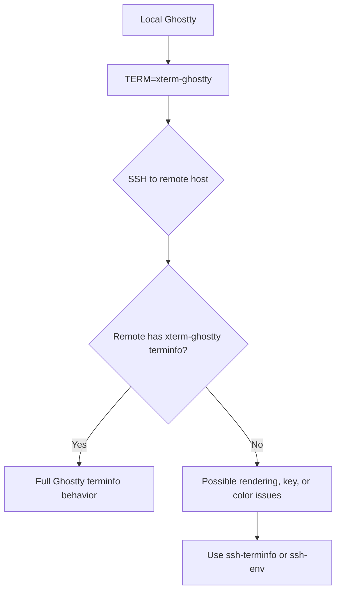

### Ghostty shell integration features for SSH

Enable both for a practical default:

```ini
shell-integration-features = ssh-env,ssh-terminfo
```

Conceptually:

- `ssh-terminfo` tries to install Ghostty’s terminfo entry on the remote host using local `infocmp` and remote `tic`.
- `ssh-env` can fall back to `TERM=xterm-256color` and forward variables such as `COLORTERM`, `TERM_PROGRAM`, and `TERM_PROGRAM_VERSION`.

### SSH decision tree

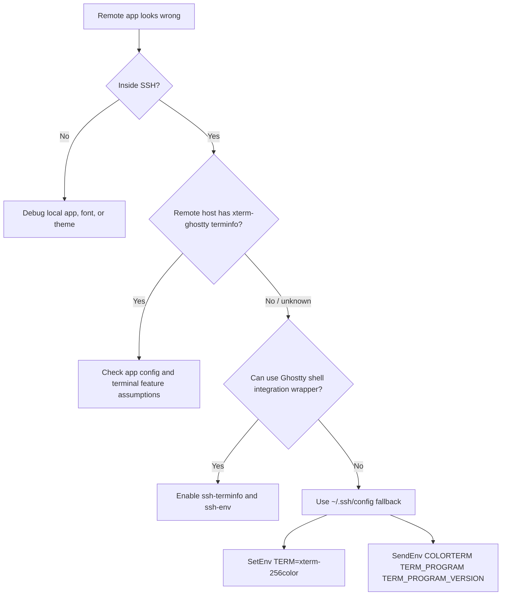

### Manual SSH fallback

For hosts that do not support Ghostty terminfo and cannot use the shell wrapper:

```sshconfig
Host legacy-box
  SetEnv TERM=xterm-256color
  SendEnv COLORTERM TERM_PROGRAM TERM_PROGRAM_VERSION
```

Use this only where needed. If a remote host already has `xterm-ghostty`, downgrading to `xterm-256color` may hide capabilities.

---

## tmux and session persistence

This is one of the most important differences for serious iTerm2 users.

### iTerm2 way

iTerm2 has special tmux control-mode integration. When you run:

```bash
tmux -CC
```

iTerm2 can represent tmux windows and panes as native iTerm2 windows, tabs, and split panes.

### Ghostty way

In Ghostty, use tmux as a normal terminal application:

```bash
tmux new -A -s work
```

or:

```bash
tmux attach -t work
```

### Recommended tmux strategy in Ghostty

Use tmux for persistence, and use Ghostty for rendering, fonts, tabs, splits, and native app behavior.

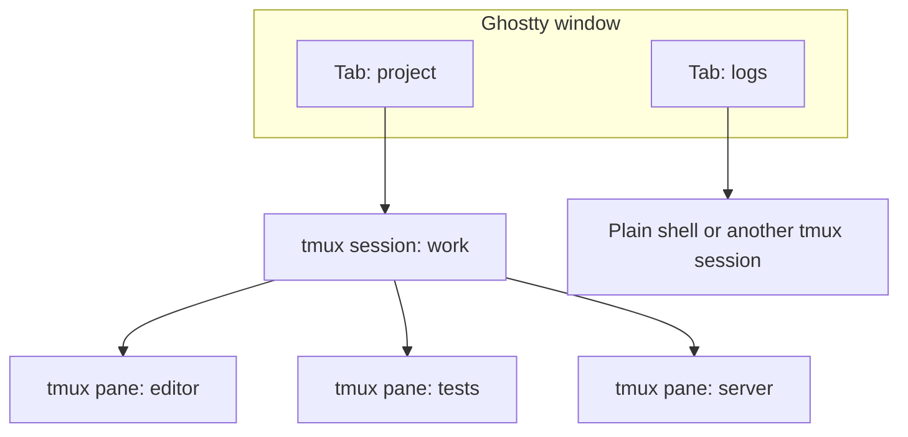

### Should you use Ghostty splits or tmux panes?

| Use Ghostty splits when... | Use tmux panes when... |
|---|---|
| You want native GUI split resizing | You need persistence across SSH drops |
| You work mostly locally | You work on remote machines |
| You want separate shell processes without tmux keymaps | You want repeatable project sessions |
| You rarely detach and reattach | You frequently detach, attach, and restore |

### Simple rule

- Local development workstation layout: **Ghostty tabs/splits are pleasant.**
- Remote or long-lived project workspace: **tmux remains essential.**
- Heavy `tmux -CC` user: **test before fully migrating; iTerm2 may remain the best tool for that specific workflow.**

---

## What to do about iTerm2-only workflows

Some iTerm2 features do not have a one-command Ghostty equivalent. The best migration is not always to recreate the same thing inside Ghostty.

### Triggers

Common iTerm2 trigger use cases and replacements:

| iTerm2 trigger use | Ghostty-era replacement |
|---|---|
| Highlight errors | Use shell prompt status, compiler colors, `grep --color`, `delta`, `bat`, `rich`, or editor diagnostics |
| Run command when text appears | Use shell scripts, `watchexec`, `entr`, process supervisors, or CI tooling |
| Detect host and change profile | Use prompt theming, `ssh` wrapper functions, or terminal title escape sequences |
| Notify on output | Use shell-level notification wrappers or app-specific hooks |
| Capture regex output | Use shell pipelines, `tee`, logs, `ripgrep`, or structured logging |

### Automatic profile switching

Instead of switching terminal profiles by host/user/path, consider:

- prompt segments that show host/user/kubernetes context,
- different shell themes for production hosts,
- `direnv` to load project context,
- `starship` or `powerlevel10k` context modules,
- SSH wrapper aliases that set titles or environment variables.

Example:

```zsh
prod() {
  print -Pn "\e]0;PROD: $1\a"
  ssh "$1"
}
```

### Coprocesses

Replace iTerm2 coprocesses with one of:

- tmux panes,
- `make` tasks,
- `just` recipes,
- `watchexec`,
- shell aliases/functions,
- background jobs with notifications.

### Smart selection

Ghostty has configurable selection behavior, but iTerm2 Smart Selection is more specialized. For URL/file-path workflows, try:

- terminal hyperlinks from tools that support OSC 8,
- editor integrations,
- shell aliases that emit clickable paths,
- `fzf`-based pickers.

### Remote upload/download UI

iTerm2’s shell integration includes UI affordances for remote file transfer. In Ghostty, prefer explicit tools:

```bash
scp host:/path/file .
rsync -av host:/path/ ./local-path/
```

Or use higher-level tools such as `trzsz`, `rclone`, VS Code Remote, SSHFS, or your editor’s remote features.

---

## Recommended migration plan

### Phase 1: one clean week

Use Ghostty with almost no config for several days.

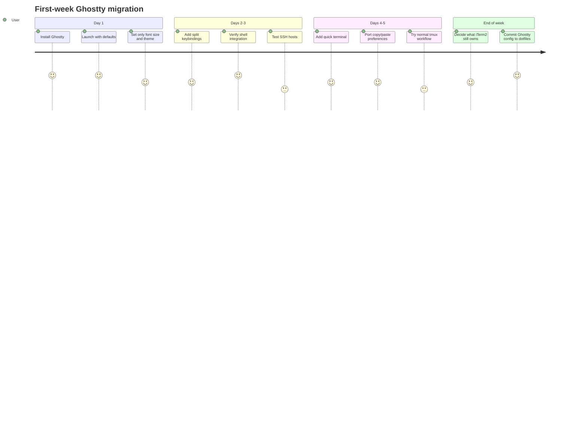

### Phase 2: port only high-frequency habits

Port these first:

1. Font size and theme.
2. Option-as-Alt behavior.
3. Split creation and navigation.
4. Prompt navigation.
5. Quick terminal.
6. SSH compatibility.
7. Window state behavior.

### Phase 3: classify the remaining iTerm2 features

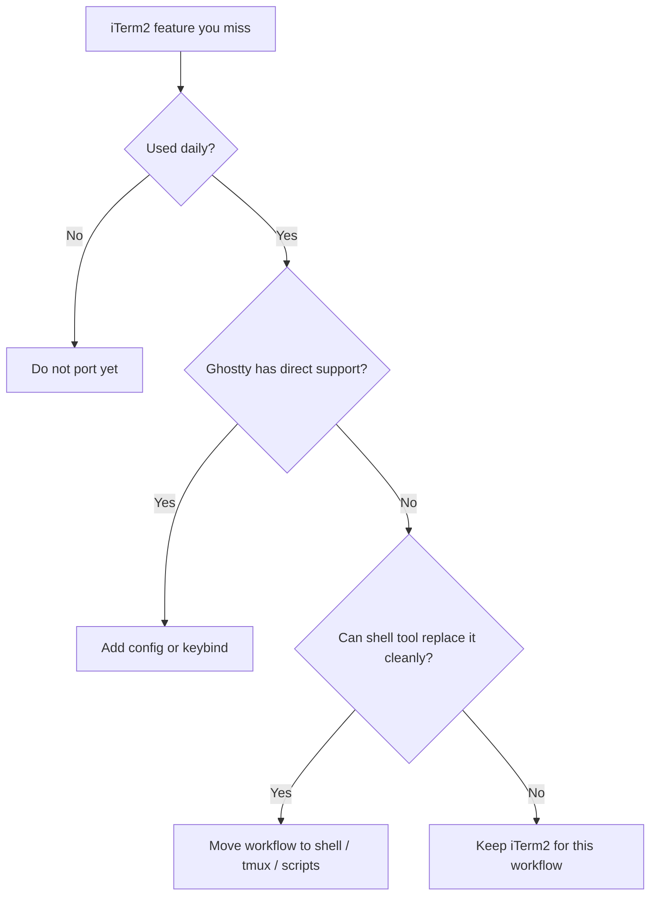

---

## Troubleshooting

### Config changes do not apply

Checklist:

1. Confirm file name: prefer `config.ghostty`, not only `config`, on modern Ghostty.
2. Confirm path: `~/.config/ghostty/config.ghostty` is the easiest dotfile path.
3. Reload with `Cmd+Shift+,` on macOS.
4. Remember that some options only affect new windows, tabs, or surfaces.
5. Fully restart Ghostty for macOS quick-terminal position changes and other non-runtime settings.

### Option key sends weird characters

If `Option+B` sends `∫` but you expected Alt behavior, set:

```ini
macos-option-as-alt = true
```

If you still want one Option key for macOS Unicode input:

```ini
macos-option-as-alt = left
```

or:

```ini
macos-option-as-alt = right
```

### Remote apps render incorrectly over SSH

Try:

```ini
shell-integration-features = ssh-env,ssh-terminfo
```

Then start a fresh shell and reconnect.

If the wrapper cannot apply, use a per-host SSH fallback:

```sshconfig
Host old-server
  SetEnv TERM=xterm-256color
```

### Prompt navigation does nothing

`jump_to_prompt` requires shell integration or prompt markers.

Check:

```ini
shell-integration = detect
```

If you switch shells inside Ghostty, manually source the shell integration in that shell’s startup file.

### Quick terminal does nothing

You must bind it yourself:

```ini
keybind = global:cmd+backquote=toggle_quick_terminal
```

On macOS, global keybindings require Accessibility permission. Grant it in System Settings if prompted.

### Transparency disappears in fullscreen

Test normal window mode. On macOS, native fullscreen has limitations around background opacity behavior.

### iTerm2-style automation is missing

Do not fight Ghostty. Move the automation to:

- shell scripts,
- tmux,
- `just` or `make`,
- file watchers,
- Raycast/Shortcuts/Keyboard Maestro,
- editor tasks,
- CI/dev-server tooling.

Keep iTerm2 around for workflows that are truly iTerm2-native.

---

## Appendix: config snippets

### Minimal config

```ini
font-size = 14
theme = Catppuccin Mocha
macos-option-as-alt = left
window-save-state = always
```

### iTerm2-like split bindings

```ini
keybind = cmd+d=new_split:right
keybind = cmd+shift+d=new_split:down
keybind = cmd+shift+enter=toggle_split_zoom
keybind = cmd+alt+left=goto_split:left
keybind = cmd+alt+right=goto_split:right
keybind = cmd+alt+up=goto_split:up
keybind = cmd+alt+down=goto_split:down
keybind = cmd+alt+0=equalize_splits
```

### Quick terminal

```ini
quick-terminal-position = top
quick-terminal-size = 35%
quick-terminal-screen = main
quick-terminal-autohide = true
keybind = global:cmd+backquote=toggle_quick_terminal
```

### Light/dark theme switching

```ini
theme = dark:TokyoNight Night,light:GitHub Light
window-theme = system
```

### SSH compatibility

```ini
shell-integration-features = ssh-env,ssh-terminfo
```

### Prompt navigation

```ini
keybind = cmd+shift+up=jump_to_prompt:-1
keybind = cmd+shift+down=jump_to_prompt:1
```

### Safer clipboard behavior

```ini
clipboard-paste-protection = true
clipboard-trim-trailing-spaces = true
copy-on-select = clipboard
right-click-action = context-menu
```

### Separate files

```ini
# ~/.config/ghostty/config.ghostty
config-file = appearance.ghostty
config-file = keybindings.ghostty
config-file = ssh.ghostty
config-file = ?local.ghostty
```

### Launch wrapper for a project

```bash
#!/usr/bin/env bash
cd ~/src/my-project || exit 1
ghostty --working-directory="$PWD" --title="my-project"
```

### tmux project launcher

```bash
#!/usr/bin/env bash
session="work"

tmux has-session -t "$session" 2>/dev/null || \
  tmux new-session -d -s "$session" -c "$HOME/src/work"

ghostty -e tmux attach -t "$session"
```

---

## Closing recommendation

For most iTerm2 users, Ghostty is worth trying if you want a terminal that feels modern, native, fast, and simple to configure.

But the best migration is selective, not ideological:

- Use Ghostty as your daily terminal if your workflow is mostly shell, editor, local dev, standard tmux, and SSH.
- Keep iTerm2 available if your workflow depends on triggers, native tmux control-mode integration, advanced profile automation, or iTerm2’s scripting ecosystem.
- Put Ghostty config in dotfiles and let the rest of your workflow live in shell tools where it is portable.

