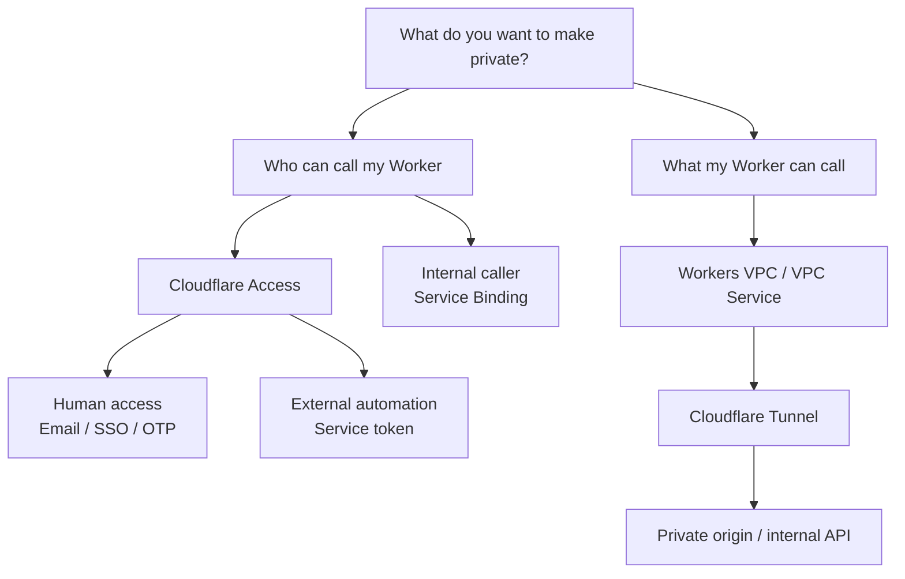
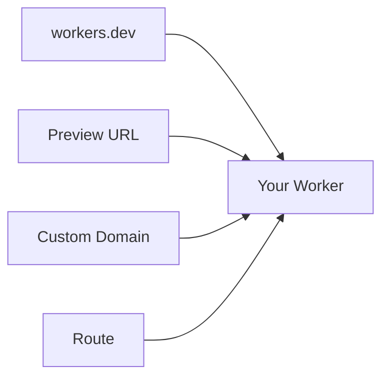
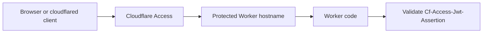
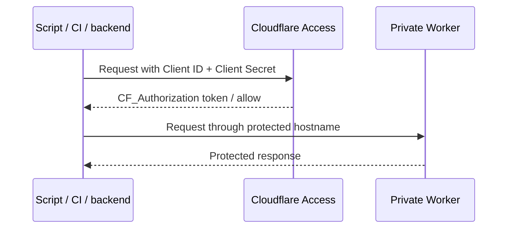
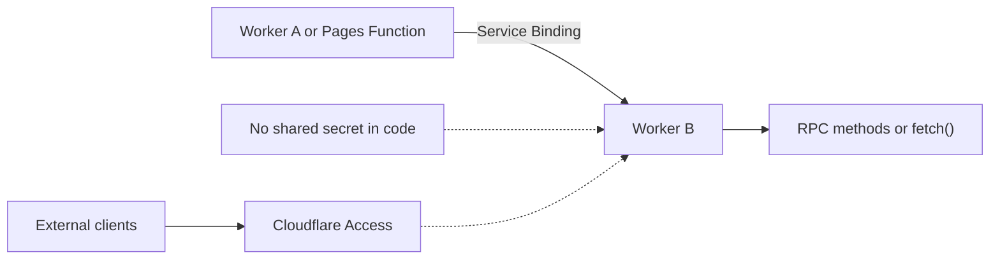
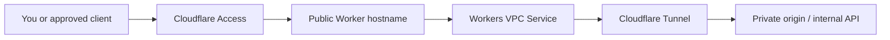
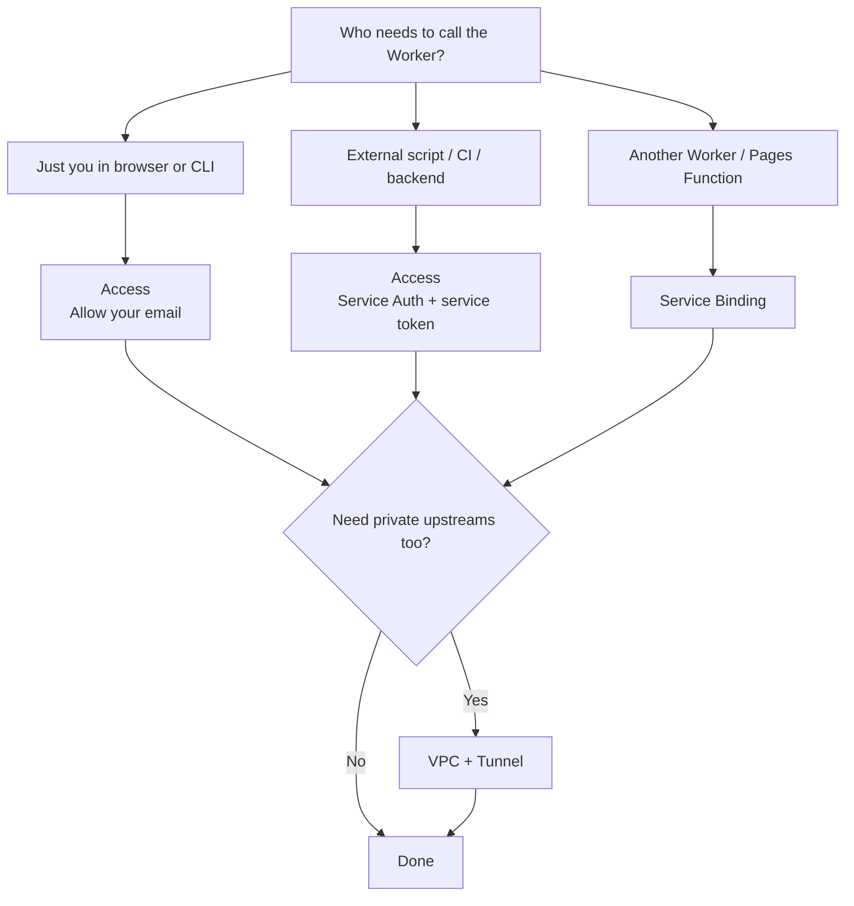

# Cloudflare Workers + Access: make your API "private" to only you

A practical guide for Cloudflare **Workers** created with **C3 (`create-cloudflare`)**.

## TL;DR

- **C3 does not make a Worker private.** It only scaffolds the project.
- A deployed Worker becomes reachable through a **`workers.dev` URL**, **Preview URL** (a per-version `workers.dev` test URL), **Route**, or **Custom Domain**.
- To make it "private", put **Cloudflare Access** in front of the Worker and only allow **your email**.
- For scripts, CI, cron jobs, or Postman-like automation, use **Cloudflare Access service tokens**.
- If the caller is another **Cloudflare Worker** or **Pages Function** on your account, use **Service Bindings** instead of passing API keys or tokens in code.
- **`cloudflared` Tunnel does _not_ make a Worker private by itself.** Tunnel is mainly for:
  1. letting **clients** authenticate to an Access-protected app from a CLI, or
  2. letting a **Worker reach your private origin/network** through **Workers VPC + Tunnel**.

---

## 1) What "private" means for Workers

Workers run on Cloudflare's edge. They are not like a private VM inside your VPC.

So there are two different security goals:

### A. "Only I can call my Worker API"
Use:
- **Cloudflare Access** in front of the Worker URL
- an **Allow** policy for **your email**
- optionally **service tokens** for machine-to-machine access from callers outside Cloudflare
- **Service Bindings** if the caller is another Worker or Pages Function on your Cloudflare account

### B. "My Worker should be able to call my private backend"
Use:
- **Cloudflare Tunnel**
- **Workers VPC / VPC Service**
- a Worker binding that calls your internal API/database/app through the tunnel

These are separate problems. Most people asking to make a Worker private mean **A**.
Service Bindings are a special case of **A** for Cloudflare-to-Cloudflare calls.

A quick visual summary:



---

## 2) Pick your deployment shape first

You normally expose a Worker through one or more of these:

- **`workers.dev`** — easiest, fast for testing
- **Preview URLs** — extra `workers.dev` URLs for specific versions, useful for testing and easy to forget about
- **Custom Domain** — best production-style URL
- **Route** — attach Worker to an existing zone/path

These are separate entrypoints to the same deployed Worker:



### What a Preview URL actually is

A **Preview URL** is an extra `workers.dev` hostname that points to a specific version of your Worker so you can test or review that version directly.

Cloudflare currently documents two types:

- **Versioned Preview URL** — generated automatically for each new Worker version
- **Aliased Preview URL** — a readable alias you assign manually, such as `staging-my-api.<subdomain>.workers.dev`

Typical shapes look like:

```text
https://<version-prefix>-my-api.<subdomain>.workers.dev
https://staging-my-api.<subdomain>.workers.dev
```

Why this matters:

- Preview URLs are a **separate entrypoint** from your main `workers.dev` URL, route, or custom domain
- if Preview URLs are enabled, they are **public immediately** unless you protect them with **Cloudflare Access**
- they are useful for PR review, QA, and testing a version before promoting it broadly
- they are also easy to miss, which is why they are a common accidental exposure path for "private" Workers

Current Cloudflare behavior:

- `preview_urls = workers_dev` is the default if you do not set it explicitly
- Preview URLs are enabled by default when `workers_dev` is enabled
- older Wrangler versions may still behave differently, so for a private API you should set `preview_urls = false` explicitly

For a personal API, the safest default is: **do not leave Preview URLs enabled unless you actively use them**.

### Recommended choices

#### Small personal API
- keep **`workers.dev`** enabled
- enable **Cloudflare Access** on it
- disable **Preview URLs** unless you truly need them

#### Production or serious internal API
- attach a **Custom Domain**
- protect the custom domain with **Cloudflare Access**
- set `workers_dev = false`
- set `preview_urls = false`

---

## 3) Option 1 — Workers + Access (email-only)

This is the simplest way to make your API accessible only to you.

## 3.1 Deploy your Worker

If you already created the project with C3, deploy normally.

```bash
npm run deploy
```

Or with Wrangler:

```bash
npx wrangler deploy
```

After deploy, note your Worker URL, for example:

```text
https://my-api.<your-subdomain>.workers.dev
```

---

## 3.2 Enable Cloudflare Access on `workers.dev`

In the Cloudflare dashboard:

1. Go to **Workers & Pages**
2. Open your Worker
3. Go to **Settings → Domains & Routes**
4. For **`workers.dev`**, click **Enable Cloudflare Access**
5. Click **Manage Cloudflare Access**

That creates or opens the Access application protecting that Worker URL.

### If you have no identity provider
Cloudflare Access can use **one-time PIN (OTP) by email**. For a single-user setup, this is usually enough.

That means you can log in with your email and receive a code in your inbox.

---

## 3.3 Restrict access to only your email

Inside **Cloudflare Access**:

1. Open the application for your Worker
2. Add or edit a policy
3. Set:
   - **Action:** `Allow`
   - **Rule / Selector:** `Emails`
   - **Value:** `your-email@example.com`
4. Save the policy

Now the Worker is behind Access and only your email address can authenticate.

### Recommended session settings

For a very locked-down personal API:
- use a short **session duration**
- do **not** add broad rules like `Everyone`, `Emails ending in`, or `Any valid service token` unless intended

---

## 3.4 Strongly recommended: validate the Access JWT inside the Worker

Cloudflare explicitly recommends validating the JWT that Access injects into the request.

The incoming request will contain:

- `Cf-Access-Jwt-Assertion`

You should verify:
- the **issuer** = your Access team domain
- the **audience** = your application AUD tag
- the signature against Cloudflare Access certs

### Install `jose`

```bash
npm install jose
```

### Worker example (`src/index.ts`)

```ts
import { createRemoteJWKSet, jwtVerify } from "jose";

export interface Env {
  TEAM_DOMAIN: string; // e.g. https://your-team.cloudflareaccess.com
  POLICY_AUD: string;  // your Access app AUD tag
}

export default {
  async fetch(request: Request, env: Env): Promise<Response> {
    const token = request.headers.get("cf-access-jwt-assertion");

    if (!env.TEAM_DOMAIN || !env.POLICY_AUD) {
      return new Response("Missing Access configuration", { status: 500 });
    }

    if (!token) {
      return new Response("Missing CF Access JWT", { status: 403 });
    }

    try {
      const JWKS = createRemoteJWKSet(
        new URL(`${env.TEAM_DOMAIN}/cdn-cgi/access/certs`)
      );

      const { payload } = await jwtVerify(token, JWKS, {
        issuer: env.TEAM_DOMAIN,
        audience: env.POLICY_AUD,
      });

      // Optional: ensure the authenticated email matches exactly who you expect.
      const email = payload.email;
      if (email !== "your-email@example.com") {
        return new Response("Forbidden", { status: 403 });
      }

      return Response.json({
        ok: true,
        message: "Authenticated",
        email,
      });
    } catch (err) {
      return new Response(`Invalid Access token: ${String(err)}`, {
        status: 403,
      });
    }
  },
};
```

### Add the Access values to your Worker

After you enable Access, get these values from the Access app:

- **Team domain**: `https://<team-name>.cloudflareaccess.com`
- **Application Audience (AUD) Tag**

Put them in your Worker config.

Example `wrangler.jsonc`:

```jsonc
{
  "$schema": "node_modules/wrangler/config-schema.json",
  "name": "my-private-api",
  "main": "src/index.ts",
  "compatibility_date": "2026-03-22",
  "workers_dev": true,
  "preview_urls": false,
  "vars": {
    "TEAM_DOMAIN": "https://your-team.cloudflareaccess.com",
    "POLICY_AUD": "paste-your-aud-tag-here"
  }
}
```

Then redeploy:

```bash
npx wrangler deploy
```

---

## 3.5 Test it

### Browser test
Open the Worker URL. You should be redirected to Cloudflare Access and asked to authenticate. After successful login, the request reaches the Worker.

### CLI test with `cloudflared`
This is useful when **you** want to call your own protected API from a terminal.

```bash
cloudflared access login https://my-api.<subdomain>.workers.dev
cloudflared access curl https://my-api.<subdomain>.workers.dev
```

Or get a token and use it with `curl`:

```bash
export TOKEN=$(cloudflared access token -app=https://my-api.<subdomain>.workers.dev)
curl -H "cf-access-token: $TOKEN" https://my-api.<subdomain>.workers.dev
```

This works because `cloudflared` is acting as a **client for Access**, not because the Worker is behind a tunnel.

The request path looks like this:



---

## 4) Option 2 — Workers + Access service token

Use this when the caller is not a human browser session, for example:

- CI/CD
- GitHub Actions
- a cron job
- another backend service
- a script running on your laptop/server
- Postman collections or API testing pipelines

## 4.1 Create the service token

In Cloudflare Zero Trust:

1. Go to **Access controls → Service credentials → Service Tokens**
2. Click **Create Service Token**
3. Give it a name, for example `my-private-worker-client`
4. Choose a duration / expiration
5. Copy:
   - **Client ID**
   - **Client Secret**

> Save the secret immediately. Cloudflare only shows it once.

---

## 4.2 Add a Service Auth policy to the Worker's Access app

Open the Access application protecting your Worker and add a second policy:

- **Action:** `Service Auth`
- **Selector / rule:** your service token

### Typical policy layout

If you want **both** human and machine access, use two policies:

1. **Allow** → your personal email
2. **Service Auth** → your service token

This gives you:
- browser access as yourself
- script/CI access using the service token

If you want **machine-only** access, remove the human Allow policy.

---

## 4.3 Call the Worker with the service token

### Initial request

```bash
curl \
  -H "CF-Access-Client-Id: <CLIENT_ID>" \
  -H "CF-Access-Client-Secret: <CLIENT_SECRET>" \
  https://my-api.example.com
```

If valid, Access will issue a `CF_Authorization` token scoped to that application.

### Subsequent request using the Access token

```bash
curl \
  -H "cf-access-token: <CF_AUTHORIZATION_COOKIE_VALUE>" \
  https://my-api.example.com
```

### Optional: single-header mode

For applications that can only send one custom header, Access can also accept a single header instead of the `CF-Access-Client-Id` + `CF-Access-Client-Secret` pair.

---

## 4.4 Best practice for scripts

Do **not** hard-code the service token in source code.

Use:
- CI secrets
- environment variables
- a secrets manager (Vault, 1Password, Doppler, AWS Secrets Manager, etc.)

Example:

```bash
export CF_ACCESS_CLIENT_ID="..."
export CF_ACCESS_CLIENT_SECRET="..."

curl \
  -H "CF-Access-Client-Id: $CF_ACCESS_CLIENT_ID" \
  -H "CF-Access-Client-Secret: $CF_ACCESS_CLIENT_SECRET" \
  https://my-api.example.com/private
```

The machine-to-machine flow looks like this:



---

## 4.5 Alternative for Worker-to-Worker calls: Service Bindings

Use **Service Bindings** when:

- the caller is another **Worker** or **Pages Function**
- both sides are on **your Cloudflare account**
- you want to avoid managing API keys or tokens in application code
- you may want the target Worker to be reachable **only** through an internal binding

Do **not** use Service Bindings when the caller is:

- `curl` on your laptop
- GitHub Actions
- Postman
- a VM/container/backend outside Cloudflare

For those callers, keep using **Cloudflare Access service tokens**.

### Why Service Bindings are different

Cloudflare documents Service Bindings as an internal Worker-to-Worker communication mechanism.
The caller declares a binding in `wrangler`, and that binding gives it permission to call the target Worker.

This means:

- no `CF-Access-Client-Id` / `CF-Access-Client-Secret` in your Worker code
- no custom API key exchange between the two Workers
- the target Worker can be isolated from the public internet and only reached through the binding

Cloudflare currently supports two call styles:

- **RPC** — call methods exposed by the target Worker
- **HTTP** — call the target Worker's `fetch()` handler via `env.MY_SERVICE.fetch(...)`

For most new designs, Cloudflare recommends **RPC**.
If your target Worker already has a normal HTTP `fetch()` handler, HTTP-style Service Bindings are often the easiest migration path.

Visually:



### Example: bind Worker A to Worker B

Caller Worker (`worker-a`) `wrangler.jsonc`:

```jsonc
{
  "$schema": "node_modules/wrangler/config-schema.json",
  "name": "worker-a",
  "main": "src/index.ts",
  "services": [
    {
      "binding": "AUTH_SERVICE",
      "service": "worker-b"
    }
  ]
}
```

Target Worker (`worker-b`) `wrangler.jsonc`:

```jsonc
{
  "$schema": "node_modules/wrangler/config-schema.json",
  "name": "worker-b",
  "main": "src/index.ts"
}
```

HTTP-style call from Worker A:

```ts
export interface Env {
  AUTH_SERVICE: Fetcher;
}

export default {
  async fetch(_request: Request, env: Env): Promise<Response> {
    const authResponse = await env.AUTH_SERVICE.fetch(
      "https://auth-service.internal/check"
    );

    if (!authResponse.ok) {
      return new Response("Forbidden", { status: 403 });
    }

    return new Response("OK");
  },
};
```

### Important limitation

Service Bindings are **not** a replacement for Cloudflare Access on a public Worker hostname.

If humans, scripts, CI, or tools outside Cloudflare need to call the Worker over `workers.dev`, a Route, or a Custom Domain, you should still protect that hostname with **Cloudflare Access** and use:

- email / SSO for humans
- service tokens for external automation

---

## 5) Can I access a "private Worker" using `cloudflared tunnel`?

## Short answer

### Yes, but only in a specific sense
You can use **`cloudflared` as a client** to access an **Access-protected Worker**:

```bash
cloudflared access login https://my-api.example.com
cloudflared access curl https://my-api.example.com
```

That is valid and useful.

### No, not as the mechanism that makes the Worker private
A Cloudflare Worker itself is **not privatized by putting it behind a Cloudflare Tunnel**.

Tunnel is mainly for connecting **your private origin/network to Cloudflare**. The Worker still needs a public Cloudflare hostname (`workers.dev`, route, or custom domain) and **Access** is what enforces who can reach it.

So:
- **Access** = who can call the Worker
- **cloudflared client commands** = how you, as a user, can call an Access-protected Worker from a terminal
- **Cloudflare Tunnel** = how private infrastructure connects to Cloudflare

---

## 6) The other meaning of Tunnel: Worker → private origin (Workers VPC)

This is the case where your Worker should call something private like:

- a home lab API
- a private EC2 instance
- an internal company API
- a database API not exposed publicly

In that design:



The Worker is still exposed through a Cloudflare URL, but callers are gated by Access.
The Worker then reaches your private backend through Tunnel.

## 6.1 Create the Tunnel

In Cloudflare:

1. Go to **Workers VPC** or **Cloudflare Tunnel** dashboard
2. Create a tunnel
3. Install `cloudflared` on a machine that can reach your private service
4. Start/connect the tunnel using the token Cloudflare gives you

Example install flow (actual command differs by OS and the dashboard-generated token):

```bash
cloudflared service install <TUNNEL_TOKEN>
```

---

## 6.2 Create a VPC Service

In **Workers VPC**:

1. Create a **VPC Service**
2. Select the tunnel
3. Point it at the internal hostname/IP and port of your private service
   - for example `internal-api.company.local`
   - or `10.0.1.50:8080`

---

## 6.3 Bind the VPC Service to your Worker

Example `wrangler.jsonc` shape:

```jsonc
{
  "$schema": "node_modules/wrangler/config-schema.json",
  "name": "private-api-gateway",
  "main": "src/index.ts",
  "compatibility_date": "2026-03-22",
  "services": [
    {
      "binding": "PRIVATE_API",
      "service": "my-private-api"
    }
  ]
}
```

> Depending on your Workers VPC setup, the exact binding form shown in the dashboard may differ. Use the binding snippet Cloudflare shows for your VPC Service.

Example Worker code:

```ts
export interface Env {
  PRIVATE_API: Fetcher;
}

export default {
  async fetch(_request: Request, env: Env): Promise<Response> {
    const upstream = await env.PRIVATE_API.fetch(
      "http://internal-api.company.local/health"
    );

    return new Response(await upstream.text(), {
      status: upstream.status,
      headers: { "content-type": "text/plain" },
    });
  },
};
```

This setup is excellent when:
- the Worker should be your secure public gateway
- the real backend must stay off the public internet

---

## 7) Recommended hardening checklist

Use this checklist for a Worker that only you should access.

### Minimum acceptable
- [ ] Protect the Worker with **Cloudflare Access**
- [ ] Add an **Allow** policy for **only your email**
- [ ] Disable **Preview URLs** if you do not need them
- [ ] Validate `Cf-Access-Jwt-Assertion` inside the Worker

### Better
- [ ] Use a **Custom Domain** instead of relying on `workers.dev`
- [ ] Set `workers_dev = false`
- [ ] Set `preview_urls = false`
- [ ] Use short Access session durations
- [ ] Remove unused routes / domains

### For automation
- [ ] Use **Service Auth** policy + **service token**
- [ ] Store token in a secret manager
- [ ] Rotate the token before expiry

### For Worker-to-Worker calls
- [ ] Use a **Service Binding** if both Workers are on your Cloudflare account
- [ ] Keep the target Worker off the public internet when possible
- [ ] Prefer **RPC** for new designs, use HTTP-style binding if you already have a `fetch()` API

### For private backends
- [ ] Put the backend behind **Cloudflare Tunnel**
- [ ] Expose it to the Worker via **Workers VPC**
- [ ] Keep the origin off the public internet

---

## 8) Example configurations

## 8.1 Personal Worker on `workers.dev`

```jsonc
{
  "$schema": "node_modules/wrangler/config-schema.json",
  "name": "my-private-api",
  "main": "src/index.ts",
  "compatibility_date": "2026-03-22",
  "workers_dev": true,
  "preview_urls": false,
  "vars": {
    "TEAM_DOMAIN": "https://your-team.cloudflareaccess.com",
    "POLICY_AUD": "your-aud-tag"
  }
}
```

Use this when:
- you are the only user
- browser or occasional CLI access is enough
- you want the simplest setup

---

## 8.2 Custom-domain Worker with Access + service token

```jsonc
{
  "$schema": "node_modules/wrangler/config-schema.json",
  "name": "my-private-api",
  "main": "src/index.ts",
  "compatibility_date": "2026-03-22",
  "workers_dev": false,
  "preview_urls": false,
  "vars": {
    "TEAM_DOMAIN": "https://your-team.cloudflareaccess.com",
    "POLICY_AUD": "your-aud-tag"
  }
}
```

Then:
- attach a **Custom Domain** in Workers
- protect that hostname with **Cloudflare Access**
- add:
  - one **Allow** policy for your email
  - one **Service Auth** policy for your machine token

Use this when:
- you want a cleaner production URL
- you want to avoid accidental public `workers.dev` exposure
- scripts/CI need access

---

## 8.3 Internal Worker-to-Worker call with Service Bindings

Caller Worker `wrangler.jsonc`:

```jsonc
{
  "$schema": "node_modules/wrangler/config-schema.json",
  "name": "gateway-worker",
  "main": "src/index.ts",
  "workers_dev": false,
  "services": [
    {
      "binding": "PRIVATE_SERVICE",
      "service": "private-service"
    }
  ]
}
```

Use this when:
- the caller is another Worker or Pages Function
- you want no API keys or tokens in Worker code for that hop
- the target service should stay internal to Cloudflare

Remember:
- the target Worker must be on your **Cloudflare account**
- Service Bindings do **not** help non-Cloudflare clients call your Worker
- if you also expose a public hostname, protect that hostname with **Cloudflare Access**

---

## 9) Troubleshooting

## I still can access the Worker publicly
Check all exposed entrypoints:

- Is `workers.dev` still enabled?
- Are **Preview URLs** still enabled?
- Did you deploy a **Custom Domain** or **Route** that is not protected by Access?
- Did you disable `workers.dev` only in the dashboard but not in `wrangler`, causing a later deploy to re-enable it?

## Browser works, but curl/script gets redirected to login
That usually means your request is missing:
- `CF-Access-Client-Id`
- `CF-Access-Client-Secret`
- or a valid `cf-access-token`

## A service token still shows the login page
The Access policy is probably wrong.

Make sure the application policy action is **`Service Auth`**.
If the action is not `Service Auth`, Access will try to send the caller through human login.

## JWT validation fails inside the Worker
Check:
- `TEAM_DOMAIN` format is exactly `https://<team>.cloudflareaccess.com`
- `POLICY_AUD` matches the correct Access application
- the request is reaching the Worker through the Access-protected hostname
- you are reading `cf-access-jwt-assertion`

## I only want CLI access and no browser usage
Use:
- Access app
- **Service Auth** policy
- service token
- optional custom domain

You do **not** need `cloudflared tunnel` for that.

## I want no keys or tokens between two Workers
If both sides are Cloudflare Workers or Pages Functions on your account, use a **Service Binding**.

That is the cleanest way to avoid manually managing secrets between services.
If one side is outside Cloudflare, you still need **Access** with a **service token** or another authentication mechanism.

---

## 10) My recommended setup for you

If your goal is:

> “I want my C3 API project accessible only by me.”

I recommend this exact stack:

At a glance:



### Simplest
1. Deploy Worker
2. Keep `workers.dev` enabled
3. Enable **Cloudflare Access** on `workers.dev`
4. Policy: **Allow → Emails → your email**
5. Set `preview_urls = false`
6. Validate `Cf-Access-Jwt-Assertion` in the Worker
7. Use `cloudflared access login/curl` when calling it from terminal

### Best long-term
1. Attach a **Custom Domain**
2. Protect it with **Cloudflare Access**
3. Set `workers_dev = false`
4. Set `preview_urls = false`
5. Add:
   - **Allow** policy for your email
   - **Service Auth** policy for a service token
6. Validate the Access JWT in the Worker
7. If the Worker needs private upstreams, connect them with **Workers VPC + Tunnel**

### If another Worker is the caller
1. Put the shared/internal API in its own Worker
2. Call it through a **Service Binding**
3. Keep the target Worker off the public internet if possible
4. Only use **Access** on hostnames that humans or external programs must reach

---

## 11) Reference docs

- [Workers `workers.dev`](https://developers.cloudflare.com/workers/configuration/routing/workers-dev/)
- [Workers Preview URLs](https://developers.cloudflare.com/workers/configuration/previews/)
- [Workers Custom Domains](https://developers.cloudflare.com/workers/configuration/routing/custom-domains/)
- [Cloudflare Access policies](https://developers.cloudflare.com/cloudflare-one/access-controls/policies/)
- [Validate JWTs from Access](https://developers.cloudflare.com/cloudflare-one/access-controls/applications/http-apps/authorization-cookie/validating-json/)
- [Service tokens](https://developers.cloudflare.com/cloudflare-one/access-controls/service-credentials/service-tokens/)
- [Connect through Access using a CLI](https://developers.cloudflare.com/cloudflare-one/tutorials/cli/)
- [Bindings overview](https://developers.cloudflare.com/workers/runtime-apis/bindings/)
- [Service Bindings](https://developers.cloudflare.com/workers/runtime-apis/bindings/service-bindings/)
- [Service Bindings RPC](https://developers.cloudflare.com/workers/runtime-apis/bindings/service-bindings/rpc/)
- [Workers VPC overview](https://developers.cloudflare.com/workers-vpc/)
- [Workers VPC: access a private API](https://developers.cloudflare.com/workers-vpc/examples/private-api/)
- [Cloudflare Tunnel overview](https://developers.cloudflare.com/cloudflare-one/networks/connectors/cloudflare-tunnel/)
- [Workers VPC + Tunnel](https://developers.cloudflare.com/workers-vpc/configuration/tunnel/)
- [One-time PIN login](https://developers.cloudflare.com/cloudflare-one/integrations/identity-providers/one-time-pin/)
