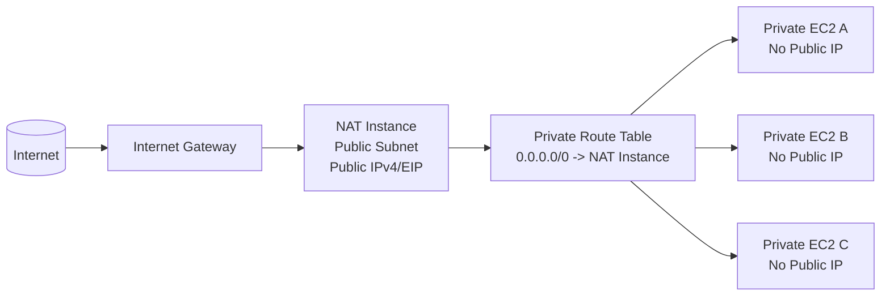
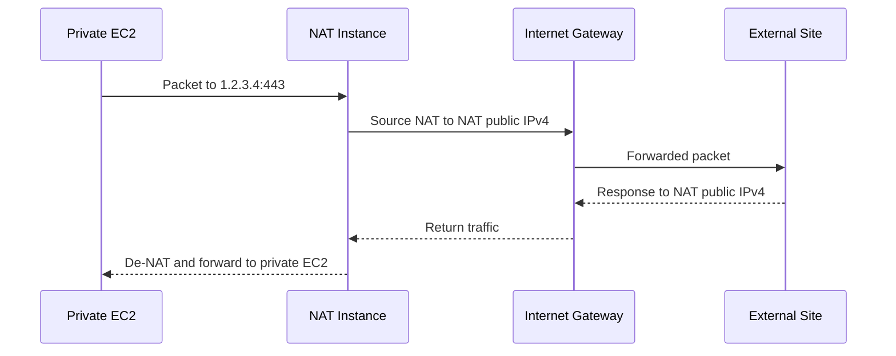
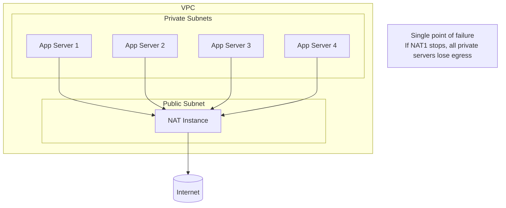
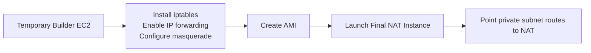
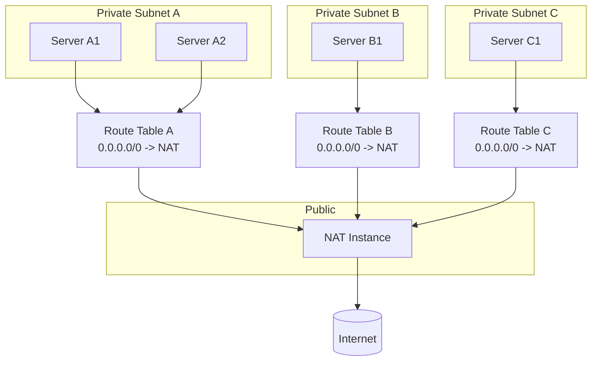
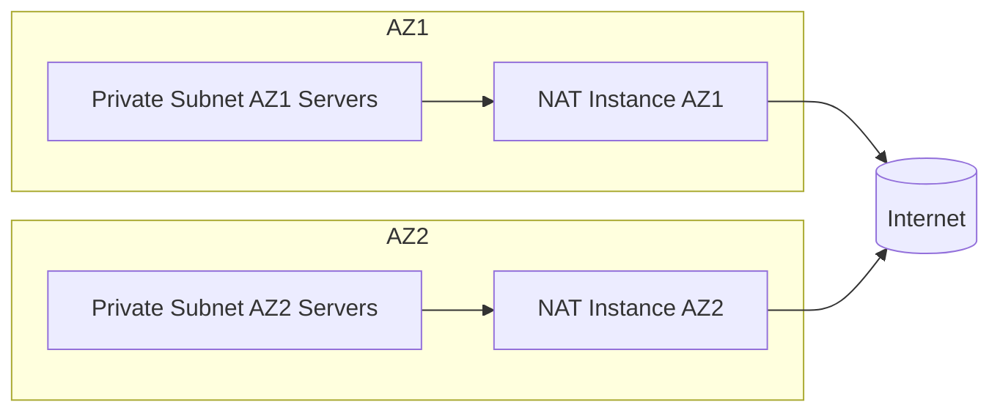
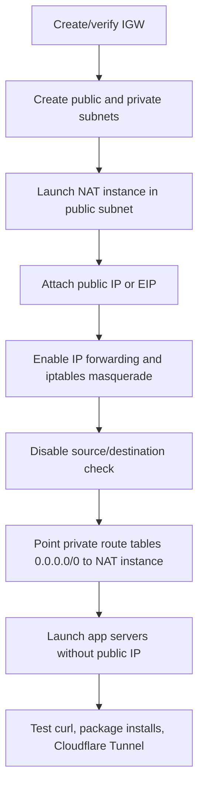

# AWS NAT Instance Guide for Multiple Private EC2 Servers

This guide shows how to set up **one EC2 instance as a NAT (Network Address Translation) instance** so that **several other EC2 instances without public IPv4 addresses** can still reach the external internet for package installs, OS updates, Docker image pulls, API calls, and Cloudflare Tunnel outbound connections.

It is written for the common pattern:

- **1 NAT instance** in a **public subnet**
- **Many application servers** in **private subnets**
- **No public IPv4** on the application servers
- **IPv4 egress only** through the NAT instance

> Important: AWS still recommends **NAT Gateway** for better availability, bandwidth, and lower admin effort. A NAT instance is appropriate when you want lower fixed cost and you accept the operational work and single-instance risk.

---

## Quick definitions: NAT and VPC

Before going deeper, it helps to define the two main terms used throughout this guide.

### What is a VPC?

A **VPC (Virtual Private Cloud)** is your private network inside AWS.

Think of it as the top-level network boundary that contains:

- your **subnets**
- your **route tables**
- your **Internet Gateway**
- your **EC2 instances**
- your **NAT devices**

In other words, the VPC is the network container, and the subnets are smaller network segments inside it.

### What is a subnet?

A **subnet** is a smaller IP network range inside a VPC.

You use subnets to divide the VPC into separate network segments so you can place resources in different areas with different routing behavior.

In AWS, the common distinction is:

- a **public subnet** can route internet-bound traffic to an **Internet Gateway**
- a **private subnet** does not send internet-bound traffic directly to an Internet Gateway and usually uses a **NAT device** for outbound internet access

In this guide, the NAT instance lives in a public subnet, and the application servers live in private subnets.

### What is NAT?

**NAT (Network Address Translation)** is a networking technique that rewrites IP addresses in packets as traffic passes through a device.

In this guide, the NAT instance does this for your private EC2 servers:

- private servers send outbound traffic to the NAT instance
- the NAT instance replaces the private source IP with its own public IP
- the internet sends the response back to the NAT instance
- the NAT instance forwards the response to the original private server

This lets private servers reach the internet for outbound connections without giving each server its own public IPv4 address.

### How they relate in AWS

In this design:

- the **VPC** is the overall AWS network
- the **public subnet** contains the NAT instance
- the **private subnets** contain your app servers
- the **NAT instance** provides outbound internet access for those private servers

---

## 1. What problem this solves

When an EC2 instance has **no public IPv4 address**, it normally **cannot reach the internet through an Internet Gateway by itself**. To give it outbound internet access, you need a NAT device.

A NAT instance:

- sits in a **public subnet**
- has a **public IPv4** or **Elastic IP**
- receives outbound traffic from private instances
- rewrites the source address to its own public address
- forwards return traffic back to the originating private instance

AWS documents this behavior for NAT devices and NAT instances.

---

## 2. Target architecture

### Basic single-AZ layout



### Packet flow



### Production caution: one NAT for many servers is simple but fragile



---

## 3. When this design is a good fit

Use a NAT instance when:

- you want to **avoid NAT Gateway monthly cost**
- your traffic volume is **modest**
- you can tolerate **manual administration**
- you understand this is usually a **single point of failure** unless you add automation/failover

Prefer NAT Gateway when:

- uptime matters more than cost
- you want managed scaling and less maintenance
- you need higher throughput or multi-AZ resilience with simpler operations

---

## 4. Prerequisites

Before you start, make sure you have:

- a VPC (Virtual Private Cloud), which is the AWS network that contains your subnets, route tables, and EC2 instances
- at least **one public subnet**
- at least **one private subnet**
- an **Internet Gateway** attached to the VPC
- a route table for the public subnet with:

```text
0.0.0.0/0 -> igw-xxxxxxxx
```

- private EC2 instances launched **without public IPv4**
- permission to modify:
  - EC2 instances
  - security groups
  - source/destination check
  - route tables

---

## 5. Important AWS constraints

According to AWS documentation:

1. A NAT instance must be in a **public subnet**.
2. It must have a **public IP address or an Elastic IP**.
3. You must **disable source/destination check** on the NAT instance.
4. The **private subnet route table** must send `0.0.0.0/0` to the NAT instance.
5. AWS notes that the old prebuilt NAT AMI is based on an old Amazon Linux release, so if you use NAT instances, you should create your own from a current OS such as **Amazon Linux 2023** or **Amazon Linux 2**.

---

## 6. Network design checklist

### Public subnet route table

Your NAT instance's subnet must have a route like:

```text
Destination    Target
10.0.0.0/16    local
0.0.0.0/0      igw-xxxxxxxx
```

### Private subnet route table

Every private subnet that should use this NAT instance needs a route like:

```text
Destination    Target
10.0.0.0/16    local
0.0.0.0/0      i-xxxxxxxxxxxxxxxxx
```

Where the target is the **instance ID of the NAT instance**.

> If you have multiple private subnets, you can associate them with the same private route table, or create separate route tables that all point to the same NAT instance.

---

## 7. Security group design

AWS's NAT-instance walkthrough recommends allowing **HTTP** and **HTTPS** from the private subnet CIDR to the NAT instance, plus **SSH** from your admin network if you need shell access.

### Example NAT instance security group

#### Inbound

| Source | Protocol | Ports | Purpose |
|---|---:|---:|---|
| `10.0.10.0/24` | TCP | 80 | Outbound web traffic from private subnet via NAT |
| `10.0.10.0/24` | TCP | 443 | Outbound HTTPS traffic from private subnet via NAT |
| `your-admin-ip/32` | TCP | 22 | Optional admin SSH |

#### Outbound

| Destination | Protocol | Ports | Purpose |
|---|---:|---:|---|
| `0.0.0.0/0` | TCP | 80 | Internet egress |
| `0.0.0.0/0` | TCP | 443 | Internet egress |
| `0.0.0.0/0` | UDP/TCP | DNS if needed | Optional if using direct DNS egress |

### Practical note

If your private servers need more than just web access, you may broaden rules carefully. Examples:

- package managers
- NTP
- Docker registry access
- outbound APIs on nonstandard ports

Keep the security group **as narrow as your workloads allow**.

---

## 8. Recommended build approach

The most reliable approach is:

1. Launch a temporary EC2 instance in the **public subnet**
2. Configure it for NAT
3. Create an **AMI** from it
4. Launch the final NAT instance from that AMI
5. Disable source/destination check
6. Point private subnet route tables to it

This mirrors AWS's current NAT-instance process.

---

## 9. Step-by-step setup

## Step 1: Launch the NAT builder instance

Launch an EC2 instance with:

- **AMI:** Amazon Linux 2023 or Amazon Linux 2
- **Subnet:** public subnet
- **Public IPv4:** enabled
- **Security group:** the NAT SG described above
- **Instance type:** sized for your load (for light usage, a small general-purpose instance is common)

> You can later create an AMI from this configured instance and relaunch it as your long-lived NAT instance.

---

## Step 2: Install NAT components and enable forwarding

On the instance, configure iptables and IPv4 forwarding.

### Commands based on AWS's current NAT-instance procedure

```bash
sudo yum install iptables-services -y
sudo systemctl enable iptables
sudo systemctl start iptables
```

Create a sysctl file:

```bash
sudo tee /etc/sysctl.d/custom-ip-forwarding.conf > /dev/null <<'EOF'
net.ipv4.ip_forward=1
EOF
```

Apply it:

```bash
sudo sysctl -p /etc/sysctl.d/custom-ip-forwarding.conf
```

Find the primary interface name:

```bash
netstat -i
```

Common names are `eth0`, `ens5`, or `enX0`.

Now configure NAT. Replace `eth0` below if your primary interface has a different name.

```bash
sudo /sbin/iptables -t nat -A POSTROUTING -o eth0 -j MASQUERADE
sudo /sbin/iptables -F FORWARD
sudo service iptables save
```

### Recommended extra forward rules

In practice, you usually want to explicitly allow forwarding instead of only flushing the chain.

```bash
sudo iptables -A FORWARD -i eth0 -m state --state RELATED,ESTABLISHED -j ACCEPT
sudo iptables -A FORWARD -o eth0 -j ACCEPT
sudo service iptables save
```

> If you already manage host firewall policy in another way, adapt these rules carefully.

---

## Step 3: Create an AMI (optional but recommended)

In the EC2 console:

- select the configured instance
- create an image (AMI)

This gives you a reusable NAT image so you can relaunch quickly if the instance is replaced.

---

## Step 4: Launch the final NAT instance

Launch from the configured AMI with:

- **Subnet:** public subnet
- **Public IPv4:** enabled, or associate an **Elastic IP**
- **Security group:** NAT security group
- **IAM role:** optional, but useful for SSM / CloudWatch

Mermaid view:



---

## Step 5: Disable source/destination check

This is mandatory.

In the EC2 console:

- select the NAT instance
- **Actions -> Networking -> Change source/destination check**
- turn it **off**

Without this, the NAT instance will drop transit traffic because EC2 instances normally only accept traffic where they are the source or destination.

---

## Step 6: Update private subnet route tables

For each private subnet that should use this NAT instance:

- open its route table
- add or update:

```text
0.0.0.0/0 -> i-xxxxxxxxxxxxxxxxx
```

If several private subnets should share the same NAT instance, make sure each private subnet is associated with a route table that points default traffic to that NAT instance.

### Example with three private subnets



---

## Step 7: Configure the private servers

On the private EC2 instances:

- **do not assign a public IP**
- ensure their security groups allow the outbound traffic they need
- ensure the subnet association points them to the correct private route table
- ensure DNS is working

To test:

```bash
curl -I https://aws.amazon.com
curl -I https://google.com
ping -c 3 8.8.8.8
getent hosts github.com
```

For your earlier Cloudflare Tunnel case, this is a good test too:

```bash
curl -I https://region1.v2.argotunnel.com
```

If outbound HTTPS works, `cloudflared` should be able to establish its tunnel unless another firewall or DNS issue exists.

---

## 10. Optional: bootstrap the NAT instance with user data

Instead of configuring by hand, you can launch the NAT instance with user data.

> Review and adapt interface names before using this in production.

```bash
#!/bin/bash
set -euxo pipefail

yum install -y iptables-services net-tools
systemctl enable iptables
systemctl start iptables

cat >/etc/sysctl.d/custom-ip-forwarding.conf <<'EOF'
net.ipv4.ip_forward=1
EOF
sysctl -p /etc/sysctl.d/custom-ip-forwarding.conf

IFACE=$(ip route show default | awk '/default/ {print $5; exit}')

iptables -t nat -A POSTROUTING -o "$IFACE" -j MASQUERADE
iptables -A FORWARD -i "$IFACE" -m state --state RELATED,ESTABLISHED -j ACCEPT
iptables -A FORWARD -o "$IFACE" -j ACCEPT
service iptables save
```

---

## 11. Validation checklist

Use this after setup.

### On the NAT instance

```bash
ip addr
ip route
sysctl net.ipv4.ip_forward
sudo iptables -t nat -S
sudo iptables -S FORWARD
curl -I https://aws.amazon.com
```

Expected:

- public IP attached
- default route to the Internet Gateway through the public subnet
- `net.ipv4.ip_forward = 1`
- a `MASQUERADE` rule exists
- outbound internet works from the NAT instance itself

### On each private server

```bash
ip addr
ip route
curl -I https://aws.amazon.com
curl -I https://registry-1.docker.io
```

Expected:

- no public IP
- default route is still the VPC router, but the subnet route table sends `0.0.0.0/0` to the NAT instance
- outbound web access works

---

## 12. Troubleshooting

## Symptom: private servers still cannot reach the internet

Check these in order:

### A. NAT instance has no public egress

From the NAT instance:

```bash
curl -I https://aws.amazon.com
```

If this fails:

- confirm the NAT instance is in a **public subnet**
- confirm the public subnet route table has:

```text
0.0.0.0/0 -> igw-xxxxxxxx
```

- confirm the NAT instance has a **public IP** or **Elastic IP**

### B. Source/destination check is still enabled

This is one of the most common issues.

Verify it is disabled on the NAT instance in the EC2 console.

### C. Private subnet route table is wrong

Make sure the private subnet route table uses the NAT instance as target:

```text
0.0.0.0/0 -> i-xxxxxxxxxxxxxxxxx
```

Not:

- the Internet Gateway
- no default route
- the wrong instance

### D. Security groups are too restrictive

- NAT instance SG may be blocking required traffic from private subnets
- private instance SG may be blocking needed outbound traffic
- check DNS traffic if you use external resolvers

### E. Host firewall rules are incomplete

Verify:

```bash
sudo iptables -t nat -S
sudo iptables -S FORWARD
```

You need at minimum:

- a `MASQUERADE` rule on the outbound interface
- forwarding rules that allow the transit traffic you need

### F. Wrong interface name in iptables

If you hardcoded `eth0` but the primary interface is `ens5`, NAT will not work.

Check with:

```bash
ip route show default
netstat -i
```

### G. DNS works poorly or not at all

If `curl https://1.1.1.1` works but `curl https://aws.amazon.com` fails, you likely have a DNS problem.

Check:

```bash
cat /etc/resolv.conf
getent hosts aws.amazon.com
```

---

## 13. High-availability and scaling considerations

One NAT instance serving many servers is usually fine for low-cost environments, but keep these caveats in mind:

### Single point of failure

If the NAT instance stops, crashes, or is terminated, **all private servers lose outbound internet access**.

### Cross-AZ traffic

If private subnets in multiple Availability Zones all route through one NAT instance in a single AZ:

- you create a resilience bottleneck
- you may incur cross-AZ data transfer

### Better pattern per AZ

A stronger design is **one NAT device per AZ**, with each private subnet using the NAT instance in the same AZ.



### Monitoring suggestions

At minimum, monitor:

- instance health checks
- CPU
- network throughput / packets
- disk fill if logs are stored locally
- CloudWatch alarms on instance status

---

## 14. Security and hardening tips

- Prefer **SSM Session Manager** instead of SSH where possible
- Restrict admin access to your office/home IP or VPN CIDR
- Keep the NAT instance patched
- Use a current OS image and recreate the AMI after patching
- Avoid running unrelated workloads on the NAT instance
- Consider VPC endpoints for AWS services to reduce public internet dependency

Examples:

- S3 Gateway Endpoint
- ECR API / ECR DKR Interface Endpoints
- SSM, EC2 Messages, and SSMMessages endpoints

These can reduce how much traffic needs to traverse the NAT instance.

---

## 15. Cost and tradeoff summary

### NAT Instance

Pros:

- usually cheaper at low scale
- flexible
- full control

Cons:

- you manage OS, firewall, updates, failover
- single point of failure unless you add automation
- performance depends on instance size

### NAT Gateway

Pros:

- managed by AWS
- simpler
- higher availability and bandwidth

Cons:

- higher fixed monthly cost
- data processing charges

### Public IP on every server

Pros:

- simplest
- no NAT management

Cons:

- public IPv4 hourly charge per server
- broader exposure surface

---

## 16. Practical recommendation for your use case

If you have **a few servers** and you want:

- no public IPs on app servers
- outbound internet access
- low cost

then this is a reasonable design:

1. one small NAT instance in a public subnet
2. all private app servers route default IPv4 traffic to it
3. app servers keep **no public IPv4**
4. use Cloudflare Tunnel or a load balancer separately for inbound access
5. add VPC endpoints for AWS-native services where possible

If the environment becomes more important or spans multiple AZs, move toward:

- one NAT per AZ, or
- NAT Gateway

---

## 17. Quick implementation summary



---

## 18. References

Official AWS references used to assemble this guide:

- Amazon VPC: **Enable private resources to communicate outside the VPC**  
  `https://docs.aws.amazon.com/vpc/latest/userguide/work-with-nat-instances.html`

- Amazon VPC: **NAT instances**  
  `https://docs.aws.amazon.com/vpc/latest/userguide/VPC_NAT_Instance.html`

- Amazon VPC: **Connect to the internet or other networks using NAT devices**  
  `https://docs.aws.amazon.com/vpc/latest/userguide/vpc-nat.html`

- Amazon VPC: **Example: VPC with servers in private subnets and NAT**  
  `https://docs.aws.amazon.com/vpc/latest/userguide/vpc-example-private-subnets-nat.html`

- Amazon VPC: **Route tables**  
  `https://docs.aws.amazon.com/vpc/latest/userguide/VPC_Route_Tables.html`

---

## 19. Final sanity check

For this design to work, all of the following must be true at the same time:

- NAT instance is in a **public subnet**
- NAT instance has a **public IP or Elastic IP**
- public subnet route table has `0.0.0.0/0 -> Internet Gateway`
- private subnet route table has `0.0.0.0/0 -> NAT instance`
- source/destination check is **disabled** on NAT instance
- IP forwarding is **enabled**
- NAT masquerade rule is **present**
- security groups permit the traffic you need

If any one of these is missing, private servers will usually fail to reach the external internet.
