# Cloudflare-hosted EmDash with D1 + R2 + Access
### Comprehensive deployment and operations guide

**Version context:** This guide is written against the public EmDash preview and current Cloudflare docs as of **2026-04-03**.  
**Target stack:** **EmDash on Cloudflare Workers** with **D1** for database, **R2** for media/assets, and **Cloudflare Access** for private access control.  
**Primary use case:** private wiki, internal knowledge base, editorial site, or controlled-access content platform.

---

## Table of contents

1. [What this stack is](#what-this-stack-is)
2. [Recommended architecture](#recommended-architecture)
3. [When to use this pattern](#when-to-use-this-pattern)
4. [How the pieces fit together](#how-the-pieces-fit-together)
5. [Prerequisites](#prerequisites)
6. [Provisioning order](#provisioning-order)
7. [Step 1 — Create or obtain an EmDash project](#step-1--create-or-obtain-an-emdash-project)
8. [Step 2 — Provision D1](#step-2--provision-d1)
9. [Step 3 — Provision R2](#step-3--provision-r2)
10. [Step 4 — Configure Wrangler bindings and routes](#step-4--configure-wrangler-bindings-and-routes)
11. [Step 5 — Configure EmDash in Astro](#step-5--configure-emdash-in-astro)
12. [Step 6 — Protect the site with Cloudflare Access](#step-6--protect-the-site-with-cloudflare-access)
13. [Step 7 — Choose your privacy model](#step-7--choose-your-privacy-model)
14. [Step 8 — Local development and testing](#step-8--local-development-and-testing)
15. [Step 9 — Media, URLs, and file access strategy](#step-9--media-urls-and-file-access-strategy)
16. [Step 10 — Security hardening](#step-10--security-hardening)
17. [Step 11 — Deployment workflow](#step-11--deployment-workflow)
18. [Step 12 — Operations, observability, and maintenance](#step-12--operations-observability-and-maintenance)
19. [Step 13 — Backup and recovery planning](#step-13--backup-and-recovery-planning)
20. [Step 14 — Migration notes for MediaWiki content](#step-14--migration-notes-for-mediawiki-content)
21. [Step 15 — Troubleshooting](#step-15--troubleshooting)
22. [Appendix A — Example files](#appendix-a--example-files)
23. [Appendix B — Mermaid diagrams](#appendix-b--mermaid-diagrams)
24. [Appendix C — Reference links](#appendix-c--reference-links)

---

## What this stack is

This deployment pattern uses:

- **Cloudflare Workers** as the runtime for the EmDash site and admin
- **Cloudflare D1** as the SQL database
- **Cloudflare R2** as the object store for uploaded media and other binary resources
- **Cloudflare Access** as the identity-aware gate in front of the site, admin, or both

EmDash’s public project and docs show that it can run on **Cloudflare (D1 + R2 + Workers)**, and its configuration reference includes first-class examples for:

- `d1({ binding: "DB" })`
- `r2({ binding: "MEDIA" })`
- `auth.cloudflareAccess`
- Cloudflare-specific adapters/helpers in the demo config

The important practical takeaway is this:

> For a **private EmDash deployment**, you should think in **two layers**:
>
> 1. **Edge access control**: Cloudflare Access protects the hostname before the request reaches EmDash.  
> 2. **Application auth/RBAC**: EmDash decides which authenticated users can administer or edit content.

---

## Recommended architecture

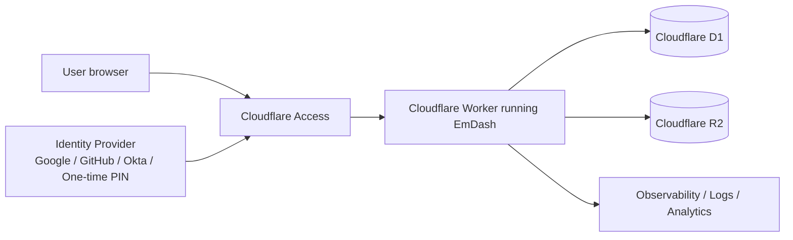

### Why this architecture is the safest default

- **Access** blocks unauthorized users **before** they hit your app.
- **EmDash** still has its own role model for authors/editors/admins.
- **D1** holds content, schema, revisions, users, and operational metadata.
- **R2** stores uploads and larger binary resources.
- **Workers** runs everything close to users without managing origin servers.

---

## When to use this pattern

This stack is a strong fit when you want:

- a **private wiki**
- an **internal documentation portal**
- an **editorial/admin-managed content system**
- **Cloudflare-native operations**
- a modern TypeScript stack instead of PHP
- strong boundary control using **Cloudflare Access**

It is less ideal when you need:

- a huge legacy WordPress plugin/theme ecosystem
- a classic wiki engine with deeply specialized wiki extensions
- mature enterprise document-collaboration features out of the box
- exact MediaWiki feature parity

---

## How the pieces fit together

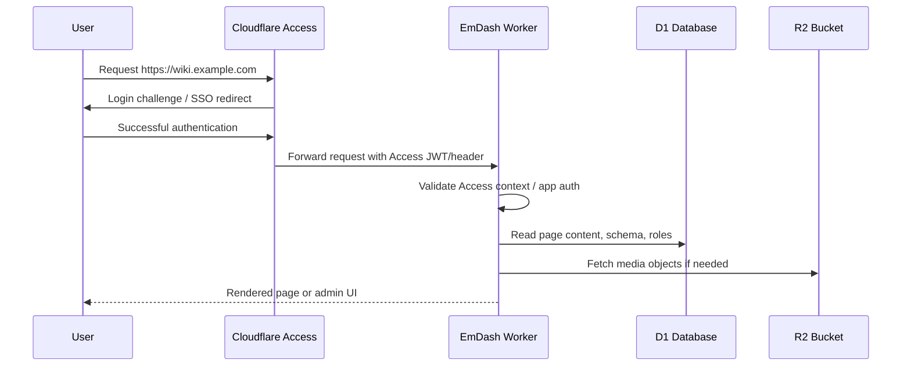

---

## Prerequisites

Before you start, have:

- a **Cloudflare account**
- a **Cloudflare zone/domain** for your final hostname if you want a custom domain
- **Wrangler** installed locally
- **Node.js** and **pnpm/npm**
- an identity model for Cloudflare Access:
  - email one-time PIN, or
  - Google, GitHub, Okta, Azure AD / Entra ID, etc.
- a decision on whether the site is:
  - **fully private**, or
  - **public content with private admin**, or
  - **private preview / staging only**

### Plan caveat: sandboxed plugins

EmDash’s public README says secure sandboxed plugins depend on **Dynamic Workers**, which are currently only available on **paid** Cloudflare accounts. If you are on a free plan, the documented workaround is to disable the `worker_loaders` block. For a private wiki, this usually means one of two things:

- start **without** sandboxed plugins, or
- use a **paid** Workers-capable account for the full plugin model

---

## Provisioning order

Use this order to minimize rework:

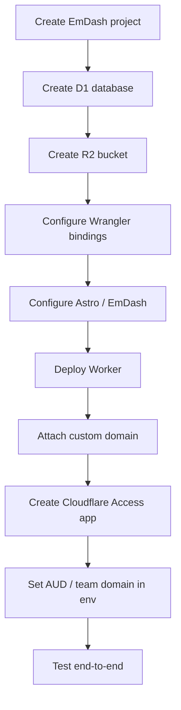

---

## Step 1 — Create or obtain an EmDash project

### Option A: scaffold a new project

```bash
npm create emdash@latest
```

### Option B: deploy from the public repo pattern

The public EmDash repo includes a Cloudflare demo and a “Deploy to Cloudflare” path. Even if you start from that, expect to customize:

- project name
- domain/route
- D1 database name and ID
- R2 bucket name
- Access team domain and audience
- plugins and media providers

### Recommended approach

For a real private deployment:

1. scaffold a project
2. commit it into your own repo
3. explicitly configure:
   - D1
   - R2
   - Access
   - custom domain
   - secrets and env vars

---

## Step 2 — Provision D1

Cloudflare D1 is the database layer for EmDash on Workers.

### Create the database

```bash
npx wrangler d1 create emdash-prod
```

Record:

- `database_name`
- `database_id`

### Bind it in `wrangler.jsonc`

```jsonc
{
  "d1_databases": [
    {
      "binding": "DB",
      "database_name": "emdash-prod",
      "database_id": "YOUR_DATABASE_ID"
    }
  ]
}
```

### Migration model

EmDash’s config reference states that **D1 requires migrations via Wrangler CLI** and that DDL is not allowed at runtime. Cloudflare’s D1 migration docs also describe a migration workflow centered on a `migrations/` directory.

That means you should treat schema changes as **versioned migration files**, not as ad hoc runtime mutations.

### Suggested migration workflow

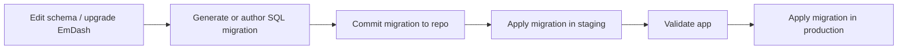

### Good practices for D1

- keep migrations in source control
- use separate databases for:
  - dev
  - staging
  - production
- avoid sharing a single D1 DB across unrelated environments
- do not manually patch schema in production unless absolutely necessary
- document every binding and database ID in your deployment inventory

### Read-replica mode

EmDash’s config reference exposes:

```js
d1({ binding: "DB", session: "auto" })
```

That mode uses the **D1 Sessions API** for read-replica behavior and bookmark-based read-your-writes consistency for authenticated users. For content-heavy, read-biased sites, this is a reasonable production default.

---

## Step 3 — Provision R2

R2 stores uploaded media and other objects.

### Create a bucket

Use the dashboard or Wrangler command set for R2 to create a bucket such as:

- `emdash-media-prod`
- `emdash-media-staging`

### Bind the bucket in `wrangler.jsonc`

```jsonc
{
  "r2_buckets": [
    {
      "binding": "MEDIA",
      "bucket_name": "emdash-media-prod"
    }
  ]
}
```

### Development behavior

Cloudflare’s R2 docs note that `wrangler dev` uses a **local R2 simulation** by default, and objects stored there live in `.wrangler/state` on your machine. If you want to use the real remote bucket during local development, add:

```jsonc
{
  "r2_buckets": [
    {
      "binding": "MEDIA",
      "bucket_name": "emdash-media-prod",
      "remote": true
    }
  ]
}
```

### Media-path design

You should decide whether uploads are:

- **public** via R2 public URL or CDN
- **semi-private** with signed URLs
- **private** behind application or Access control

For an internal wiki, the safest default is:

- keep the site itself behind **Cloudflare Access**
- keep R2 media access aligned with that privacy model
- avoid casually exposing bucket URLs until you intentionally design for that

---

## Step 4 — Configure Wrangler bindings and routes

Below is a practical starting point for a Cloudflare-hosted EmDash project.

```jsonc
{
  "$schema": "node_modules/wrangler/config-schema.json",
  "name": "emdash-private-wiki",
  "main": "./src/worker.ts",
  "compatibility_date": "2026-04-03",
  "compatibility_flags": ["nodejs_compat", "disable_nodejs_process_v2"],

  "routes": [
    {
      "pattern": "wiki.example.com",
      "zone_name": "example.com",
      "custom_domain": true
    }
  ],

  "d1_databases": [
    {
      "binding": "DB",
      "database_name": "emdash-prod",
      "database_id": "YOUR_D1_DATABASE_ID"
    }
  ],

  "r2_buckets": [
    {
      "binding": "MEDIA",
      "bucket_name": "emdash-media-prod"
    }
  ],

  "worker_loaders": [
    {
      "binding": "LOADER"
    }
  ],

  "observability": {
    "enabled": true
  }
}
```

### Binding map

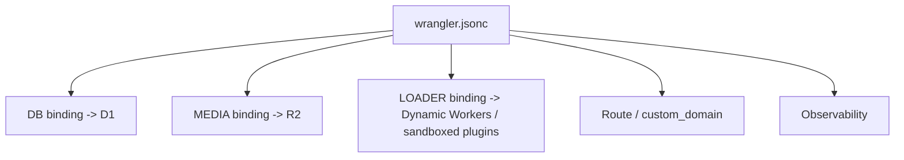

### Notes

- **`DB`** must match your EmDash D1 config.
- **`MEDIA`** must match your EmDash R2 config.
- **`LOADER`** is only needed for the sandboxed plugin model.
- **`custom_domain: true`** is the cleanest production pattern for private/internal-hostname deployments.
- If you are not ready for sandboxed plugins or you are on a plan that does not support Dynamic Workers, remove `worker_loaders`.

---

## Step 5 — Configure EmDash in Astro

EmDash’s configuration reference shows the generic integration shape:

- `database`
- `storage`
- `plugins`
- `auth`

Its Cloudflare demo config shows the Cloudflare-native version using D1, R2, and an Access helper.

### Recommended Cloudflare-native example

```js
// astro.config.mjs
import { defineConfig } from "astro/config";
import cloudflare from "@astrojs/cloudflare";
import emdash from "emdash/astro";

// Depending on your installed package versions / exports:
import { d1, r2, access, sandbox, cloudflareCache } from "@emdash-cms/cloudflare";

export default defineConfig({
  output: "server",
  adapter: cloudflare(),

  integrations: [
    emdash({
      database: d1({
        binding: "DB",
        session: "auto"
      }),

      storage: r2({
        binding: "MEDIA"
      }),

      auth: access({
        teamDomain: "your-team.cloudflareaccess.com",
        autoProvision: true,
        defaultRole: 30
      }),

      sandboxRunner: sandbox(),

      plugins: [],
      sandboxed: []
    })
  ],

  experimental: {
    cache: {
      provider: cloudflareCache()
    }
  }
});
```

### Generic configuration-reference style example

If your installed version exposes the generic auth configuration instead of the helper wrapper, the public config reference shows this shape:

```js
import { defineConfig } from "astro/config";
import emdash, { r2 } from "emdash/astro";
import { d1 } from "emdash/db";

export default defineConfig({
  integrations: [
    emdash({
      database: d1({ binding: "DB", session: "auto" }),

      storage: r2({ binding: "MEDIA" }),

      auth: {
        cloudflareAccess: {
          teamDomain: "your-team.cloudflareaccess.com",
          audience: "YOUR_AUD_TAG",
          autoProvision: true,
          defaultRole: 30,
          syncRoles: false,
          roleMapping: {
            "Admins": 50,
            "Editors": 40
          }
        }
      }
    })
  ]
});
```

### What the Access auth block means

- **`teamDomain`**: your Cloudflare Access team domain
- **`audience`**: the Access application’s **AUD** tag
- **`autoProvision`**: create the user in EmDash at first successful login
- **`defaultRole`**: initial role inside EmDash
- **`syncRoles`**: whether EmDash should recalculate role mapping on each login
- **`roleMapping`**: map IdP groups to EmDash roles

### Important auth behavior

The config reference explicitly states:

> When `cloudflareAccess` is configured, it becomes the **exclusive** auth method. Passkeys, OAuth, magic links, and self-signup are disabled.

That is usually the right choice for an internal/private deployment.

---

## Step 6 — Protect the site with Cloudflare Access

For a Cloudflare-hosted EmDash site on a public hostname, the best model is usually:

1. deploy the Worker on a **custom domain**
2. create a **self-hosted Access application** for that hostname
3. enforce Access policies for the audience you want
4. wire EmDash to the same Access identity context

### Why use Access even if EmDash has auth

Because the two systems solve different problems:

- **Access**: “Who may reach this hostname/path at all?”
- **EmDash RBAC**: “Once inside, who may administer or edit?”

### Access topology

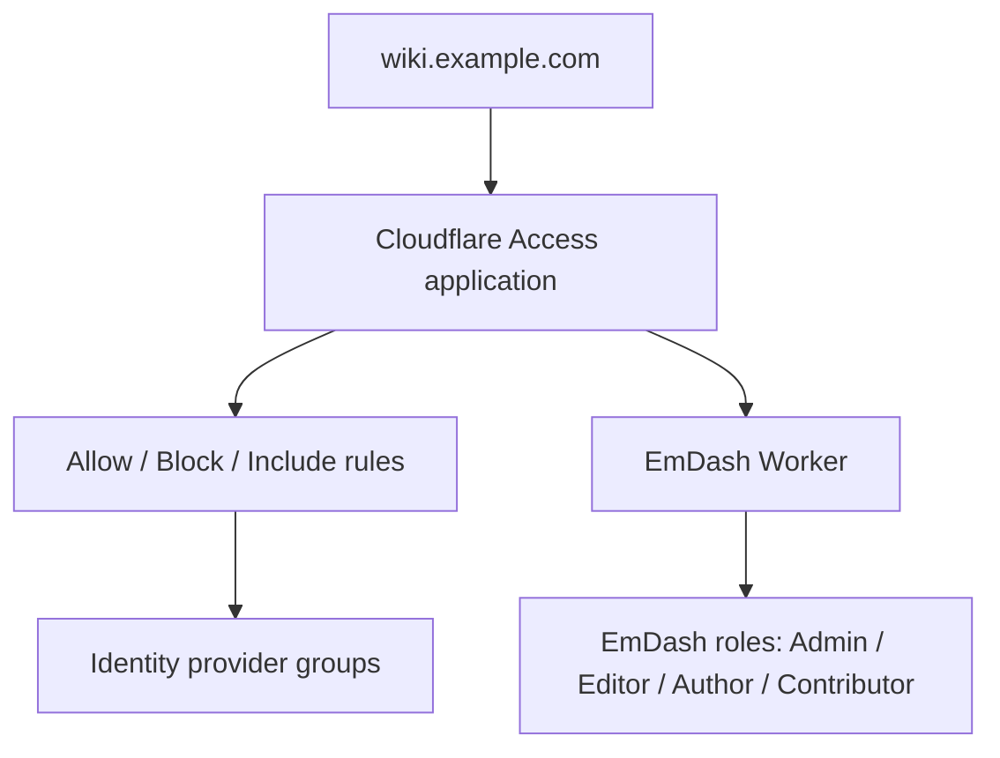

### Basic Access setup pattern

For a **public hostname application**:

- add the custom domain to the Worker
- go to **Cloudflare One**
- create a **Self-hosted** application
- specify the hostname
- add policies that define who may access it

### Getting the AUD tag

Cloudflare’s Access docs say each Access application has a unique **Application Audience (AUD) Tag**. Copy it from:

- **Access controls > Applications**
- **Configure**
- **Basic information**
- **Application Audience (AUD) Tag**

That AUD is what you place into your EmDash config or environment.

### Recommended environment variables

Use secrets / environment vars for sensitive values:

```bash
# Example names - choose a consistent convention
CF_ACCESS_AUDIENCE=xxxxxxxx-xxxx-xxxx-xxxx-xxxxxxxxxxxx
CF_ACCESS_TEAM_DOMAIN=your-team.cloudflareaccess.com
EMDASH_AUTH_SECRET=replace_me
EMDASH_PREVIEW_SECRET=replace_me
```

---

## Step 7 — Choose your privacy model

There are several valid patterns.

### Pattern A — Entire site private

Best for:

- private wiki
- internal docs
- client portal
- restricted editorial workspace

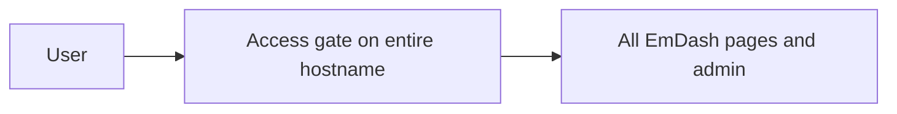

**Recommendation:** this is the cleanest private-wiki pattern.

### Pattern B — Public content, private admin

Best for:

- public marketing/blog content
- private editorial admin

Possible approaches:

1. split hostnames:
   - `www.example.com` for public site
   - `admin.example.com` for protected admin
2. or use more granular app routing/policies if you are certain about your policy boundaries

**Recommendation:** prefer **separate admin subdomain** if privacy is important. It is simpler to reason about and audit.

### Pattern C — Private staging, public production

Best for:

- editorial review workflows
- preview environments
- safe QA before public release

Use Access on:

- preview URLs
- staging hostname
- optionally workers.dev preview routes

### Decision diagram

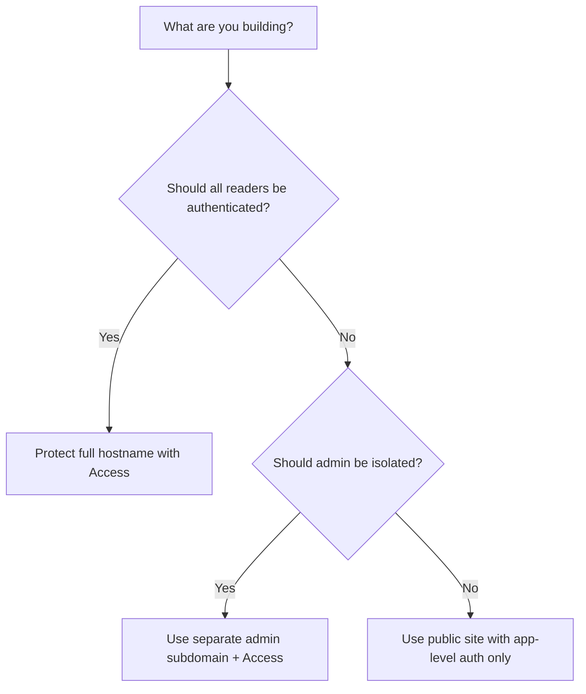

For a **private wiki**, choose **Pattern A**.

---

## Step 8 — Local development and testing

### D1 local development

Cloudflare D1 docs support local development with Wrangler. Use local state for dev and separate remote resources for staging/production.

### R2 local development

By default, `wrangler dev` uses a **local R2 simulation**. This is useful for safe local iteration.

### Practical local workflow

```bash
pnpm install
pnpm dev
```

If your project follows the demo pattern, local development typically runs through Astro with the Cloudflare runtime.

### Suggested environment separation

| Environment | Runtime | Database | Media | Access |
|---|---|---|---|---|
| Local dev | `wrangler dev` / Astro dev | Local D1 simulation or separate dev DB | Local R2 simulation | Usually disabled or mocked |
| Staging | Worker on custom subdomain | Staging D1 | Staging R2 | Enabled |
| Production | Worker on final domain | Prod D1 | Prod R2 | Enabled |

### Environment diagram

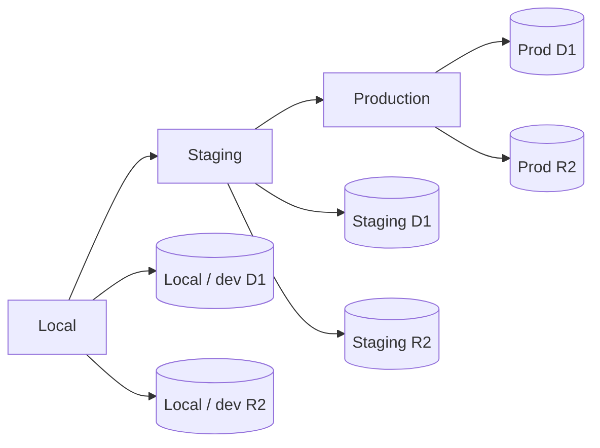

### Testing checklist

Before go-live, verify:

- authenticated access works
- unauthorized access is blocked
- EmDash admin loads correctly
- media uploads land in the intended R2 bucket
- media reads use the intended URL/path model
- D1 writes, reads, and revisions work
- domain/route and TLS are correct
- staging and production do not share buckets or databases

---

## Step 9 — Media, URLs, and file access strategy

This is one of the most important design choices for a private deployment.

### Option 1 — Public object URLs

Use when:

- your site is public
- uploaded assets are meant to be public
- CDN-style serving is acceptable

Public URL example in EmDash config:

```js
storage: r2({
  binding: "MEDIA",
  publicUrl: "https://pub-xxxx.r2.dev"
})
```

### Option 2 — Access-controlled site, indirect media access

Use when:

- site content is private
- you want media discoverability limited to authenticated readers
- you want files accessed through the app, not directly via openly exposed object URLs

### Option 3 — Bucket/path protection with Access

Cloudflare’s R2 docs include a guide for protecting an R2 bucket with Access. This is useful when you need additional protection for object access paths.

### Recommended private-wiki rule

For a private wiki, prefer this order of safety:

1. protect the **site hostname** with Access  
2. serve content and media through app-controlled paths where practical  
3. only expose raw bucket/public URLs when you deliberately want that behavior

### Media flow

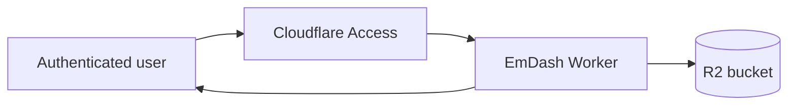

---

## Step 10 — Security hardening

### Core controls

- protect the hostname with **Cloudflare Access**
- use **custom domain** instead of depending only on ad hoc preview URLs
- keep **staging** and **production** in separate Cloudflare resources
- store secrets in Wrangler / Cloudflare secrets, not in Git
- treat D1 schema changes as reviewed migrations
- remove `worker_loaders` if you are not using sandboxed plugins
- keep plugin count low in early deployments

### Role strategy

A sensible default for a private wiki:

- **Administrator**: infra + schema + all content
- **Editor**: manages content and publishing
- **Author**: creates/updates assigned content
- **Contributor**: limited writing/review

### IdP group mapping

Use Cloudflare Access groups from your IdP and map them to EmDash roles.

Example:

```js
roleMapping: {
  "Wiki-Admins": 50,
  "Wiki-Editors": 40,
  "Wiki-Authors": 30
}
```

### Security boundary diagram

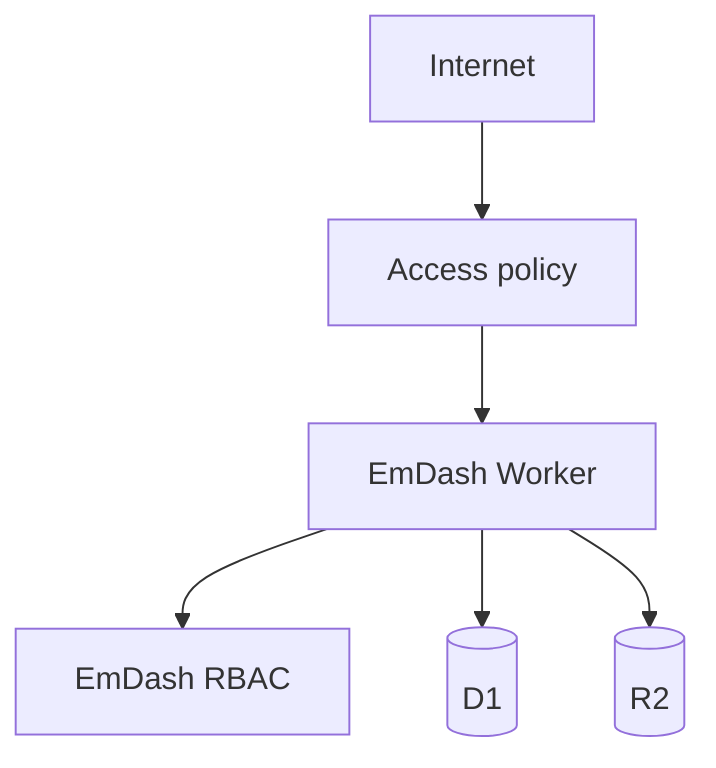

### Path to keep simple

For an internal deployment, the safest version is usually:

- one production hostname
- one staging hostname
- both behind Access
- one IdP
- one role-mapping policy
- no public bucket URL unless truly necessary

---

## Step 11 — Deployment workflow

### Recommended flow

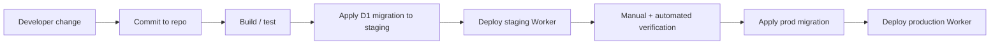

### Production checklist

- D1 migration reviewed
- R2 bucket exists and binding matches
- route/custom domain matches intended hostname
- Access app exists and policies are correct
- AUD tag in env/config matches the Access app
- smoke test completed
- rollback plan documented

### One-click deployment

Cloudflare’s Deploy-to-Cloudflare flow is useful for bootstrapping, but for a real private site you should still explicitly review:

- route
- domain
- D1 DB target
- R2 bucket target
- Access app and policy
- secrets

---

## Step 12 — Operations, observability, and maintenance

### What to monitor

- request failures / status codes
- auth failures
- Worker exceptions
- D1 query issues and migration failures
- upload/read failures from R2
- latency and cache effectiveness

### Suggested maintenance rhythm

- review Worker and app logs after deployment
- rotate secrets on a planned schedule
- audit Access policies and IdP groups regularly
- review stale users/roles inside EmDash
- test restore / recovery procedures quarterly

### Operational event flow

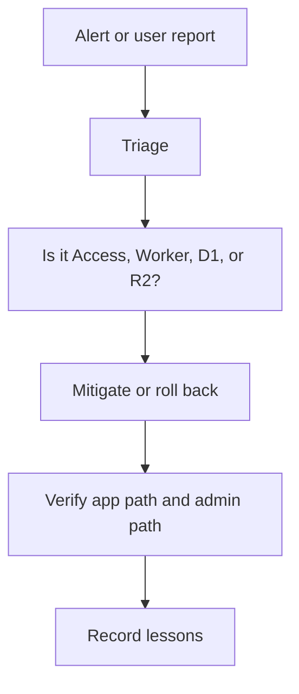

---

## Step 13 — Backup and recovery planning

This stack is modern, but you still need classic backup discipline.

### Minimum recovery plan

Document:

- D1 database names and IDs
- migration history location
- R2 bucket names
- Worker/project name
- domain and route config
- Access application name and AUD tag
- required secrets and where they are stored
- the exact commit currently in production

### Recovery objectives to define

- how quickly the wiki must return
- whether losing recent uploads is acceptable
- whether you need point-in-time or versioned restore capability
- whether staging can temporarily serve as fallback

### Recovery diagram

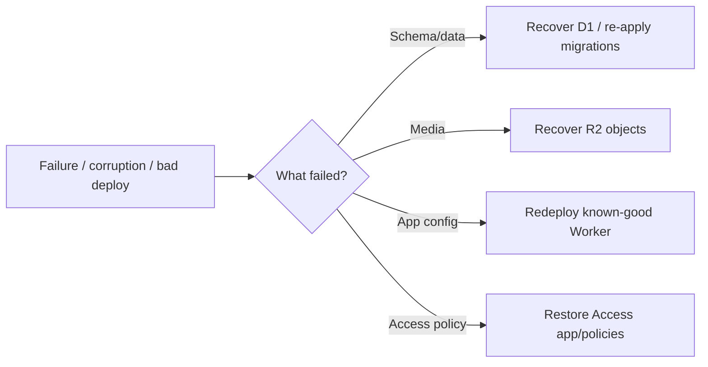

### Practical advice

- never rely on “the cloud has it” as your backup strategy
- keep infra configuration and migration files in Git
- export/verify critical content regularly
- validate recovery steps before an actual incident

---

## Step 14 — Migration notes for MediaWiki content

If your final target is a **private wiki**, this Cloudflare stack can host it well. But MediaWiki migration remains a **custom migration project**.

### What maps well

- pages/articles
- uploaded files
- categories/taxonomy-like grouping
- basic revisions concept
- structured content collections

### What needs custom handling

- MediaWiki templates
- parser functions
- extension-generated data
- semantic/cargo models
- user/group semantics
- per-page permissions
- exact rendering parity

### Suggested migration path

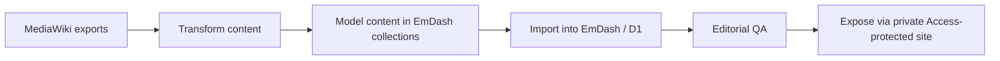

### Recommended data lanes

- **Pages/content** -> D1 via EmDash import or custom loader
- **Uploads/files** -> R2
- **Users** -> Access / IdP + EmDash role provisioning
- **Permissions** -> Access policy + EmDash RBAC
- **Templates/special pages** -> rebuild in theme/components, not direct import

---

## Step 15 — Troubleshooting

### 1) The site deploys but admin login fails

Check:

- Access app exists for the correct hostname
- `teamDomain` is correct
- `audience` / AUD tag matches the actual Access application
- EmDash is configured for Access auth in the installed package/version style you are using

### 2) Uploads fail

Check:

- `MEDIA` binding exists in `wrangler.jsonc`
- bucket exists in the intended account/environment
- your storage adapter points to `r2({ binding: "MEDIA" })`
- the site is not accidentally writing to a local simulation while you expect production data

### 3) Changes are not visible after write

Check:

- D1 binding name
- session mode
- whether you are using separate staging/prod DBs
- whether the migration actually applied

### 4) Access blocks everyone

Check:

- application hostname
- policy rules
- IdP group mapping
- include/exclude rules
- session duration and test users

### 5) Sandboxed plugins do not work

Check:

- Cloudflare plan capability for Dynamic Workers
- `worker_loaders` binding exists
- plugin is actually configured as sandboxed
- or disable the loader and remove sandboxed plugin usage

### 6) Custom domain does not route correctly

Check:

- Cloudflare zone ownership
- `custom_domain: true`
- route pattern and zone name
- whether a conflicting CNAME already exists

### Troubleshooting decision tree

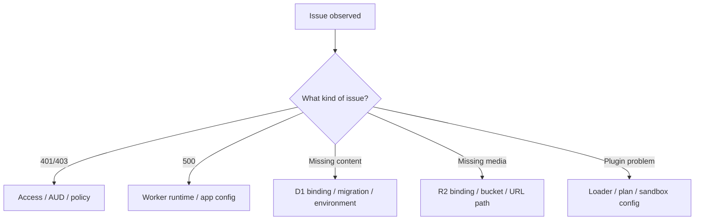

---

## Appendix A — Example files

### Example `wrangler.jsonc`

```jsonc
{
  "$schema": "node_modules/wrangler/config-schema.json",
  "name": "emdash-private-wiki",
  "main": "./src/worker.ts",
  "compatibility_date": "2026-04-03",
  "compatibility_flags": ["nodejs_compat", "disable_nodejs_process_v2"],

  "routes": [
    {
      "pattern": "wiki.example.com",
      "zone_name": "example.com",
      "custom_domain": true
    }
  ],

  "d1_databases": [
    {
      "binding": "DB",
      "database_name": "emdash-prod",
      "database_id": "YOUR_DATABASE_ID"
    }
  ],

  "r2_buckets": [
    {
      "binding": "MEDIA",
      "bucket_name": "emdash-media-prod"
    }
  ],

  "worker_loaders": [
    {
      "binding": "LOADER"
    }
  ],

  "observability": {
    "enabled": true
  }
}
```

### Example `astro.config.mjs`

```js
import { defineConfig } from "astro/config";
import cloudflare from "@astrojs/cloudflare";
import emdash from "emdash/astro";
import { d1, r2, access, sandbox, cloudflareCache } from "@emdash-cms/cloudflare";

export default defineConfig({
  output: "server",
  adapter: cloudflare(),

  integrations: [
    emdash({
      database: d1({
        binding: "DB",
        session: "auto"
      }),

      storage: r2({
        binding: "MEDIA"
      }),

      auth: access({
        teamDomain: process.env.CF_ACCESS_TEAM_DOMAIN,
        autoProvision: true,
        defaultRole: 30
      }),

      sandboxRunner: sandbox(),

      plugins: [],
      sandboxed: []
    })
  ],

  experimental: {
    cache: {
      provider: cloudflareCache()
    }
  }
});
```

### Example generic Access config block

```js
auth: {
  cloudflareAccess: {
    teamDomain: process.env.CF_ACCESS_TEAM_DOMAIN,
    audience: process.env.CF_ACCESS_AUDIENCE,
    autoProvision: true,
    defaultRole: 30,
    syncRoles: false,
    roleMapping: {
      "Wiki-Admins": 50,
      "Wiki-Editors": 40,
      "Wiki-Authors": 30
    }
  }
}
```

---

## Appendix B — Mermaid diagrams

This guide includes these Mermaid diagram types:

1. architecture diagram
2. request sequence
3. provisioning flow
4. D1 migration flow
5. bindings map
6. Access topology
7. privacy-mode decision flow
8. environment progression
9. media flow
10. security boundary
11. deployment workflow
12. operations incident flow
13. recovery workflow
14. migration workflow
15. troubleshooting decision tree

If your Markdown renderer does not support Mermaid, render the document in GitHub, GitLab, Obsidian with Mermaid enabled, or a docs stack that supports Mermaid code fences.

---

## Appendix C — Reference links

### EmDash

- EmDash repository: https://github.com/emdash-cms/emdash
- EmDash launch post: https://blog.cloudflare.com/emdash-wordpress/
- EmDash Cloudflare demo directory: https://github.com/emdash-cms/emdash/tree/main/demos/cloudflare
- EmDash configuration reference (raw): https://raw.githubusercontent.com/emdash-cms/emdash/main/docs/src/content/docs/reference/configuration.mdx
- EmDash Cloudflare demo `wrangler.jsonc` (raw): https://raw.githubusercontent.com/emdash-cms/emdash/main/demos/cloudflare/wrangler.jsonc
- EmDash Cloudflare demo `astro.config.mjs` (raw): https://raw.githubusercontent.com/emdash-cms/emdash/main/demos/cloudflare/astro.config.mjs

### Cloudflare Workers / domains

- Workers overview: https://developers.cloudflare.com/workers/
- Workers custom domains: https://developers.cloudflare.com/workers/configuration/routing/custom-domains/
- Workers routes and domains: https://developers.cloudflare.com/workers/configuration/routing/
- workers.dev: https://developers.cloudflare.com/workers/configuration/routing/workers-dev/
- Deploy to Cloudflare buttons: https://developers.cloudflare.com/workers/platform/deploy-buttons/

### Cloudflare D1

- D1 overview: https://developers.cloudflare.com/d1/
- D1 getting started: https://developers.cloudflare.com/d1/get-started/
- D1 migrations: https://developers.cloudflare.com/d1/reference/migrations/
- D1 Wrangler commands: https://developers.cloudflare.com/d1/wrangler-commands/
- D1 local development: https://developers.cloudflare.com/d1/best-practices/local-development/

### Cloudflare R2

- R2 Workers API usage: https://developers.cloudflare.com/r2/api/workers/workers-api-usage/
- R2 Workers API reference: https://developers.cloudflare.com/r2/api/workers/workers-api-reference/
- R2 from Workers / local-vs-remote dev behavior: https://developers.cloudflare.com/r2/get-started/workers-api/
- Protect an R2 bucket with Access: https://developers.cloudflare.com/r2/tutorials/cloudflare-access/

### Cloudflare Access / Zero Trust

- Add web applications: https://developers.cloudflare.com/cloudflare-one/access-controls/applications/http-apps/
- Public hostname self-hosted application: https://developers.cloudflare.com/cloudflare-one/access-controls/applications/http-apps/self-hosted-public-app/
- Private web application: https://developers.cloudflare.com/cloudflare-one/setup/secure-private-apps/private-web-app/
- Create an Access application: https://developers.cloudflare.com/learning-paths/clientless-access/access-application/create-access-app/
- Validate Access JWTs / get AUD tag: https://developers.cloudflare.com/cloudflare-one/access-controls/applications/http-apps/authorization-cookie/validating-json/
- Origin parameters and audTag forwarding: https://developers.cloudflare.com/cloudflare-one/networks/connectors/cloudflare-tunnel/configure-tunnels/origin-parameters/
- Pages Access plugin: https://developers.cloudflare.com/pages/functions/plugins/cloudflare-access/

---

## Final recommendations

If your target is a **private EmDash wiki on Cloudflare**, this is the most robust operating model:

1. deploy EmDash as a **Worker on a custom domain**
2. use **D1** for content and site state
3. use **R2** for uploads
4. protect the **entire hostname** with **Cloudflare Access**
5. wire EmDash to **Cloudflare Access** for app-level user provisioning and role mapping
6. keep staging and production fully separate
7. use sandboxed plugins only if your Cloudflare plan supports the required Dynamic Workers model

That combination gives you:

- a clean privacy boundary
- Cloudflare-native deployment
- centralized identity and policy
- predictable media and database bindings
- a good foundation for a private wiki, internal docs portal, or editorial system
