# Amazon ECS Express Mode

_A practical guide with Mermaid diagrams and hands-on examples_

Updated: 2026-04-06

---

## 1) What it is

Amazon ECS Express Mode is AWS's simplified path for deploying **containerized web applications and APIs** on top of **Amazon ECS + AWS Fargate**.

Instead of manually creating an ECS service, Application Load Balancer, target groups, security groups, scaling policies, log groups, and certificates, you provide a **container image** plus two IAM roles:

- **Task execution role**
- **Infrastructure role**

Express Mode then provisions and wires up the rest for you.

A good mental model is:

> **App Runner-like simplicity, but built as normal ECS/Fargate infrastructure inside your own AWS account.**

---

## 2) The 30-second mental model

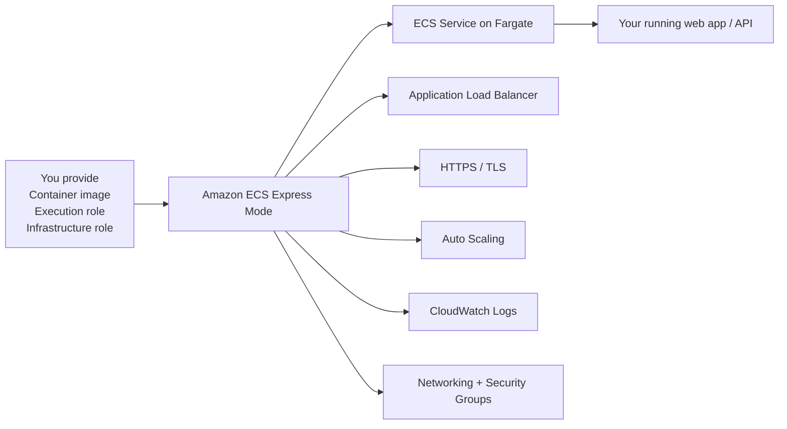

**What this means in practice:**
- You still end up with standard AWS resources.
- You can inspect and customize them later.
- You avoid the initial ECS setup tax.

---

## 3) Where it fits in AWS

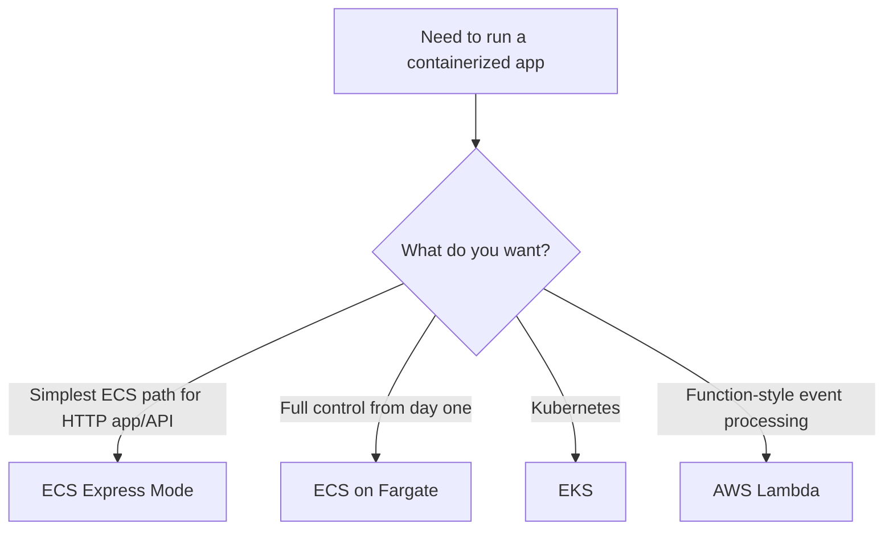

### Best fit
Use Express Mode when:
- Your workload is a **web app or HTTP API**.
- You want **production-shaped defaults** quickly.
- You want the option to **grow into normal ECS later**.

### Weaker fit
It is less ideal when:
- The workload is not mainly HTTP traffic.
- You already know you need advanced ECS customization from day one.
- You want a source-code build service like old App Runner workflows. Express Mode is **image-first**.

---

## 4) Why AWS is pushing it now

AWS has announced that **AWS App Runner is closed to new customers starting April 30, 2026**, and AWS recommends **Amazon ECS Express Mode** for migrations and similar use cases. That makes Express Mode the current AWS answer for people who want a simpler container deployment experience without leaving the ECS ecosystem.

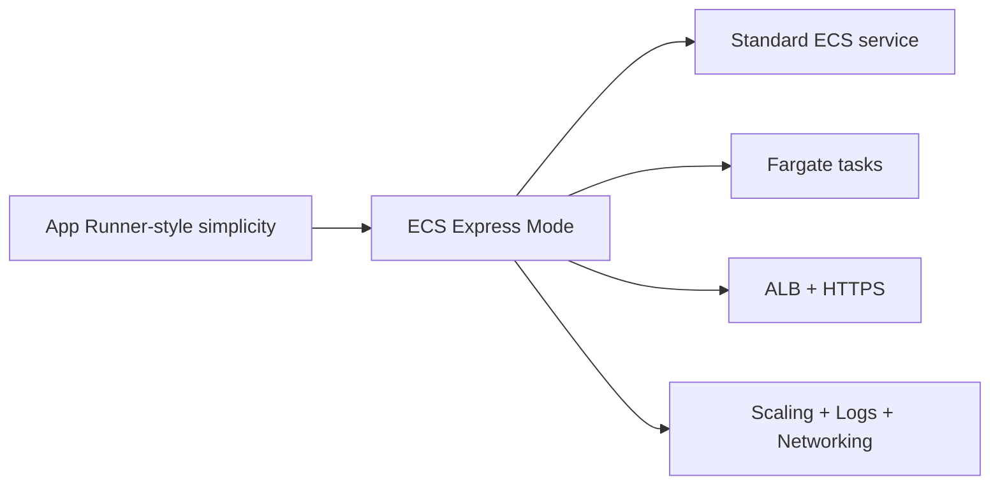

---

## 5) What Express Mode creates for you

When you create an Express Mode service, AWS creates a bundle of standard resources in your account.

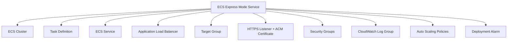

This is the most important conceptual difference from App Runner:

- **App Runner** felt like a higher-level managed product boundary.
- **Express Mode** creates **normal ECS/Fargate resources in your account**.

That means there is no separate "graduation path" later. You are already on ECS.

---

## 6) Core inputs you must provide

### Required
1. **Container image**
2. **Task execution role**
3. **Infrastructure role**

### Often also needed
4. **Task role** if your app needs AWS API access, such as S3, DynamoDB, or Secrets Manager.
5. **Environment variables / secrets**
6. **Container port** and optionally a health-check path

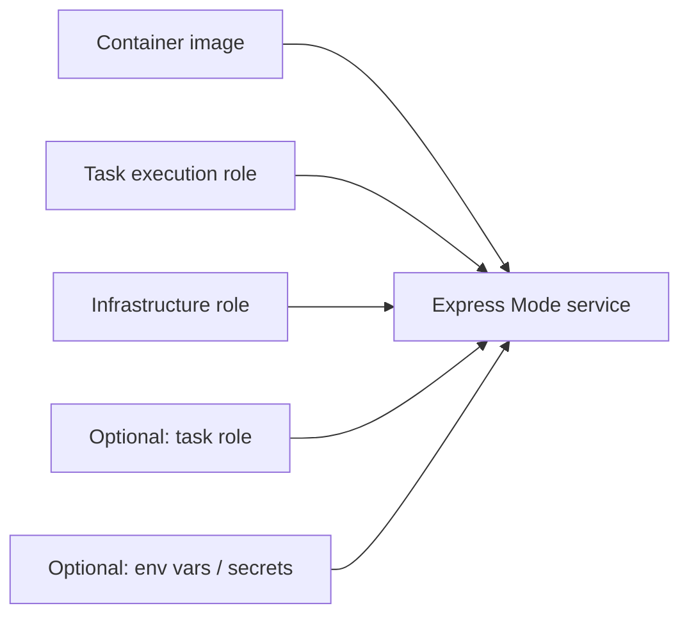

### Practical example
You already have a Docker image in ECR:

```text
123456789012.dkr.ecr.us-east-1.amazonaws.com/my-api:2026-04-06
```

Your app listens on port `8080` and needs to read a secret and write to S3.

That usually means:
- execution role: pull image + write logs
- infrastructure role: let Express Mode create ALB, ECS service, scaling, and related resources
- task role: let your application call S3 and Secrets Manager

---

## 7) Basic request flow

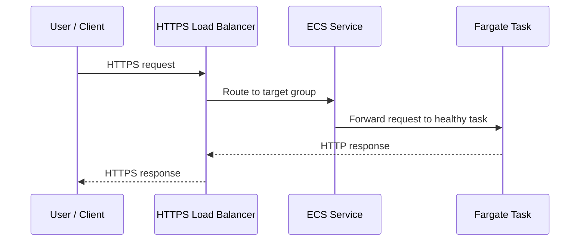

### What to remember
- The **ALB is the front door**.
- Your container does **not** terminate public TLS directly; the load balancer handles that path.
- Health checks determine which tasks are considered ready for traffic.

---

## 8) Public vs private service patterns

### Public service
Use this when the app should be reachable from the public internet.

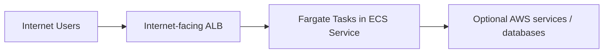

Typical examples:
- public API
- SaaS frontend
- partner-facing webhook receiver

### Private service
Use this when the app should only be reachable inside your VPC or internal network path.

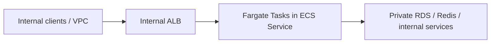

Typical examples:
- internal admin dashboard
- back-office API
- service reachable only through VPN, Direct Connect, or internal network routing

---

## 9) Deployment lifecycle

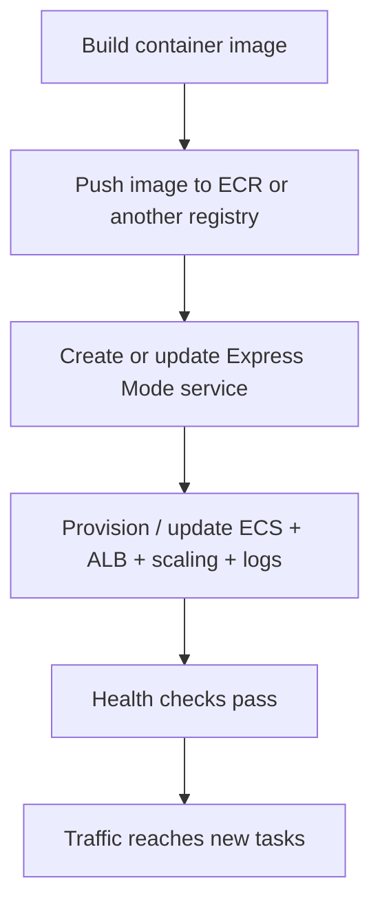

### Practical example: normal developer workflow
1. Change application code.
2. Rebuild image.
3. Push image to ECR.
4. Update Express Mode service to the new image tag.
5. Watch logs, health checks, and traffic.

This is different from App Runner's source-code mode. Express Mode expects you to already have a built image.

---

## 10) First practical example: deploy a simple API

### Example application
Imagine a small Node.js API with one endpoint:

```javascript
import express from 'express';

const app = express();
const port = process.env.PORT || 8080;

app.get('/health', (_req, res) => {
  res.status(200).send('ok');
});

app.get('/hello', (_req, res) => {
  res.json({ message: 'Hello from ECS Express Mode' });
});

app.listen(port, () => {
  console.log(`Listening on ${port}`);
});
```

### Dockerfile

```dockerfile
FROM node:22-alpine
WORKDIR /app
COPY package*.json ./
RUN npm ci --omit=dev
COPY . .
EXPOSE 8080
CMD ["node", "server.js"]
```

### Build and push image

```bash
aws ecr get-login-password --region us-east-1 \
  | docker login --username AWS --password-stdin 123456789012.dkr.ecr.us-east-1.amazonaws.com

docker build -t my-api:2026-04-06 .
docker tag my-api:2026-04-06 123456789012.dkr.ecr.us-east-1.amazonaws.com/my-api:2026-04-06

docker push 123456789012.dkr.ecr.us-east-1.amazonaws.com/my-api:2026-04-06
```

### Create the Express Mode service

```bash
aws ecs create-express-gateway-service \
  --service-name my-api \
  --execution-role-arn arn:aws:iam::123456789012:role/ecsTaskExecutionRole \
  --infrastructure-role-arn arn:aws:iam::123456789012:role/ecsInfrastructureRoleForExpressServices \
  --primary-container '{
    "image": "123456789012.dkr.ecr.us-east-1.amazonaws.com/my-api:2026-04-06",
    "containerPort": 8080,
    "environment": [
      {"name": "NODE_ENV", "value": "production"}
    ]
  }' \
  --health-check-path /health \
  --cpu 1024 \
  --memory 2048 \
  --scaling-target '{
    "minTaskCount": 1,
    "maxTaskCount": 4,
    "autoScalingMetric": "AVERAGE_CPU",
    "autoScalingTargetValue": 60
  }'
```

### What happens after this command

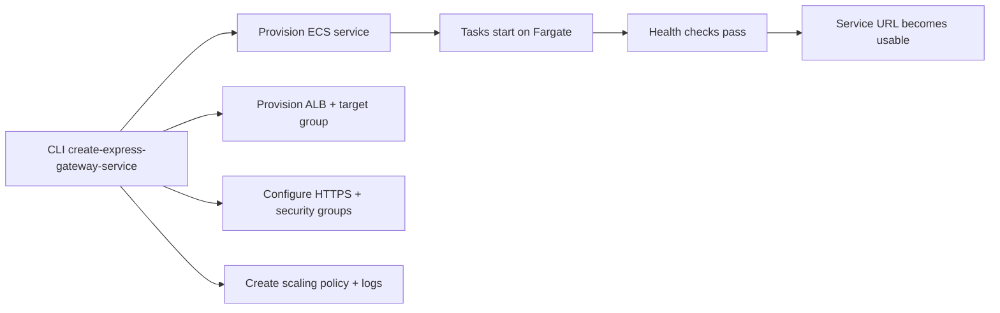

---

## 11) Second practical example: internal service with private dependencies

Suppose you are deploying an internal billing API that must:
- stay private
- reach a private RDS database
- be accessible only from inside the VPC

### Architecture

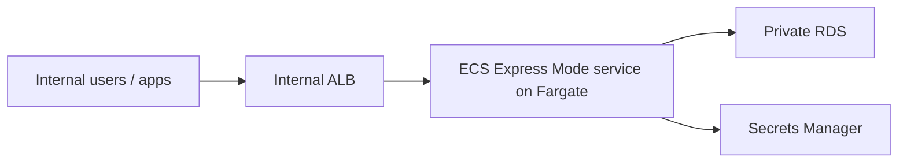

### What you would configure
- choose **private subnets**
- make the ALB **internal**
- attach a **task role** for Secrets Manager access
- pass DB connection info through **environment variables / secrets**
- ensure security groups allow app-to-database traffic

### Why this matters
This is a good example of Express Mode being simple **without** being limited to internet-facing apps.

---

## 12) Third practical example: custom domain

Suppose your service should be available at:

```text
api.example.com
```

AWS's customization guidance shows the rough flow:

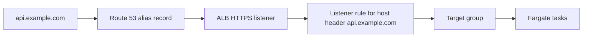

### What you do conceptually
1. Create or use an ACM certificate for `api.example.com`.
2. Attach that certificate to the ALB HTTPS listener.
3. Add a host-based listener rule for `api.example.com`.
4. Point DNS to the ALB.

### Why it matters
This shows the key Express Mode tradeoff:
- simpler initial deployment,
- but custom domain behavior is still grounded in standard ALB + ACM + DNS building blocks.

---

## 13) Scaling model

Express Mode uses ECS/Fargate tasks behind an ALB and can scale based on metrics such as CPU, memory, or request count per target.

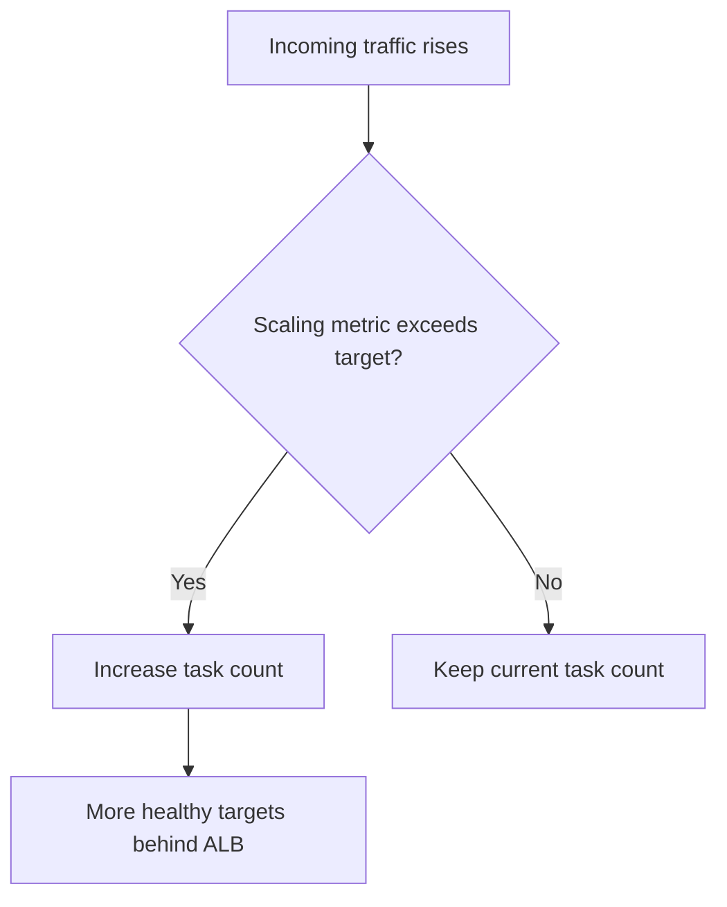

### Documented defaults
- **min tasks:** 1
- **max tasks:** 20
- **metric:** CPU utilization
- **target value:** 60

### Practical example
Your API receives bursty daytime traffic.

You might set:
- min tasks: `2`
- max tasks: `10`
- metric: `REQUEST_COUNT_PER_TARGET`
- target: based on acceptable latency and task capacity

Use CPU-based scaling when CPU is the main bottleneck. Use request-count-based scaling when each request has similar cost and you want scaling behavior tied more directly to HTTP traffic.

---

## 14) Update and rollout behavior

AWS documents canary-style deployments for Express Mode updates.

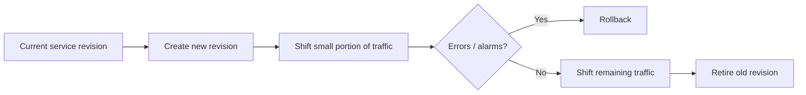

### Practical example
You deploy image tag `my-api:2026-04-10`.

If the new version starts failing health checks or triggering rollback alarms, ECS can stop promotion and keep the older revision serving traffic. That gives you a safer update path than a single all-at-once switch.

### Operational takeaway
Treat every update like a small release event:
- watch health checks
- watch 4xx/5xx metrics
- watch logs during rollout

---

## 15) Logging, debugging, and troubleshooting

### Debugging flow

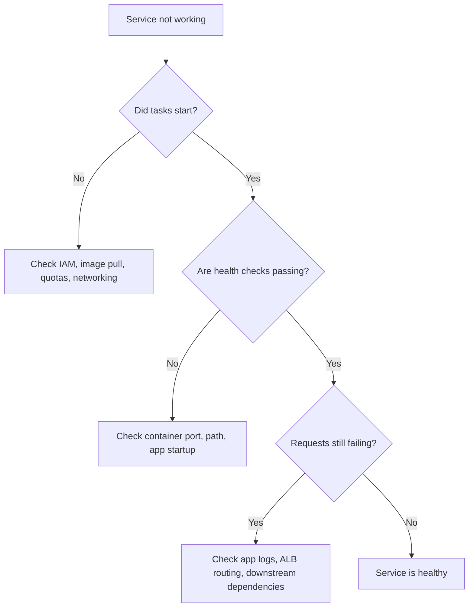

### Common problems
1. **Image pull failure**
   - wrong image URI
   - missing registry access
   - bad execution-role permissions

2. **Health check failure**
   - wrong container port
   - wrong health-check path
   - app is listening only on localhost instead of the container interface
   - startup time is too slow

3. **Dependency connectivity problems**
   - security groups block DB access
   - missing private networking or endpoints
   - secrets or env vars missing

4. **Quota / capacity issues**
   - account limits reached
   - Fargate capacity unavailable in selected setup

### A useful troubleshooting checklist
- Is the image accessible?
- Is the container listening on the configured port?
- Does `/health` actually return `200`?
- Did the ALB target group mark tasks healthy?
- Are CloudWatch logs showing startup errors?
- Can the task reach the database / secret / external endpoint it needs?

---

## 16) How it differs from App Runner

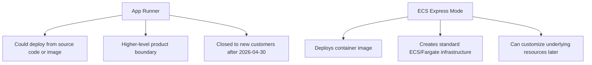

### Simple comparison
| Topic | App Runner | ECS Express Mode |
|---|---|---|
| Input | Source code or image | Image |
| Under the hood | Managed service abstraction | ECS service on Fargate + ALB + scaling |
| Long-term AWS direction | Closed to new customers after 2026-04-30 | Recommended by AWS for similar use cases |
| Customization later | More bounded | Broader ECS customization available |

---

## 17) How it differs from plain ECS on Fargate

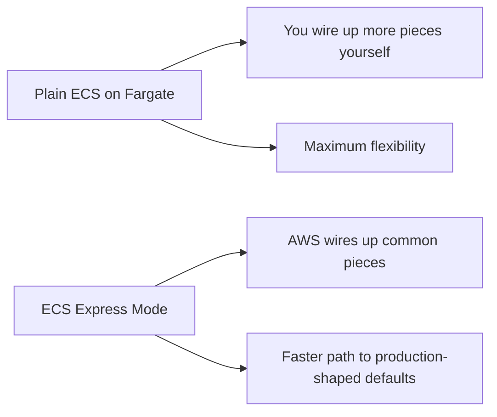

### Rule of thumb
- Pick **Express Mode** when you want a **fast, safe default** for a web app/API.
- Pick **plain ECS/Fargate** when you already know you need deep custom configuration immediately.

---

## 18) Cost model

Express Mode itself has **no extra service charge**. You pay for the underlying resources it creates, such as:
- Fargate compute
- Application Load Balancer
- CloudWatch logs and metrics
- data transfer

### Practical implication
This is not a separate pricing model like a standalone serverless product. Think of the bill as:

```text
ECS/Fargate + ALB + observability + network-related charges
```

### Example cost intuition
A tiny internal API may cost more than expected if the ALB is always running, even when traffic is low. That is one reason Express Mode is simplest operationally, but not always the absolute cheapest for every tiny workload shape.

---

## 19) Safe production practices

### Image tagging
Avoid floating tags like `latest` in production.

Better:
```text
my-api:2026-04-06
my-api:git-sha-abc1234
```

### Health checks
Keep a lightweight endpoint such as:
```text
/health
```
that returns `200` when the app is ready to serve traffic.

### Statelesness
Design the service so tasks can be replaced safely.
Store durable state in managed services such as databases, caches, or object storage.

### IAM separation
- execution role: pull image, write logs
- task role: application permissions
- infrastructure role: Express Mode provisioning permissions

### Observability
At minimum, monitor:
- task count
- health-check status
- 4xx/5xx error rate
- latency
- application logs

---

## 20) A practical CI/CD example

If your team uses GitHub Actions, the high-level flow usually looks like this:

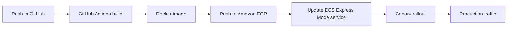

### Why this matters
This is the closest replacement for App Runner's old "push code, get deployment" feeling.

The difference is that now your pipeline builds the image explicitly and then Express Mode deploys that image.

---

## 21) Minimal learning path for a new user

If you want to learn Express Mode without getting lost, use this order:

1. Build a tiny HTTP app that exposes `/health`.
2. Push the image to ECR.
3. Create an Express Mode service with the default VPC.
4. Confirm the generated service URL works.
5. Inspect the created ECS service, ALB, target group, and log group.
6. Update the image tag and watch a rollout.
7. Add a custom domain.
8. Try a private/internal service later.

This path teaches both the simplified front door **and** the ECS resources that Express Mode actually creates.

---

## 22) Bottom line

Amazon ECS Express Mode is AWS's simplest current path to run a **containerized web app or API** on **ECS + Fargate** with **HTTPS, load balancing, autoscaling, and logging** already wired together.

Its biggest strengths are:
- fast setup
- production-shaped defaults
- standard ECS infrastructure underneath
- a smooth path into deeper ECS customization later

Its biggest constraint is also its design center:
- it is optimized primarily for **image-based HTTP services**, not every possible container workload.

If you liked the idea of App Runner but want something aligned with AWS's current direction, Express Mode is the service to learn.

---

## 23) Official AWS references

- Amazon ECS Express Mode overview
- Resources created by Amazon ECS Express Mode services
- Creating an Amazon ECS Express Mode service
- Updating an Amazon ECS Express Mode service
- Troubleshooting Amazon ECS Express Mode services
- create-express-gateway-service (AWS CLI)
- AWS App Runner availability change

