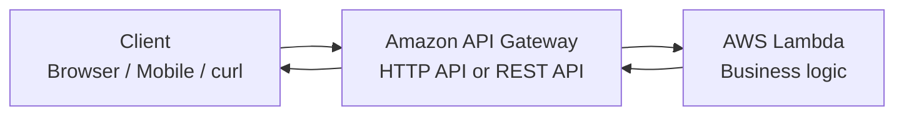
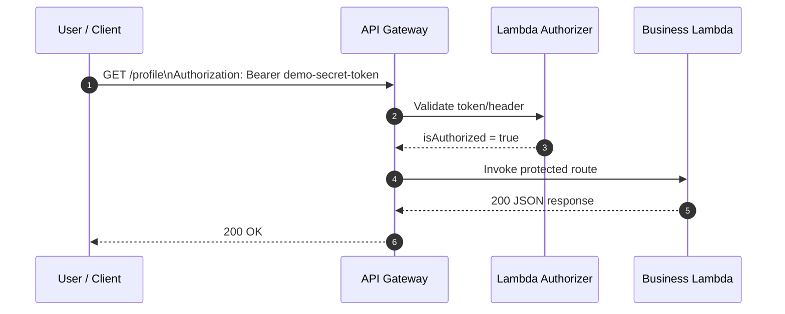
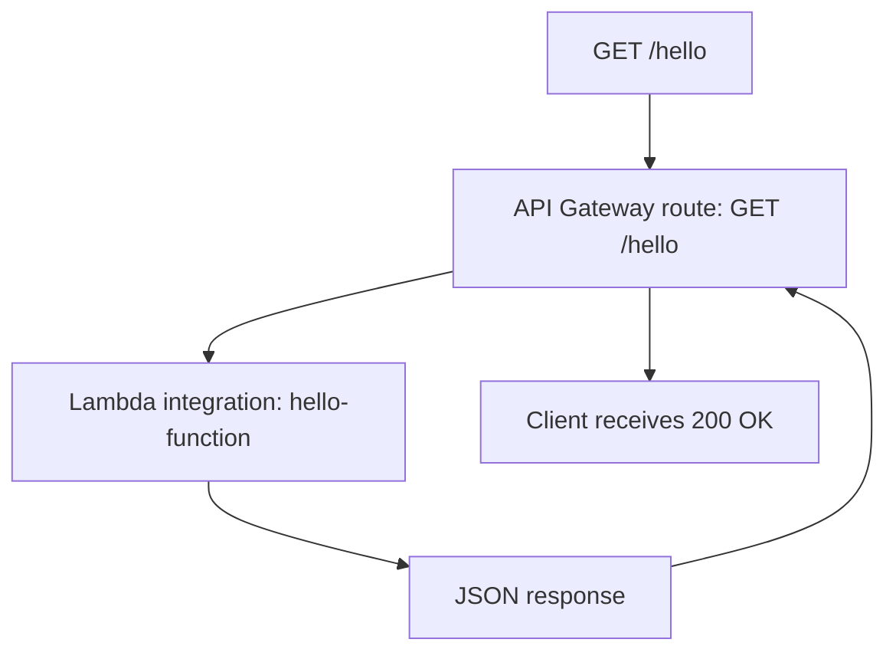
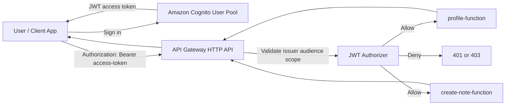
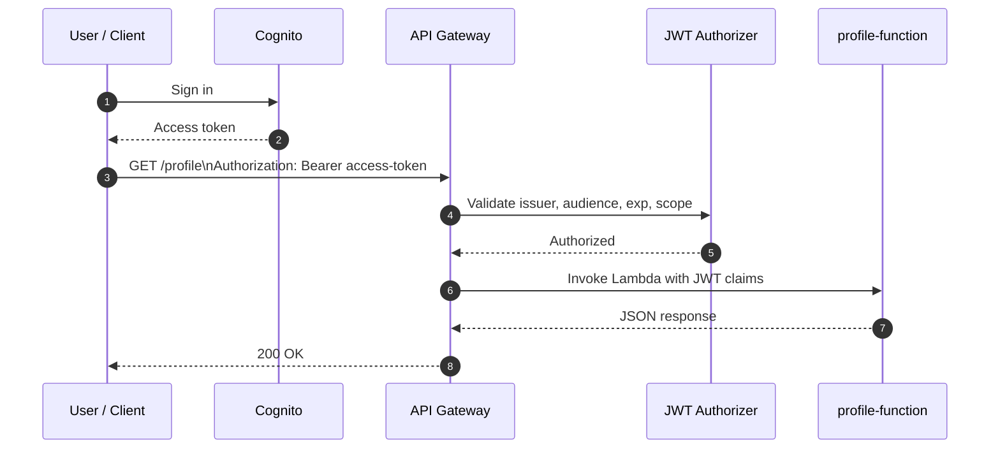
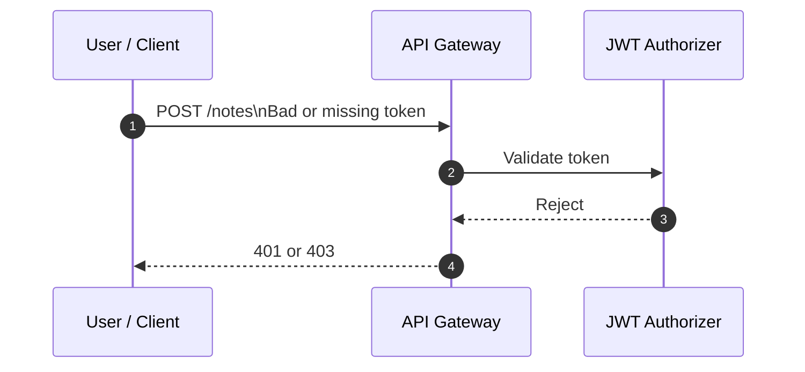

# AWS Lambda + API Gateway Guide

> A practical Markdown guide for building an API with AWS Lambda, exposing it through API Gateway, and protecting it with authentication.

---

## 1) The big picture

If you want to use **AWS Lambda as an API**, the most common design is:

- **API Gateway** = the HTTP front door
- **Lambda** = the backend code that runs for each request

In other words, Lambda is usually **not** the public API endpoint by itself. Instead, **API Gateway receives the HTTP request, then invokes your Lambda function, and returns the Lambda response to the client**.

> In Amazon API Gateway, **HTTP API** and **REST API** are two different API Gateway product types. This guide uses **HTTP API** because it is usually the best fit for a simple Lambda-backed API.

### Basic request flow



### Authenticated request flow



---

## 2) How to use AWS Lambda as an API

### What Lambda does well

Lambda is great when you want:

- serverless execution
- automatic scaling
- pay-for-use pricing
- small API handlers that respond to HTTP requests

### The usual pattern

1. Write a Lambda function.
2. Create an API in API Gateway.
3. Connect a route such as `GET /hello` to the Lambda function.
4. Call the API Gateway invoke URL.

### What the Lambda function receives

For **HTTP API Lambda proxy integrations**, API Gateway sends an `event` object to Lambda. With **payload format 2.0**, the event includes fields such as:

- `rawPath`
- `headers`
- `queryStringParameters`
- `requestContext.http.method`

A custom response can return fields such as:

- `statusCode`
- `headers`
- `body`

That is why most Lambda API handlers look like normal request/response code.

---

## 3) How to use API Gateway

API Gateway is the service that lets you:

- create public API endpoints
- define routes like `GET /hello` or `POST /orders`
- connect those routes to Lambda
- add auth, throttling, logging, CORS, and custom domains

### Core concepts

#### Route
A route is the combination of:

- HTTP method
- path

Examples:

- `GET /hello`
- `POST /login`
- `GET /profile`

#### Integration
An integration is **where the route sends the request**.

For this guide, the integration target is **Lambda**.

#### Stage
A stage is a deployed version of your API, such as:

- `$default`
- `dev`
- `prod`

#### Authorizer
An authorizer decides whether a request can access a route.

For HTTP APIs, common choices are:

- **JWT authorizer** for real OAuth 2.0 / OIDC tokens
- **Lambda authorizer** for custom logic
- **IAM authorization** for AWS-signed requests

### HTTP API vs REST API

If these names feel confusing, that is normal.

In general web architecture, a **REST API** usually runs over **HTTP**.

But in **Amazon API Gateway**, **HTTP API** and **REST API** are the names of **two different API Gateway products**.

So the question is not:

- "Should I use HTTP or REST?"

The real question is:

- "Which API Gateway product should I create?"

Both products can:

- expose normal HTTP endpoints
- route requests to Lambda
- return JSON responses

The practical difference is this:

- **HTTP API** = newer, simpler, and lower-cost for common serverless APIs
- **REST API** = older, more feature-rich, and better when you need advanced API management features

### A quick way to choose

Use **HTTP API** when you want:

- a simple Lambda-backed API
- JWT / OIDC authorization
- Lambda authorizers
- built-in CORS support
- automatic deployments
- the lower-cost option for a typical backend API

Use **REST API** when you specifically need:

- API keys and usage plans
- per-client throttling
- request validation
- AWS WAF integration
- private API endpoints
- other REST API-only features

One important takeaway: **REST API is not "more correct" or "more RESTful" in AWS naming**. It is simply the API Gateway option with more features.

For most simple Lambda-backed APIs, including the examples in this guide, **HTTP API** is the best place to start.

---

## 4) Practical example #1: a simple public API

Goal: create a public endpoint:

- `GET /hello`

Expected response:

```json
{
  "message": "Hello from Lambda",
  "path": "/hello",
  "method": "GET"
}
```

### Lambda code

```js
export const handler = async (event) => {
  return {
    statusCode: 200,
    headers: {
      "content-type": "application/json"
    },
    body: JSON.stringify({
      message: "Hello from Lambda",
      path: event.rawPath,
      method: event.requestContext?.http?.method
    })
  };
};
```

### How to create it in the AWS Console

1. Open **AWS Lambda**.
2. Create a function named `hello-function`.
3. Paste the code above and deploy it.
4. Open **Amazon API Gateway**.
5. Create an **HTTP API**.
6. Add a **Lambda integration** that points to `hello-function`.
7. Create a route: `GET /hello`.
8. Deploy the API.
9. Copy the **invoke URL**.

Your URL will look like this:

```text
https://abc123.execute-api.us-east-1.amazonaws.com/hello
```

### Test it with curl

```bash
curl https://abc123.execute-api.us-east-1.amazonaws.com/hello
```

### Expected result

```json
{
  "message": "Hello from Lambda",
  "path": "/hello",
  "method": "GET"
}
```

### What happens internally



---

## 5) Practical example #2: a real authenticated API

Now let’s build a **production-style authenticated API**.

Goal:

- public route: `GET /hello`
- protected route: `GET /profile`
- protected route: `POST /notes`
- users sign in with **Amazon Cognito**
- API Gateway validates a **JWT access token**
- routes require scopes such as `notes-api/read` and `notes-api/write`

This is the pattern most teams should start with for a user-facing Lambda API:

- **Amazon Cognito** issues signed JWTs
- **API Gateway HTTP API JWT authorizer** validates the token before Lambda runs
- **Lambda** receives trusted claims from `event.requestContext.authorizer.jwt.claims`

### Architecture



### What makes this example real

- the token is a signed JWT from a real identity provider
- API Gateway validates issuer, audience, expiry, and scopes
- Lambda does not need to parse or verify the token itself
- route scopes let you separate read and write access

### Route design for this guide

| Route | Public or protected | Required scope | Backend |
| --- | --- | --- | --- |
| `GET /hello` | public | none | `hello-function` |
| `GET /profile` | protected | `notes-api/read` | `profile-function` |
| `POST /notes` | protected | `notes-api/write` | `create-note-function` |

### Step 1: Create a Cognito user pool

Create a **User Pool** in Amazon Cognito.

Recommended settings:

- sign-in identifiers: email
- application type: a regular web app or server-backed client
- create a domain for the user pool
- enable OAuth 2.0 authorization code grant
- configure callback URL such as `http://localhost:3000/callback`
- configure logout URL such as `http://localhost:3000/logout`

> If your client is a browser-only SPA or a mobile app, use **authorization code grant with PKCE**. This guide uses a confidential web-style app client so the token exchange is easier to demonstrate with `curl`.

### Step 2: Create a resource server and custom scopes

Inside the same user pool, create a **resource server**.

Use:

- resource server identifier: `notes-api`
- scope: `read`
- scope: `write`

Cognito will render those scopes inside the access token as:

- `notes-api/read`
- `notes-api/write`

### Step 3: Create an app client that can request those scopes

Create an **app client** for the user pool.

Make sure it is allowed to request:

- `openid`
- `profile`
- `email`
- `notes-api/read`
- `notes-api/write`

Also note these values because API Gateway will need them:

- **User pool ID**
- **App client ID**
- **Cognito domain**
- your AWS **region**

Your JWT issuer URL will look like this:

```text
https://cognito-idp.us-east-1.amazonaws.com/us-east-1_ABC123xyz
```

Your Cognito authorization server domain will look like this:

```text
https://my-notes-demo.auth.us-east-1.amazoncognito.com
```

### Step 4: Create the protected business Lambdas

#### `profile-function`

This function reads the validated JWT claims that API Gateway passes into the event.

```js
export const handler = async (event) => {
  const claims = event.requestContext?.authorizer?.jwt?.claims ?? {};
  const scopes = (claims.scope ?? "").split(" ").filter(Boolean);

  return {
    statusCode: 200,
    headers: {
      "content-type": "application/json"
    },
    body: JSON.stringify({
      message: "Authenticated profile response",
      user: {
        sub: claims.sub,
        username: claims.username || claims["cognito:username"] || null,
        clientId: claims.client_id || null
      },
      auth: {
        tokenUse: claims.token_use || null,
        scopes
      }
    })
  };
};
```

Because this route is authorized with an **access token**, the example reads claims that access tokens commonly contain, such as `sub`, `username`, `client_id`, and `scope`. If you also need user profile fields such as `email`, fetch them from your own user store, the Cognito `userInfo` endpoint, or another identity/profile service instead of assuming they are present in the access token.

#### `create-note-function`

This function assumes API Gateway already enforced `notes-api/write`.

```js
export const handler = async (event) => {
  const claims = event.requestContext?.authorizer?.jwt?.claims ?? {};
  const scopes = (claims.scope ?? "").split(" ").filter(Boolean);
  const body = event.body ? JSON.parse(event.body) : {};

  return {
    statusCode: 201,
    headers: {
      "content-type": "application/json"
    },
    body: JSON.stringify({
      message: "Note created",
      note: {
        id: `note-${Date.now()}`,
        title: body.title ?? "Untitled",
        content: body.content ?? "",
        ownerSub: claims.sub
      },
      auth: {
        username: claims.username || claims["cognito:username"] || null,
        scopes
      }
    })
  };
};
```

### Step 5: Create the HTTP API and routes

Create an **HTTP API** in API Gateway.

Add these routes:

- `GET /hello` -> `hello-function`
- `GET /profile` -> `profile-function`
- `POST /notes` -> `create-note-function`

At this point, leave `GET /hello` public.

### Step 6: Create the JWT authorizer

In API Gateway, create an authorizer with:

- authorizer type: `JWT`
- identity source: `$request.header.Authorization`
- issuer: `https://cognito-idp.<region>.amazonaws.com/<user-pool-id>`
- audience: your **Cognito app client ID**

Why these matter:

- **issuer** says who is allowed to mint the token
- **audience** says which client the token was issued for

### Step 7: Attach the authorizer and scopes to routes

Attach the JWT authorizer to:

- `GET /profile`
- `POST /notes`

Then configure route scopes:

- `GET /profile` -> `notes-api/read`
- `POST /notes` -> `notes-api/write`

This is important because when you configure route scopes, API Gateway matches the route scopes against the token scopes and expects an **access token** rather than an ID token.

### Step 8: Make sure API Gateway can invoke the Lambda integrations

For the backend Lambdas, API Gateway must still be allowed to invoke the integration functions.

If you create routes from the console, AWS often creates the invoke permission for you. If you create resources with CLI, SDK, SAM, CDK, or Terraform, make sure Lambda permissions are added explicitly.

### Step 9: Create a test user

Create a user in the Cognito user pool, or enable self-sign-up and register one.

For a quick manual test, a user like this is enough:

- username or email: `demo@example.com`
- a confirmed password

### Step 10: Sign in and get an authorization code

Open this kind of URL in a browser:

```text
https://my-notes-demo.auth.us-east-1.amazoncognito.com/oauth2/authorize?response_type=code&client_id=<app-client-id>&redirect_uri=http://localhost:3000/callback&scope=openid+profile+email+notes-api/read+notes-api/write
```

After the user signs in, Cognito redirects to:

```text
http://localhost:3000/callback?code=<authorization-code>
```

Copy the `code` value from that redirect URL.

### Step 11: Exchange the authorization code for tokens

Use the Cognito token endpoint:

```bash
curl --request POST \
  --url 'https://my-notes-demo.auth.us-east-1.amazoncognito.com/oauth2/token' \
  --header 'content-type: application/x-www-form-urlencoded' \
  --user '<app-client-id>:<app-client-secret>' \
  --data 'grant_type=authorization_code' \
  --data 'client_id=<app-client-id>' \
  --data 'code=<authorization-code>' \
  --data 'redirect_uri=http://localhost:3000/callback'
```

Expected response shape:

```json
{
  "access_token": "eyJra...<snip>",
  "id_token": "eyJra...<snip>",
  "refresh_token": "eyJjd...<snip>",
  "token_type": "Bearer",
  "expires_in": 3600
}
```

Use the **access token** when calling API Gateway.

If you use a **public client with PKCE**, do not send a client secret. Instead, send the `code_verifier` that matches the original `code_challenge`.

### Step 12: Call the protected routes

```bash
ACCESS_TOKEN='<paste-access-token-here>'
```

Call `GET /profile`:

```bash
curl \
  -H "Authorization: Bearer $ACCESS_TOKEN" \
  https://abc123.execute-api.us-east-1.amazonaws.com/profile
```

Example response:

```json
{
  "message": "Authenticated profile response",
  "user": {
    "sub": "aaaaaaaa-bbbb-cccc-dddd-eeeeeeeeeeee",
    "username": "demo@example.com",
    "clientId": "4exampleclientid123456789"
  },
  "auth": {
    "tokenUse": "access",
    "scopes": ["notes-api/read", "notes-api/write"]
  }
}
```

Call `POST /notes`:

```bash
curl \
  -X POST \
  -H "Authorization: Bearer $ACCESS_TOKEN" \
  -H "content-type: application/json" \
  -d '{"title":"First note","content":"created from API Gateway + Lambda"}' \
  https://abc123.execute-api.us-east-1.amazonaws.com/notes
```

Example response:

```json
{
  "message": "Note created",
  "note": {
    "id": "note-1712400000000",
    "title": "First note",
    "content": "created from API Gateway + Lambda",
    "ownerSub": "aaaaaaaa-bbbb-cccc-dddd-eeeeeeeeeeee"
  },
  "auth": {
    "username": "demo@example.com",
    "scopes": ["notes-api/read", "notes-api/write"]
  }
}
```

### Step 13: Test failure cases on purpose

Try these checks:

- no `Authorization` header
- an expired token
- an ID token instead of an access token
- an access token missing `notes-api/write`, then call `POST /notes`

API Gateway should reject the request before the Lambda integration runs.

---

## 6) How the authentication flow works

### Successful request



### Rejected request



### Why this is better than a custom token check inside Lambda

- invalid requests do not reach your business Lambda
- issuer and audience validation happen centrally in API Gateway
- scopes give you per-route authorization without custom code
- your Lambda code stays focused on business logic

---

## 7) Selected AWS CLI examples

These are not the full deployment, but they show the core resources behind the console steps above.

### Create a resource server with `read` and `write` scopes

```bash
aws cognito-idp create-resource-server \
  --user-pool-id us-east-1_ABC123xyz \
  --identifier notes-api \
  --name notes-api \
  --scopes ScopeName=read,ScopeDescription='Read notes' ScopeName=write,ScopeDescription='Write notes'
```

### Create a JWT authorizer for the HTTP API

```bash
aws apigatewayv2 create-authorizer \
  --api-id <api-id> \
  --name cognito-jwt \
  --authorizer-type JWT \
  --identity-source '$request.header.Authorization' \
  --jwt-configuration Audience=<app-client-id>,Issuer=https://cognito-idp.us-east-1.amazonaws.com/us-east-1_ABC123xyz
```

### Attach the JWT authorizer to `GET /profile`

```bash
aws apigatewayv2 update-route \
  --api-id <api-id> \
  --route-id <route-id> \
  --authorization-type JWT \
  --authorizer-id <authorizer-id> \
  --authorization-scopes notes-api/read
```

### Attach the JWT authorizer to `POST /notes`

```bash
aws apigatewayv2 update-route \
  --api-id <api-id> \
  --route-id <route-id> \
  --authorization-type JWT \
  --authorizer-id <authorizer-id> \
  --authorization-scopes notes-api/write
```

---

## 8) Production advice

For a real authenticated Lambda API, the default recommendation is:

- **HTTP API**
- **Lambda proxy integration**
- **Amazon Cognito** or another OIDC provider
- **JWT authorizer**
- **route scopes on protected routes**

### Option A: JWT authorizer

Use this when your users sign in through:

- Amazon Cognito
- Auth0
- Okta
- another OIDC / OAuth 2.0 provider

This is usually the cleanest choice for user-facing APIs.

### Option B: Lambda authorizer

Use this when you need custom authorization logic that JWT claims alone cannot express, such as:

- calling another service before allowing access
- checking tenant-specific rules in a database
- supporting a custom non-OIDC token format
- combining headers, path values, and business rules

### Option C: IAM authorization

Use this when the client is another AWS principal and can sign requests with **SigV4**.

---

## 9) Common mistakes

### Mistake 1: Treating Lambda as the public HTTP endpoint

Usually, **API Gateway is the HTTP endpoint** and Lambda is the backend compute.

### Mistake 2: Assuming REST API is the default choice

In API Gateway, **REST API** is not automatically the better option just because it says "REST". If you just need a simple Lambda-backed API, **HTTP API** is usually easier and cheaper.

### Mistake 3: Sending the wrong token type

If you configure route scopes, clients should send an **access token**. Do not assume an ID token is the right token for API authorization.

### Mistake 4: Forgetting Lambda invoke permissions

API Gateway must be allowed to invoke the Lambda integration. If you use a Lambda authorizer instead of JWT, API Gateway must also be allowed to invoke that authorizer Lambda.

### Mistake 5: Mixing payload formats

If you use CLI, SDK, or IaC for HTTP API Lambda integrations or Lambda authorizers, be explicit about version `1.0` vs `2.0`.

### Mistake 6: Putting all authorization logic inside the business Lambda

Let API Gateway reject invalid tokens and missing scopes before the business handler runs.

---

## 10) A good starter design

If you want a practical starting point, use this stack:

- **API Gateway HTTP API**
- **Lambda proxy integration**
- **Amazon Cognito user pool**
- **JWT authorizer**
- **resource server scopes** such as `notes-api/read` and `notes-api/write`

That gives you:

- a public route when needed
- protected routes with real JWT validation
- clear read/write authorization boundaries
- Lambda handlers that can trust `requestContext.authorizer.jwt.claims`

---

## 11) Summary

### If your question is: “How do I use AWS Lambda as an API?”

Use **API Gateway + Lambda**.

### If your question is: “How do I use API Gateway?”

Create:

1. a route
2. a Lambda integration
3. a stage/deployment
4. an authorizer if the route must be protected

### If your question is: “What is the difference between HTTP API and REST API?”

They are **two API Gateway product types**. For this guide, choose **HTTP API** because it is simpler and lower-cost. Choose **REST API** only when you need advanced features such as API keys, usage plans, request validation, WAF, or private endpoints.

### If your question is: “How do I make an authenticated Lambda API?”

Use this pattern:

- Cognito user pool
- app client with OAuth scopes
- resource server scopes such as `notes-api/read`
- API Gateway HTTP API with a JWT authorizer
- Lambda routes protected by scope-based authorization

---

## 12) References

Official AWS documentation used for this guide:

- API Gateway getting started: https://docs.aws.amazon.com/apigateway/latest/developerguide/getting-started.html
- Develop HTTP APIs in API Gateway: https://docs.aws.amazon.com/apigateway/latest/developerguide/http-api-develop.html
- HTTP APIs overview: https://docs.aws.amazon.com/apigateway/latest/developerguide/http-api.html
- Choose between REST APIs and HTTP APIs: https://docs.aws.amazon.com/apigateway/latest/developerguide/http-api-vs-rest.html
- Lambda proxy integrations for HTTP APIs: https://docs.aws.amazon.com/apigateway/latest/developerguide/http-api-develop-integrations-lambda.html
- Lambda with API Gateway: https://docs.aws.amazon.com/lambda/latest/dg/services-apigateway.html
- HTTP API access control: https://docs.aws.amazon.com/apigateway/latest/developerguide/http-api-access-control.html
- HTTP API IAM authorization: https://docs.aws.amazon.com/apigateway/latest/developerguide/http-api-access-control-iam.html
- HTTP API JWT authorizers: https://docs.aws.amazon.com/apigateway/latest/developerguide/http-api-jwt-authorizer.html
- Troubleshooting HTTP API Lambda integrations: https://docs.aws.amazon.com/apigateway/latest/developerguide/http-api-troubleshooting-lambda.html
- HTTP API Lambda authorizers: https://docs.aws.amazon.com/apigateway/latest/developerguide/http-api-lambda-authorizer.html
- Scopes, M2M, and resource servers in Cognito: https://docs.aws.amazon.com/cognito/latest/developerguide/cognito-user-pools-define-resource-servers.html
- Cognito authorization endpoint: https://docs.aws.amazon.com/cognito/latest/developerguide/authorization-endpoint.html
- Cognito token endpoint: https://docs.aws.amazon.com/cognito/latest/developerguide/token-endpoint.html
- Using PKCE in authorization code grants: https://docs.aws.amazon.com/cognito/latest/developerguide/using-pkce-in-authorization-code.html
- Understanding the Cognito access token: https://docs.aws.amazon.com/cognito/latest/developerguide/amazon-cognito-user-pools-using-the-access-token.html
- Cognito userInfo endpoint: https://docs.aws.amazon.com/cognito/latest/developerguide/userinfo-endpoint.html
