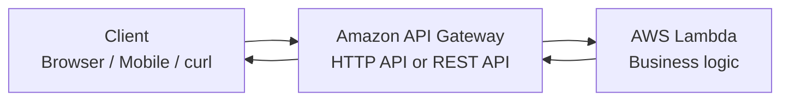
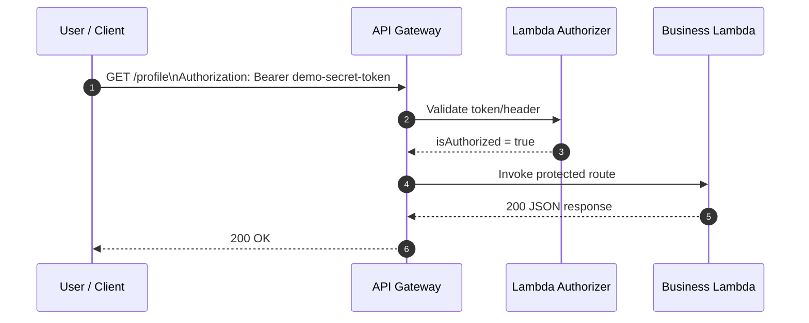
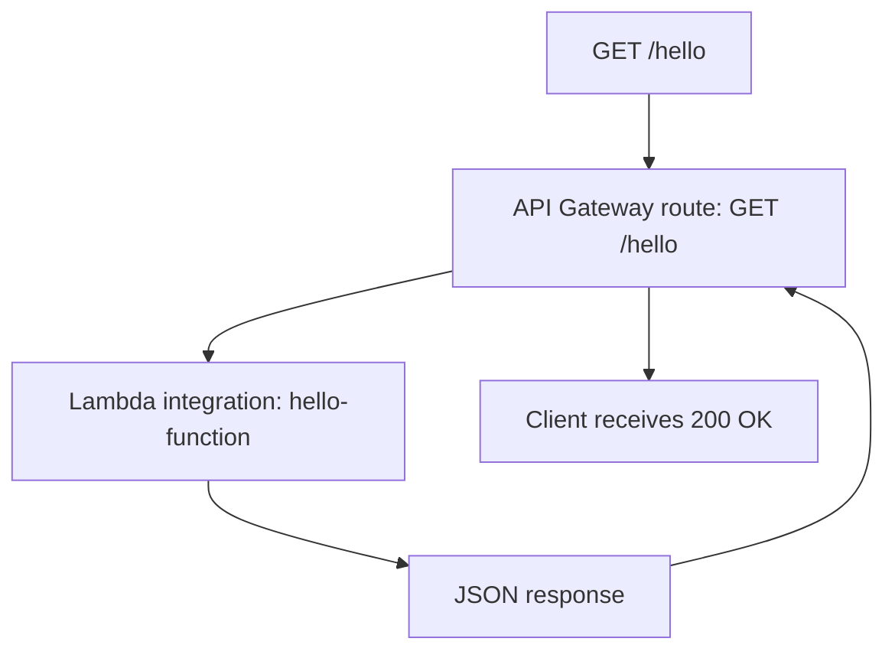
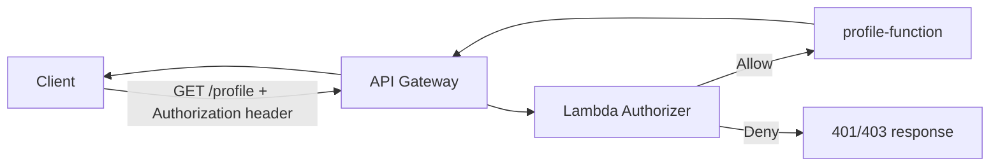
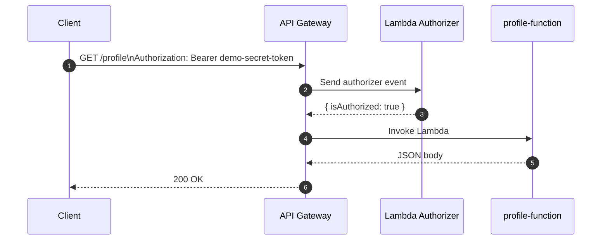
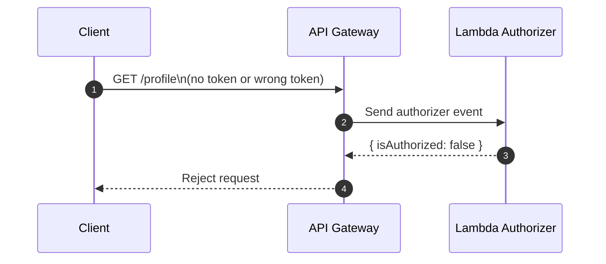

# AWS Lambda + API Gateway Guide

> A practical Markdown guide for building an API with AWS Lambda, exposing it through API Gateway, and protecting it with authentication.

---

## 1) The big picture

If you want to use **AWS Lambda as an API**, the most common design is:

- **API Gateway** = the HTTP front door
- **Lambda** = the backend code that runs for each request

In other words, Lambda is usually **not** the public API endpoint by itself. Instead, **API Gateway receives the HTTP request, then invokes your Lambda function, and returns the Lambda response to the client**.

### Basic request flow



### Authenticated request flow



---

## 2) How to use AWS Lambda as an API

### What Lambda does well

Lambda is great when you want:

- serverless execution
- automatic scaling
- pay-for-use pricing
- small API handlers that respond to HTTP requests

### The usual pattern

1. Write a Lambda function.
2. Create an API in API Gateway.
3. Connect a route such as `GET /hello` to the Lambda function.
4. Call the API Gateway invoke URL.

### What the Lambda function receives

For **HTTP API Lambda proxy integrations**, API Gateway sends an `event` object to Lambda. With **payload format 2.0**, the event includes fields such as:

- `rawPath`
- `headers`
- `queryStringParameters`
- `requestContext.http.method`

A custom response can return fields such as:

- `statusCode`
- `headers`
- `body`

That is why most Lambda API handlers look like normal request/response code.

---

## 3) How to use API Gateway

API Gateway is the service that lets you:

- create public API endpoints
- define routes like `GET /hello` or `POST /orders`
- connect those routes to Lambda
- add auth, throttling, logging, CORS, and custom domains

### Core concepts

#### Route
A route is the combination of:

- HTTP method
- path

Examples:

- `GET /hello`
- `POST /login`
- `GET /profile`

#### Integration
An integration is **where the route sends the request**.

For this guide, the integration target is **Lambda**.

#### Stage
A stage is a deployed version of your API, such as:

- `$default`
- `dev`
- `prod`

#### Authorizer
An authorizer decides whether a request can access a route.

For HTTP APIs, common choices are:

- **JWT authorizer** for real OAuth 2.0 / OIDC tokens
- **Lambda authorizer** for custom logic
- **IAM authorization** for AWS-signed requests

### HTTP API vs REST API

Use **HTTP API** when you want the simpler, lower-cost option and do not need advanced REST API-only features.

Use **REST API** when you need features like:

- API keys
- per-client throttling
- request validation
- AWS WAF integration
- private API endpoints

For most simple Lambda-backed APIs, **HTTP API** is the best place to start.

---

## 4) Practical example #1: a simple public API

Goal: create a public endpoint:

- `GET /hello`

Expected response:

```json
{
  "message": "Hello from Lambda",
  "path": "/hello",
  "method": "GET"
}
```

### Lambda code

```js
export const handler = async (event) => {
  return {
    statusCode: 200,
    headers: {
      "content-type": "application/json"
    },
    body: JSON.stringify({
      message: "Hello from Lambda",
      path: event.rawPath,
      method: event.requestContext?.http?.method
    })
  };
};
```

### How to create it in the AWS Console

1. Open **AWS Lambda**.
2. Create a function named `hello-function`.
3. Paste the code above and deploy it.
4. Open **Amazon API Gateway**.
5. Create an **HTTP API**.
6. Add a **Lambda integration** that points to `hello-function`.
7. Create a route: `GET /hello`.
8. Deploy the API.
9. Copy the **invoke URL**.

Your URL will look like this:

```text
https://abc123.execute-api.us-east-1.amazonaws.com/hello
```

### Test it with curl

```bash
curl https://abc123.execute-api.us-east-1.amazonaws.com/hello
```

### Expected result

```json
{
  "message": "Hello from Lambda",
  "path": "/hello",
  "method": "GET"
}
```

### What happens internally



---

## 5) Practical example #2: a protected API with authentication

Now let’s build a **simple authenticated API**.

Goal:

- public route: `GET /hello`
- protected route: `GET /profile`
- auth rule: the request must send
  `Authorization: Bearer demo-secret-token`

> This example is intentionally simple so you can understand the moving parts. For production, prefer a real identity provider and a JWT/OIDC-based flow, or validate signed tokens carefully.

### Architecture



### Step 1: Create the authorizer Lambda

```js
export const handler = async (event) => {
  const authHeader =
    event.headers?.authorization || event.headers?.Authorization || "";

  const allowed = authHeader === "Bearer demo-secret-token";

  return {
    isAuthorized: allowed,
    context: {
      user: allowed ? "demo-user" : "anonymous"
    }
  };
};
```

This Lambda checks the `Authorization` header and returns:

- `isAuthorized: true` when the token matches
- `isAuthorized: false` when it does not

### Step 2: Create the protected business Lambda

```js
export const handler = async () => {
  return {
    statusCode: 200,
    headers: {
      "content-type": "application/json"
    },
    body: JSON.stringify({
      message: "You are inside a protected route",
      data: {
        project: "demo-api",
        access: "granted"
      }
    })
  };
};
```

### Step 3: Create the HTTP API

Create an **HTTP API** in API Gateway.

Add these routes:

- `GET /hello` -> `hello-function`
- `GET /profile` -> `profile-function`

### Step 4: Add the Lambda authorizer

Attach a **Lambda authorizer** to the `GET /profile` route.

Recommended settings for this simple example:

- authorizer type: `REQUEST`
- identity source: `$request.header.Authorization`
- authorizer payload format version: `2.0`
- simple responses: enabled

### Step 5: Allow API Gateway to invoke the authorizer

Make sure API Gateway has permission to invoke the authorizer Lambda.

If you create pieces in the console, AWS often guides you through permissions. If you create them with CLI, SDK, or IaC, make sure the required Lambda permissions are added explicitly.

### Test without auth

```bash
curl https://abc123.execute-api.us-east-1.amazonaws.com/profile
```

The request should be rejected by API Gateway.

### Test with auth

```bash
curl \
  -H 'Authorization: Bearer demo-secret-token' \
  https://abc123.execute-api.us-east-1.amazonaws.com/profile
```

Expected success response:

```json
{
  "message": "You are inside a protected route",
  "data": {
    "project": "demo-api",
    "access": "granted"
  }
}
```

---

## 6) How the authentication flow works



If the token is missing or invalid:



---

## 7) Very simple AWS CLI examples

These commands are useful when you want a quick setup or want to understand what the console is creating behind the scenes.

### Create an HTTP API with quick create

```bash
aws apigatewayv2 create-api \
  --name my-api \
  --protocol-type HTTP \
  --target arn:aws:lambda:us-east-1:123456789012:function:hello-function
```

### Create a Lambda authorizer for an HTTP API

```bash
aws apigatewayv2 create-authorizer \
  --api-id <api-id> \
  --authorizer-type REQUEST \
  --identity-source '$request.header.Authorization' \
  --name demo-authorizer \
  --authorizer-uri 'arn:aws:apigateway:us-east-1:lambda:path/2015-03-31/functions/arn:aws:lambda:us-east-1:123456789012:function:auth-function/invocations' \
  --authorizer-payload-format-version '2.0' \
  --enable-simple-responses
```

### Attach the authorizer to a route

```bash
aws apigatewayv2 update-route \
  --api-id <api-id> \
  --route-id <route-id> \
  --authorization-type CUSTOM \
  --authorizer-id <authorizer-id>
```

---

## 8) Production advice

The demo token approach is fine for learning, but for real systems you should usually use one of these:

### Option A: JWT authorizer
Use this when your users sign in through:

- Amazon Cognito
- Auth0
- Okta
- another OIDC / OAuth 2.0 provider

This is usually the cleanest choice for user-facing APIs.

### Option B: Lambda authorizer
Use this when you need custom auth logic, such as:

- checking multiple headers
- looking up tenant-specific rules
- validating a custom token format
- combining request context and business rules

### Option C: IAM authorization
Use this when the client is another AWS principal and can sign requests with **SigV4**.

---

## 9) Common mistakes

### Mistake 1: Treating Lambda as the public HTTP endpoint
Usually, **API Gateway is the HTTP endpoint** and Lambda is the backend compute.

### Mistake 2: Picking REST API when HTTP API is enough
If you just need a simple Lambda-backed API, HTTP API is often easier and cheaper.

### Mistake 3: Forgetting invoke permissions
API Gateway must be allowed to invoke the Lambda integration and the Lambda authorizer.

### Mistake 4: Mixing payload formats
If you use CLI, SDK, or IaC for HTTP API Lambda integrations or authorizers, be explicit about version `1.0` vs `2.0`.

### Mistake 5: Using a hardcoded token in production
Use a real identity provider or carefully validated signed tokens for real workloads.

---

## 10) A good starter design

If you want a simple, practical starting point, use this stack:

- **API Gateway HTTP API**
- **Lambda proxy integration**
- **Lambda authorizer** for learning, then
- move to **JWT authorizer** when you adopt Cognito or another identity provider

That gives you a path from:

- simple demo
- to real authenticated API
- without changing the overall architecture too much

---

## 11) Summary

### If your question is: “How do I use AWS Lambda as an API?”
Use **API Gateway + Lambda**.

### If your question is: “How do I use API Gateway?”
Create:

1. a route
2. a Lambda integration
3. a stage/deployment
4. an authorizer if the route must be protected

### If your question is: “How do I make an API with authentication?”
The simplest learning example is:

- an HTTP API route
- a Lambda authorizer that checks `Authorization`
- a protected Lambda route behind that authorizer

---

## 12) References

Official AWS documentation used for this guide:

- API Gateway getting started: https://docs.aws.amazon.com/apigateway/latest/developerguide/getting-started.html
- Develop HTTP APIs in API Gateway: https://docs.aws.amazon.com/apigateway/latest/developerguide/http-api-develop.html
- HTTP APIs overview: https://docs.aws.amazon.com/apigateway/latest/developerguide/http-api.html
- Choose between REST APIs and HTTP APIs: https://docs.aws.amazon.com/apigateway/latest/developerguide/http-api-vs-rest.html
- Lambda proxy integrations for HTTP APIs: https://docs.aws.amazon.com/apigateway/latest/developerguide/http-api-develop-integrations-lambda.html
- Lambda with API Gateway: https://docs.aws.amazon.com/lambda/latest/dg/services-apigateway.html
- HTTP API Lambda authorizers: https://docs.aws.amazon.com/apigateway/latest/developerguide/http-api-lambda-authorizer.html
- HTTP API access control: https://docs.aws.amazon.com/apigateway/latest/developerguide/http-api-access-control.html
- HTTP API IAM authorization: https://docs.aws.amazon.com/apigateway/latest/developerguide/http-api-access-control-iam.html
- HTTP API JWT authorizers: https://docs.aws.amazon.com/apigateway/latest/developerguide/http-api-jwt-authorizer.html
- Troubleshooting HTTP API Lambda integrations: https://docs.aws.amazon.com/apigateway/latest/developerguide/http-api-troubleshooting-lambda.html

