# Cloudflare Images: Comprehensive Guide

Updated: 2026-04-06

## Who this guide is for

This guide is for engineers, architects, and product teams who want to understand **Cloudflare Images** in enough detail to choose the right architecture, implement it safely, and avoid the most common mistakes.

It covers:

- what Cloudflare Images is and where it fits
- the difference between **Hosted Images** and **Transformations**
- upload and delivery flows
- variants, flexible variants, and signed URLs
- Workers and R2 integration
- custom domains and custom paths
- pricing, limits, and operational gotchas
- practical architectures and copy-ready examples

---

## 1. What Cloudflare Images is

Cloudflare Images is Cloudflare's image platform for **storing, transforming, optimizing, and delivering images on Cloudflare's global network**.

A key point that confuses many teams: Cloudflare Images is really **two related products under one name**:

1. **Hosted Images**
   - You upload images into Cloudflare Images storage.
   - Cloudflare stores the originals.
   - You deliver named variants or flexible variants from Cloudflare.

2. **Transformations**
   - Your original images stay somewhere else, such as your origin, R2, or another public source.
   - Cloudflare transforms and caches them at delivery time.
   - You are billed by unique transformations, not by Cloudflare-hosted image storage.

That split determines your architecture, pricing, security model, and migration path.

---

## 2. Quick decision guide

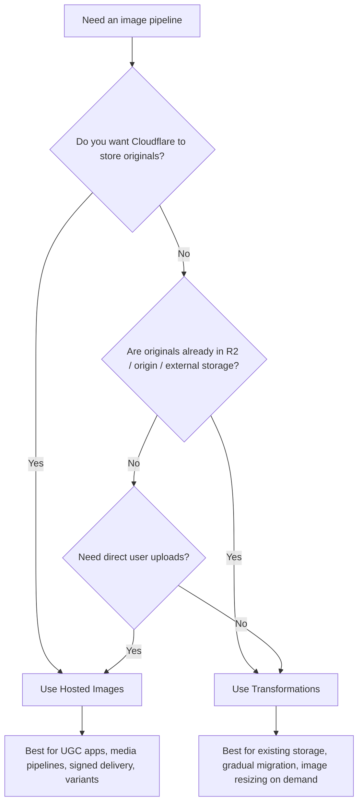

### Rule of thumb

Use **Hosted Images** when:

- you want a clean all-in-one image service
- users upload images directly
- you want simple delivery URLs and per-image access control
- you want Cloudflare to own the storage and variant lifecycle

Use **Transformations** when:

- originals already live in **R2**, your origin, or another public source
- you want to add optimization without re-uploading all assets
- you want to keep your own storage system
- you need a low-friction migration from another image stack

---

## 3. Core concepts

### 3.1 Hosted Images

Images are uploaded into Cloudflare Images storage and delivered using image delivery URLs.

Typical delivery shape:

```text
https://imagedelivery.net/<ACCOUNT_HASH>/<IMAGE_ID>/<VARIANT>
```

Or via a custom domain:

```text
https://example.com/cdn-cgi/imagedelivery/<ACCOUNT_HASH>/<IMAGE_ID>/<VARIANT>
```

### 3.2 Transformations

Cloudflare transforms images that are stored outside of Hosted Images.

Typical URL shape:

```text
https://example.com/cdn-cgi/image/<OPTIONS>/<SOURCE_PATH_OR_URL>
```

Examples:

```text
https://example.com/cdn-cgi/image/width=800,quality=85,format=auto/images/hero.jpg
https://example.com/cdn-cgi/image/fit=cover,width=400,height=400,format=auto/https://assets.example.net/user/123/avatar.jpg
```

### 3.3 Variants

A **variant** is a named transformation profile for Hosted Images, such as `thumbnail`, `card`, `hero`, or `public`.

Variants are useful because they:

- make URLs stable
- reduce client-side parameter sprawl
- standardize image sizes across the app
- help teams avoid arbitrary resizing chaos

### 3.4 Flexible variants

Flexible variants extend Hosted Images by allowing dynamic resizing parameters on Cloudflare-hosted images.

This is more flexible than named variants, but it can also increase complexity and image-shape sprawl if you do not constrain usage.

### 3.5 Signed URLs

Hosted Images supports signed URL tokens for private delivery. You can require signed URLs at the image level, while optionally keeping some variants public.

### 3.6 Direct Creator Upload

This lets end users upload directly to Cloudflare Images using a **one-time upload URL**, without exposing your API token to the browser or mobile app.

---

## 4. Architecture overview

### 4.1 Hosted Images architecture

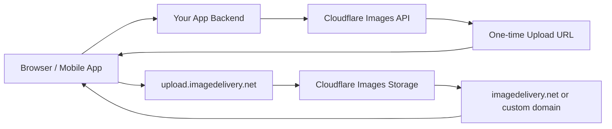

### 4.2 Transformations architecture

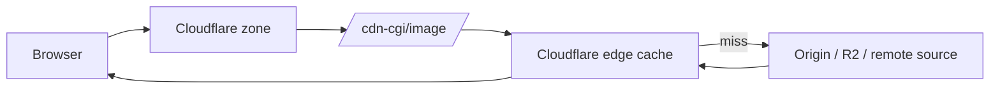

### 4.3 Worker-controlled transformation architecture

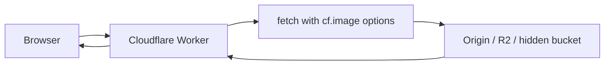

This model is powerful when you want custom URL schemes, authorization logic, or hidden origin locations.

---

## 5. Product capabilities in plain language

## 5.1 What Hosted Images is good at

Hosted Images is strong when you want an opinionated media pipeline for applications such as:

- social apps with user-uploaded avatars and posts
- marketplaces with seller-uploaded product images
- CMS systems with editorial assets
- SaaS products needing private image delivery
- applications that want signed access without building image storage separately

### Main advantages

- simple image upload API
- direct creator upload for end users
- Cloudflare-hosted originals
- delivery variants
- signed URLs for private access
- custom IDs and metadata
- custom domain delivery

## 5.2 What Transformations is good at

Transformations is best when images already live somewhere else.

Typical use cases:

- legacy app already serving images from origin
- object-storage-based architecture using **R2**
- ecommerce site with a large existing image library
- progressive migration off another image CDN
- Worker-based image gateway that hides internal storage layout

### Main advantages

- no mass re-upload required
- easy incremental adoption
- works well with R2 and origin storage
- can be invoked via URL or Workers
- cacheable at the edge

---

## 6. Pricing model and how to think about it

Cloudflare Images uses different billing depending on which mode you choose.

## 6.1 Free plan

The default free plan includes the **transformations** feature with **up to 5,000 unique transformations per month**.

If you exceed that:

- existing cached transformations continue to serve
- new transformations return a `9422` error
- you are not charged past the free limit until you move to paid

## 6.2 Paid plan

The paid plan supports both transformations and Hosted Images storage.

At the time of writing, the published pricing is:

- **Images Transformed**: first 5,000 included, then **$0.50 / 1,000 unique transformations / month**
- **Images Stored**: **$5 / 100,000 images stored / month**
- **Images Delivered**: **$1 / 100,000 images delivered / month**

## 6.3 The most important pricing distinction

For **images stored outside of Cloudflare Images**, you are billed by **unique transformations**.

For **images stored inside Hosted Images**, you are billed by:

- images stored
- images delivered

That means Hosted Images and Transformations can behave very differently economically.

### Example: transformation billing

If you resize the same original image to:

- `100x100`
- `200x200`
- `400x400`

those are **three unique transformations** for external-source images.

Repeat requests for the exact same transformed version in the same calendar month count only once for transformation billing.

### Practical interpretation

- If you have a small, controlled set of image sizes, Transformations pricing is predictable.
- If your app lets clients request arbitrary widths like 317, 319, 321, 322, pricing and cache fragmentation can get ugly.
- Hosted Images with named variants is often easier to control at scale.

---

## 7. Limits and supported formats

## 7.1 Hosted image upload formats

Cloudflare Images accepts these input formats for Hosted Images uploads:

- PNG
- GIF, including animations
- JPEG
- WebP, including animated WebP
- SVG
- HEIC

Important note: HEIC can be ingested for decoding, but Cloudflare serves web-safe outputs such as AVIF, WebP, JPG, or PNG.

## 7.2 Hosted image upload limits

Published upload limits for Hosted Images include:

- maximum image dimension: **12,000 px**
- maximum image area: **100 megapixels**
- maximum image size: **10 MB**
- metadata limit: **1024 bytes**
- animated GIF/WebP total frames limit: **50 megapixels**

## 7.3 External-source transformation limits

For images stored outside of Hosted Images, published limits include:

- maximum image size: **70 MB**
- maximum image area: **100 megapixels**
- animated GIF/WebP total limit: **50 megapixels**

### Practical takeaway

If your source library includes giant editorial TIFF-like assets converted into huge JPEGs, or very large animated GIFs, you need to validate them early in your pipeline.

---

## 8. Upload methods for Hosted Images

Cloudflare Images supports several upload patterns.

## 8.1 Upload from your backend with file bytes

This is the simplest server-side path.

```bash
curl --request POST \
  --url https://api.cloudflare.com/client/v4/accounts/<ACCOUNT_ID>/images/v1 \
  --header 'Authorization: Bearer <API_TOKEN>' \
  --form file=@./avatar.jpg
```

### Best for

- internal admin tooling
- low-volume uploads
- simple backends

## 8.2 Upload by URL

Instead of sending bytes, you can provide a source URL and let Cloudflare pull it.

```bash
curl --request POST \
  --url https://api.cloudflare.com/client/v4/accounts/<ACCOUNT_ID>/images/v1 \
  --header 'Authorization: Bearer <API_TOKEN>' \
  --form 'url=https://example.com/source-images/hero.jpg'
```

### Best for

- migrations
- importing existing media libraries
- CMS pipelines pulling from existing stores

## 8.3 Upload with a custom ID path

Instead of Cloudflare-generated UUIDs, you can assign a custom ID such as:

- `users/123/avatar`
- `products/sku-123/front`
- `posts/2026/04/cover`

This can make integration easier, especially when your app already has deterministic image identifiers.

### Example idea

```text
users/42/avatar
products/ABC-1000/front
brands/nike/logo
```

### Design warning

Do not encode secrets or private business meaning into custom IDs. Treat them as identifiers, not private metadata.

## 8.4 Direct Creator Upload

This is one of the most useful Hosted Images capabilities.

### Flow

1. Your backend requests a one-time upload URL.
2. Your backend returns that upload URL to the client.
3. The browser or mobile app uploads directly to Cloudflare.
4. Cloudflare stores the image and returns the future image ID.

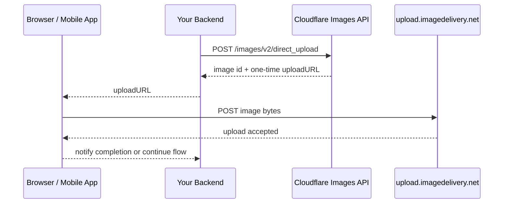

### Example: create one-time upload URL

```bash
curl --request POST \
  https://api.cloudflare.com/client/v4/accounts/{account_id}/images/v2/direct_upload \
  --header "Authorization: Bearer <API_TOKEN>" \
  --form 'requireSignedURLs=true' \
  --form 'metadata={"type":"avatar","userId":"42"}'
```

### Example response shape

```json
{
  "result": {
    "id": "2cdc28f0-017a-49c4-9ed7-87056c83901",
    "uploadURL": "https://upload.imagedelivery.net/<ACCOUNT_HASH>/2cdc28f0-017a-49c4-9ed7-87056c83901"
  },
  "success": true,
  "errors": [],
  "messages": []
}
```

### Why this is a big deal

Without Direct Creator Upload, teams often build this slower path:


Direct Creator Upload removes the middle storage layer and avoids exposing your Cloudflare API token to the client.

---

## 9. Delivery model for Hosted Images

## 9.1 Default delivery URL

```text
https://imagedelivery.net/<ACCOUNT_HASH>/<IMAGE_ID>/<VARIANT>
```

Example:

```text
https://imagedelivery.net/ZWd9g1K7eljCn_KDTu_MWA/083eb7b2-5392-4565-b69e-aff66acddd00/public
```

## 9.2 Delivery through your custom domain

If you want your own hostname:

```text
https://example.com/cdn-cgi/imagedelivery/<ACCOUNT_HASH>/<IMAGE_ID>/<VARIANT>
```

### Why use a custom domain

- cleaner brand surface
- easier CSP configuration
- consistent app hostname policy
- easier migration from an older image stack

### Example

```html

```

---

## 10. Variants and flexible variants

## 10.1 Named variants

Hosted Images includes a default `public` variant. You can define up to **100 variants**.

Example variant set:

| Variant | Intended use | Example behavior |
|---|---|---|
| `public` | default general display | width 1200, format auto |
| `thumb` | avatars and small cards | 120x120 cover |
| `card` | grid/listing cards | 480x320 cover |
| `hero` | banners | 1600x900 fit/crop |
| `original-safe` | near-original delivery | retain size limits + metadata choice |

### Why named variants are usually better than arbitrary resizing

- simpler cache behavior
- easier design consistency
- easier cost control
- fewer accidental oversized images

## 10.2 Flexible variants

Flexible variants let you apply transformation parameters to Cloudflare-hosted images more dynamically.

Example idea:

```text
https://imagedelivery.net/<ACCOUNT_HASH>/<IMAGE_ID>/w=400,sharpen=3
```

### When flexible variants help

- headless frontend where image widths vary by breakpoint
- CMS/editorial layouts with many size permutations
- migration from another dynamic image parameter system

### When to be careful

Flexible variants can make it too easy for clients to request many one-off sizes. That can reduce cache reuse and complicate performance governance.

### Team recommendation

Even when flexible variants are enabled, constrain usage behind:

- design-system presets
- a Worker-based width allowlist
- a frontend image component that snaps widths to fixed buckets

---

## 11. Signed URLs and private delivery

Hosted Images supports signed URL tokens for private images.

### How it works

- you configure image access to require signed URLs
- your backend generates a tokenized, expiring URL
- clients can only fetch the image while the token is valid

### Important limitation

Private images **do not currently support custom paths**.

### Architecture

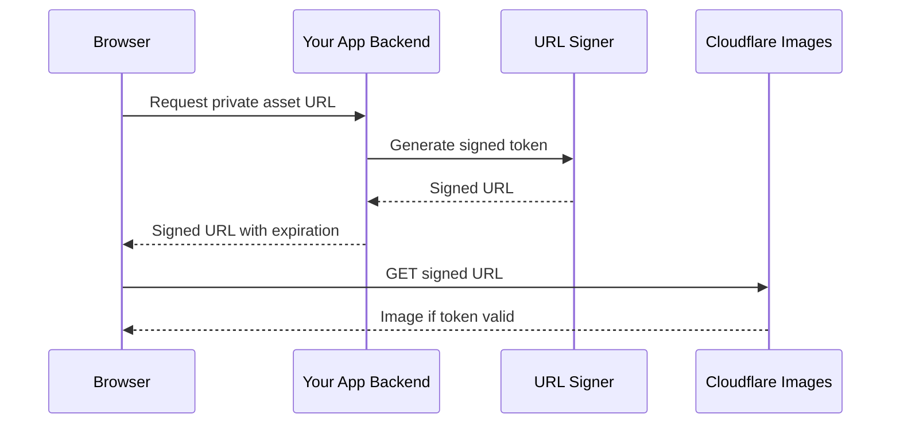

### Good use cases

- paid content
- private documents rendered as images
- medical or internal images with access windows
- user-specific dashboards or exports

### Example pattern

Your backend issues signed URLs that expire in 5 minutes:

```text
https://imagedelivery.net/<ACCOUNT_HASH>/<IMAGE_ID>/public?token=<SIGNED_TOKEN>
```

Use short expirations unless there is a strong UX reason not to.

---

## 12. Transformations for external images

Transformations optimize images **stored outside of Cloudflare Images**.

## 12.1 When to use URL-based transformations

URL-based transformations are simple and fast to adopt.

Example:

```text
https://example.com/cdn-cgi/image/width=800,quality=85,format=auto/uploads/blog/cover.jpg
```

### Best for

- static websites
- origin-backed assets
- simple resizing rollouts
- frontend teams that can embed transformed URLs directly

## 12.2 When to use Worker-based transformations

Use Workers when you need logic, such as:

- hiding the real source URL
- validating requested sizes
- mapping semantic sizes like `thumb`, `card`, `hero`
- authorization checks
- device/network-aware tuning

### Example Worker

```js
export default {
  async fetch(request) {
    const url = new URL(request.url)
    const preset = url.searchParams.get("preset") || "card"

    const presets = {
      thumb: { width: 120, height: 120, fit: "cover", format: "auto" },
      card: { width: 480, height: 320, fit: "cover", format: "auto", quality: 85 },
      hero: { width: 1600, height: 900, fit: "cover", format: "auto", quality: 82 }
    }

    const image = presets[preset] || presets.card

    // Real source is hidden from the client.
    const source = "https://origin.example.internal/assets" + url.pathname

    return fetch(source, {
      cf: {
        image
      }
    })
  }
}
```

### Why this is better than raw width parameters

Instead of letting clients request `/image?w=317`, `/image?w=318`, `/image?w=319`, you normalize them to a small preset set.

That improves:

- cache reuse
- cost predictability
- visual consistency

---

## 13. Common transformation options

Cloudflare supports many transformation parameters. The ones teams use most often are:

- `width`
- `height`
- `fit`
- `quality`
- `format`
- `sharpen`
- `anim`

### Example: responsive card image

```text
/cdn-cgi/image/fit=cover,width=480,height=320,quality=85,format=auto/products/shoe.jpg
```

### Example: hero image

```text
/cdn-cgi/image/fit=cover,width=1600,height=900,quality=82,format=auto/campaigns/spring-hero.jpg
```

### Example: preserve GIF frames

```text
/cdn-cgi/image/anim=true,width=500,format=auto/memes/cat.gif
```

### Example: flatten animation to still image

```text
/cdn-cgi/image/anim=false,width=500,format=webp/memes/cat.gif
```

That is especially useful when user-uploaded animated GIFs are too heavy.

### Quality guidance

Cloudflare documents `quality` on a 1-100 scale, with **85 as the default** and useful values often between **50 and 90**.

A practical starting point:

- product/gallery images: `80-85`
- high-traffic article thumbnails: `70-80`
- dashboard or internal docs: `75-85`
- photo-heavy hero images: test visually at `78-84`

---

## 14. Responsive images done right

Cloudflare's docs show standard `srcset` usage. The main lesson is: do not create too many density variants.

### Good baseline

Use:

- `1x`
- `2x`

Usually stop there.

### Example

```html

```

### Better example with width descriptors

```html

```

### Governance tip

Snap widths to a fixed set such as:

- 160
- 320
- 480
- 640
- 960
- 1280
- 1600

Avoid arbitrary width generation.

---

## 15. Custom domains and custom paths

## 15.1 Hosted Images custom domains

Hosted Images can be served from customer domains under the same Cloudflare account.

Example:

```text
https://media.example.com/cdn-cgi/imagedelivery/<ACCOUNT_HASH>/<IMAGE_ID>/<VARIANT>
```

## 15.2 Transformations custom paths

By default, Transformations use `/cdn-cgi/image/`, but Cloudflare supports **Transform Rules** to rewrite friendly paths.

### Goal

Turn this:

```text
https://example.com/cdn-cgi/image/width=600,quality=85,format=auto/images/photo.jpg
```

into something like this:

```text
https://example.com/images/photo.jpg?width=600
```

or:

```text
https://example.com/img/600x400/photo.jpg
```

### Basic rewrite idea

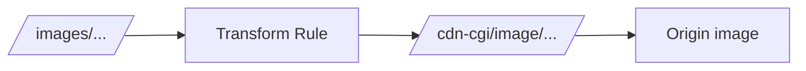

### Important warning

When you rewrite custom paths for transformations, you must avoid rewrite loops. Cloudflare specifically documents checking the `Via` header for `image-resizing` when building rules.

### Practical implication

Custom paths are powerful, but if you are not careful, you can accidentally rewrite a transformed request back into itself.

---

## 16. R2 integration patterns

Cloudflare Images and R2 work very well together, but there are two very different patterns.

## 16.1 Pattern A: Store originals in R2, use Transformations

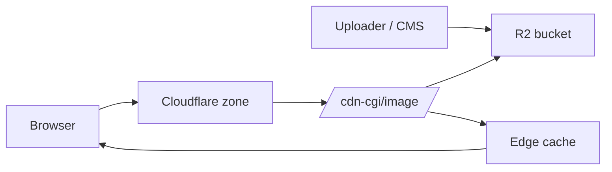

### Best for

- existing object-storage architecture
- large editorial libraries
- keeping originals under your own storage policy
- gradual migration

### Example

```text
https://media.example.com/cdn-cgi/image/width=800,format=auto/https://pub-<bucket>.r2.dev/articles/2026/cover.jpg
```

Or better, use an R2 custom domain rather than public bucket URLs.

## 16.2 Pattern B: Use Hosted Images for app uploads, R2 for everything else

This hybrid is often the best real-world design.

- user-generated images -> Hosted Images
- editorial originals / bulk assets -> R2 + Transformations
- private or signed app content -> Hosted Images signed URLs

### Why this is attractive

You avoid forcing one system to do everything.

---

## 17. Worker integration patterns

Workers gives you programmatic control over the image pipeline.

## 17.1 Preset mapping Worker

This is the most practical Worker pattern.

```js
const presets = {
  avatar: { width: 120, height: 120, fit: "cover", format: "auto" },
  card: { width: 480, height: 320, fit: "cover", format: "auto", quality: 85 },
  hero: { width: 1600, height: 900, fit: "cover", format: "auto", quality: 82 }
}

export default {
  async fetch(request) {
    const url = new URL(request.url)
    const preset = presets[url.searchParams.get("preset")] || presets.card
    const source = "https://assets.example.com" + url.pathname

    return fetch(source, {
      cf: { image: preset }
    })
  }
}
```

## 17.2 Width allowlist Worker

Useful when frontend teams need flexibility but you still want guardrails.

```js
const ALLOWED = [160, 320, 480, 640, 960, 1280, 1600]

function nearestWidth(input) {
  const n = Number(input || 640)
  return ALLOWED.reduce((best, cur) =>
    Math.abs(cur - n) < Math.abs(best - n) ? cur : best
  )
}

export default {
  async fetch(request) {
    const url = new URL(request.url)
    const width = nearestWidth(url.searchParams.get("w"))
    const source = "https://origin.example.com" + url.pathname

    return fetch(source, {
      cf: {
        image: {
          width,
          format: "auto",
          quality: 82
        }
      }
    })
  }
}
```

## 17.3 Auth-gated transformation Worker

If you need app-session checks before image delivery, a Worker is often the cleanest control plane.

```js
export default {
  async fetch(request) {
    const cookie = request.headers.get("cookie") || ""
    if (!cookie.includes("session=")) {
      return new Response("Unauthorized", { status: 401 })
    }

    const url = new URL(request.url)
    const source = "https://private-origin.example.internal" + url.pathname

    return fetch(source, {
      cf: {
        image: {
          width: 800,
          format: "auto",
          quality: 80
        }
      }
    })
  }
}
```

### Security reminder

If you use Worker-based transformations, make sure users cannot force your Worker to resize arbitrary third-party URLs unless that is truly intended.

---

## 18. Practical architecture playbooks

## 18.1 User-generated content app

### Good choice

Use **Hosted Images + Direct Creator Upload + named variants + signed URLs where needed**.

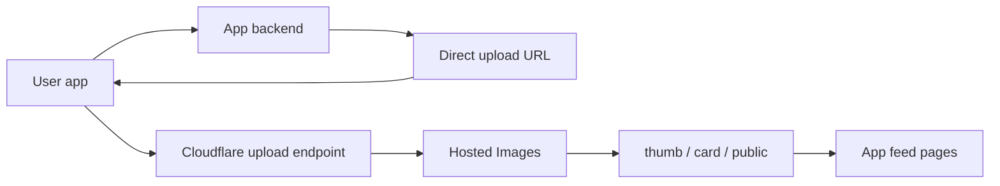

### Why this works

- no temp upload bucket
- simple image lifecycle
- strong app integration
- easy per-image privacy controls

## 18.2 Ecommerce catalog

### Good choice

Use **R2 or existing origin + Transformations**, unless you want to replatform the whole catalog.

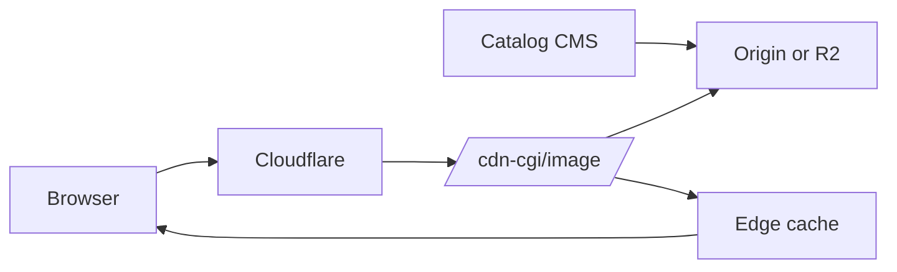

### Why this works

- no mass re-upload needed
- easy responsive variants
- strong cache behavior for a fixed set of sizes

## 18.3 Media CMS with editorial uploads

### Good choice

Hybrid:

- editorial master assets in **R2**
- frontend delivery through **Transformations**
- UGC or per-user uploads in **Hosted Images**

This prevents you from forcing enormous newsroom asset workflows into a purely per-image Hosted Images model if your editorial stack already centers around object storage.

## 18.4 SaaS dashboards with private images

### Good choice

Use **Hosted Images + signed URLs** for images tied to a specific tenant or customer session.

---

## 19. Operational best practices

## 19.1 Prefer a small set of sizes

Whether you use Hosted Images variants or external Transformations, standardize widths and aspect ratios.

### Good

- `avatar` = 120x120
- `card` = 480x320
- `hero` = 1600x900
- `gallery` = 1280x1280 max

### Bad

- arbitrary widths from every caller
- per-component one-off sizes
- dynamic sizes without snapping

## 19.2 Keep transformation URLs deterministic

If your URL changes order or parameter shape unnecessarily, you can hurt cache reuse.

## 19.3 Use `format=auto` unless you have a reason not to

Cloudflare automatically chooses efficient output formats like AVIF or WebP when appropriate.

## 19.4 Validate uploads before they hit the image pipeline

Especially for:

- giant HEIC files
- huge animated GIFs
- malformed SVGs
- images with absurd aspect ratios

## 19.5 Treat SVG differently

Cloudflare can deliver SVGs and sanitize them, but **does not resize SVGs** because SVG is inherently scalable.

## 19.6 Use a custom domain if image hostnames matter to your app

A custom domain can simplify:

- Content Security Policy
- ad blocker edge cases
- branding
- migration from previous CDNs

## 19.7 Separate API logic from image delivery logic

If you are already using Workers for APIs, avoid forcing every image request through heavy app logic unless you truly need that logic. Let static image delivery stay as direct and cacheable as possible.

---

## 20. Troubleshooting guide

## 20.1 Common error codes

Cloudflare documents several relevant errors, including:

- `9520` — image format not supported
- `9522` — image exceeded processing limit
- `9529` — image timed out while processing
- `9422` — free-plan transformation limit behavior for new transformations after the included quota is exceeded

## 20.2 Diagnostic checklist

### If images are slow

Check:

1. Is the request cacheable?
2. Are you using too many unique widths?
3. Are images going through unnecessary Worker logic?
4. Is the source image too large?
5. Is the origin or R2 path slow on cache misses?
6. Are you serving originals where transformed variants should be used?

### If images fail to resize

Check:

1. Is the source format supported?
2. Is the image too large?
3. Are you trying to resize SVG?
4. Is the transformed path or URL rewrite looping?
5. Are you exceeding free-plan transformation limits?

### If private delivery fails

Check:

1. Is the signed token valid and unexpired?
2. Are you accidentally using custom paths for a private image flow?
3. Did your backend sign the exact URL form the client is requesting?

---

## 21. Practical examples

## 21.1 Example: avatar system with Hosted Images

### Requirements

- users upload avatars from web and mobile
- avatars are public in profile cards
- original image should not pass through your app server

### Recommended design

- backend creates direct upload URL
- client uploads directly to Cloudflare Images
- store returned image ID in your user table
- use named variants: `thumb`, `profile`, `public`

### Data model example

```json
{
  "userId": 42,
  "avatarImageId": "users/42/avatar",
  "avatarUpdatedAt": "2026-04-06T09:00:00Z"
}
```

### Frontend example

```html

```

## 21.2 Example: blog cover images with Transformations

### Requirements

- originals already live on origin
- need responsive sizes
- no desire to re-upload all existing assets

### Recommended design

- keep originals on origin or R2
- deliver through `/cdn-cgi/image/`
- snap widths to a fixed width ladder

### Example

```html

```

## 21.3 Example: private customer report images

### Requirements

- screenshots or rendered charts are private
- access should expire quickly
- some images may be embedded in customer portals

### Recommended design

- store in Hosted Images
- require signed URLs
- generate tokenized URLs from backend on demand
- optionally cache page HTML privately while keeping image access window short

## 21.4 Example: migration from another image CDN

### Requirements

- thousands or millions of images already live at origin
- team wants minimal migration risk
- later might move uploads to Cloudflare

### Recommended path

Phase 1:
- enable Transformations on the zone
- convert frontend image URLs gradually
- standardize sizes

Phase 2:
- move new UGC uploads to Hosted Images
- keep old catalog on Transformations

Phase 3:
- decide whether to bulk import old images or keep hybrid architecture

---

## 22. Anti-patterns to avoid

## 22.1 Letting clients invent infinite widths

This hurts both cache reuse and predictability.

## 22.2 Running every image through a Worker when simple delivery would do

Only use Worker logic when it adds real value.

## 22.3 Treating animated GIFs like normal JPEGs

They can explode in size and processing cost.

## 22.4 Using private image flows without thinking about URL expiration

Over-long expirations weaken access control.

## 22.5 Forcing Hosted Images when R2 + Transformations is clearly a better fit

If you already have a robust object storage pipeline, Hosted Images is not automatically the right answer.

## 22.6 Relying on SVG resizing

Cloudflare will deliver SVGs, but resizing is not the model for them.

---

## 23. Recommended reference architectures

## 23.1 Best default for most app teams

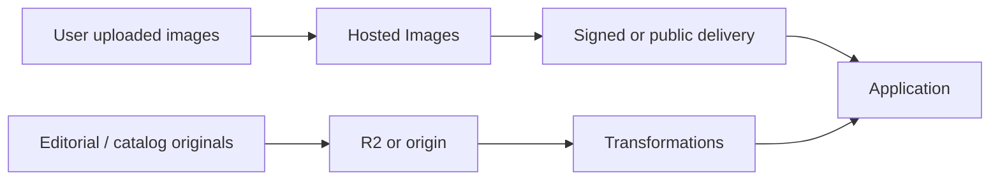

Why this is strong:

- UGC gets secure upload and delivery ergonomics
- editorial assets stay compatible with existing storage
- cost model stays understandable
- you avoid overcommitting to one pattern

## 23.2 Best default for greenfield social or community apps

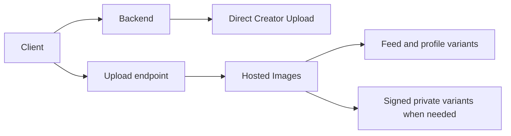

## 23.3 Best default for existing commerce/catalog sites

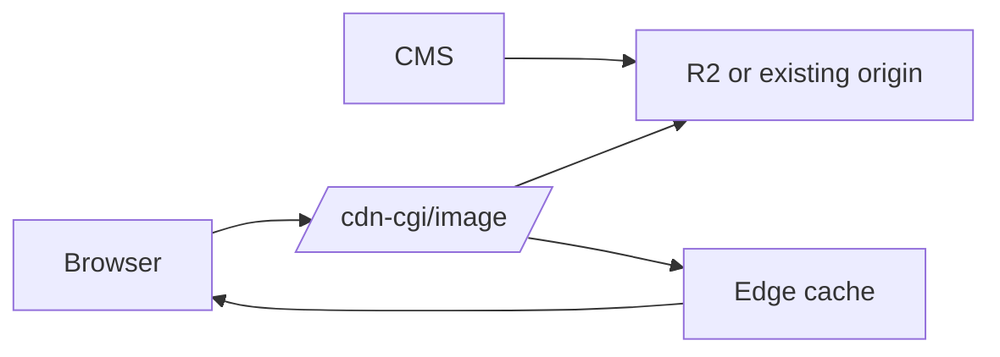

---

## 24. Implementation checklist

## If you choose Hosted Images

- [ ] create API token
- [ ] define upload policy
- [ ] decide whether to use UUID or custom IDs
- [ ] define named variants
- [ ] decide whether flexible variants are truly needed
- [ ] decide which images require signed URLs
- [ ] decide whether to use Direct Creator Upload
- [ ] choose default delivery domain
- [ ] store returned image IDs in app data model

## If you choose Transformations

- [ ] enable transformations on the zone
- [ ] inventory image source locations
- [ ] define a fixed width ladder
- [ ] define quality defaults
- [ ] use `format=auto`
- [ ] decide whether URL-based or Worker-based control is better
- [ ] add Transform Rules only if you really need custom paths
- [ ] test cache behavior and origin miss performance

---

## 25. Bottom line

Cloudflare Images is not just an “image CDN.” It is a flexible image platform with **two distinct operating modes**:

- **Hosted Images** for app-centered, Cloudflare-managed image storage and delivery
- **Transformations** for optimizing images that already live somewhere else

If your app accepts user uploads, needs clean variant management, or benefits from signed image delivery, **Hosted Images** is often the best fit.

If your images already live in R2 or origin storage and you mainly want optimization, caching, and responsive delivery, **Transformations** is usually the simpler and more incremental choice.

For many teams, the best architecture is not choosing one or the other exclusively. It is using:

- **Hosted Images for user-generated content**, and
- **R2/origin + Transformations for editorial or catalog assets**.

That hybrid model is usually the most practical, scalable, and operationally sane setup.

---

## 26. References

This guide was prepared from Cloudflare's current product and API documentation, including:

- Cloudflare Images overview
- pricing
- upload methods
- Direct Creator Upload
- create variants
- flexible variants
- serving uploaded images
- serving private images
- serving through custom domains
- transformation URLs and Workers
- custom path rewrites
- responsive images guidance
- troubleshooting

