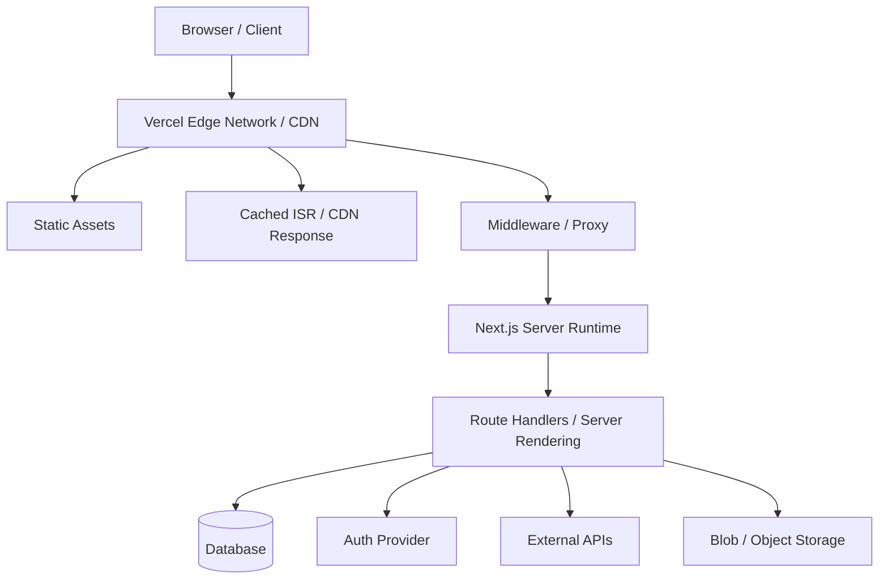
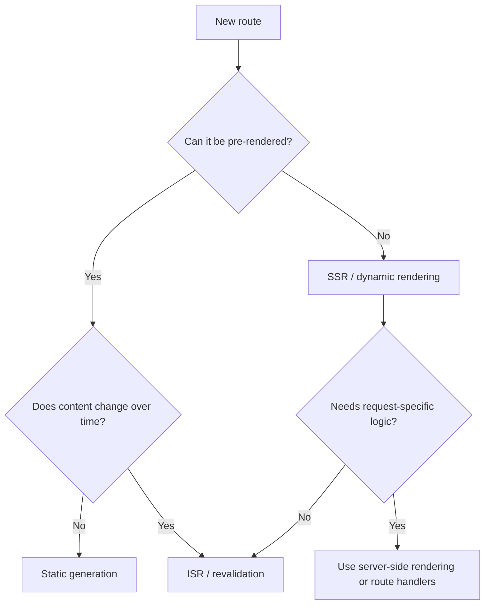
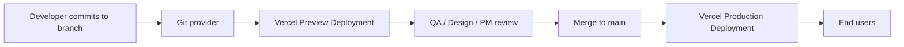

# Comprehensive Guide: Using Vercel for a React + Next.js Web App

## 1. What Vercel is in this stack

Vercel is a deployment and hosting platform that is especially optimized for **Next.js** applications.
In a React + Next.js workflow, Vercel typically handles:

- Git-based deployments
- Preview deployments for branches and pull requests
- Production deployments
- Server-side rendering infrastructure
- Route handlers and server-side compute
- Edge middleware
- CDN caching
- Image and font optimization support
- Environment variable management
- Logs, analytics, and observability

For a **plain React SPA**, Vercel can host the built static assets.
For a **Next.js app**, Vercel can run the full application model: static pages, dynamic server rendering, API routes, middleware, streaming, and cache-aware delivery.

---

## 2. Why Vercel is a strong fit for Next.js

Vercel is the company behind Next.js, so the integration is unusually tight.
That usually means:

- minimal deployment configuration
- framework-aware builds
- automatic preview URLs
- first-class support for App Router features
- straightforward handling of SSR, ISR, and streaming

In practice, this makes Vercel feel less like “renting a generic server” and more like “running a managed Next.js runtime.”

---

## 3. Architecture mental model

Think of a typical Next.js app on Vercel as several layers:

```text
Browser
  -> Vercel Edge Network / CDN
    -> Static assets and cached responses
    -> Middleware (optional)
    -> Next.js server rendering / route handlers / functions
    -> External services (database, auth, APIs, storage)
```

### Architecture diagram



Depending on how a route is built, a request may be served from:

- a pre-rendered static asset
- a cached ISR response
- a Node.js function
- edge runtime logic
- a route handler that fetches from a database or third-party API

---

## 4. Recommended stack shape

A practical production setup often looks like this:

- **Frontend/UI:** React with Next.js App Router
- **Deployment:** Vercel
- **Auth:** NextAuth/Auth.js, Clerk, or another provider
- **Database:** Postgres or another managed DB
- **File storage:** Vercel Blob or external object storage
- **Low-latency config / flags:** Edge Config or equivalent
- **Observability:** Vercel Logs, Web Analytics, Speed Insights, Observability

---

## 5. Project setup

### Create a new Next.js app

```bash
npx create-next-app@latest my-app
cd my-app
```

During setup, most teams today choose:

- TypeScript
- App Router
- ESLint
- src/ directory if preferred
- Tailwind if needed

### Install Vercel CLI

```bash
npm i -g vercel
```

### Link the local directory to a Vercel project

```bash
vercel link
```

This connects your working directory to a project in Vercel and stores project metadata in a local `.vercel/` directory.

---

## 6. Local development workflow

For local work, your loop is usually:

```bash
npm run dev
```

If your app depends on Vercel-managed environment variables, pull them first:

```bash
vercel env pull .env.local
```

You can also use environment-aware CLI flows when needed:

```bash
vercel env run -- npm run dev
```

A common team workflow is:

1. create or update a feature branch
2. pull environment variables
3. run `npm run dev`
4. push code
5. review the generated preview deployment
6. merge to main for production

---

## 7. App Router basics on Vercel

The modern default for Next.js is the **App Router**.
It uses React features such as:

- Server Components
- Suspense
- streaming
- nested layouts
- route handlers
- server actions / server functions patterns

A typical app structure:

```text
app/
  layout.tsx
  page.tsx
  dashboard/
    page.tsx
  api/
    hello/
      route.ts
```

### Example page

```tsx
export default function HomePage() {
  return <main>Hello from Next.js on Vercel</main>
}
```

### Example route handler

```tsx
import { NextResponse } from 'next/server'

export async function GET() {
  return NextResponse.json({ ok: true })
}
```

On Vercel, route handlers are deployed as server-side compute rather than static files.

---

## 8. Rendering modes you should understand

One of the biggest reasons to use Next.js on Vercel is the ability to mix rendering strategies by route.

### Rendering decision diagram



### Static rendering
Use when the content is mostly fixed or changes infrequently.
Examples:

- marketing pages
- docs pages
- public landing pages

Benefits:

- fastest delivery
- CDN-friendly
- low compute usage

### Server-side rendering (SSR)
Use when content must be generated per request or depends on request-time data.
Examples:

- authenticated dashboards
- highly personalized pages
- request-sensitive content

Benefits:

- fresh data on every request
- can safely access server-only secrets

Tradeoff:

- more compute involved than static delivery

### Incremental Static Regeneration (ISR)
Use when pages should be cached but refreshed periodically.
Examples:

- blogs
- product catalogs
- CMS-backed content

Example:

```tsx
export default async function Page() {
  const res = await fetch('https://api.example.com/posts', {
    next: { revalidate: 60 },
  })

  const posts = await res.json()
  return <pre>{JSON.stringify(posts, null, 2)}</pre>
}
```

This lets you keep pages fast while still updating them over time.

### Dynamic vs static decisions
A simple rule:

- choose **static** when content can be pre-rendered
- choose **ISR** when content changes on a schedule
- choose **SSR** when content must be request-aware or truly real-time

---

## 9. Data fetching patterns

With App Router, data fetching usually happens directly in server components.

### Server component fetch

```tsx
async function getProducts() {
  const res = await fetch('https://api.example.com/products', {
    next: { revalidate: 300 },
  })

  if (!res.ok) throw new Error('Failed to fetch products')
  return res.json()
}

export default async function ProductsPage() {
  const products = await getProducts()

  return (
    <main>
      <h1>Products</h1>
      <pre>{JSON.stringify(products, null, 2)}</pre>
    </main>
  )
}
```

### Route handler as backend-for-frontend
Use route handlers when you want to:

- hide private API keys
- normalize third-party data
- validate requests
- create a server-only integration layer

```tsx
import { NextResponse } from 'next/server'

export async function GET() {
  const res = await fetch('https://third-party.example.com/data', {
    headers: {
      Authorization: `Bearer ${process.env.MY_SECRET_TOKEN}`,
    },
  })

  const data = await res.json()
  return NextResponse.json(data)
}
```

---

## 10. Environment variables

Environment variables are central to most Vercel projects.
Typical examples:

- database URLs
- OAuth credentials
- API tokens
- feature flags
- app secrets

### Important rule
Only variables prefixed with `NEXT_PUBLIC_` should be exposed to the browser.
Anything else should stay server-only.

### Example

```env
DATABASE_URL=postgres://...
APP_SECRET=super-secret-value
NEXT_PUBLIC_API_BASE_URL=https://example.com
```

### Recommended workflow

- set variables in the Vercel dashboard or CLI
- pull them locally with `vercel env pull .env.local`
- do not commit `.env.local`
- keep secrets server-side whenever possible

### Good practice
Avoid pushing secrets into client components unless they are intentionally public.
Even with Next.js, this is one of the easiest mistakes to make.

---

## 11. Preview deployments

Preview deployments are one of Vercel’s most valuable features.

Every branch or pull request can get a unique URL so teammates can review changes before production.
This is especially helpful for:

- design review
- QA
- product sign-off
- stakeholder demos
- branch-specific testing

Typical flow:

```text
feature branch push
  -> Vercel builds the branch
  -> preview URL is generated
  -> reviewer opens the preview
  -> changes are approved
  -> merge to main
  -> production deployment happens
```

### Deployment flow diagram



This greatly improves collaboration compared with “it works on my machine” handoffs.

---

## 12. Git-based deployment flow

The most common production workflow is:

1. connect GitHub/GitLab/Bitbucket to Vercel
2. import the repository
3. Vercel detects Next.js automatically
4. Vercel installs dependencies using the detected package manager
5. Vercel builds the app
6. Vercel deploys it and creates a deployment URL

This is why many teams never need to write custom infra scripts for a normal web app.

---

## 13. CLI-based deployment flow

You can also work entirely from the CLI.

### Preview deployment

```bash
vercel deploy
```

### Production deployment

```bash
vercel deploy --prod
```

A strong minimal CLI flow is:

```bash
vercel link
vercel env pull .env.local
vercel env run -- npm run dev
vercel deploy
vercel deploy --prod
```

This is useful for solo development, scripted releases, or troubleshooting outside a Git integration.

---

## 14. Build behavior on Vercel

Vercel automatically detects the framework and package manager.
For a standard Next.js project, the build normally maps to `next build`.

This means you usually do **not** need to manually define all build steps unless:

- you use a monorepo
- you need a custom build command
- you have special output handling
- you are deploying multiple apps from one repository

### When to customize
You may customize settings like:

- root directory
- install command
- build command
- output directory
- environment variables

Most small and medium Next.js apps can keep the defaults.

---

## 15. Images and fonts

### Images
Use `next/image` whenever practical.

```tsx
import Image from 'next/image'

export default function Hero() {
  return (
    <Image
      src="/hero.png"
      alt="Hero"
      width={1200}
      height={630}
      priority
    />
  )
}
```

Why this matters:

- optimized delivery
- responsive sizing
- better default performance
- less manual image pipeline work

### Fonts
Use `next/font` for built-in font optimization and self-hosting behavior.

```tsx
import { Inter } from 'next/font/google'

const inter = Inter({ subsets: ['latin'], display: 'swap' })

export default function RootLayout({ children }: { children: React.ReactNode }) {
  return (
    <html lang="en" className={inter.className}>
      <body>{children}</body>
    </html>
  )
}
```

---

## 16. Middleware and Edge runtime

Middleware runs before a request reaches the main route logic.
Use it for lightweight request-time tasks such as:

- auth checks
- redirects
- locale detection
- A/B routing
- bot filtering patterns

### Example middleware

> Note: in current Next.js releases, you may also see `proxy.ts` used instead of `middleware.ts` for this file convention in newer documentation and projects.

```tsx
import { NextResponse } from 'next/server'
import type { NextRequest } from 'next/server'

export function middleware(request: NextRequest) {
  const isLoggedIn = request.cookies.has('session')

  if (!isLoggedIn && request.nextUrl.pathname.startsWith('/dashboard')) {
    return NextResponse.redirect(new URL('/login', request.url))
  }

  return NextResponse.next()
}

export const config = {
  matcher: ['/dashboard/:path*'],
}
```

### Important Edge caveats
Edge runtime is not the same as Node.js.
Some Node APIs and some libraries will not work there.
Dynamic code execution patterns are also restricted.

Use Edge when you need:

- very fast request-time logic close to the user
- lightweight personalization
- low-latency redirects or checks

Use Node.js functions when you need:

- broader package compatibility
- database drivers that expect Node features
- heavier server logic

---

## 17. Functions and server-side compute

For Next.js on Vercel, server-side code commonly appears in:

- route handlers
- server-rendered pages
- server actions patterns
- background-ish workflows triggered by requests

### Choose runtime carefully

**Node.js runtime** is usually the default choice for:

- database access
- SDK-heavy integrations
- mature server libraries
- broader compatibility

**Edge runtime** is usually better for:

- middleware
- low-latency request logic
- small response generation near users

### Region strategy
A useful rule is:

- place functions near your data source, not only near your users

If your database is in one region, placing compute close to the database often reduces total latency more than pushing compute somewhere else.

---

## 18. Storage choices

Vercel is not only about deployment; you may also attach storage solutions.

### Vercel Blob
Use for:

- file uploads
- user-submitted assets
- generated exports
- media and large files

Example use cases:

- profile image uploads
- PDF export storage
- storing uploaded attachments

### Edge Config
Use for:

- low-latency feature flags
- config reads at the edge
- request-time routing switches

### Databases
For relational or application data, teams often use managed Postgres or other database providers via Vercel integrations or external services.

Simple rule:

- use **Blob** for files
- use **database** for relational application data
- use **Edge Config** for tiny, fast-read configuration values

---

## 19. Authentication patterns

A common production pattern is:

- auth provider handles identity
- session/token verified in middleware or server components
- protected routes rendered on the server
- client receives only the data it needs

Recommendations:

- perform authorization checks server-side
- use middleware only for lightweight gating and redirects
- avoid putting sensitive authorization logic only in client components

Bad pattern:

- hide a page in the UI, but still expose the underlying API route without checks

Good pattern:

- secure the route handler or server action itself

---

## 20. Caching strategy

Good Vercel + Next.js apps usually have an explicit caching plan.

### Typical approach

- **Static pages** for content that rarely changes
- **ISR** for content that updates periodically
- **SSR** for request-sensitive data
- **CDN caching** for assets and safe cacheable responses

### Practical advice
Ask these questions per route:

1. Can this page be pre-rendered?
2. If not fully static, can it refresh every N seconds/minutes?
3. Does it truly need per-request computation?
4. Is the bottleneck compute, remote API latency, or database latency?

Most performance problems in production come from poor rendering and caching choices more than from framework overhead.

---

## 21. Streaming and loading states

With App Router, streaming is a major UX improvement.
You can send part of the UI quickly while slower parts continue loading.

### Example loading file

```tsx
export default function Loading() {
  return <p>Loading...</p>
}
```

### Example Suspense usage

```tsx
import { Suspense } from 'react'

function SlowSection() {
  return <div>Slow content</div>
}

export default function Page() {
  return (
    <main>
      <Suspense fallback={<p>Loading section...</p>}>
        <SlowSection />
      </Suspense>
    </main>
  )
}
```

This helps perceived performance even when some data sources are slower.

---

## 22. Observability, analytics, and logs

Once the app is live, operations matter.
Vercel provides several useful layers:

### Logs
Use logs to inspect:

- build failures
- runtime errors
- function behavior
- deployment issues

### Observability
Use Observability to inspect:

- route performance
- error rate
- traffic trends
- function behavior
- problematic endpoints

### Web Analytics
Use Web Analytics to understand:

- visitors
- page views
- referrers
- geography
- browser and device trends

### Speed Insights
Use Speed Insights when you want client-side performance visibility.

A healthy team habit is:

- review preview deployments before merge
- inspect logs for failed requests
- monitor slow routes after release
- track visitor and performance trends after major changes

---

## 23. Domains and environments

A typical Vercel project has several environments:

- Local Development
- Preview
- Production

Use environment-specific variables for each stage.
That way, your preview deployment can safely point to preview services instead of production resources.

Examples:

- preview database
- staging API keys
- branch-specific feature toggles

This separation is important for avoiding accidental production writes during testing.

---

## 24. Monorepo usage

Vercel works well with monorepos, but setup matters.

Typical cases:

- `apps/web` for Next.js app
- `packages/ui` for shared component library
- `packages/config` for shared tooling

Recommendations:

- set the correct project root directory
- keep environment variables scoped correctly
- make shared packages buildable by the Next.js app
- be careful with server-only code leaking into client bundles

Monorepos are powerful, but they add build and dependency complexity quickly.

---

## 25. Security basics

Minimum security checklist:

- keep secrets in Vercel environment variables
- never commit `.env.local`
- expose only `NEXT_PUBLIC_` variables to the browser
- validate input in route handlers
- secure database and admin actions server-side
- review middleware and protected routes carefully
- use least-privilege tokens for external services

---

## 26. Common mistakes

### Mistake 1: Putting too much logic in client components
Prefer server components for fetching and secure operations when possible.

### Mistake 2: Using SSR everywhere
Not every page needs request-time rendering. Overusing SSR increases cost and latency.

### Mistake 3: Using Edge for incompatible libraries
Some Node packages do not work in Edge runtime.

### Mistake 4: Leaking secrets
Do not move sensitive values into `NEXT_PUBLIC_` unless they are intentionally public.

### Mistake 5: No caching strategy
Apps often feel slow because every route is forced to fetch everything on every request.

### Mistake 6: Auth checks only in the client
Users can still hit the backend endpoints directly unless the server checks permissions.

### Mistake 7: Functions too far from the database
Placing compute far from the data source often causes avoidable latency.

---

## 27. A practical deployment checklist

Before production:

- [ ] App builds locally
- [ ] `vercel link` completed
- [ ] environment variables set correctly
- [ ] `.env.local` ignored by Git
- [ ] preview deployment reviewed
- [ ] protected routes tested
- [ ] logging and analytics enabled as needed
- [ ] image and font optimization set up
- [ ] caching strategy chosen for major routes
- [ ] production domain configured

After launch:

- [ ] check runtime logs
- [ ] inspect slow routes
- [ ] verify analytics and speed trends
- [ ] review error rates after rollout

---

## 28. Recommended default pattern for most teams

If you want a sane default approach, use this:

- Next.js App Router
- server components by default
- client components only where interactivity is needed
- route handlers for server-only integrations
- static/ISR for public content
- SSR only where request-time data is necessary
- Vercel preview deployments for every PR
- Vercel environment variables per environment
- Blob for uploads, database for app data
- Observability + logs turned on from the start

This gives a good balance of performance, security, and developer velocity.

---

## 29. Sample end-to-end workflow

```bash
# Create app
npx create-next-app@latest my-app
cd my-app

# Install Vercel CLI
npm i -g vercel

# Link local project to Vercel
vercel link

# Pull env vars
vercel env pull .env.local

# Run locally
npm run dev

# Create preview deployment
vercel deploy

# Release to production
vercel deploy --prod
```

Then, in your codebase:

- build pages with App Router
- fetch on the server where practical
- use `next/image` and `next/font`
- use route handlers for secure server integrations
- choose static, ISR, or SSR route by route

---

## 30. Final takeaway

Vercel is best understood not as a generic VM host, but as a **managed platform for modern React and Next.js applications**.

For a React + Next.js app, its biggest strengths are:

- low configuration deployment
- preview-based collaboration
- framework-aware rendering support
- strong caching and global delivery
- good operational tooling

Use Vercel well by making deliberate choices about:

- where code runs
- what gets cached
- what stays server-only
- which runtime a route needs
- how each environment is configured

If you get those decisions right, Vercel can give you a very fast path from local development to a reliable production web app.

---

## 31. Reference links

### Core Vercel docs

- [Next.js on Vercel](https://vercel.com/docs/frameworks/full-stack/nextjs)
- [Vercel CLI overview](https://vercel.com/docs/cli)
- [Deploy from the CLI](https://vercel.com/docs/projects/deploy-from-cli)
- [Environment Variables](https://vercel.com/docs/environment-variables)
- [Routing Middleware](https://vercel.com/docs/routing-middleware)
- [Edge Runtime](https://vercel.com/docs/functions/runtimes/edge)

### Next.js docs

- [App Router](https://nextjs.org/docs/app)
- [App Router: Getting Started](https://nextjs.org/docs/app/getting-started)
- [Server and Client Components](https://nextjs.org/docs/app/getting-started/server-and-client-components)
- [Fetching Data](https://nextjs.org/docs/app/getting-started/fetching-data)

### Storage and config

- [Vercel Blob](https://vercel.com/docs/vercel-blob)
- [Vercel Edge Config](https://vercel.com/docs/edge-config)

### Analytics and operations

- [Web Analytics](https://vercel.com/docs/analytics)
- [Speed Insights](https://vercel.com/docs/speed-insights)
- [Observability](https://vercel.com/docs/observability)

