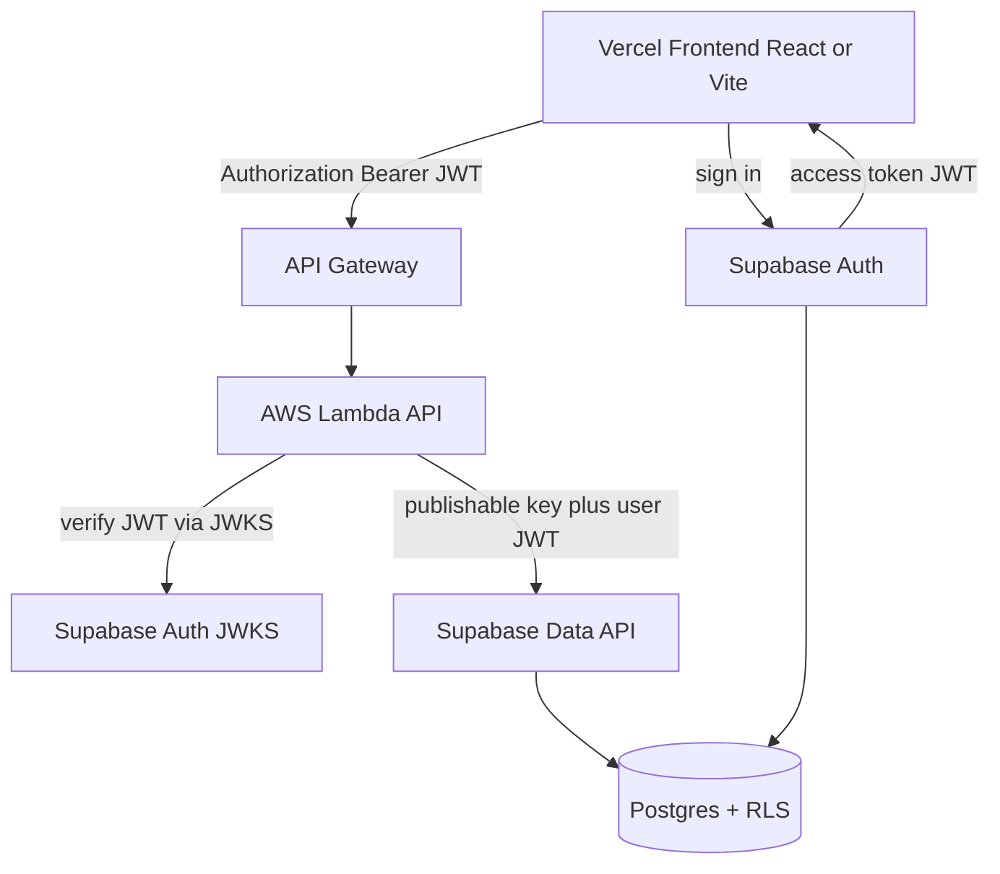
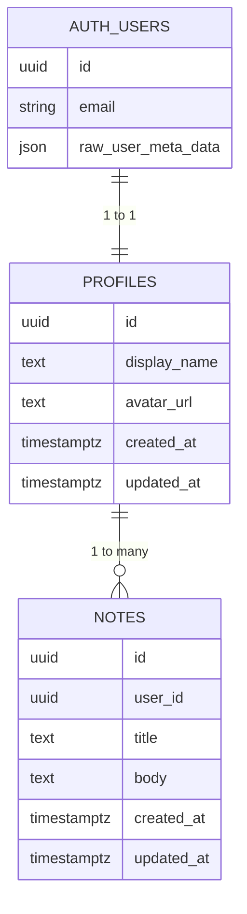
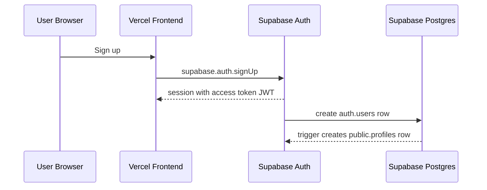
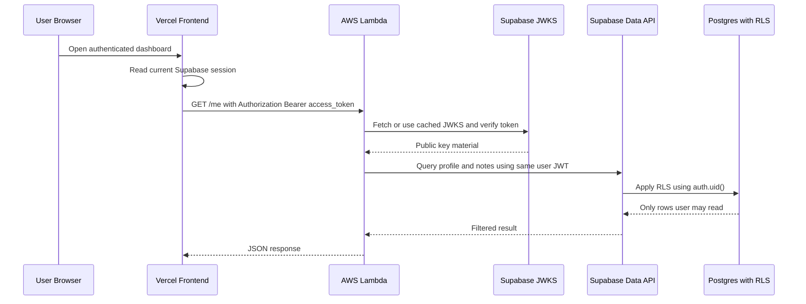
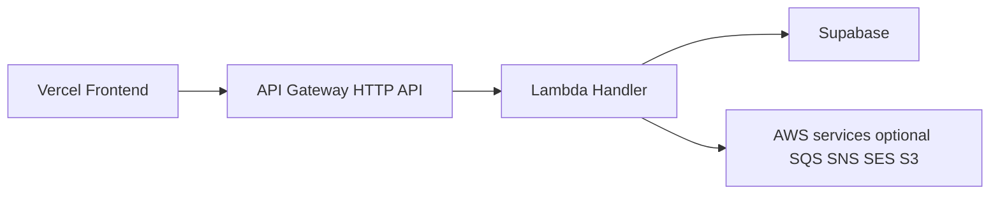
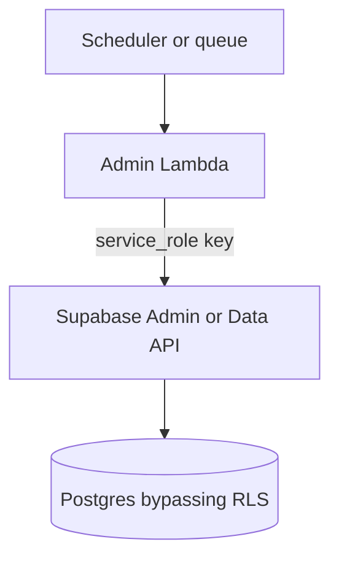
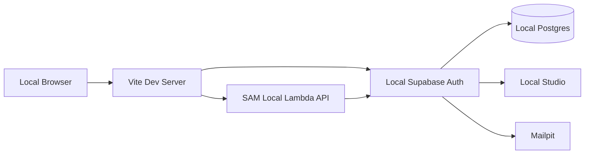
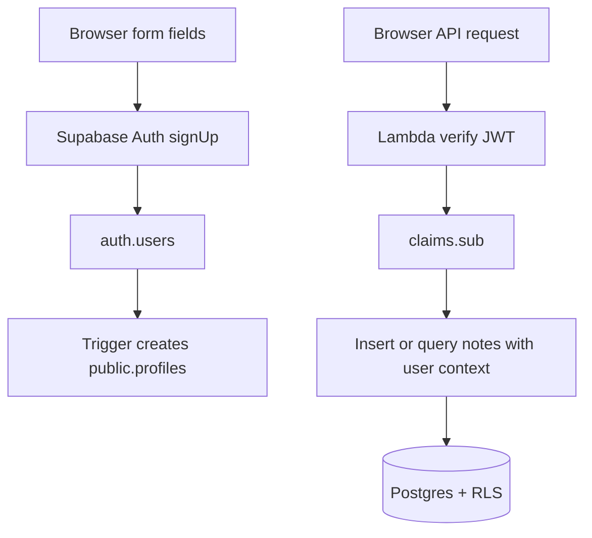

# Supabase + AWS Lambda + Vercel: A Practical Full-Stack Sample Project

*Last updated: 2026-04-22*

This guide walks through a concrete sample project that uses:

- **Supabase** for **Postgres + Auth**
- **AWS Lambda + API Gateway** for the **backend API**
- **Vercel** for the **frontend**

The sample app is a small authenticated notes app:

- users sign up and sign in with Supabase Auth
- user identity lives in `auth.users`
- application profile data lives in `public.profiles`
- note data lives in `public.notes`
- the browser sends the Supabase access token to AWS Lambda
- Lambda verifies the JWT and calls Supabase using the same user token
- **RLS remains the real authorization layer**

This is a good architecture when:

- you want Postgres and Supabase Auth
- you already use AWS for APIs or integrations
- you want Vercel for frontend DX and previews
- you do **not** want the client directly responsible for all business logic

It is **not** the simplest possible stack. The whole point of this guide is to show how to make the cross-vendor auth flow explicit and safe.

---

## Table of Contents

1. [What We Are Building](#what-we-are-building)
2. [The Main Architectural Rule](#the-main-architectural-rule)
3. [High-Level Architecture](#high-level-architecture)
4. [Project Layout](#project-layout)
5. [How to Think About User Data](#how-to-think-about-user-data)
6. [JWT Handshake Across Vercel, Lambda, and Supabase](#jwt-handshake-across-vercel-lambda-and-supabase)
7. [Supabase Schema and RLS](#supabase-schema-and-rls)
8. [Frontend Code on Vercel](#frontend-code-on-vercel)
9. [AWS Lambda API Code](#aws-lambda-api-code)
10. [AWS API Gateway and Deployment Shape](#aws-api-gateway-and-deployment-shape)
11. [Environment Variables](#environment-variables)
12. [Local Development Workflow](#local-development-workflow)
13. [How User Data Should Flow](#how-user-data-should-flow)
14. [Common Mistakes in This Stack](#common-mistakes-in-this-stack)
15. [When to Choose a Different Infra Mix](#when-to-choose-a-different-infra-mix)
16. [Recommended Variants](#recommended-variants)
17. [Official References](#official-references)

---

## What We Are Building

The sample project has these user-facing features:

- sign up with email and password
- sign in
- load the current user profile
- list the current user's notes
- create a note

The sample project has these backend rules:

- the frontend never receives any server-only key
- Lambda never trusts a `user_id` from the request body
- the JWT `sub` claim is the canonical user ID
- Supabase RLS policies decide which rows the user can read or write

---

## The Main Architectural Rule

> **Use Supabase Auth for identity, and use Postgres RLS for authorization, even when your API runs on AWS Lambda.**

That means:

- Vercel frontend signs the user in with Supabase
- frontend sends the access token to Lambda as `Authorization: Bearer <jwt>`
- Lambda verifies the JWT
- Lambda creates a Supabase client scoped to that same JWT
- Supabase applies RLS with `auth.uid()`

If you keep this rule, the stack stays coherent.

If you break this rule and use a privileged key for everyday user traffic, your app will still appear to work, but your authorization model becomes much easier to get wrong.

---

## High-Level Architecture



### Why this split can make sense

- **Supabase** is very strong for auth, Postgres, and RLS
- **Lambda** is good when your API needs AWS-native integrations, queues, or server-side orchestration
- **Vercel** is good for fast frontend deploys and previews

### What this split costs you

- cross-origin concerns
- more environment variable surfaces
- multi-vendor logs and debugging
- more careful JWT handling

If you do not actually need Lambda, there are simpler options later in this guide.

---

## Project Layout

A practical monorepo layout:

```text
mynote-stack/
  apps/
    api/
      src/
        auth.ts
        handler.ts
      package.json
      tsconfig.json
      template.yaml
    web/
      src/
        lib/
          api.ts
          supabase.ts
        App.tsx
      package.json
      vite.config.ts
  supabase/
    migrations/
      202604220001_initial_schema.sql
```

The responsibilities are:

- `apps/web`: UI, sign-in, token forwarding, rendering
- `apps/api`: JWT verification, HTTP handlers, orchestration
- `supabase/migrations`: schema, triggers, policies

---

## How to Think About User Data

This is the first place teams get confused.

Do **not** treat Supabase Auth as the place to store all app user data.

A much better split is:

- `auth.users`: identity record managed by Supabase Auth
- `public.profiles`: app profile data you query in the app
- `public.notes`: business data owned by a user

### Recommended data ownership model



### Practical rules for user data

- use the JWT `sub` claim as the stable user ID
- use `public.profiles` for mutable app-facing profile data
- use `public.notes` and other business tables for domain data
- do not put large or frequently changing profile data into JWT claims
- do not trust client-submitted `user_id`

### What should live in the JWT

Usually:

- `sub`
- `email`
- `role`
- a few carefully chosen claims if you truly need them

### What should not usually live in the JWT

- full profile objects
- app preferences
- large team membership lists
- note counts, billing state, feature usage, or other changing business data

JWTs are for short-lived identity and auth context, not as your main user data store.

---

## JWT Handshake Across Vercel, Lambda, and Supabase

This is the most important part of the whole guide.

### Sign-up and session creation flow



On later sign-ins for an existing user, Supabase returns a new session JWT but does **not** create a new `auth.users` row.

### Authenticated API call flow



### The two key security points

1. **Lambda verifies the JWT before trusting claims like `sub`.**
2. **Lambda still queries Supabase as the user, not as an all-powerful admin.**

That second point is what keeps RLS meaningful.

### Recommended verification approach

For modern Supabase projects using asymmetric signing keys, verify the JWT against the project's JWKS endpoint:

```text
https://<project-ref>.supabase.co/auth/v1/.well-known/jwks.json
```

If your project still uses the legacy shared-secret JWT setup, Supabase docs recommend verification through the Auth server rather than assuming JWKS-based local verification will work.

### Optional API Gateway JWT authorizer

AWS API Gateway supports JWT authorizers. In theory, you can push some JWT validation earlier to the gateway.

In practice, many teams using Supabase Auth still start with verification inside Lambda because:

- the claims logic is easier to make explicit in code
- issuer and audience alignment can be easy to misconfigure
- you often still need custom app logic after validation anyway

A practical progression is:

1. verify in Lambda first
2. add an authorizer later if you want gateway-level rejection

---

## Supabase Schema and RLS

Create a migration such as `supabase/migrations/202604220001_initial_schema.sql`:

```sql
create extension if not exists pgcrypto;

create or replace function public.set_updated_at()
returns trigger
language plpgsql
as $$
begin
  new.updated_at = now();
  return new;
end;
$$;

create table public.profiles (
  id uuid primary key references auth.users(id) on delete cascade,
  display_name text,
  avatar_url text,
  created_at timestamptz not null default now(),
  updated_at timestamptz not null default now()
);

create table public.notes (
  id uuid primary key default gen_random_uuid(),
  user_id uuid not null references public.profiles(id) on delete cascade,
  title text not null check (char_length(title) between 1 and 200),
  body text not null default '',
  created_at timestamptz not null default now(),
  updated_at timestamptz not null default now()
);

create trigger set_profiles_updated_at
before update on public.profiles
for each row
execute function public.set_updated_at();

create trigger set_notes_updated_at
before update on public.notes
for each row
execute function public.set_updated_at();

create or replace function public.handle_new_user()
returns trigger
language plpgsql
security definer
set search_path = public
as $$
begin
  insert into public.profiles (id, display_name)
  values (
    new.id,
    coalesce(new.raw_user_meta_data ->> 'display_name', split_part(new.email, '@', 1))
  );
  return new;
end;
$$;

drop trigger if exists on_auth_user_created on auth.users;

create trigger on_auth_user_created
after insert on auth.users
for each row
execute function public.handle_new_user();

alter table public.profiles enable row level security;
alter table public.notes enable row level security;

create policy "users can view own profile"
on public.profiles
for select
using ((select auth.uid()) = id);

create policy "users can update own profile"
on public.profiles
for update
using ((select auth.uid()) = id)
with check ((select auth.uid()) = id);

create policy "users can read own notes"
on public.notes
for select
using ((select auth.uid()) = user_id);

create policy "users can insert own notes"
on public.notes
for insert
with check ((select auth.uid()) = user_id);

create policy "users can update own notes"
on public.notes
for update
using ((select auth.uid()) = user_id)
with check ((select auth.uid()) = user_id);

create policy "users can delete own notes"
on public.notes
for delete
using ((select auth.uid()) = user_id);
```

### Why this schema works well

- `auth.users` remains the source of identity truth
- the profile row is created automatically after sign-up
- `notes.user_id` ties every note to the authenticated user
- RLS prevents users from seeing or mutating each other's rows

### The most important application rule

When the browser calls Lambda to create a note, the browser should send:

- `title`
- `body`

It should **not** send:

- `user_id`

Lambda derives the user from the verified JWT.

---

## Frontend Code on Vercel

This sample uses a Vite React app deployed on Vercel.

### Frontend environment variables

Create `.env.local` for local development:

```bash
VITE_SUPABASE_URL=https://your-project-ref.supabase.co
VITE_SUPABASE_PUBLISHABLE_KEY=your-publishable-key
VITE_API_BASE_URL=https://your-api.example.com
```

In Vercel, configure the same variables in the project settings for:

- development
- preview
- production

### `src/lib/supabase.ts`

```ts
import { createClient } from "@supabase/supabase-js";

export const supabase = createClient(
  import.meta.env.VITE_SUPABASE_URL,
  import.meta.env.VITE_SUPABASE_PUBLISHABLE_KEY
);
```

### `src/lib/api.ts`

This file is the handoff point between the Supabase-authenticated browser session and the AWS API.

```ts
import { supabase } from "./supabase";

const API_BASE_URL = import.meta.env.VITE_API_BASE_URL;

export async function apiFetch<T>(path: string, init: RequestInit = {}): Promise<T> {
  const {
    data: { session },
  } = await supabase.auth.getSession();

  if (!session?.access_token) {
    throw new Error("No active Supabase session");
  }

  const headers = new Headers(init.headers);
  headers.set("Authorization", `Bearer ${session.access_token}`);

  if (init.body && !headers.has("Content-Type")) {
    headers.set("Content-Type", "application/json");
  }

  const response = await fetch(`${API_BASE_URL}${path}`, {
    ...init,
    headers,
  });

  if (!response.ok) {
    const message = await response.text();
    throw new Error(message || `Request failed with ${response.status}`);
  }

  return response.json() as Promise<T>;
}
```

### `src/App.tsx`

This is intentionally small. The point is to show the auth flow clearly.

```tsx
import { FormEvent, useEffect, useState } from "react";
import { apiFetch } from "./lib/api";
import { supabase } from "./lib/supabase";

type Note = {
  id: string;
  title: string;
  body: string;
  created_at: string;
};

type MeResponse = {
  user: {
    id: string;
    email: string | null;
    profile: {
      display_name: string | null;
      avatar_url: string | null;
    } | null;
  };
  notes: Note[];
};

export default function App() {
  const [email, setEmail] = useState("");
  const [password, setPassword] = useState("");
  const [displayName, setDisplayName] = useState("");
  const [title, setTitle] = useState("");
  const [body, setBody] = useState("");
  const [me, setMe] = useState<MeResponse | null>(null);
  const [loading, setLoading] = useState(true);

  async function loadMe() {
    const data = await apiFetch<MeResponse>("/me");
    setMe(data);
  }

  useEffect(() => {
    supabase.auth.getSession().then(async ({ data }) => {
      if (data.session) {
        await loadMe();
      }
      setLoading(false);
    });

    const {
      data: { subscription },
    } = supabase.auth.onAuthStateChange(async (_event, session) => {
      if (session) {
        await loadMe();
      } else {
        setMe(null);
      }
    });

    return () => subscription.unsubscribe();
  }, []);

  async function signUp(event: FormEvent) {
    event.preventDefault();

    const { error } = await supabase.auth.signUp({
      email,
      password,
      options: {
        data: {
          display_name: displayName,
        },
      },
    });

    if (error) {
      alert(error.message);
      return;
    }

    alert("Sign-up succeeded. Confirm your email if confirmation is enabled.");
  }

  async function signIn(event: FormEvent) {
    event.preventDefault();

    const { error } = await supabase.auth.signInWithPassword({
      email,
      password,
    });

    if (error) {
      alert(error.message);
    }
  }

  async function signOut() {
    await supabase.auth.signOut();
    setMe(null);
  }

  async function createNote(event: FormEvent) {
    event.preventDefault();

    await apiFetch<Note>("/notes", {
      method: "POST",
      body: JSON.stringify({ title, body }),
    });

    setTitle("");
    setBody("");
    await loadMe();
  }

  if (loading) {
    return <p>Loading...</p>;
  }

  if (!me) {
    return (
      <main>
        <h1>MyNote Sample</h1>

        <form onSubmit={signUp}>
          <input
            value={displayName}
            onChange={(event) => setDisplayName(event.target.value)}
            placeholder="Display name"
          />
          <input
            value={email}
            onChange={(event) => setEmail(event.target.value)}
            placeholder="Email"
          />
          <input
            type="password"
            value={password}
            onChange={(event) => setPassword(event.target.value)}
            placeholder="Password"
          />
          <button type="submit">Sign up</button>
        </form>

        <form onSubmit={signIn}>
          <input
            value={email}
            onChange={(event) => setEmail(event.target.value)}
            placeholder="Email"
          />
          <input
            type="password"
            value={password}
            onChange={(event) => setPassword(event.target.value)}
            placeholder="Password"
          />
          <button type="submit">Sign in</button>
        </form>
      </main>
    );
  }

  return (
    <main>
      <h1>Welcome {me.user.profile?.display_name ?? me.user.email ?? me.user.id}</h1>
      <button onClick={signOut}>Sign out</button>

      <form onSubmit={createNote}>
        <input
          value={title}
          onChange={(event) => setTitle(event.target.value)}
          placeholder="Note title"
        />
        <textarea
          value={body}
          onChange={(event) => setBody(event.target.value)}
          placeholder="Note body"
        />
        <button type="submit">Create note</button>
      </form>

      <ul>
        {me.notes.map((note) => (
          <li key={note.id}>
            <strong>{note.title}</strong>
            <p>{note.body}</p>
          </li>
        ))}
      </ul>
    </main>
  );
}
```

### Why the frontend code is deliberately thin

The frontend should:

- manage the session
- send the JWT
- render results

The frontend should **not** be the only place where authorization logic lives.

---

## AWS Lambda API Code

### Install packages

```bash
npm install @supabase/supabase-js jose
npm install -D typescript esbuild @types/aws-lambda
```

### `src/auth.ts`

This file is where Lambda verifies the Supabase JWT and creates a user-scoped Supabase client.

```ts
import { createClient } from "@supabase/supabase-js";
import { createRemoteJWKSet, JWTPayload, jwtVerify } from "jose";

const SUPABASE_URL = process.env.SUPABASE_URL!;
const SUPABASE_PUBLISHABLE_KEY = process.env.SUPABASE_PUBLISHABLE_KEY!;
const SUPABASE_ISSUER = `${SUPABASE_URL}/auth/v1`;

const PROJECT_JWKS = createRemoteJWKSet(
  new URL(`${SUPABASE_ISSUER}/.well-known/jwks.json`)
);

export type AuthClaims = JWTPayload & {
  sub: string;
  email?: string;
  role?: string;
};

export function getBearerToken(headerValue?: string) {
  if (!headerValue?.startsWith("Bearer ")) {
    return null;
  }

  return headerValue.slice("Bearer ".length);
}

export async function verifySupabaseJwt(jwt: string): Promise<AuthClaims> {
  const { payload } = await jwtVerify(jwt, PROJECT_JWKS, {
    issuer: SUPABASE_ISSUER,
  });

  if (typeof payload.sub !== "string") {
    throw new Error("Invalid JWT subject");
  }

  return payload as AuthClaims;
}

export function createUserScopedSupabaseClient(accessToken: string) {
  return createClient(SUPABASE_URL, SUPABASE_PUBLISHABLE_KEY, {
    accessToken: async () => accessToken,
    auth: {
      persistSession: false,
      autoRefreshToken: false,
      detectSessionInUrl: false,
    },
  });
}
```

### Why this is the right boundary

- JWT validation happens before your API trusts `sub`
- Supabase requests still execute in the user's security context
- RLS still enforces access

### `src/handler.ts`

This file implements three routes:

- `GET /health`
- `GET /me`
- `POST /notes`

```ts
import type {
  APIGatewayProxyEventV2,
  APIGatewayProxyStructuredResultV2,
} from "aws-lambda";
import {
  createUserScopedSupabaseClient,
  getBearerToken,
  verifySupabaseJwt,
} from "./auth";

function parseAllowlist() {
  return (process.env.CORS_ALLOWLIST ?? "")
    .split(",")
    .map((value) => value.trim())
    .filter(Boolean);
}

function corsHeaders(origin?: string) {
  const allowlist = parseAllowlist();
  const allowOrigin = origin && allowlist.includes(origin) ? origin : allowlist[0] ?? "";

  return {
    "access-control-allow-origin": allowOrigin,
    "access-control-allow-headers": "authorization,content-type",
    "access-control-allow-methods": "GET,POST,OPTIONS",
    vary: "Origin",
  };
}

function json(
  statusCode: number,
  origin: string | undefined,
  body: unknown
): APIGatewayProxyStructuredResultV2 {
  return {
    statusCode,
    headers: {
      ...corsHeaders(origin),
      "content-type": "application/json",
    },
    body: JSON.stringify(body),
  };
}

export async function handler(
  event: APIGatewayProxyEventV2
): Promise<APIGatewayProxyStructuredResultV2> {
  const origin = event.headers.origin ?? event.headers.Origin;
  const method = event.requestContext.http.method;
  const path = event.rawPath;

  if (method === "OPTIONS") {
    return {
      statusCode: 204,
      headers: corsHeaders(origin),
    };
  }

  if (method === "GET" && path === "/health") {
    return json(200, origin, { ok: true });
  }

  const authHeader = event.headers.authorization ?? event.headers.Authorization;
  const accessToken = getBearerToken(authHeader);

  if (!accessToken) {
    return json(401, origin, { error: "Missing bearer token" });
  }

  let claims;

  try {
    claims = await verifySupabaseJwt(accessToken);
  } catch {
    return json(401, origin, { error: "Invalid or expired JWT" });
  }

  const supabase = createUserScopedSupabaseClient(accessToken);

  if (method === "GET" && path === "/me") {
    const [{ data: profile, error: profileError }, { data: notes, error: notesError }] =
      await Promise.all([
        supabase
          .from("profiles")
          .select("display_name, avatar_url")
          .eq("id", claims.sub)
          .single(),
        supabase
          .from("notes")
          .select("id, title, body, created_at")
          .order("created_at", { ascending: false }),
      ]);

    if (profileError) {
      return json(500, origin, { error: profileError.message });
    }

    if (notesError) {
      return json(500, origin, { error: notesError.message });
    }

    return json(200, origin, {
      user: {
        id: claims.sub,
        email: typeof claims.email === "string" ? claims.email : null,
        profile,
      },
      notes,
    });
  }

  if (method === "POST" && path === "/notes") {
    const payload = event.body ? JSON.parse(event.body) : {};

    if (typeof payload.title !== "string" || payload.title.trim() === "") {
      return json(400, origin, { error: "title is required" });
    }

    const body = typeof payload.body === "string" ? payload.body : "";

    const { data, error } = await supabase
      .from("notes")
      .insert({
        user_id: claims.sub,
        title: payload.title.trim(),
        body,
      })
      .select("id, title, body, created_at")
      .single();

    if (error) {
      return json(500, origin, { error: error.message });
    }

    return json(201, origin, data);
  }

  return json(404, origin, { error: "Not found" });
}
```

### The most important line in the Lambda code

This line:

```ts
accessToken: async () => accessToken
```

means:

> "Query Supabase using the current user's JWT."

That is the line that preserves user-context authorization instead of silently switching to admin-context access.

### Optional authoritative user lookup

If you need to confirm user details directly with the Auth server instead of trusting the JWT claims alone, use `auth.getUser(jwt)` server-side.

That is useful when:

- you need the freshest user object
- you are on a legacy shared-secret JWT setup
- you want a server round-trip as the source of truth

For most request-path authorization in modern projects, JWKS verification plus user-scoped Supabase queries is the better default.

---

## AWS API Gateway and Deployment Shape

### Recommended deployment shape



### Minimal AWS SAM template

`template.yaml`:

```yaml
AWSTemplateFormatVersion: "2010-09-09"
Transform: AWS::Serverless-2016-10-31

Resources:
  NotesHttpApi:
    Type: AWS::Serverless::HttpApi
    Properties:
      CorsConfiguration:
        AllowOrigins:
          - http://localhost:5173
          - https://your-app.vercel.app
        AllowHeaders:
          - authorization
          - content-type
        AllowMethods:
          - GET
          - POST
          - OPTIONS

  NotesFunction:
    Type: AWS::Serverless::Function
    Properties:
      Runtime: nodejs22.x
      Handler: dist/handler.handler
      CodeUri: .
      MemorySize: 512
      Timeout: 10
      Environment:
        Variables:
          SUPABASE_URL: https://your-project-ref.supabase.co
          SUPABASE_PUBLISHABLE_KEY: your-publishable-key
          CORS_ALLOWLIST: http://localhost:5173,https://your-app.vercel.app
      Events:
        GetHealth:
          Type: HttpApi
          Properties:
            ApiId: !Ref NotesHttpApi
            Path: /health
            Method: GET
        GetMe:
          Type: HttpApi
          Properties:
            ApiId: !Ref NotesHttpApi
            Path: /me
            Method: GET
        PostNotes:
          Type: HttpApi
          Properties:
            ApiId: !Ref NotesHttpApi
            Path: /notes
            Method: POST
```

### Practical note on CORS and Vercel previews

Vercel preview deployments create changing URLs.

That means you need to think about one of these:

- exact allowlist entries per stable environment
- a stable custom staging domain
- a Lambda-managed dynamic allowlist

Do **not** casually allow every possible origin just to get past CORS errors.

---

## Environment Variables

### Vercel frontend

Use these on Vercel:

```bash
VITE_SUPABASE_URL=https://your-project-ref.supabase.co
VITE_SUPABASE_PUBLISHABLE_KEY=your-publishable-key
VITE_API_BASE_URL=https://your-api.example.com
```

### AWS Lambda

Use these in Lambda:

```bash
SUPABASE_URL=https://your-project-ref.supabase.co
SUPABASE_PUBLISHABLE_KEY=your-publishable-key
CORS_ALLOWLIST=http://localhost:5173,https://your-app.vercel.app
```

### When to use `SUPABASE_SERVICE_ROLE_KEY`

Only use `SUPABASE_SERVICE_ROLE_KEY` in Lambda for:

- admin-only jobs
- migrations or import tooling
- trusted background workflows
- invite flows using `supabase.auth.admin.*`

Do **not** use it for routine user API requests.

### Admin job flow



That is correct for trusted system jobs.

That is the wrong default for ordinary per-user endpoints.

---

## Local Development Workflow

### 1. Start local Supabase

```bash
npx supabase init
npx supabase start
npx supabase db reset
```

### 2. Start the frontend

```bash
cd apps/web
npm install
npm run dev
```

### 3. Run the Lambda API locally

Using AWS SAM is a practical option:

```bash
cd apps/api
npm install
npm run build
sam build
sam local start-api
```

### 4. Point the frontend at local services

For example:

```bash
VITE_SUPABASE_URL=http://127.0.0.1:54321
VITE_SUPABASE_PUBLISHABLE_KEY=<local-publishable-or-anon-key>
VITE_API_BASE_URL=http://127.0.0.1:3000
```

### Local environment picture



---

## How User Data Should Flow

This is the cleanest pattern.

### Sign-up time

- user submits email, password, display name
- frontend calls `supabase.auth.signUp`
- Supabase creates `auth.users`
- DB trigger creates `public.profiles`

### Request time

- frontend reads current session
- frontend sends access token to Lambda
- Lambda verifies JWT
- Lambda reads `claims.sub`
- Lambda queries `profiles` and `notes` as that user

### Write time

- frontend sends note fields only
- Lambda injects `user_id = claims.sub`
- Supabase RLS verifies the row matches `auth.uid()`

### Data ownership diagram



### Why this is the right split

- identity comes from Auth
- mutable app data comes from your tables
- authorization comes from RLS
- Lambda handles orchestration, not identity invention

---

## Common Mistakes in This Stack

### 1. Using a privileged key for normal user traffic

This is the biggest mistake.

If user endpoints use a privileged key, RLS is no longer the thing protecting your data.

### 2. Trusting `user_id` from the browser

Never do this:

```json
{
  "user_id": "someone-else-id",
  "title": "bad idea"
}
```

Always derive the user from the verified JWT.

### 3. Treating JWT claims as your main profile store

Use JWT claims for identity context.

Use database tables for real user data.

### 4. Making authorization decisions only in frontend code

Frontend checks are UX hints.

RLS is the real gate.

### 5. Forgetting CORS and preview-domain behavior

Cross-vendor frontends and APIs make this easy to miss.

### 6. Mixing old and new key terminology carelessly

Supabase now recommends **publishable** and **secret** API keys. Many older examples still show `anon` and `service_role`.

Be explicit about which kind of key you are actually using.

---

## When to Choose a Different Infra Mix

This stack is strong, but it is not always the best default.

Choose something simpler if your needs are simpler.

### If your API is mostly CRUD over your own tables

A simpler option is:

- Vercel frontend
- Supabase Auth
- direct Supabase queries from the client
- RLS for authorization

That removes Lambda entirely.

### If you want server-side code but less cross-vendor complexity

A simpler option is:

- Vercel frontend
- Supabase Auth + DB
- **Supabase Edge Functions**

That reduces CORS and vendor sprawl.

### If you want everything inside AWS

A more AWS-native option is:

- Vercel or another frontend host
- **Amazon Cognito** for auth
- **API Gateway + Lambda**
- **Aurora Postgres or RDS Postgres**

That may fit better for organizations with strict AWS-only requirements.

### If you want very low-latency edge APIs

A strong alternative is:

- frontend on Vercel or Cloudflare
- Supabase for Auth + Postgres
- **Cloudflare Workers** for the API layer

That can feel lighter than API Gateway + Lambda for globally distributed APIs.

---

## Recommended Variants

### Variant 1: simplest product stack

- Vercel frontend
- Supabase Auth + DB
- direct client queries
- Supabase Edge Functions only when needed

Pick this if:

- your product is mostly app CRUD
- you do not need AWS-specific integrations yet
- you want fewer moving parts

### Variant 2: this guide's stack

- Vercel frontend
- Supabase Auth + DB
- AWS Lambda API

Pick this if:

- you need AWS integrations
- you want a central API boundary
- you are comfortable owning cross-vendor auth flow and ops

### Variant 3: AWS-heavy enterprise stack

- frontend on Vercel or AWS
- Amazon Cognito
- API Gateway + Lambda
- Aurora or RDS

Pick this if:

- your organization strongly prefers AWS-native IAM and networking
- you need unified AWS governance
- you are willing to give up Supabase's built-in developer workflow

### Variant 4: edge-first stack

- frontend on Vercel or Cloudflare
- Supabase Auth + DB
- Cloudflare Workers or Supabase Edge Functions

Pick this if:

- low-latency edge execution matters
- your API layer is request-driven and relatively lightweight
- you want less operational friction than the Vercel + AWS + Supabase split

---

## Official References

These are the main official docs used to shape this guide.

- Supabase Auth overview: [https://supabase.com/docs/guides/auth](https://supabase.com/docs/guides/auth)
- Supabase JWTs: [https://supabase.com/docs/guides/auth/jwts](https://supabase.com/docs/guides/auth/jwts)
- Supabase JWT claims reference: [https://supabase.com/docs/guides/auth/jwt-fields](https://supabase.com/docs/guides/auth/jwt-fields)
- Supabase `auth.getClaims()`: [https://supabase.com/docs/reference/javascript/auth-getclaims](https://supabase.com/docs/reference/javascript/auth-getclaims)
- Supabase `auth.getUser()`: [https://supabase.com/docs/reference/javascript/auth-getuser](https://supabase.com/docs/reference/javascript/auth-getuser)
- Supabase Row Level Security: [https://supabase.com/docs/guides/database/postgres/row-level-security](https://supabase.com/docs/guides/database/postgres/row-level-security)
- Supabase Edge Functions: [https://supabase.com/docs/guides/functions](https://supabase.com/docs/guides/functions)
- Supabase securing Edge Functions: [https://supabase.com/docs/guides/functions/auth](https://supabase.com/docs/guides/functions/auth)
- AWS Lambda with TypeScript: [https://docs.aws.amazon.com/lambda/latest/dg/lambda-typescript.html](https://docs.aws.amazon.com/lambda/latest/dg/lambda-typescript.html)
- API Gateway JWT authorizers: [https://docs.aws.amazon.com/apigateway/latest/developerguide/http-api-jwt-authorizer.html](https://docs.aws.amazon.com/apigateway/latest/developerguide/http-api-jwt-authorizer.html)
- Vercel environment variables: [https://vercel.com/docs/environment-variables](https://vercel.com/docs/environment-variables)
- Vite on Vercel: [https://vercel.com/docs/frameworks/frontend/vite](https://vercel.com/docs/frameworks/frontend/vite)
- Supabase local development: [https://supabase.com/docs/guides/local-development](https://supabase.com/docs/guides/local-development)
- Cloudflare Workers overview: [https://developers.cloudflare.com/workers/](https://developers.cloudflare.com/workers/)
- Amazon Cognito overview: [https://docs.aws.amazon.com/cognito/latest/developerguide/what-is-amazon-cognito.html](https://docs.aws.amazon.com/cognito/latest/developerguide/what-is-amazon-cognito.html)
