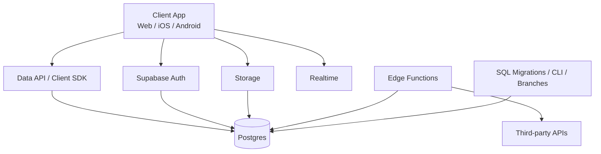
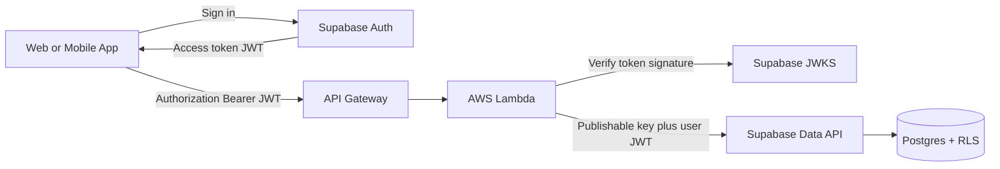
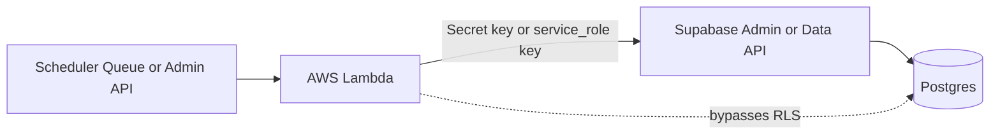
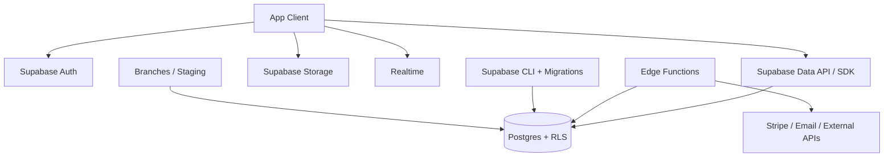

# Practical Guidance for Using Supabase

*Last updated: 2026-04-22*

This guide is a practical, engineer-focused overview of Supabase: what it is good at, where it can bite you, how to structure projects, how to think about security and cost, and how to ship with it responsibly.

It is written to be useful for real product work rather than as a feature brochure.

---

## Table of Contents

1. [What Supabase Actually Is](#what-supabase-actually-is)
2. [When Supabase Is a Great Fit](#when-supabase-is-a-great-fit)
3. [When Supabase Is a Poor Fit](#when-supabase-is-a-poor-fit)
4. [A Good Mental Model](#a-good-mental-model)
5. [Current Pricing Model and Cost Control](#current-pricing-model-and-cost-control)
6. [Recommended Project Setup](#recommended-project-setup)
7. [Local Development and Migrations](#local-development-and-migrations)
8. [Database Design Advice](#database-design-advice)
9. [Auth, JWTs, and Row Level Security](#auth-jwts-and-row-level-security)
10. [Using Supabase Auth with AWS Lambda](#using-supabase-auth-with-aws-lambda)
11. [Storage Patterns](#storage-patterns)
12. [Realtime Guidance](#realtime-guidance)
13. [Edge Functions vs Database Functions vs Client Logic](#edge-functions-vs-database-functions-vs-client-logic)
14. [Performance, Scaling, and Observability](#performance-scaling-and-observability)
15. [Backups, Recovery, and Branching](#backups-recovery-and-branching)
16. [Practical iOS / Swift Guidance](#practical-ios--swift-guidance)
17. [Common Pitfalls](#common-pitfalls)
18. [A Launch Checklist](#a-launch-checklist)
19. [Suggested Starter Architecture](#suggested-starter-architecture)
20. [Official References](#official-references)

---

## What Supabase Actually Is

Supabase is not just “hosted Postgres.” A Supabase project gives you a **dedicated Postgres instance** plus a bundle of productized backend services around it:

- **Postgres database**
- **Auth**
- **Storage**
- **Realtime**
- **Auto-generated APIs / Data API**
- **Edge Functions**
- **Dashboard / Studio**
- **CLI for local dev, migrations, and deployment**
- **Backups and optional Point-in-Time Recovery**
- **Branching / preview environments**

That combination is why Supabase often feels much faster than rolling your own Postgres + API + auth + file storage stack.

The core design principle is important:

> **Supabase is PostgreSQL-first.**
>
> If you understand relational schema design, SQL, migrations, roles, and policies, you can get a lot of value out of it.

---

## When Supabase Is a Great Fit

Supabase is a strong choice when you want most of the following:

- A **real relational database**, not document storage
- Fast product iteration with **minimal DevOps overhead**
- Built-in auth for sign-up, sign-in, session handling, and JWT issuance, plus storage and realtime, without stitching together many services
- Strong authorization with **Row Level Security (RLS)**
- A path to more advanced Postgres features such as **extensions**, **functions**, and **pgvector**
- A team that is comfortable owning schema and SQL

Typical good fits:

- SaaS MVPs that still need a real relational model
- Mobile app backends
- Internal tools and admin systems
- Products that need user auth + per-user data isolation
- Systems where SQL reporting and joins matter
- AI products that benefit from `pgvector`

---

## When Supabase Is a Poor Fit

Supabase may be the wrong default when your main need is one of these:

- Highly custom infrastructure or networking requirements from day one
- Very large-scale workloads that need deeper control over database topology and tuning
- An organization that already runs everything inside a strict AWS/GCP platform model
- A team that does **not** want to own SQL, migrations, or RLS policies
- Heavy backend logic better suited to a larger service platform

In those cases, raw Postgres on AWS RDS / Aurora or a more custom backend may be a better long-term fit.

---

## A Good Mental Model



### The practical way to think about it

- **Postgres is the source of truth.**
- **Auth issues JWTs.**
- **RLS decides what each user can read or write.**
- **Storage policies should align with the same access model.**
- **Edge Functions are for trusted server-side work and external integrations.**
- **CLI + migrations + branches are how you keep change safe.**

If you build with that mental model, Supabase usually feels coherent.

---

## Current Pricing Model and Cost Control

> Pricing changes over time. Always verify current limits and rates on the official pricing pages before making commitments.

### 1. Billing structure

Supabase bills **by organization**, and each organization has its own subscription plan. Different plans cannot be mixed inside one organization. If you want some projects on Free and others on Pro, you need separate organizations.

Also, **each project has its own dedicated Postgres instance**, and every project increases compute cost.

### 2. Practical pricing takeaway

For many teams, the base plan is **not** the whole bill. In practice, your total cost can include:

- base plan subscription
- project compute
- disk or storage overages
- egress
- monthly active users (MAUs)
- realtime overages
- edge function invocations
- optional add-ons like PITR and replicas

### 3. Current officially documented examples and rates

At the time of writing, the official docs/pages state:

- **Pro plan** includes **100,000 MAUs**, **8 GB disk per project**, and **250 GB egress**.
- **MAU overage** is documented as **$0.00325 per MAU** above plan quota.
- **Storage size** overage is documented as **$0.021 per GB per month**.
- **Realtime messages** overage is documented as **$2.50 per 1 million messages**.
- **Realtime peak connections** overage is documented as **$10 per 1,000 peak connections**.
- **Edge Function invocations** overage is documented as **$2 per 1 million invocations**.

### 4. Spend Cap

Supabase’s **Spend Cap** is one of the most important cost-control features.

When Spend Cap is **on**, usage beyond quota for covered items is blocked instead of billed. When Spend Cap is **off**, your services continue and you pay overages.

Important details:

- Spend Cap is available on **Pro**
- Spend Cap does **not** cover everything
- Compute, read replica compute, custom domain, PITR, extra disk IOPS/throughput, and some other explicitly opted-in resources are **not** covered by Spend Cap

### 5. Cost advice that actually matters

1. **Count projects, not just users.** Every project adds compute.
2. **Use Pro deliberately.** The base plan is only part of the bill.
3. **Monitor MAUs carefully.** They are counted by distinct users who log in or refresh a token during the billing cycle.
4. **Watch Realtime and Storage.** These are easy to ignore until they are not.
5. **Treat PITR and replicas as production add-ons**, not defaults.
6. **If you buy via AWS Marketplace, re-check billing behavior**, because marketplace billing has some differences.

### 6. A realistic cost mindset

Supabase pricing is usually easier to reason about than per-read/per-write systems, but it is still very possible to overspend if you:

- create too many environments
- leave branches or replicas running
- overuse realtime
- grow storage carelessly
- ignore MAU behavior

---

## Recommended Project Setup

### Small team / startup recommendation

A very practical default is:

- **Local**: Supabase CLI + Docker
- **Staging**: one paid project or branch
- **Production**: one paid project

### Environment strategy

Use this default split:

| Environment | Purpose | Guidance |
|---|---|---|
| Local | fast iteration, migrations, testing | always use CLI + Docker |
| Staging | integration checks, QA | keep config close to prod |
| Production | user traffic | minimal manual edits |

### Organization strategy

Because plans are organization-based, decide early whether you want:

- one organization per company/product
- one organization per billing boundary
- separate organizations when mixing Free and Pro usage

### Branching strategy

Supabase branches are useful for safe experimentation. Each branch has its own:

- database instance
- API endpoints
- authentication settings
- storage buckets

Branches are isolated, which is powerful, but it also means they are real environments. Do not create them casually and forget them.

---

## Local Development and Migrations

Supabase CLI is one of the best reasons to take Supabase seriously.

### Why local development matters

It gives you:

- faster iteration
- offline work
- lower cost during development
- a safer place for experiments
- a reliable migration workflow

### Quick local workflow

```bash
# install the CLI (one option)
npm install supabase --save-dev

# initialize Supabase in your repo
npx supabase init

# start the local Supabase stack
npx supabase start
```

### Security note for local dev

If you are on an untrusted network, Supabase docs recommend binding the local stack to `127.0.0.1` via a dedicated Docker network. Do **not** expose your local stack publicly.

### Migration workflow recommendation

A practical workflow:

1. Make schema changes locally
2. Capture them as SQL migrations
3. Commit migration files
4. Apply them in staging
5. Apply them in production

### Good rule

> **Avoid making production-only dashboard edits when the same change should live in migration files.**

Use the dashboard for exploration and inspection; use migrations for durable change management.

---

## Database Design Advice

Supabase becomes much easier to operate when your schema is boring in a good way.

### Good defaults

- Prefer **normalized relational tables** first
- Use **UUID primary keys** or identity columns consistently
- Add `created_at` and `updated_at` on most business tables
- Use **foreign keys**
- Keep naming conventions consistent
- Add indexes based on actual query patterns
- Reserve `jsonb` for flexible payloads, not core relational structure

### Suggested conventions

- snake_case for table and column names
- singular or plural table naming, but be consistent
- explicit join tables for many-to-many relations
- soft delete only when there is a clear business need

### Example starter schema

```sql
create table public.profiles (
  id uuid primary key references auth.users(id) on delete cascade,
  username text unique not null,
  avatar_path text,
  created_at timestamptz not null default now(),
  updated_at timestamptz not null default now()
);

create table public.projects (
  id uuid primary key default gen_random_uuid(),
  owner_id uuid not null references auth.users(id) on delete cascade,
  name text not null,
  description text,
  created_at timestamptz not null default now(),
  updated_at timestamptz not null default now()
);

create table public.project_members (
  project_id uuid not null references public.projects(id) on delete cascade,
  user_id uuid not null references auth.users(id) on delete cascade,
  role text not null check (role in ('owner', 'editor', 'viewer')),
  created_at timestamptz not null default now(),
  primary key (project_id, user_id)
);
```

### Use database functions for stable business actions

A good heuristic:

- if a logic path is **security-sensitive** and closely tied to data consistency, prefer a **database function / RPC**
- if it mostly orchestrates third-party APIs, prefer an **Edge Function**

Examples of good DB function candidates:

- create a project and insert membership atomically
- invite a member
- transfer ownership
- archive a record

---

## Auth, JWTs, and Row Level Security

This is the section where many Supabase projects either become elegant or become dangerous.

### The core model

- Supabase Auth issues JWTs
- JWT claims are used inside Postgres authorization flows
- RLS policies decide which rows a caller may see or modify

### What “built-in auth” actually means

When people say Supabase has **built-in auth**, they do **not** mean “security is automatic” or “authorization is solved.”

They mean Supabase already includes a **managed authentication system** as part of the platform, so you do not need to separately build or bolt on the common identity pieces yourself.

In practice, that usually means Supabase gives you these pieces out of the box:

- user registration and sign-in endpoints
- common login methods such as email/password, magic links, one-time codes, and OAuth providers
- secure password hashing and credential storage
- session creation, refresh token handling, and sign-out flows
- JWT issuance so clients can call Supabase APIs as an authenticated user
- a managed `auth.users` table for identity records
- admin APIs for trusted server-side user management

That is the “built-in” part: the identity system is already there and wired into the rest of the platform.

### What built-in auth does not mean

Built-in auth does **not** mean:

- every signed-in user should be allowed to read every row
- your application roles are already modeled correctly
- sensitive actions are automatically safe
- client code can be trusted to enforce permissions

Authentication answers:

> **Who is this user?**

Authorization answers:

> **What is this user allowed to do?**

Supabase Auth helps with the first question. **RLS** is how you enforce the second.

### Example 1: normal email/password sign-up

Suppose you are building a notes app.

Without a built-in auth system, you would need to create or integrate:

- a users table and identity model
- password hashing and reset flows
- email verification
- session cookies or tokens
- token refresh behavior
- sign-out and account recovery flows

With Supabase Auth, the basic sign-up flow can be as simple as:

```ts
const { data, error } = await supabase.auth.signUp({
  email: "ana@example.com",
  password: "correct-horse-battery-staple"
});
```

What Supabase handles for you here:

- storing the identity in `auth.users`
- hashing the password securely
- issuing a session when appropriate
- supporting email confirmation flows
- making the authenticated user available as `auth.uid()` inside Postgres policies

Your app still needs to decide what that user can access after login.

### Example 2: passwordless email login

Suppose you want a lower-friction sign-in flow for a mobile app or lightweight SaaS.

```ts
const { error } = await supabase.auth.signInWithOtp({
  email: "ana@example.com"
});
```

Supabase can handle the email-based login flow and session creation for you. That means you avoid building password storage and reset UX entirely.

This is still built-in auth, because Supabase is operating the identity workflow rather than your team building it from scratch.

### Example 3: Google login

Suppose users want to sign in with an existing Google account.

```ts
const { data, error } = await supabase.auth.signInWithOAuth({
  provider: "google"
});
```

Supabase handles the OAuth dance, receives the identity result, and creates the authenticated session your client will use afterward.

Again, built-in auth does **not** mean Google users can see every project in your database. It only means the platform has identified the user and issued the session.

### Example 4: built-in auth plus RLS

Here is the key relationship:

- Auth says the current user is `user_123`
- RLS checks whether `user_123` owns the row or belongs to the project

That is why a policy like this matters:

```sql
create policy "users can read own notes"
on public.notes
for select
using (auth.uid() = user_id);
```

In plain English:

- Supabase Auth signs the user in
- Supabase puts the user identity into the JWT
- Postgres sees that identity through `auth.uid()`
- RLS allows only rows where `user_id` matches the signed-in user

So if Ana signs in successfully, she is authenticated. But she still cannot read Ben’s notes, because the database policy blocks it.

That is the practical meaning of “built-in auth” in Supabase:

- identity and session management are provided for you
- authorization still needs to be designed deliberately

### Example 5: server-side admin actions

Sometimes you need trusted backend-only behavior, such as inviting a user before they ever sign in.

That is where built-in auth also helps on the server side:

```ts
const { data, error } = await supabase.auth.admin.createUser({
  email: "new-user@example.com",
  email_confirm: true
});
```

This is useful for admin tooling, internal systems, migrations, or invite flows, but it should run only in a trusted server context with a server-only key.
For `supabase.auth.admin.*`, that means a `service_role` key.

This is another good example of what built-in auth means: Supabase is not just storing tokens. It exposes an actual managed identity service with both end-user and admin workflows.

### The single most important rule

> **Do not rely on the client app for authorization.**
>
> Use RLS to enforce it in the database.

### Second most important rule

> **Never ship server-only secrets to the client.**

For public/mobile/web apps, use the project URL plus a **publishable key** in the client. Keep server-only keys only in trusted server contexts.

### RLS principles

1. **Enable RLS** on exposed tables
2. Write policies for each action you allow
3. Assume the client can call your API directly
4. Make the database prove access is allowed

### Example: user-owned rows

```sql
create table public.notes (
  id uuid primary key default gen_random_uuid(),
  user_id uuid not null references auth.users(id) on delete cascade,
  body text not null,
  created_at timestamptz not null default now()
);

alter table public.notes enable row level security;

create policy "users can read own notes"
on public.notes
for select
using (auth.uid() = user_id);

create policy "users can insert own notes"
on public.notes
for insert
with check (auth.uid() = user_id);

create policy "users can update own notes"
on public.notes
for update
using (auth.uid() = user_id)
with check (auth.uid() = user_id);

create policy "users can delete own notes"
on public.notes
for delete
using (auth.uid() = user_id);
```

### Example: membership-based access

```sql
alter table public.projects enable row level security;

create policy "members can read projects"
on public.projects
for select
using (
  exists (
    select 1
    from public.project_members pm
    where pm.project_id = projects.id
      and pm.user_id = auth.uid()
  )
);
```

### Good security habits

- Keep the access model simple enough that you can reason about it
- Prefer explicit membership tables over complex implicit rules
- Write policies for `select`, `insert`, `update`, and `delete` intentionally
- Test policies with real user scenarios, not just admin users

### Things that commonly go wrong

- RLS not enabled on a newly exposed table
- A policy allows reads but forgets inserts or updates
- An update policy checks old rows but not new values
- Using a server key in client code
- Confusing “logged in” with “authorized”

---

## Using Supabase Auth with AWS Lambda

Supabase Auth works fine with AWS Lambda.

The important design choice is this:

- for normal user-triggered requests, pass the **user's access token** to Lambda and keep **RLS active**
- for trusted admin jobs, cron tasks, queue consumers, or back-office flows, use a **server-only elevated key** intentionally

### Recommended architecture for normal app traffic



The practical rule is simple:

> **If the request is acting on behalf of a signed-in user, Lambda should usually operate with that user's JWT, not with a service role key.**

That keeps your existing RLS policies in force.

### End-to-end example: client to Lambda to Supabase

In a browser or mobile client, send the Supabase access token to your AWS API:

```ts
const {
  data: { session },
} = await supabase.auth.getSession();

if (!session) {
  throw new Error("Not signed in");
}

const response = await fetch(`${API_BASE_URL}/notes`, {
  headers: {
    Authorization: `Bearer ${session.access_token}`,
  },
});
```

Then in Lambda, verify the JWT and create a Supabase client that uses the same user token.

```ts
import type { APIGatewayProxyHandlerV2 } from "aws-lambda";
import { createClient } from "@supabase/supabase-js";
import { createRemoteJWKSet, jwtVerify } from "jose";

const SUPABASE_URL = process.env.SUPABASE_URL!;
const SUPABASE_PUBLISHABLE_KEY = process.env.SUPABASE_PUBLISHABLE_KEY!;
const SUPABASE_ISSUER = `${SUPABASE_URL}/auth/v1`;

const PROJECT_JWKS = createRemoteJWKSet(
  new URL(`${SUPABASE_ISSUER}/.well-known/jwks.json`)
);

function getBearerToken(headerValue?: string) {
  if (!headerValue?.startsWith("Bearer ")) {
    return null;
  }

  return headerValue.slice("Bearer ".length);
}

export const handler: APIGatewayProxyHandlerV2 = async (event) => {
  const authHeader = event.headers.authorization ?? event.headers.Authorization;
  const accessToken = getBearerToken(authHeader);

  if (!accessToken) {
    return {
      statusCode: 401,
      body: JSON.stringify({ error: "Missing bearer token" }),
    };
  }

  try {
    const { payload } = await jwtVerify(accessToken, PROJECT_JWKS, {
      issuer: SUPABASE_ISSUER,
    });

    if (typeof payload.sub !== "string") {
      return {
        statusCode: 401,
        body: JSON.stringify({ error: "Invalid subject claim" }),
      };
    }

    const supabase = createClient(
      SUPABASE_URL,
      SUPABASE_PUBLISHABLE_KEY,
      {
        accessToken: async () => accessToken,
      }
    );

    const { data, error } = await supabase
      .from("notes")
      .select("id, body, created_at")
      .order("created_at", { ascending: false })
      .limit(20);

    if (error) {
      throw error;
    }

    return {
      statusCode: 200,
      body: JSON.stringify({
        userId: payload.sub,
        notes: data,
      }),
    };
  } catch {
    return {
      statusCode: 401,
      body: JSON.stringify({ error: "Invalid or expired token" }),
    };
  }
};
```

Why this pattern is good:

- Lambda verifies that the JWT is genuine
- Lambda does **not** need to invent its own authorization rules for ordinary reads and writes
- Supabase sees the same user identity the client had
- RLS policies continue to apply in Postgres

### Why the `accessToken` option matters

When Lambda calls Supabase as the user, prefer giving the client the user's JWT via the `accessToken` option.

That means your Lambda is effectively saying:

> "Run this query as the signed-in user."

This is usually the cleanest way to preserve your existing RLS model.

### Practical Lambda notes

- Keep `SUPABASE_PUBLISHABLE_KEY` in Lambda for user-context requests
- Keep the user's JWT in the incoming `Authorization` header
- Verify the token before trusting claims like `sub`
- If your project still uses a legacy shared-secret JWT setup, prefer verification through the Auth server rather than hand-rolling shared-secret validation

### Privileged admin or scheduled job flow

Some Lambda functions are not acting on behalf of a single end user.

Examples:

- nightly reconciliation jobs
- queue consumers
- back-office admin actions
- invite workflows
- account cleanup or reporting tasks

That is a different path:



The important warning is:

> **Secret keys and `service_role` bypass RLS.**

That is correct for trusted backend jobs, but it is the wrong default for ordinary user traffic.

### Example: admin Lambda for invite flows

For `supabase.auth.admin.*`, Supabase requires a `service_role` key. Keep it only in Lambda environment variables and never expose it to clients.

```ts
import type { ScheduledHandler } from "aws-lambda";
import { createClient } from "@supabase/supabase-js";

const supabaseAdmin = createClient(
  process.env.SUPABASE_URL!,
  process.env.SUPABASE_SERVICE_ROLE_KEY!,
  {
    auth: {
      persistSession: false,
      autoRefreshToken: false,
      detectSessionInUrl: false,
    },
  }
);

export const handler: ScheduledHandler = async () => {
  const { data, error } = await supabaseAdmin.auth.admin.createUser({
    email: "new-user@example.com",
    email_confirm: true,
  });

  if (error) {
    throw error;
  }

  console.log("Created user", data.user?.id);
};
```

Use this path only when Lambda itself is the trusted authority.

### Good default rules

1. If the request starts with a signed-in user, forward the user's JWT to Lambda and keep RLS active.
2. If the function is an internal system job, use an elevated key deliberately and keep the scope narrow.
3. Do not use a `service_role` key for routine user reads and writes unless Lambda is also enforcing authorization itself.

---

## Storage Patterns

Supabase Storage integrates nicely with RLS, but only if you set it up correctly.

### Important default

By default, Storage does **not** allow uploads to buckets without RLS policies. Policies are written against `storage.objects`.

### Recommended bucket patterns

#### Public assets bucket
Use for:

- app marketing images
- public avatars
- static public content

Rule of thumb:

- keep only truly public files here
- do not store sensitive user content in public buckets

#### Private user bucket
Use for:

- invoices
- private profile assets
- documents
- account exports

Store files under a predictable path structure, for example:

```text
users/<user_id>/avatars/<filename>
users/<user_id>/documents/<filename>
projects/<project_id>/attachments/<filename>
```

Then align RLS rules to those path patterns.

### Example policy idea

- A user may upload only into `users/<auth.uid()>/...`
- A user may read only files belonging to projects they are a member of

### Storage advice

- Store only the file path in business tables, not giant metadata blobs
- Use one canonical file path convention
- Clean up orphaned files when records are deleted
- Be deliberate about image transformations and egress costs

---

## Realtime Guidance

Supabase Realtime is powerful, but not every screen needs it.

### Good uses for Realtime

- chat messages
- collaborative cursors or presence
- live dashboards
- notification badges
- lightweight state synchronization

### Bad uses for Realtime

- every list in your app by default
- large noisy tables that change constantly
- data that users can tolerate seeing after a refresh

### Practical rule

> Use Realtime where the user experience is meaningfully improved.
>
> Do not add it just because it is available.

### Cost note

Realtime is billed on **messages** and **peak connections**, so careless use can become expensive.

---

## Edge Functions vs Database Functions vs Client Logic

A lot of architecture confusion goes away if you decide where code belongs.

| Put logic here | Best for | Avoid when |
|---|---|---|
| Client app | UI state, local validation, optimistic updates | security or trusted secrets are required |
| Database function (RPC) | data-centric actions, transactions, authorization-sensitive operations | you need third-party API calls or long external workflows |
| Edge Function | webhooks, Stripe, secret handling, trusted orchestration | the action is just a simple SQL transaction |

### Use a Database Function when

- the operation is mostly SQL
- you need a transaction
- authorization depends heavily on database state
- you want one stable API-like entry point around data rules

### Use an Edge Function when

- you need secrets
- you call third-party APIs
- you handle webhooks
- you do trusted server-side work
- you want logic near users with low latency

### Use client logic when

- it is presentational
- it is optimistic UI behavior
- it is not security-sensitive

---

## Performance, Scaling, and Observability

Supabase is still Postgres. Most performance wins are still normal Postgres wins.

### The practical performance ladder

1. Fix schema design
2. Add the right indexes
3. reduce query volume
4. inspect slow queries
5. tune app behavior
6. then scale compute

### Useful built-in/available tools

- `pg_stat_statements` for query statistics
- `index_advisor` for index suggestions in Studio
- query performance reports
- load testing in staging
- read replicas for read-heavy workloads

### Compute guidance

Each project has a dedicated Postgres instance. Free projects use **Nano**; paid projects start from **Micro**. Compute changes can incur downtime, so treat upgrades like production changes.

### Disk guidance

Compute size affects baseline disk throughput and IOPS. Smaller instances can burst, but sustained load will expose their baseline limits.

### AI / vector workloads

If you are using pgvector:

- store vectors in Postgres only when that fits the product and scale
- use the appropriate distance operator (`<->`, `<#>`, `<=>`) for your similarity strategy
- add vector indexes intentionally
- size compute based on embeddings dimension and query pattern

---

## Backups, Recovery, and Branching

### Daily backups vs PITR

Supabase projects are backed up daily, and paid plans can enable **Point-in-Time Recovery (PITR)** as an add-on.

PITR lets you restore to a chosen point with much finer granularity than daily backups, but:

- it is a paid add-on
- it requires at least **Small** compute
- if PITR is enabled, Supabase no longer takes daily backups for that project

### When to use PITR

Use PITR when:

- the cost of losing part of a day’s data is unacceptable
- the product handles important user content or business transactions
- you need stronger disaster recovery posture

Do not turn it on blindly for every non-production environment.

### Branching guidance

Supabase branching is great for:

- preview environments
- safe schema experiments
- pre-merge verification

A practical remote workflow from the docs is:

1. create a preview branch
2. switch to it
3. make schema changes
4. pull them locally with `supabase db pull`
5. commit migrations
6. push to Git

That is a good reminder that **dashboard changes still need to end up in source control**.

---

## Practical iOS / Swift Guidance

If you are building an iOS app, Supabase can be a strong fit because it gives you:

- relational data
- auth
- storage
- realtime
- a reasonably straightforward Swift SDK path

### Recommended iOS posture

For most apps:

- initialize the client with your **project URL** and **publishable key**
- keep all server-only secrets off-device
- use Auth + RLS for per-user access control
- prefer database functions or edge functions for trusted actions

### Minimal initialization example

```swift
import Supabase

let supabase = SupabaseClient(
  supabaseURL: URL(string: "YOUR_SUPABASE_URL")!,
  supabaseKey: "YOUR_SUPABASE_PUBLISHABLE_KEY"
)
```

### Query example

```swift
struct Instrument: Decodable, Identifiable {
  let id: Int
  let name: String
}

let instruments: [Instrument] = try await supabase
  .from("instruments")
  .select()
  .execute()
  .value
```

### Practical mobile advice

- Keep the client app thin on authorization logic
- Treat deep linking setup as part of auth setup, not as an afterthought
- Be careful with unauthenticated public read policies
- Prefer explicit DTOs / models rather than loose dictionary parsing

---

## Common Pitfalls

### 1. Treating Supabase like “magic backend”
It is still your database, your policies, and your schema.

### 2. Shipping without real RLS coverage
This is probably the most common serious mistake.

### 3. Doing everything from the client
Clients should not be trusted for secret handling or privileged actions.

### 4. Overusing `jsonb`
Use relational tables first. Reach for `jsonb` when flexibility is truly required.

### 5. Ignoring migrations
Dashboard-only changes drift fast.

### 6. Creating too many projects/environments
Every project costs compute. Branches and replicas also cost attention.

### 7. Turning on Realtime everywhere
Use it for clear UX value, not as a default transport.

### 8. Forgetting storage cleanup
Database rows deleted does not automatically mean files are cleaned up in the way you want.

### 9. Using the wrong key type
Public/mobile clients should not receive server-only keys.

### 10. Scaling compute before fixing queries
That usually burns money before it solves the actual problem.

---

## A Launch Checklist

### Security

- [ ] RLS enabled on all exposed tables
- [ ] Client uses publishable key only
- [ ] Server-only secrets kept in trusted environments
- [ ] Storage policies tested
- [ ] Privileged actions moved to Edge Functions or DB functions

### Data

- [ ] Migrations committed to source control
- [ ] Foreign keys and indexes reviewed
- [ ] Backup strategy chosen
- [ ] Seed data / staging validation prepared

### Cost

- [ ] Understand number of projects and branches
- [ ] Spend Cap reviewed
- [ ] MAU expectations estimated
- [ ] Storage and realtime usage monitored
- [ ] PITR / replicas enabled only when justified

### Operations

- [ ] Staging environment exists
- [ ] Slow-query inspection path exists
- [ ] Error logging and observability are configured
- [ ] Disaster recovery expectation is realistic

---

## Suggested Starter Architecture

Here is a practical default for many apps:



### Keep this architecture simple

- **Client:** UI, session handling, optimistic updates
- **Postgres + RLS:** core data model and authorization
- **Database functions:** trusted, data-centric actions
- **Edge Functions:** secrets and external integrations
- **CLI + migrations:** source-controlled change management

That split will take you a surprisingly long way.

---

## Final Advice

If you use Supabase well, it can be one of the fastest ways to ship a serious app without giving up relational data modeling.

The winning pattern is not “put everything in Supabase.”
The winning pattern is:

1. Use **Postgres** as the core truth
2. Use **RLS** as the real authorization layer
3. Use **Edge Functions** only where trust or external orchestration is needed
4. Keep **schema changes in migrations**
5. Monitor **cost and environment sprawl** early

If you ignore those rules, Supabase can become messy.
If you follow them, it is often a very productive platform.

---

## Official References

These are the primary official sources used to shape this guide. Re-check them for the latest details.

- Supabase pricing: https://supabase.com/pricing
- About billing on Supabase: https://supabase.com/docs/guides/platform/billing-on-supabase
- Compute and disk: https://supabase.com/docs/guides/platform/compute-and-disk
- Cost control / Spend Cap: https://supabase.com/docs/guides/platform/cost-control
- Local development and CLI: https://supabase.com/docs/guides/local-development
- CLI reference: https://supabase.com/docs/reference/cli/introduction
- Row Level Security: https://supabase.com/docs/guides/database/postgres/row-level-security
- Auth overview: https://supabase.com/docs/guides/auth
- JWTs: https://supabase.com/docs/guides/auth/jwts
- API keys: https://supabase.com/docs/guides/api/api-keys
- JavaScript Auth Admin: https://supabase.com/docs/reference/javascript/admin-api
- Storage access control: https://supabase.com/docs/guides/storage/security/access-control
- Edge Functions: https://supabase.com/docs/guides/functions
- Realtime pricing: https://supabase.com/docs/guides/realtime/pricing
- Edge Function pricing: https://supabase.com/docs/guides/functions/pricing
- MAU pricing and examples: https://supabase.com/docs/guides/platform/manage-your-usage/monthly-active-users
- Storage size pricing: https://supabase.com/docs/guides/platform/manage-your-usage/storage-size
- Database backups / PITR: https://supabase.com/docs/guides/platform/backups
- Branching overview: https://supabase.com/docs/guides/deployment/branching
- Working with branches: https://supabase.com/docs/guides/deployment/branching/working-with-branches
- Database extensions: https://supabase.com/docs/guides/database/extensions
- `pg_stat_statements`: https://supabase.com/docs/guides/database/extensions/pg_stat_statements
- `index_advisor`: https://supabase.com/docs/guides/database/extensions/index_advisor
- pgvector overview: https://supabase.com/docs/guides/database/extensions/pgvector
- vector indexes: https://supabase.com/docs/guides/ai/vector-indexes
- iOS SwiftUI quickstart: https://supabase.com/docs/guides/getting-started/quickstarts/ios-swiftui
