# Building a Private Jekyll Documentation Site on Cloudflare with Google Login

> **Goal:** Deploy a Jekyll-based documentation site on Cloudflare and restrict access to only approved Google-account users.

If your approved users are managed in GitHub instead of Google, you can keep the same Pages and Access architecture and swap the identity provider to **GitHub**. The GitHub-specific setup is included below.

---

## Table of contents

1. [What you are building](#what-you-are-building)
2. [Recommended architecture](#recommended-architecture)
3. [How access control works](#how-access-control-works)
4. [Prerequisites](#prerequisites)
5. [Deployment order that avoids common mistakes](#deployment-order-that-avoids-common-mistakes)
6. [Step 1: Create and test the Jekyll site locally](#step-1-create-and-test-the-jekyll-site-locally)
7. [Step 2: Push the site to GitHub](#step-2-push-the-site-to-github)
8. [Step 3: Deploy the site to Cloudflare Pages](#step-3-deploy-the-site-to-cloudflare-pages)
9. [Step 4: Attach a custom domain](#step-4-attach-a-custom-domain)
10. [Step 5: Set up Google or GitHub as an identity provider in Cloudflare Access](#step-5-set-up-google-or-github-as-an-identity-provider-in-cloudflare-access)
11. [Step 6: Create the Access application for your private docs hostname](#step-6-create-the-access-application-for-your-private-docs-hostname)
12. [Step 7: Protect preview deployments and the Pages hostname](#step-7-protect-preview-deployments-and-the-pages-hostname)
13. [Optional hardening](#optional-hardening)
14. [Suggested project files](#suggested-project-files)
15. [Validation checklist](#validation-checklist)
16. [Troubleshooting](#troubleshooting)
17. [Operational guidance](#operational-guidance)
18. [Reference links](#reference-links)

---

## What you are building

The cleanest way to do this on Cloudflare is:

- **Jekyll** for static-site generation
- **Cloudflare Pages** for build + hosting
- **Cloudflare Access** for authentication/authorization
- **Google** or **GitHub** as the login identity provider
- **An allow-list policy** for only approved users, domains, or groups

This means your site stays static and simple, while login enforcement happens at the Cloudflare edge before users can reach the docs.

---

## Recommended architecture

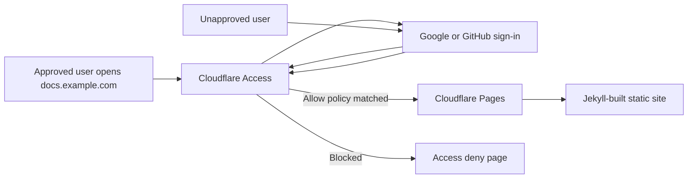

### Why this architecture is a good fit

- You do **not** need to build your own login system into Jekyll.
- Your documentation remains a static site, so hosting is fast and simple.
- Access rules can be based on:
  - exact email addresses
  - email domains
  - identity-provider groups
  - GitHub organization / team membership
- You can protect:
  - your **custom production domain**
  - your **`*.pages.dev` hostname**
  - your **preview deployment URLs**

---

## How access control works

It helps to separate **authentication** from **authorization**:

- **Authentication:** “Who are you?” → Google or GitHub sign-in
- **Authorization:** “Are you allowed in?” → Cloudflare Access policy

That distinction matters because your identity provider may allow many users to sign in, but **Cloudflare Access decides who may actually see the site**.

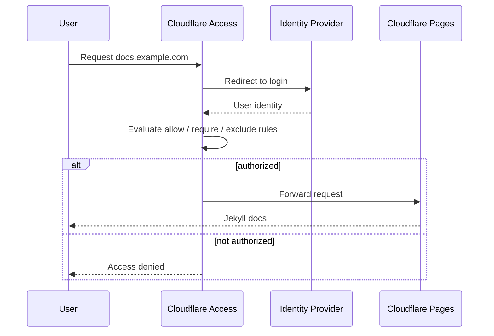

---

## Prerequisites

You should have these before starting:

- A **Cloudflare account**
- A **Zero Trust / Cloudflare One** account area in Cloudflare
- A **domain name** you control
- A **GitHub repository**
- A local machine with **Ruby** available
- A Jekyll project (new or existing)

### Recommended hostnames

Use these as a simple layout:

- Production docs: `docs.example.com`
- Pages default hostname: `<project>.pages.dev`
- Preview URLs: `<hash>.<project>.pages.dev` and `<branch>.<project>.pages.dev`

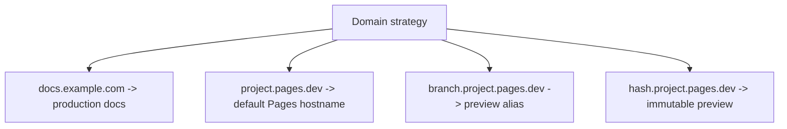

---

## Deployment order that avoids common mistakes

**Do these in this order:**

1. Build and test Jekyll locally
2. Push to GitHub
3. Create the Cloudflare Pages project
4. Attach the custom domain
5. Configure Google or GitHub as the Access identity provider
6. Create a self-hosted Access application for the custom domain
7. Protect preview deployments and optionally the Pages hostname
8. Optionally redirect `*.pages.dev` traffic to the custom domain

### Why order matters

Cloudflare documents an important caveat: you **cannot** add a Pages custom domain if a Cloudflare Access policy is already enabled on that domain. Also, certificate validation can fail if Access or a Worker blocks the ACME challenge path too early.

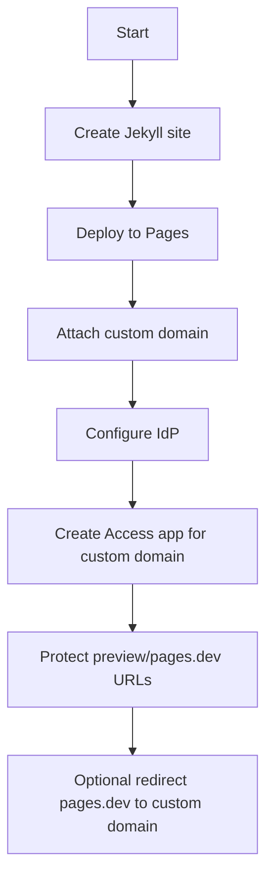

---

## Step 1: Create and test the Jekyll site locally

Cloudflare’s Jekyll Pages guide recommends installing a recent Ruby and using Jekyll normally. On macOS, the Jekyll docs recommend **not** using the system Ruby.

### Example bootstrap

```bash
rbenv install 3.1.3
rbenv global 3.1.3
gem install bundler jekyll
jekyll new my-private-docs
cd my-private-docs
bundle exec jekyll serve
```

Then open the local site and confirm it works before you deploy.

### Minimal content structure

```text
my-private-docs/
├─ _config.yml
├─ Gemfile
├─ index.md
├─ docs/
│  ├─ getting-started.md
│  └─ architecture.md
└─ assets/
```

### Example `index.md`

```md
---
layout: home
title: Private Docs
---

# Private Docs

Welcome to the internal documentation portal.
```

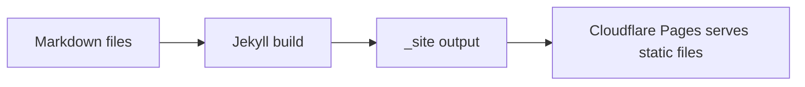

---

## Step 2: Push the site to GitHub

Cloudflare Pages works well with Git integration, so keep the source in GitHub.

```bash
git init
git add .
git commit -m "Initial Jekyll docs site"
git branch -M main
git remote add origin https://github.com/<your-user>/<your-repo>.git
git push -u origin main
```

### Good repository habits

- Keep `Gemfile` committed.
- Keep docs content in normal Markdown files.
- Use pull requests for changes so preview deployments are useful.
- Treat previews as potentially sensitive and protect them too.

---

## Step 3: Deploy the site to Cloudflare Pages

In Cloudflare:

1. Go to **Workers & Pages**
2. Select **Create application**
3. Choose **Pages**
4. Import the GitHub repository
5. Use the Jekyll build settings below

### Build settings

| Setting | Value |
|---|---|
| Production branch | `main` |
| Build command | `jekyll build` |
| Build directory | `_site` |
| Environment variable | `RUBY_VERSION=3.1.3` (or your local Ruby version) |

### Notes

- Cloudflare Pages will inspect your `Gemfile` and install dependencies.
- Every push to `main` will trigger a production build.
- Pull requests / non-production branches can get preview deployments.

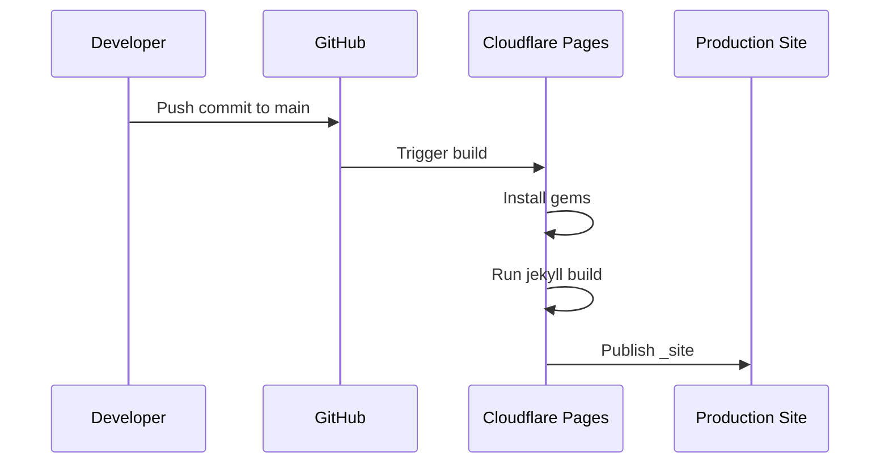

---

## Step 4: Attach a custom domain

Use a custom domain such as `docs.example.com`.

### Recommended approach

- Prefer serving the real site from a custom domain.
- Later, protect that custom domain with Cloudflare Access.
- Optionally redirect `<project>.pages.dev` to your custom domain.

### Steps

1. Open your Pages project
2. Go to **Custom domains**
3. Select **Set up a domain**
4. Enter `docs.example.com`
5. Complete the DNS validation steps

### Important caveats

- If you use an **apex domain** like `example.com`, the zone must be on Cloudflare.
- If you use a **subdomain** like `docs.example.com`, Cloudflare can use a CNAME to `<project>.pages.dev`.
- Do **not** manually point a CNAME to Pages without first adding the domain in the Pages dashboard.
- Do **not** enable Access on the custom domain before Pages domain attachment is complete.

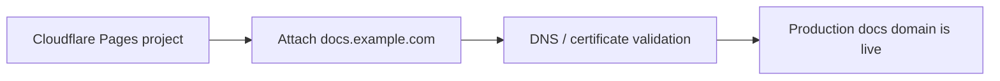

---

## Step 5: Set up Google or GitHub as an identity provider in Cloudflare Access

This is the login layer.

### In Google Cloud

1. Create or choose a Google Cloud project
2. Go to **APIs & Services**
3. Configure the **OAuth consent screen**
4. Choose **External** as the audience type if you want Gmail / general Google accounts to be able to authenticate
5. Create an **OAuth client**
6. Choose **Web application**

### Use these callback values

- **Authorized JavaScript origin:**  
  `https://<your-team-name>.cloudflareaccess.com`

- **Authorized redirect URI:**  
  `https://<your-team-name>.cloudflareaccess.com/cdn-cgi/access/callback`

Then copy the **Client ID** and **Client Secret**.

### In Cloudflare One

1. Go to **Integrations > Identity providers**
2. Add a new provider
3. Choose **Google**
4. Paste the Client ID and Client Secret
5. Optionally enable **PKCE**
6. Save
7. Test the connection

### Important interpretation

Choosing **External** in Google lets Google authenticate general Google users.  
That does **not** mean all of them can access your docs. Access policies still decide who gets in.

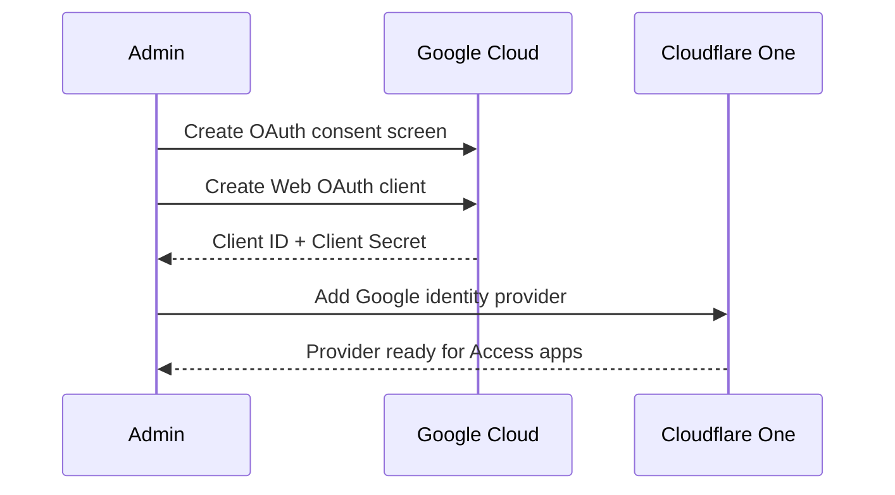

### If you use Google Workspace

Google Workspace integration is useful when you want richer organization-based rules, including group-based access. It is a better fit than generic Google if access is primarily for a company or school domain.

### Alternative: use GitHub as the identity provider

If the people allowed to read your docs are already managed in GitHub, Cloudflare Access can use **GitHub login** instead of Google.

### In GitHub

1. Log in to GitHub
2. Go to **Settings > Developer settings**
3. Select **OAuth Apps**
4. Create a **New OAuth App**
5. Set **Homepage URL** to:  
   `https://<your-team-name>.cloudflareaccess.com`
6. Set **Authorization callback URL** to:  
   `https://<your-team-name>.cloudflareaccess.com/cdn-cgi/access/callback`
7. Register the application
8. Copy the **Client ID**
9. Generate and copy the **Client Secret**

### In Cloudflare One

1. Go to **Integrations > Identity providers**
2. Add a new provider
3. Choose **GitHub**
4. Paste the GitHub **Client ID** and **Client Secret**
5. Save
6. Select **Finish setup** and authorize the requested GitHub permissions
7. Test the connection

### Important interpretation

GitHub login proves who the user is.  
Cloudflare Access policies still decide whether that GitHub user is one of your valid users.

You do **not** need a GitHub organization to use the GitHub identity provider, but a GitHub organization or team is the cleanest way to maintain an allow-list over time.

---

## Step 6: Create the Access application for your private docs hostname

Now protect `docs.example.com`.

### Access app type

Create a **Self-hosted** Access application for the custom domain.

### Steps

1. Go to **Zero Trust > Access controls > Applications**
2. Select **Add an application**
3. Choose **Self-hosted**
4. Give it a name such as `Private Jekyll Docs`
5. Set session duration
6. Add public hostname: `docs.example.com`
7. Add one or more access policies
8. Enable the identity provider for this application:
   - **Google** for the Google flow above
   - **GitHub** for the GitHub flow above
9. If only one login method is enabled, you can enable **Instant Auth**
10. Save

### Recommended policies

#### Option A — specific approved Gmail accounts

Use this when only a handful of people should have access.

- **Action:** Allow
- **Include selector:** Emails
- **Values:**  
  - `alice@gmail.com`
  - `bob@example.com`

#### Option B — anyone in your Workspace domain

Use this when all company users may access the docs.

- **Action:** Allow
- **Include selector:** Emails ending in
- **Value:** `@example.com`

#### Option C — group-based access

Use this when only a specific Workspace group should access the docs.

- **Identity provider group** (if available through your IdP integration)

#### Option D — approved GitHub organization or team

Use this when your valid-user list is already maintained in GitHub.

- **Action:** Allow
- **Include selector:** GitHub organization
- **Organization:** `your-org`
- **Optional team:** `docs-readers`
- **Optional Require selector:** Login Method
- **Require value:** your GitHub identity provider

This is usually the cleanest GitHub-based policy. Adding someone to the GitHub organization or team becomes the gate for docs access.

If you are not using a GitHub organization, you can still use the exact email allow-list from **Option A** and let those users authenticate with GitHub instead of Google.

### Example authorization patterns

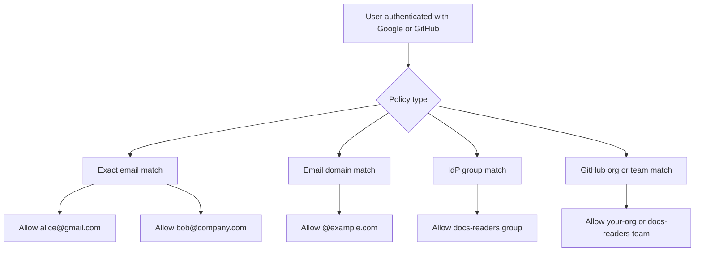

### Recommended first version

Start with **exact email allow-listing**.  
It is the safest default for “reserved users only.”

### Example policy layout

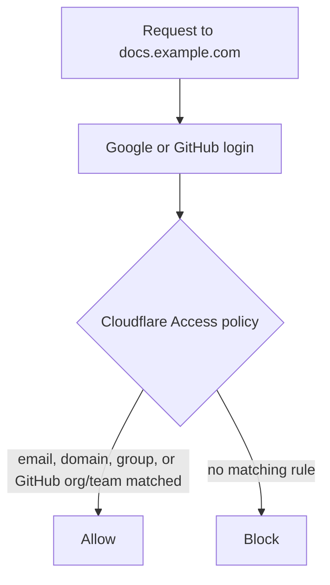

---

## Step 7: Protect preview deployments and the Pages hostname

This step is easy to miss.

### Preview deployments

By default, Pages preview deployment URLs are public. You should protect them if your docs are private.

#### Enable preview protection

1. Open your Pages project
2. Go to **Settings > General**
3. Select **Enable access policy**

This protects preview deployment URLs such as:

- `<hash>.<project>.pages.dev`
- `<branch>.<project>.pages.dev`

### Important limitation

That preview setting **does not** automatically protect:

- the main `<project>.pages.dev` hostname
- your custom domain

Those require separate handling.

### Protect the main `*.pages.dev` hostname

Cloudflare documents a known-issues workflow for this:

1. In your Pages project, go to **Settings > Enable access policy**
2. Use **Manage** on the Access policy created for previews
3. Edit the public hostname so it protects the exact Pages hostname instead of a wildcard if needed
4. Re-enable preview protection so you end up with separate policies

### If you also use a custom domain

You must create a **separate self-hosted Access application** for the custom domain.  
Otherwise visitors may see an authentication prompt that does not work correctly.

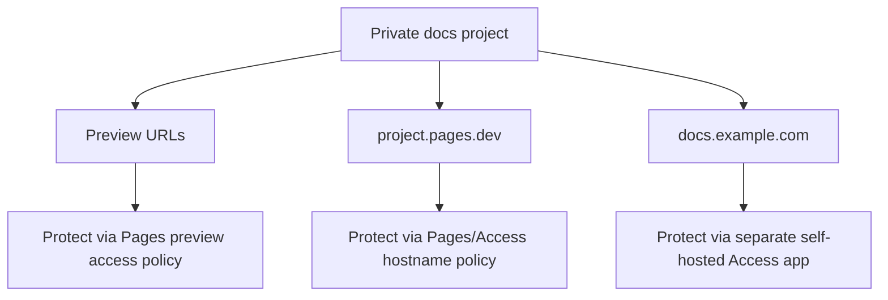

### Optional: redirect the Pages hostname to the custom domain

Once the custom domain is working, you can use Bulk Redirects so that users land on `docs.example.com` instead of `<project>.pages.dev`.

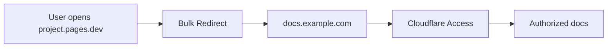

---

## Optional hardening

### 1. Add security headers

Cloudflare Pages supports a `_headers` file for static responses.

Create a file named `_headers` in your static asset area or build output path.

Example:

```text
/*
  X-Frame-Options: DENY
  X-Content-Type-Options: nosniff
  Referrer-Policy: no-referrer
  Permissions-Policy: document-domain=()
  Content-Security-Policy: default-src 'self'; frame-ancestors 'none';
```

### 2. Prevent indexing of Pages hostnames

If you do not want `*.pages.dev` URLs to appear in search results:

```text
https://:project.pages.dev/*
  X-Robots-Tag: noindex

https://:version.:project.pages.dev/*
  X-Robots-Tag: noindex
```

### 3. Use a short Access session duration for sensitive docs

Shorter sessions reduce risk on shared devices.

### 4. Turn on account-wide default deny carefully

Cloudflare Access has a **Require Access protection** setting that blocks traffic to any hostname in the account unless an Access application exists for it.

This is powerful, but only enable it **after** your important hostnames already have proper Access apps.

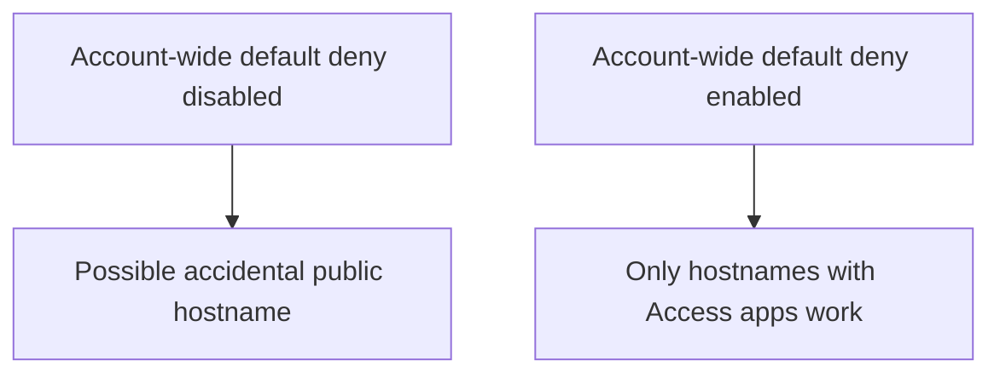

### 5. Consider Google Workspace integration for larger teams

Use Workspace when you want:

- domain-based org access
- group-based authorization
- easier ongoing user management

---

## Suggested project files

### `_config.yml`

```yaml
title: Private Docs
description: Private documentation site
theme: minima
markdown: kramdown
plugins: []
```

### `Gemfile`

```ruby
source "https://rubygems.org"

gem "jekyll"
gem "minima"
```

### `_headers`

```text
/*
  X-Frame-Options: DENY
  X-Content-Type-Options: nosniff
  Referrer-Policy: no-referrer
  Permissions-Policy: document-domain=()

https://:project.pages.dev/*
  X-Robots-Tag: noindex

https://:version.:project.pages.dev/*
  X-Robots-Tag: noindex
```

### `index.md`

```md
---
layout: home
title: Private Docs
---

# Private Docs

This site is protected by Cloudflare Access and available only to approved users.
```

---

## Validation checklist

After setup, test all of the following:

### Authentication and authorization

- [ ] Visiting `docs.example.com` redirects to your configured login method
- [ ] An approved Google or GitHub user is allowed in
- [ ] An unapproved Google or GitHub user is denied
- [ ] Session behavior matches your chosen Access session duration

### Hosting and routing

- [ ] `main` branch deploys to production successfully
- [ ] The custom domain serves the latest Pages deployment
- [ ] `<project>.pages.dev` is either protected or redirected
- [ ] Preview deployments are protected

### Security

- [ ] `_headers` rules are working on static responses
- [ ] Search indexing is discouraged on Pages hostnames
- [ ] No unexpected public hostname is left open

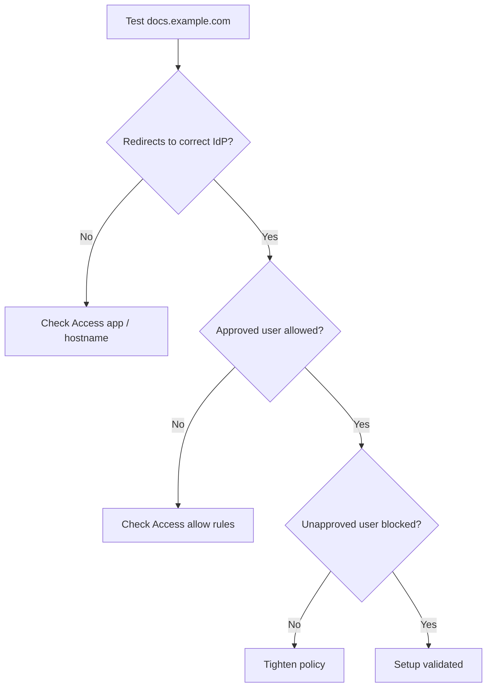

---

## Troubleshooting

### Problem: Custom domain will not attach

Possible causes:

- Access is already enabled on that domain
- DNS is wrong
- SSL certificate validation is blocked
- You manually created DNS before registering the domain in Pages

### Problem: Login appears but nobody can get in

Possible causes:

- The Access policy is too strict
- You used exact email matching but listed the wrong address
- You expected IdP login alone to grant access, but authorization rules are missing

### Problem: Preview deployments are still public

Possible causes:

- The Pages preview Access policy is not enabled
- You protected only the custom domain, not previews

### Problem: Custom domain authentication prompt is broken

Possible cause:

- You protected previews / pages.dev but forgot to create a **separate Access application** for the custom domain

### Problem: Workspace group rules are unavailable

Possible cause:

- You are using generic Google instead of Google Workspace integration, or your IdP/group sync is incomplete

### Problem: A GitHub organization member is still denied

Possible cause:

- The user first tried to log in before they were added to the required GitHub organization or team
- GitHub authorization needs to be refreshed

Fix:

- Have the user revoke the Cloudflare Access OAuth application's access in GitHub and then log in again so Cloudflare Access re-reads the updated org/team membership

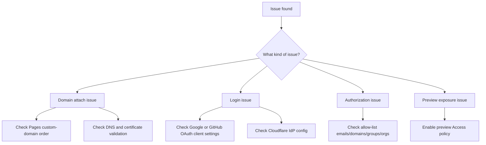

---

## Operational guidance

### Best practice for small private docs

Use this setup:

- Jekyll
- Cloudflare Pages
- Custom domain: `docs.example.com`
- Generic Google IdP
- Access policy using exact emails

This is best when you only need a private docs portal for a few approved users.

### Best practice for a team or company

Use this setup:

- Jekyll
- Cloudflare Pages
- Custom domain: `docs.example.com`
- Google Workspace IdP
- Access policy using:
  - `Emails ending in @example.com`, or
  - a Workspace group

This is easier to maintain as the team changes.

### Best practice when valid users are managed in GitHub

Use this setup:

- Jekyll
- Cloudflare Pages
- Custom domain: `docs.example.com`
- GitHub IdP
- Access policy using:
  - a GitHub organization, or
  - a GitHub organization + team

This is a good fit when docs access should follow GitHub membership instead of a separate Google or email allow-list.

### Recommended maintenance routine

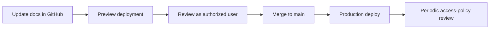

Review regularly:

- allowed emails / domains / groups
- Access session duration
- preview deployment visibility
- security headers
- redirects from Pages hostnames

---

## Reference links

Official documentation used for this guide:

### Jekyll

- Jekyll quickstart: <https://jekyllrb.com/docs/>
- Jekyll installation: <https://jekyllrb.com/docs/installation/>
- Jekyll on macOS: <https://jekyllrb.com/docs/installation/macos/>

### Cloudflare Pages

- Deploy a Jekyll site on Cloudflare Pages: <https://developers.cloudflare.com/pages/framework-guides/deploy-a-jekyll-site/>
- Pages build configuration: <https://developers.cloudflare.com/pages/configuration/build-configuration/>
- Pages custom domains: <https://developers.cloudflare.com/pages/configuration/custom-domains/>
- Pages preview deployments: <https://developers.cloudflare.com/pages/configuration/preview-deployments/>
- Pages headers: <https://developers.cloudflare.com/pages/configuration/headers/>
- Redirect `*.pages.dev` to a custom domain: <https://developers.cloudflare.com/pages/how-to/redirect-to-custom-domain/>
- Pages known issues: <https://developers.cloudflare.com/pages/platform/known-issues/>

### Cloudflare Access / Zero Trust

- Create an Access application: <https://developers.cloudflare.com/learning-paths/clientless-access/access-application/create-access-app/>
- Access policies: <https://developers.cloudflare.com/cloudflare-one/access-controls/policies/>
- Require Access protection: <https://developers.cloudflare.com/cloudflare-one/access-controls/access-settings/require-access-protection/>

### Google identity provider

- Google as a Cloudflare Access identity provider: <https://developers.cloudflare.com/cloudflare-one/integrations/identity-providers/google/>
- Google Workspace as a Cloudflare Access identity provider: <https://developers.cloudflare.com/cloudflare-one/integrations/identity-providers/google-workspace/>

### GitHub identity provider

- GitHub as a Cloudflare Access identity provider: <https://developers.cloudflare.com/cloudflare-one/integrations/identity-providers/github/>

---

## Final recommendation

For your stated requirement — **a Jekyll documentation site on Cloudflare that is visible only to reserved users** — the best practical setup is:

1. Deploy the Jekyll site on **Cloudflare Pages**
2. Put the production site on a **custom domain**
3. Protect that domain with a **Self-hosted Cloudflare Access application**
4. Use **Google**, **Google Workspace**, or **GitHub** as the identity provider
5. Restrict access with an **exact email allow-list**, **domain/group rules**, or a **GitHub organization/team rule**
6. Protect preview deployments too
7. Redirect `*.pages.dev` to the custom domain or secure it separately

If your valid users already live in GitHub, the most maintainable version is usually **GitHub IdP + GitHub organization/team policy**.
