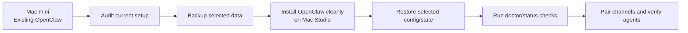
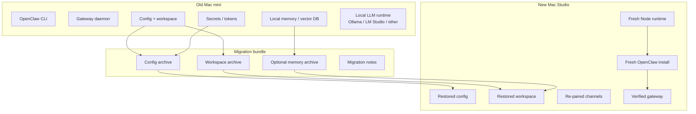
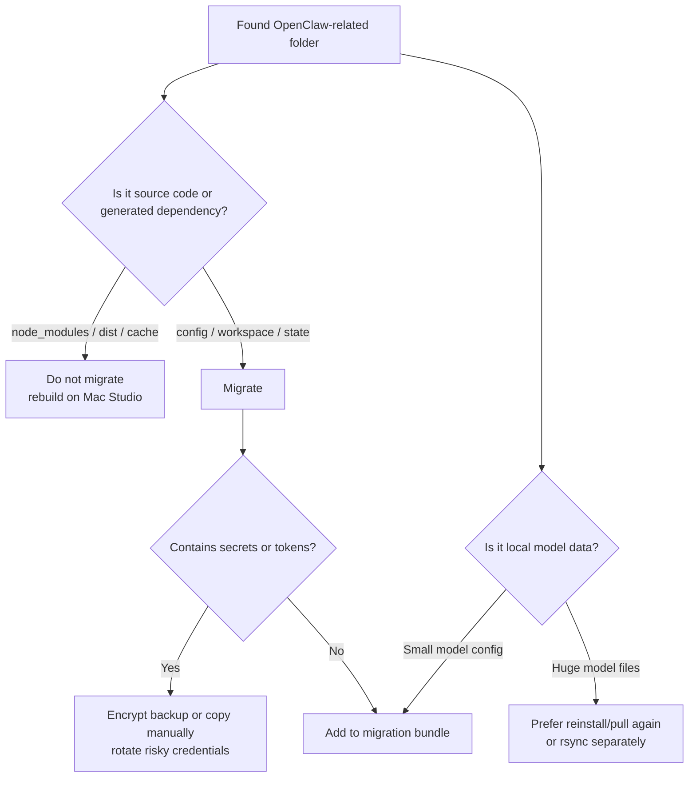
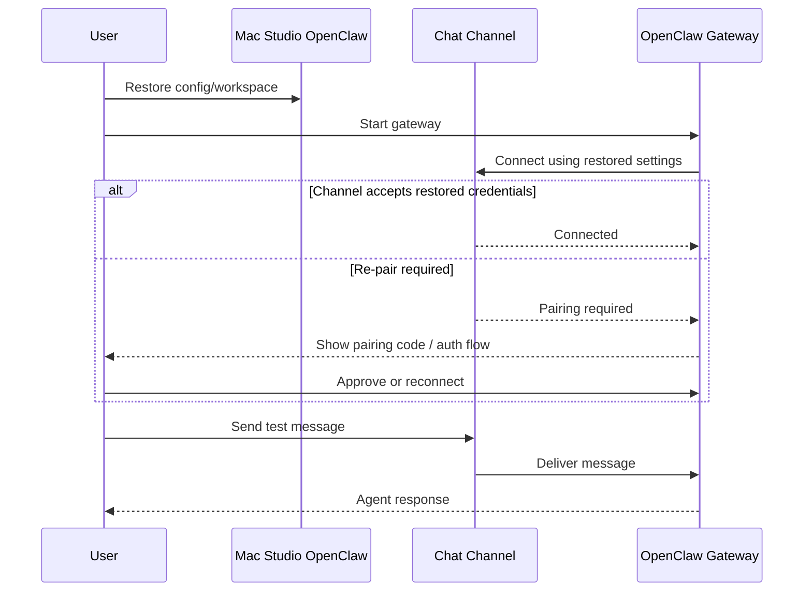
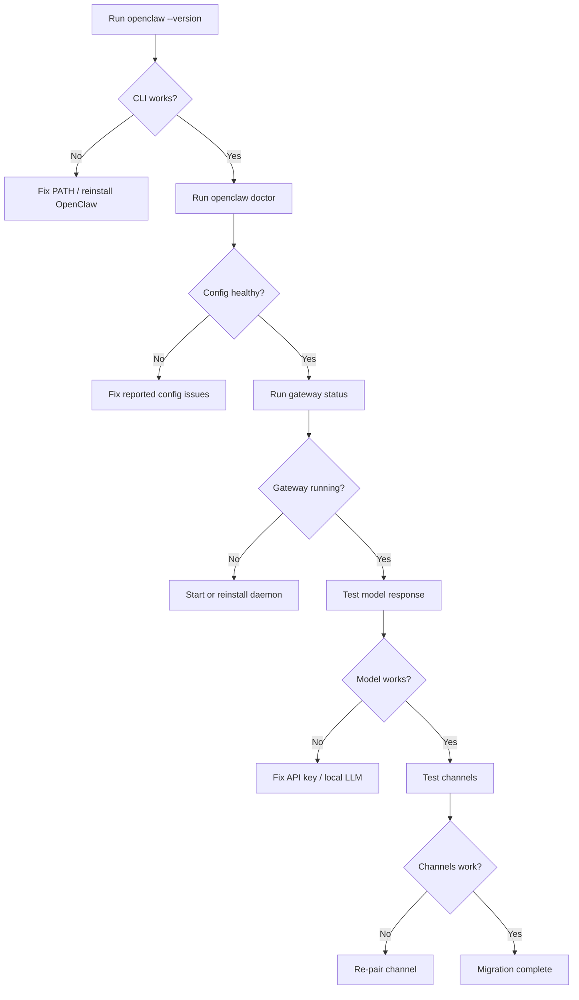
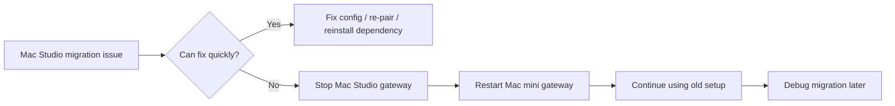
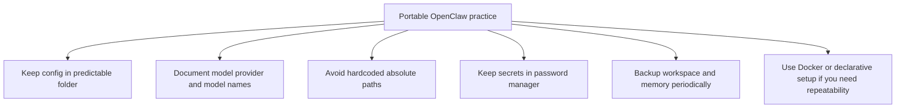

# OpenClaw Mac-to-Mac Migration Guide

**Migration pattern:** Clean reinstall + selective migration  
**Scenario:** Move OpenClaw settings from an existing Mac mini to a new Mac Studio  
**Audience:** macOS users who want a clean OpenClaw installation on a new Mac while preserving configuration, channels, agents, model settings, workspace data, and useful runtime state.

> This guide intentionally avoids cloning the entire old machine. Instead, it reinstalls OpenClaw cleanly on the target Mac and copies only the data that matters.

---

## 1. Why use clean reinstall + selective migration?

A full folder clone is fast, but it can also copy hidden problems: old Node versions, broken symlinks, stale caches, machine-specific LaunchAgent paths, permission issues, hardcoded absolute paths, and unnecessary logs. A clean reinstall gives the new Mac a fresh runtime while preserving the OpenClaw-specific state you care about.



---

## 2. What should be migrated?

Selective migration means you should copy configuration and persistent state, not every generated artifact.

| Category | Migrate? | Examples | Notes |
|---|---:|---|---|
| OpenClaw config | Yes | config files, profiles, model settings | Highest priority |
| Workspace data | Yes | agents, skills, workspace files | Preserve your actual OpenClaw behavior |
| Channel settings | Yes | Telegram, Discord, Slack, WhatsApp, etc. | Some channels may require re-pairing |
| Allowlists/pairing state | Usually | approved senders, local allowlists | Review for security before restoring |
| Secrets | Carefully | `.env`, API keys, OAuth tokens | Prefer regenerating if unsure |
| Local model config | Yes | Ollama/LM Studio/OpenRouter settings | Model files may live outside OpenClaw |
| Vector DB / memory | Yes, if used | ChromaDB, local memory stores | Critical if you rely on persistent memory |
| Logs | Usually no | gateway logs, debug logs | Keep separately only for troubleshooting |
| Caches/build outputs | No | `node_modules`, `.cache`, `dist`, temp dirs | Rebuild on the new Mac |

---

## 3. Migration architecture



---

## 4. Before you begin

### 4.1 Confirm your OpenClaw install method on the Mac mini

Run:

```bash
which openclaw
openclaw --version
openclaw doctor
openclaw gateway status
```

Record the output:

```bash
mkdir -p ~/Desktop/openclaw-migration-notes
{
  echo "# OpenClaw migration notes"
  echo
  echo "## Date"
  date
  echo
  echo "## openclaw path"
  which openclaw || true
  echo
  echo "## openclaw version"
  openclaw --version || true
  echo
  echo "## doctor"
  openclaw doctor || true
  echo
  echo "## gateway status"
  openclaw gateway status || true
} > ~/Desktop/openclaw-migration-notes/openclaw-status.txt
```

### 4.2 Identify your Node runtime

OpenClaw currently recommends Node 24, with Node 22.14+ or 22.16+ accepted depending on the installation path. Check your runtime:

```bash
node --version
npm --version
pnpm --version 2>/dev/null || true
bun --version 2>/dev/null || true
```

### 4.3 Stop OpenClaw while backing up

This reduces the chance of copying partially written databases or state files.

```bash
openclaw gateway stop 2>/dev/null || true
```

If you installed a macOS LaunchAgent and it restarts automatically, check status again:

```bash
openclaw gateway status
```

---

## 5. Discover OpenClaw files on the Mac mini

Because OpenClaw can be installed through different methods, do not assume one fixed folder. Start with a discovery step.

```bash
mkdir -p ~/Desktop/openclaw-migration-notes

find ~ \
  -iname '*openclaw*' \
  -o -iname '*claw*' \
  2>/dev/null | sort > ~/Desktop/openclaw-migration-notes/openclaw-paths.txt

cat ~/Desktop/openclaw-migration-notes/openclaw-paths.txt
```

Common locations to inspect:

```text
~/.openclaw/
~/Library/Application Support/OpenClaw/
~/Library/LaunchAgents/
~/openclaw/
~/.config/openclaw/
~/.local/share/openclaw/
```

Also inspect your project directory if you run OpenClaw from source:

```bash
ls -la ~/openclaw 2>/dev/null || true
ls -la ~/.openclaw 2>/dev/null || true
ls -la "$HOME/Library/Application Support/OpenClaw" 2>/dev/null || true
```

---

## 6. Decide what to copy

Use this decision tree.



### Recommended migration bundle contents

Create a staging directory:

```bash
MIGRATION_DIR="$HOME/Desktop/openclaw-migration-bundle"
mkdir -p "$MIGRATION_DIR"
```

Copy likely config and workspace folders if they exist:

```bash
# OpenClaw local prefix / config
[ -d "$HOME/.openclaw" ] && rsync -a "$HOME/.openclaw/" "$MIGRATION_DIR/.openclaw/"

# macOS Application Support folder
[ -d "$HOME/Library/Application Support/OpenClaw" ] && \
  rsync -a "$HOME/Library/Application Support/OpenClaw/" \
  "$MIGRATION_DIR/Application Support OpenClaw/"

# Source checkout workspace, if you used one
[ -d "$HOME/openclaw" ] && \
  rsync -a \
    --exclude 'node_modules' \
    --exclude '.git' \
    --exclude 'dist' \
    --exclude '.turbo' \
    --exclude '.cache' \
    "$HOME/openclaw/" "$MIGRATION_DIR/openclaw-workspace/"
```

### Optional: copy local memory or vector databases

Only copy these if you know OpenClaw or your skills use them.

```bash
# ChromaDB examples; adjust to your actual paths
[ -d "$HOME/.chromadb" ] && rsync -a "$HOME/.chromadb/" "$MIGRATION_DIR/.chromadb/"
[ -d "$HOME/chroma" ] && rsync -a "$HOME/chroma/" "$MIGRATION_DIR/chroma/"
```

### Optional: copy local LLM configuration

For Ollama, model files are often large. You can migrate them, but reinstalling/pulling models again is often cleaner.

```bash
# Ollama model directory can be large.
# Consider skipping this and running `ollama pull <model>` again on the Mac Studio.
[ -d "$HOME/.ollama" ] && du -sh "$HOME/.ollama"
```

---

## 7. Create a safe archive

### 7.1 Basic archive

```bash
cd "$HOME/Desktop"
tar -czf openclaw-migration-bundle.tar.gz openclaw-migration-bundle openclaw-migration-notes
```

### 7.2 Encrypted archive for secrets

If your bundle includes API keys, OAuth tokens, cookies, SSH credentials, or channel secrets, use encryption.

```bash
cd "$HOME/Desktop"
tar -czf - openclaw-migration-bundle openclaw-migration-notes | \
  openssl enc -aes-256-cbc -salt -pbkdf2 -out openclaw-migration-bundle.tar.gz.enc
```

To decrypt later:

```bash
openssl enc -d -aes-256-cbc -pbkdf2 \
  -in openclaw-migration-bundle.tar.gz.enc | tar -xzf -
```

---

## 8. Transfer the bundle to the Mac Studio

### Option A: AirDrop

Good for small bundles. Not ideal for huge local models.

### Option B: rsync over SSH

On Mac Studio, enable **System Settings → General → Sharing → Remote Login**.

From the Mac mini:

```bash
rsync -avh --progress \
  ~/Desktop/openclaw-migration-bundle.tar.gz \
  your_user@macstudio.local:~/Desktop/
```

If you encrypted it:

```bash
rsync -avh --progress \
  ~/Desktop/openclaw-migration-bundle.tar.gz.enc \
  your_user@macstudio.local:~/Desktop/
```

> macOS often ships an older rsync. Use `--progress` instead of `--info=progress2` if your rsync does not support the newer option.

### Option C: external SSD

Best for large vector databases or local model folders.

---

## 9. Clean install OpenClaw on the Mac Studio

### 9.1 Install command-line prerequisites

Install Homebrew if needed, then:

```bash
brew install node
node --version
npm --version
```

If you use `nvm`, `fnm`, or another Node manager, install Node 24 or a currently supported Node 22.x release.

### 9.2 Install OpenClaw

Recommended official install methods include the installer script or npm/pnpm/bun global installation. The docs list the installer script as the fastest path because it detects the OS, installs Node if needed, installs OpenClaw, and launches onboarding.

Installer script:

```bash
curl -fsSL https://openclaw.ai/install.sh | bash
```

Install without onboarding:

```bash
curl -fsSL https://openclaw.ai/install.sh | bash -s -- --no-onboard
```

npm global install:

```bash
npm install -g openclaw@latest
openclaw onboard --install-daemon
```

If you use pnpm:

```bash
pnpm add -g openclaw@latest
pnpm approve-builds -g
openclaw onboard --install-daemon
```

### 9.3 Verify the fresh installation

```bash
openclaw --version
openclaw doctor
openclaw gateway status
```

At this stage, do **not** assume migration is complete. First confirm the fresh install works.

---

## 10. Restore selected data on the Mac Studio

### 10.1 Extract the bundle

```bash
cd ~/Desktop
tar -xzf openclaw-migration-bundle.tar.gz
```

For encrypted archive:

```bash
cd ~/Desktop
openssl enc -d -aes-256-cbc -pbkdf2 \
  -in openclaw-migration-bundle.tar.gz.enc | tar -xzf -
```

### 10.2 Stop the new gateway before restoring

```bash
openclaw gateway stop 2>/dev/null || true
```

### 10.3 Restore config/workspace folders carefully

Use `rsync` so you can preserve permissions and merge directories.

```bash
MIGRATION_DIR="$HOME/Desktop/openclaw-migration-bundle"

# Restore ~/.openclaw
[ -d "$MIGRATION_DIR/.openclaw" ] && \
  rsync -a "$MIGRATION_DIR/.openclaw/" "$HOME/.openclaw/"

# Restore Application Support folder
[ -d "$MIGRATION_DIR/Application Support OpenClaw" ] && \
  mkdir -p "$HOME/Library/Application Support/OpenClaw" && \
  rsync -a "$MIGRATION_DIR/Application Support OpenClaw/" \
  "$HOME/Library/Application Support/OpenClaw/"

# Restore workspace if applicable
[ -d "$MIGRATION_DIR/openclaw-workspace" ] && \
  mkdir -p "$HOME/openclaw" && \
  rsync -a "$MIGRATION_DIR/openclaw-workspace/" "$HOME/openclaw/"
```

### 10.4 Restore optional vector DB / memory

```bash
[ -d "$MIGRATION_DIR/.chromadb" ] && \
  rsync -a "$MIGRATION_DIR/.chromadb/" "$HOME/.chromadb/"

[ -d "$MIGRATION_DIR/chroma" ] && \
  rsync -a "$MIGRATION_DIR/chroma/" "$HOME/chroma/"
```

---

## 11. Fix machine-specific paths

Search restored files for old Mac mini paths.

```bash
OLD_USER="old_macmini_username"
NEW_USER="$USER"

grep -R "/Users/$OLD_USER" \
  "$HOME/.openclaw" \
  "$HOME/Library/Application Support/OpenClaw" \
  "$HOME/openclaw" \
  2>/dev/null || true
```

If you find paths, edit the relevant config files manually. Avoid blind global replacement unless you have reviewed the files.

Common things that may need editing:

```text
/Users/<old-user>/...
Local model paths
Workspace paths
Browser profile paths
Log paths
Shell command paths
SSH key paths
```

---

## 12. Reinstall or reconnect external dependencies

OpenClaw settings may reference software that is not part of OpenClaw itself.

### 12.1 Local LLM runtime

If you used Ollama:

```bash
brew install ollama
ollama serve
ollama list
```

Pull models again if you did not migrate model files:

```bash
ollama pull llama3.1
# or your preferred model
```

### 12.2 Browser automation dependencies

If your OpenClaw skills use browser automation, reinstall browser dependencies according to your setup. Example:

```bash
npx playwright install
```

### 12.3 Project tools

If OpenClaw automates your development environment, reinstall tools such as:

```bash
brew install git gh jq ripgrep fd
```

---

## 13. Re-pair channels and accounts

Some channel credentials or local allowlists may work after migration, but many integrations should be treated as security-sensitive and revalidated.



Recommended checks:

```bash
openclaw doctor
openclaw gateway status
```

Then send a simple test message from each connected channel:

```text
Hello, confirm that you are running on the Mac Studio.
```

---

## 14. Start and verify the gateway

```bash
openclaw gateway start 2>/dev/null || openclaw gateway --verbose
openclaw gateway status
openclaw doctor
```

If you installed the daemon:

```bash
openclaw gateway install
openclaw gateway status
```

Validation checklist:



---

## 15. Security review after migration

OpenClaw can interact with real messaging channels, files, terminals, browsers, calendars, and other services. Treat migration as a good time to reduce risk.

### 15.1 Rotate or review secrets

Review:

```text
API keys
OAuth tokens
Channel bot tokens
Webhook secrets
SSH keys
Browser/session cookies
.env files
```

For high-risk keys, prefer regeneration over copying.

### 15.2 Review DM and allowlist policies

The OpenClaw README emphasizes that inbound DMs should be treated as untrusted input and recommends pairing/allowlist controls for unknown senders. After migration, confirm that your channel policies are still restrictive.

### 15.3 Review skills and plugins

Only keep skills you trust. If you copied old skills, inspect them before enabling them on the new Mac Studio.

Suggested review command:

```bash
find "$HOME/.openclaw" "$HOME/openclaw" \
  -iname '*skill*' -o -iname '*.md' -o -iname '*.js' -o -iname '*.ts' \
  2>/dev/null
```

---

## 16. Troubleshooting

### 16.1 `openclaw: command not found`

Check shell path:

```bash
echo $PATH
which npm
npm bin -g 2>/dev/null || true
```

Try reinstalling:

```bash
npm install -g openclaw@latest
```

Restart your shell or source your profile:

```bash
source ~/.zshrc
```

### 16.2 Gateway does not start

Run:

```bash
openclaw doctor
openclaw gateway --verbose
```

Common causes:

```text
Port already in use
Broken old path in config
Missing API key
Missing local model runtime
Permission issue in restored folder
LaunchAgent points to old binary path
```

### 16.3 Model fails after migration

Check:

```bash
printenv | grep -Ei 'OPENAI|ANTHROPIC|OPENROUTER|OLLAMA|MODEL'
```

If using `.env`, confirm it exists in the correct restored location. If using a local LLM, make sure the server is running.

### 16.4 Channels no longer respond

Run:

```bash
openclaw doctor
openclaw gateway status
```

Then re-run onboarding for channel setup:

```bash
openclaw onboard
```

### 16.5 Permission problems

Avoid overly broad permissions like `chmod -R 777`. Use owner repair first:

```bash
sudo chown -R "$USER":staff "$HOME/.openclaw" 2>/dev/null || true
sudo chown -R "$USER":staff "$HOME/Library/Application Support/OpenClaw" 2>/dev/null || true
```

---

## 17. Rollback plan

Do not erase the Mac mini setup immediately.

Recommended rollback window:

```text
Keep the Mac mini OpenClaw setup untouched for at least 1–2 weeks.
Do not revoke old tokens until the Mac Studio is verified.
Keep the encrypted migration bundle until the Mac Studio is stable.
```

Rollback flow:



---

## 18. Final checklist

### On Mac mini

- [ ] Ran `openclaw --version`
- [ ] Ran `openclaw doctor`
- [ ] Ran `openclaw gateway status`
- [ ] Discovered OpenClaw-related folders
- [ ] Stopped gateway before backup
- [ ] Created migration bundle
- [ ] Encrypted bundle if secrets are included
- [ ] Transferred bundle to Mac Studio

### On Mac Studio

- [ ] Installed Node 24 or supported Node 22.x
- [ ] Installed OpenClaw cleanly
- [ ] Confirmed fresh `openclaw --version`
- [ ] Restored selected config/state
- [ ] Fixed old `/Users/...` paths
- [ ] Reinstalled local LLM runtime if used
- [ ] Re-paired or verified channels
- [ ] Ran `openclaw doctor`
- [ ] Ran `openclaw gateway status`
- [ ] Sent successful test message
- [ ] Kept old Mac mini setup as rollback

---

## 19. Recommended command summary

```bash
# On Mac mini
mkdir -p ~/Desktop/openclaw-migration-bundle ~/Desktop/openclaw-migration-notes
openclaw --version > ~/Desktop/openclaw-migration-notes/version.txt 2>&1 || true
openclaw doctor > ~/Desktop/openclaw-migration-notes/doctor.txt 2>&1 || true
openclaw gateway status > ~/Desktop/openclaw-migration-notes/gateway-status.txt 2>&1 || true
openclaw gateway stop 2>/dev/null || true

[ -d "$HOME/.openclaw" ] && rsync -a "$HOME/.openclaw/" ~/Desktop/openclaw-migration-bundle/.openclaw/
[ -d "$HOME/Library/Application Support/OpenClaw" ] && mkdir -p ~/Desktop/openclaw-migration-bundle/AppSupportOpenClaw && rsync -a "$HOME/Library/Application Support/OpenClaw/" ~/Desktop/openclaw-migration-bundle/AppSupportOpenClaw/

cd ~/Desktop
tar -czf openclaw-migration-bundle.tar.gz openclaw-migration-bundle openclaw-migration-notes
```

```bash
# On Mac Studio
brew install node
curl -fsSL https://openclaw.ai/install.sh | bash -s -- --no-onboard
openclaw --version
openclaw doctor

cd ~/Desktop
tar -xzf openclaw-migration-bundle.tar.gz
openclaw gateway stop 2>/dev/null || true

[ -d "$HOME/Desktop/openclaw-migration-bundle/.openclaw" ] && rsync -a "$HOME/Desktop/openclaw-migration-bundle/.openclaw/" "$HOME/.openclaw/"
[ -d "$HOME/Desktop/openclaw-migration-bundle/AppSupportOpenClaw" ] && mkdir -p "$HOME/Library/Application Support/OpenClaw" && rsync -a "$HOME/Desktop/openclaw-migration-bundle/AppSupportOpenClaw/" "$HOME/Library/Application Support/OpenClaw/"

openclaw doctor
openclaw gateway status
openclaw onboard
```

---

## 20. References

- OpenClaw official website: <https://openclaw.ai/>
- OpenClaw GitHub repository: <https://github.com/openclaw/openclaw>
- OpenClaw install documentation: <https://docs.openclaw.ai/install>
- OpenClaw documentation index: <https://docs.openclaw.ai/>

---

## 21. Notes for future migrations

After this migration, keep your OpenClaw state more portable:



Suggested habit:

```bash
mkdir -p ~/openclaw-backups
DATE=$(date +%Y%m%d-%H%M%S)
tar -czf ~/openclaw-backups/openclaw-config-$DATE.tar.gz ~/.openclaw 2>/dev/null
```

For sensitive setups, encrypt backups and store recovery notes separately.
