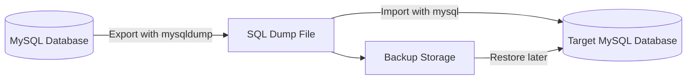
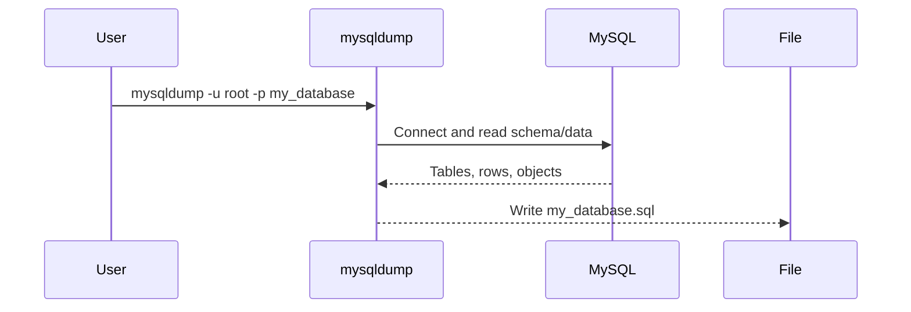
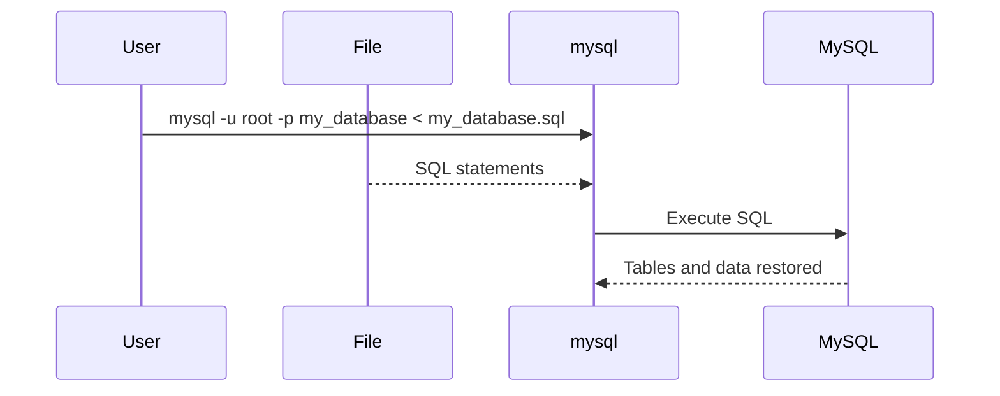
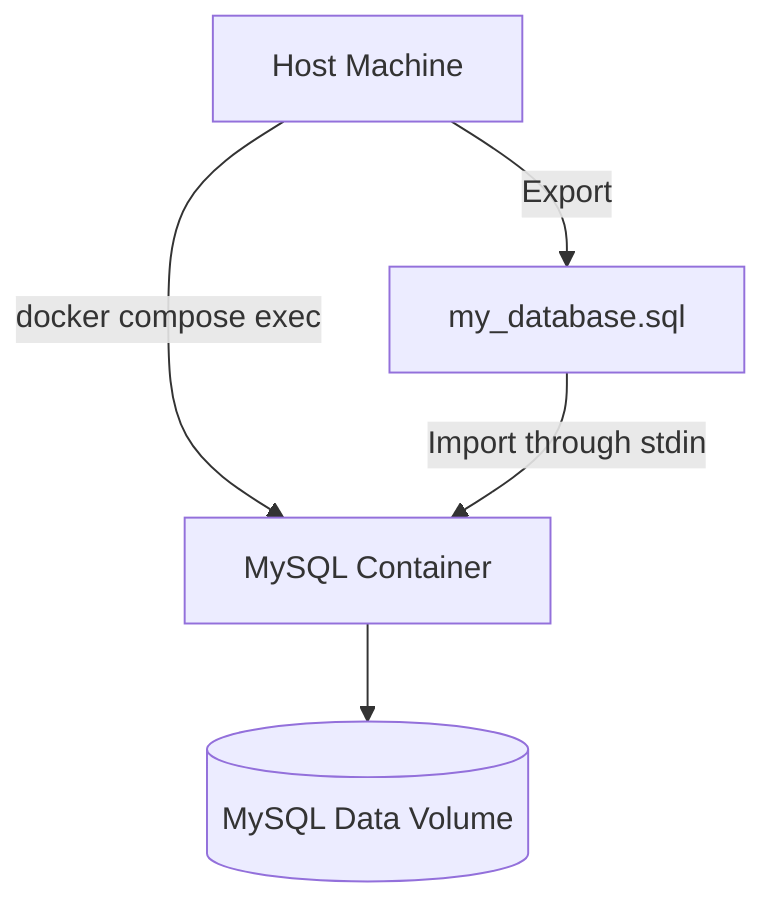
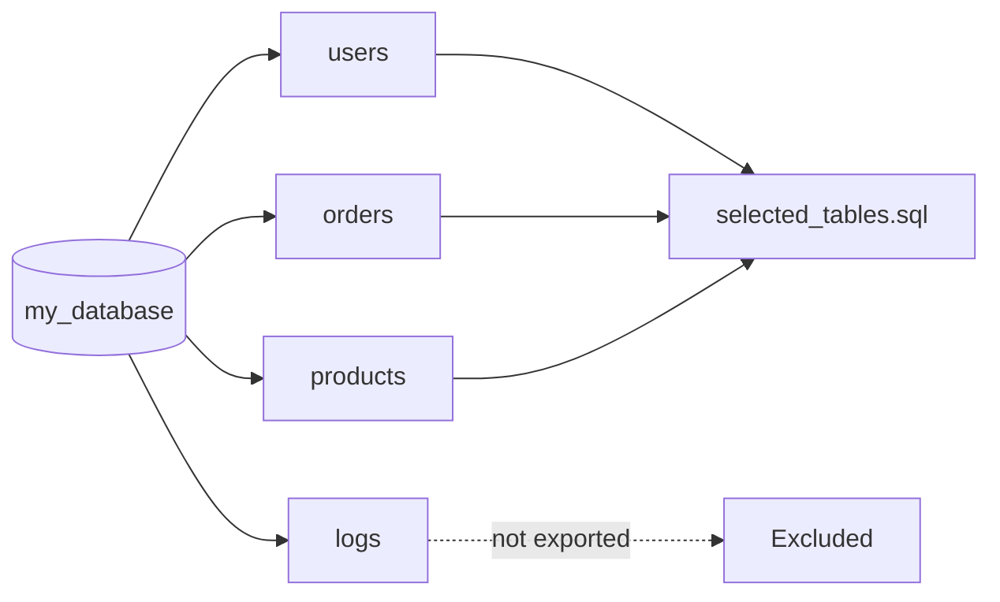
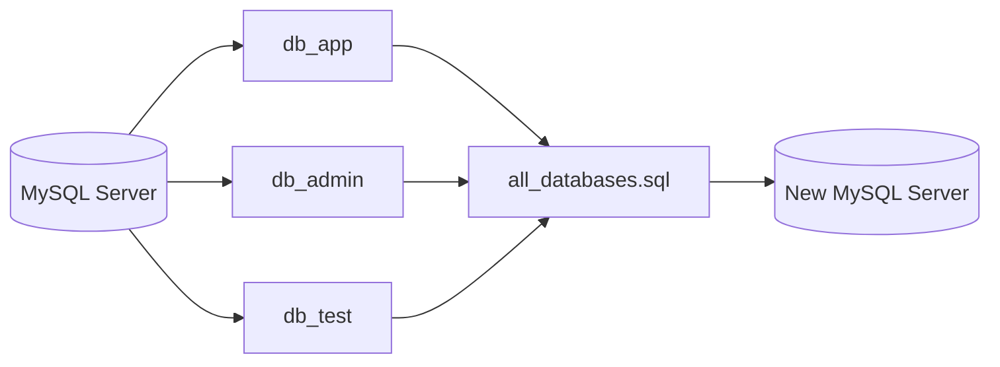
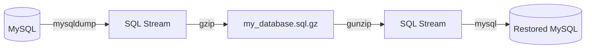
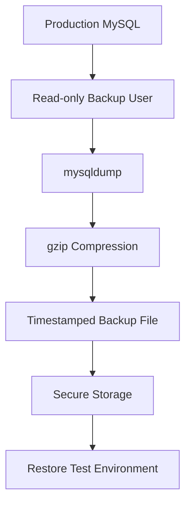
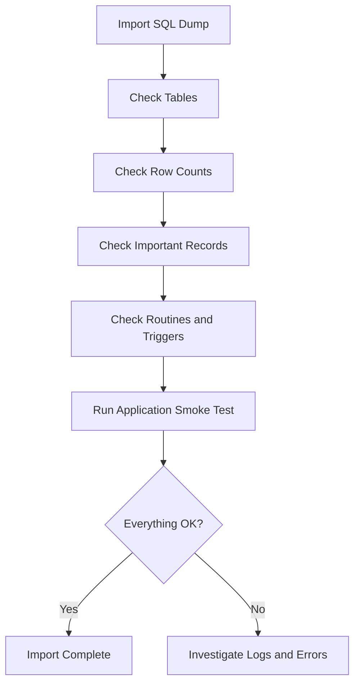

# MySQL Data Export and Import Guide

A comprehensive practical guide for exporting, importing, backing up, restoring, and migrating MySQL data using `mysqldump`, `mysql`, Docker Compose, compressed files, and safer production-oriented workflows.

> This guide focuses on MySQL development and migration workflows. Most examples also work with MariaDB, but some options may differ depending on version.

---

## Table of Contents

1. [Overview](#overview)
2. [Export vs Import Concepts](#export-vs-import-concepts)
3. [Common Tools](#common-tools)
4. [Basic Export with `mysqldump`](#basic-export-with-mysqldump)
5. [Basic Import with `mysql`](#basic-import-with-mysql)
6. [Export and Import with Docker Compose](#export-and-import-with-docker-compose)
7. [Export Specific Tables](#export-specific-tables)
8. [Export Schema Only](#export-schema-only)
9. [Export Data Only](#export-data-only)
10. [Export All Databases](#export-all-databases)
11. [Compressed Export and Import](#compressed-export-and-import)
12. [Recommended Development Backup Command](#recommended-development-backup-command)
13. [Recommended Safer Production Export](#recommended-safer-production-export)
14. [Importing into a Fresh Database](#importing-into-a-fresh-database)
15. [Importing Large SQL Files](#importing-large-sql-files)
16. [Character Encoding](#character-encoding)
17. [Users, Permissions, Routines, Triggers, and Events](#users-permissions-routines-triggers-and-events)
18. [Verification After Import](#verification-after-import)
19. [Troubleshooting](#troubleshooting)
20. [Cheat Sheet](#cheat-sheet)

---

## Overview

MySQL data export/import is commonly used for:

- Backing up a development database
- Moving data from local to staging
- Moving data from staging to local
- Migrating a database to another server
- Creating test fixtures
- Restoring a database after accidental data loss
- Copying only schema or only data
- Copying selected tables

The most common command-line tools are:

- `mysqldump` for exporting data
- `mysql` for importing SQL files
- `gzip` for compressing large dump files
- `docker compose exec` when MySQL runs inside Docker

---

## Export vs Import Concepts



An exported SQL dump usually contains SQL statements such as:

```sql
CREATE TABLE users (...);
INSERT INTO users (...) VALUES (...);
```

When imported, MySQL executes those SQL statements to recreate the database objects and data.

---

## Common Tools

| Tool | Purpose |
|---|---|
| `mysqldump` | Exports MySQL databases, tables, schemas, and data |
| `mysql` | Connects to MySQL and imports SQL files |
| `gzip` | Compresses SQL dump files |
| `gunzip` | Decompresses compressed dump files |
| `docker compose exec` | Runs MySQL commands inside a Docker Compose service |

Check if tools are available:

```bash
mysql --version
mysqldump --version
docker compose version
```

---

## Basic Export with `mysqldump`

### Export One Database

```bash
mysqldump -u root -p my_database > my_database.sql
```

Explanation:

| Part | Meaning |
|---|---|
| `mysqldump` | Export tool |
| `-u root` | MySQL username |
| `-p` | Ask for password |
| `my_database` | Database to export |
| `>` | Redirect output to file |
| `my_database.sql` | Output SQL dump file |



### Export with Host and Port

Use this when MySQL is not running on the default local socket.

```bash
mysqldump -h 127.0.0.1 -P 3306 -u root -p my_database > my_database.sql
```

| Option | Meaning |
|---|---|
| `-h 127.0.0.1` | MySQL host |
| `-P 3306` | MySQL port |
| `-u root` | Username |
| `-p` | Prompt for password |

---

## Basic Import with `mysql`

### Import into an Existing Database

```bash
mysql -u root -p my_database < my_database.sql
```

The database must already exist unless the SQL file contains `CREATE DATABASE` and `USE` statements.



---

## Export and Import with Docker Compose

Assume this `docker-compose.yml` service:

```yaml
services:
  mysql:
    image: mysql:8.4
    environment:
      MYSQL_ROOT_PASSWORD: root_password
      MYSQL_DATABASE: my_database
    ports:
      - "3306:3306"
    volumes:
      - mysql_data:/var/lib/mysql

volumes:
  mysql_data:
```

### Export from Docker Compose MySQL

```bash
docker compose exec mysql mysqldump -u root -p my_database > my_database.sql
```

You will be prompted for the password.

### Export with Inline Password

```bash
docker compose exec mysql mysqldump -u root -p'root_password' my_database > my_database.sql
```

> Be careful: putting passwords directly in commands may expose them in shell history.

### Import into Docker Compose MySQL

```bash
docker compose exec -T mysql mysql -u root -p my_database < my_database.sql
```

The `-T` option disables pseudo-TTY allocation and is important when using input redirection.

### Import with Inline Password

```bash
docker compose exec -T mysql mysql -u root -p'root_password' my_database < my_database.sql
```



---

## Export Specific Tables

### Export One Table

```bash
mysqldump -u root -p my_database users > users.sql
```

### Export Multiple Tables

```bash
mysqldump -u root -p my_database users orders products > selected_tables.sql
```

This is useful when:

- You only need sample data
- You want to migrate selected domain tables
- You want to debug a specific feature locally



---

## Export Schema Only

Export only table definitions, indexes, views, triggers, and related structure.

```bash
mysqldump -u root -p --no-data my_database > schema.sql
```

Use this when:

- You want to recreate database structure
- You do not want production data
- You want to compare schema changes
- You want to initialize a new environment

---

## Export Data Only

Export only rows, without `CREATE TABLE` statements.

```bash
mysqldump -u root -p --no-create-info my_database > data.sql
```

Use this when:

- The target database schema already exists
- You want to refresh data only
- Schema is managed separately by migrations

---

## Export All Databases

```bash
mysqldump -u root -p --all-databases > all_databases.sql
```

Import:

```bash
mysql -u root -p < all_databases.sql
```

This dump usually includes `CREATE DATABASE` and `USE` statements.



---

## Compressed Export and Import

Large SQL files can become very big. Compress them with `gzip`.

### Export Compressed Dump

```bash
mysqldump -u root -p my_database | gzip > my_database.sql.gz
```

### Import Compressed Dump

```bash
gunzip < my_database.sql.gz | mysql -u root -p my_database
```

### Docker Compose Compressed Export

```bash
docker compose exec mysql mysqldump -u root -p my_database | gzip > my_database.sql.gz
```

### Docker Compose Compressed Import

```bash
gunzip < my_database.sql.gz | docker compose exec -T mysql mysql -u root -p my_database
```



---

## Recommended Development Backup Command

For most local development environments:

```bash
mysqldump \
  -h 127.0.0.1 \
  -P 3306 \
  -u root \
  -p \
  --single-transaction \
  --routines \
  --triggers \
  --events \
  --default-character-set=utf8mb4 \
  my_database > my_database_backup.sql
```

### Why These Options?

| Option | Why it is useful |
|---|---|
| `--single-transaction` | Creates a consistent dump for InnoDB tables without locking them heavily |
| `--routines` | Includes stored procedures and functions |
| `--triggers` | Includes triggers |
| `--events` | Includes scheduled events |
| `--default-character-set=utf8mb4` | Helps preserve Unicode text such as Korean, emoji, and symbols |

---

## Recommended Safer Production Export

For production, prefer a careful process:

```bash
mysqldump \
  -h production-db.example.com \
  -u backup_user \
  -p \
  --single-transaction \
  --quick \
  --routines \
  --triggers \
  --events \
  --default-character-set=utf8mb4 \
  my_database | gzip > my_database_$(date +%Y%m%d_%H%M%S).sql.gz
```

### Additional Production Recommendations

- Use a dedicated read-only backup user
- Avoid exporting during peak traffic
- Test restore regularly
- Store backups securely
- Encrypt backups if they contain sensitive data
- Avoid placing passwords directly in shell commands
- Prefer automated backup systems for critical production databases



---

## Importing into a Fresh Database

If the target database does not exist, create it first.

```bash
mysql -u root -p
```

Then inside MySQL:

```sql
CREATE DATABASE my_database
  CHARACTER SET utf8mb4
  COLLATE utf8mb4_0900_ai_ci;

EXIT;
```

Then import:

```bash
mysql -u root -p my_database < my_database.sql
```

### Docker Compose Version

```bash
docker compose exec mysql mysql -u root -p
```

Inside MySQL:

```sql
CREATE DATABASE my_database
  CHARACTER SET utf8mb4
  COLLATE utf8mb4_0900_ai_ci;

EXIT;
```

Then:

```bash
docker compose exec -T mysql mysql -u root -p my_database < my_database.sql
```

---

## Importing Large SQL Files

For large files, avoid web tools like phpMyAdmin if possible. Use terminal import.

```bash
mysql -u root -p my_database < large_dump.sql
```

For compressed files:

```bash
gunzip < large_dump.sql.gz | mysql -u root -p my_database
```

For Docker Compose:

```bash
gunzip < large_dump.sql.gz | docker compose exec -T mysql mysql -u root -p my_database
```

### Useful MySQL Settings for Large Imports

Sometimes large imports fail because of packet size limits.

Check current value:

```sql
SHOW VARIABLES LIKE 'max_allowed_packet';
```

Start MySQL with a larger value if needed:

```bash
mysqld --max_allowed_packet=512M
```

Or configure MySQL server:

```ini
[mysqld]
max_allowed_packet=512M
```

---

## Character Encoding

Use `utf8mb4` to preserve full Unicode, including Korean and emoji.

### Export with UTF-8

```bash
mysqldump \
  -u root \
  -p \
  --default-character-set=utf8mb4 \
  my_database > my_database.sql
```

### Import with UTF-8

```bash
mysql \
  -u root \
  -p \
  --default-character-set=utf8mb4 \
  my_database < my_database.sql
```

### Recommended Database Creation

```sql
CREATE DATABASE my_database
  CHARACTER SET utf8mb4
  COLLATE utf8mb4_0900_ai_ci;
```

For older MySQL versions, you may need:

```sql
CREATE DATABASE my_database
  CHARACTER SET utf8mb4
  COLLATE utf8mb4_unicode_ci;
```

---

## Users, Permissions, Routines, Triggers, and Events

### Include Routines, Triggers, and Events

```bash
mysqldump \
  -u root \
  -p \
  --routines \
  --triggers \
  --events \
  my_database > my_database_full_objects.sql
```

### Export User Accounts and Grants

`mysqldump my_database` does not usually migrate MySQL users and permissions.

To check grants:

```sql
SHOW GRANTS FOR 'app_user'@'%';
```

You can recreate users manually:

```sql
CREATE USER 'app_user'@'%' IDENTIFIED BY 'strong_password';
GRANT SELECT, INSERT, UPDATE, DELETE ON my_database.* TO 'app_user'@'%';
FLUSH PRIVILEGES;
```

For migration between servers, be careful with:

- User host values such as `'user'@'localhost'` vs `'user'@'%'`
- Authentication plugins
- Password policies
- Privilege differences between MySQL versions

---

## Verification After Import

After import, verify the result.

```bash
mysql -u root -p my_database
```

Inside MySQL:

```sql
SHOW TABLES;
```

Check row count:

```sql
SELECT COUNT(*) FROM users;
```

Check important records:

```sql
SELECT * FROM users LIMIT 10;
```

Check table status:

```sql
SHOW TABLE STATUS;
```

Check routines:

```sql
SHOW PROCEDURE STATUS WHERE Db = 'my_database';
SHOW FUNCTION STATUS WHERE Db = 'my_database';
```

Check triggers:

```sql
SHOW TRIGGERS;
```



---

## Troubleshooting

### 1. `Access denied for user`

Possible causes:

- Wrong username
- Wrong password
- User does not have permission
- Host mismatch, such as `'root'@'localhost'` vs `'root'@'%'`

Try:

```bash
mysql -u root -p
```

Check grants:

```sql
SHOW GRANTS FOR CURRENT_USER();
```

---

### 2. `Unknown database 'my_database'`

The database does not exist.

Create it first:

```sql
CREATE DATABASE my_database;
```

Then import again:

```bash
mysql -u root -p my_database < my_database.sql
```

---

### 3. Docker Import Hangs or Fails

Use `-T`:

```bash
docker compose exec -T mysql mysql -u root -p my_database < my_database.sql
```

Without `-T`, input redirection can behave incorrectly.

---

### 4. Character Text Looks Broken

Use `utf8mb4` during export and import:

```bash
mysqldump -u root -p --default-character-set=utf8mb4 my_database > my_database.sql
mysql -u root -p --default-character-set=utf8mb4 my_database < my_database.sql
```

Also check database/table character set:

```sql
SHOW CREATE DATABASE my_database;
SHOW FULL COLUMNS FROM users;
```

---

### 5. Duplicate Key Errors During Import

Example:

```text
ERROR 1062 (23000): Duplicate entry ...
```

Possible causes:

- Target database already contains data
- Importing data-only dump into non-empty tables
- Running the same import twice

Options:

- Import into a fresh database
- Drop and recreate tables
- Use `TRUNCATE TABLE` carefully
- Review whether duplicate data should be preserved

---

### 6. Foreign Key Constraint Errors

Example:

```text
ERROR 1452 (23000): Cannot add or update a child row
```

Possible causes:

- Tables imported in wrong order
- Missing parent rows
- Existing inconsistent data

For controlled restore only, you can temporarily disable foreign key checks:

```sql
SET FOREIGN_KEY_CHECKS = 0;
SOURCE my_database.sql;
SET FOREIGN_KEY_CHECKS = 1;
```

Use carefully. Do not use this to hide real data integrity problems.

---

### 7. `max_allowed_packet` Error

Example:

```text
ERROR 1153 (08S01): Got a packet bigger than 'max_allowed_packet'
```

Increase server setting:

```ini
[mysqld]
max_allowed_packet=512M
```

Then restart MySQL.

---

### 8. Definer Errors

Example:

```text
ERROR 1227 (42000): Access denied; you need SUPER privilege
```

This may happen with views, triggers, routines, or events that include a `DEFINER`.

Possible solutions:

- Dump and restore with compatible users
- Recreate the missing definer user
- Edit the dump carefully to replace `DEFINER`
- Use a migration process that normalizes definers

---

## Suggested Backup File Naming

Use timestamped names:

```bash
my_database_20260430_153000.sql
my_database_20260430_153000.sql.gz
```

Shell example:

```bash
mysqldump -u root -p my_database > my_database_$(date +%Y%m%d_%H%M%S).sql
```

Compressed:

```bash
mysqldump -u root -p my_database | gzip > my_database_$(date +%Y%m%d_%H%M%S).sql.gz
```

---

## Example End-to-End Migration

Move a local database from one machine to another.


### On Source Machine

```bash
mysqldump \
  -u root \
  -p \
  --single-transaction \
  --routines \
  --triggers \
  --events \
  --default-character-set=utf8mb4 \
  my_database | gzip > my_database.sql.gz
```

### Copy to Target Machine

```bash
scp my_database.sql.gz user@target-machine:/path/to/backups/
```

### On Target Machine

Create database:

```bash
mysql -u root -p
```

```sql
CREATE DATABASE my_database
  CHARACTER SET utf8mb4
  COLLATE utf8mb4_0900_ai_ci;
EXIT;
```

Import:

```bash
gunzip < my_database.sql.gz | mysql -u root -p my_database
```

Verify:

```bash
mysql -u root -p my_database
```

```sql
SHOW TABLES;
SELECT COUNT(*) FROM users;
```

---

## Security Notes

Do not casually store production dumps on your laptop or shared drives if they contain:

- User personal information
- Password hashes
- Payment-related information
- Private messages
- Access tokens
- Business-sensitive data

Recommended practices:

- Encrypt backup files
- Restrict file permissions
- Use dedicated backup users
- Rotate old backups
- Test restore in a safe environment
- Avoid committing `.sql` files into Git

Set restrictive permissions:

```bash
chmod 600 my_database.sql
chmod 600 my_database.sql.gz
```

---

## Cheat Sheet

### Local MySQL

```bash
# Export database
mysqldump -u root -p my_database > my_database.sql

# Import database
mysql -u root -p my_database < my_database.sql

# Export all databases
mysqldump -u root -p --all-databases > all_databases.sql

# Import all databases
mysql -u root -p < all_databases.sql

# Export schema only
mysqldump -u root -p --no-data my_database > schema.sql

# Export data only
mysqldump -u root -p --no-create-info my_database > data.sql

# Export compressed
mysqldump -u root -p my_database | gzip > my_database.sql.gz

# Import compressed
gunzip < my_database.sql.gz | mysql -u root -p my_database
```

### Docker Compose MySQL

```bash
# Export from container
docker compose exec mysql mysqldump -u root -p my_database > my_database.sql

# Import into container
docker compose exec -T mysql mysql -u root -p my_database < my_database.sql

# Export compressed from container
docker compose exec mysql mysqldump -u root -p my_database | gzip > my_database.sql.gz

# Import compressed into container
gunzip < my_database.sql.gz | docker compose exec -T mysql mysql -u root -p my_database
```

### Recommended Development Export

```bash
mysqldump \
  -u root \
  -p \
  --single-transaction \
  --routines \
  --triggers \
  --events \
  --default-character-set=utf8mb4 \
  my_database > my_database_backup.sql
```

---

## Final Recommendation

For everyday development, use:

```bash
mysqldump \
  -u root \
  -p \
  --single-transaction \
  --routines \
  --triggers \
  --events \
  --default-character-set=utf8mb4 \
  my_database > my_database_backup.sql
```

Then restore with:

```bash
mysql -u root -p my_database < my_database_backup.sql
```

For Docker Compose, use:

```bash
docker compose exec mysql mysqldump -u root -p my_database > my_database.sql
docker compose exec -T mysql mysql -u root -p my_database < my_database.sql
```
