# AWS Account Access Guide: Admin, Developer, Tester, Operator, Finance, Auditor, and CI/CD

A comprehensive Markdown guide for creating and managing new AWS access accounts/identities for different roles such as administrator, developer, tester, operator, billing/finance, security auditor, read-only user, and automation/CI/CD.

> Last updated: 2026-05-02  
> Recommended model: **AWS IAM Identity Center + Groups + Permission Sets**  
> Fallback model: **IAM Users + IAM Groups + Managed/Customer Policies**

---

## Table of Contents

1. [Terminology: AWS Account vs User Account](#terminology-aws-account-vs-user-account)
2. [Recommended Access Model](#recommended-access-model)
3. [Role Matrix](#role-matrix)
4. [Overall Architecture](#overall-architecture)
5. [Method A: IAM Identity Center Setup](#method-a-iam-identity-center-setup)
6. [Method B: IAM User Fallback Setup](#method-b-iam-user-fallback-setup)
7. [Admin Account Setup](#admin-account-setup)
8. [Developer Account Setup](#developer-account-setup)
9. [Tester / QA Account Setup](#tester--qa-account-setup)
10. [Operator / DevOps Account Setup](#operator--devops-account-setup)
11. [Finance / Billing Account Setup](#finance--billing-account-setup)
12. [Security Auditor Account Setup](#security-auditor-account-setup)
13. [Read-Only Account Setup](#read-only-account-setup)
14. [CI/CD and Automation Access](#cicd-and-automation-access)
15. [Environment-Based Access Design](#environment-based-access-design)
16. [Billing Visibility Setup](#billing-visibility-setup)
17. [MFA and Password Policy](#mfa-and-password-policy)
18. [CLI Access Setup](#cli-access-setup)
19. [Custom Policy Examples](#custom-policy-examples)
20. [Verification Checklist](#verification-checklist)
21. [Troubleshooting](#troubleshooting)
22. [Best Practices](#best-practices)
23. [Reference Links](#reference-links)

---

# Terminology: AWS Account vs User Account

The word **account** can mean two different things in AWS.

## 1. AWS account

An AWS account is a billing, security, and resource boundary.

Examples:

```text
Production AWS account
Development AWS account
Testing AWS account
Security AWS account
Management AWS account
```

## 2. User account / identity

A user account is a login identity used by a person or service.

Examples:

```text
admin@example.com
developer@example.com
tester@example.com
operator@example.com
finance@example.com
```

In this document, **“making new accounts”** mostly means creating **new user identities and access roles** inside AWS.

---

# Recommended Access Model

For human users, prefer:

```text
IAM Identity Center
→ User
→ Group
→ Permission Set
→ AWS Account
```

For automation, prefer:

```text
IAM Role
→ Short-lived credentials
→ Limited permissions
```

Avoid using:

```text
Root user for daily work
Long-term access keys for humans
AdministratorAccess for everyone
```

---

# Role Matrix

| Role | Main Purpose | Recommended Permission | Billing Access | IAM Management | Production Access |
|---|---|---:|---:|---:|---:|
| Admin | Full account administration | `AdministratorAccess` | Optional / Yes | Yes | Yes |
| Developer | Build and deploy application resources | `PowerUserAccess` or custom | No | Usually no | Limited |
| Tester / QA | Test apps and inspect test resources | Custom QA policy or limited `PowerUserAccess` | No | No | Usually no |
| Operator / DevOps | Monitor, operate, restart, deploy | Custom operations policy | No | Limited / No | Yes, limited |
| Finance / Billing | View or manage costs | `AWSBillingReadOnlyAccess` or `Billing` | Yes | No | No |
| Security Auditor | Review security posture | `SecurityAudit` + read-only | No | No write access | Yes, read-only |
| Read-Only | Inspect resources | `ReadOnlyAccess` | No | No | Read-only |
| CI/CD | Deploy from pipeline | IAM role with scoped policy | No | Only `iam:PassRole` if needed | Environment-specific |
| Emergency Admin | Break-glass access | `AdministratorAccess` | Yes | Yes | Yes |

---

# Overall Architecture

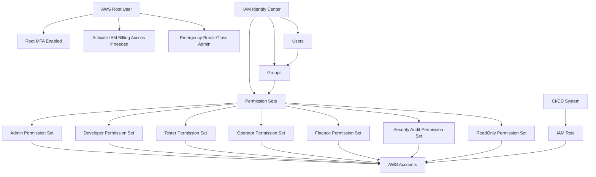

---

# Method A: IAM Identity Center Setup

IAM Identity Center is the recommended way to manage access for people.

## Why use IAM Identity Center?

It helps you:

- Manage human users centrally.
- Assign users/groups to one or more AWS accounts.
- Use permission sets for job roles.
- Use temporary credentials instead of long-term IAM access keys.
- Scale better when you have multiple users or accounts.

---

## IAM Identity Center Flow

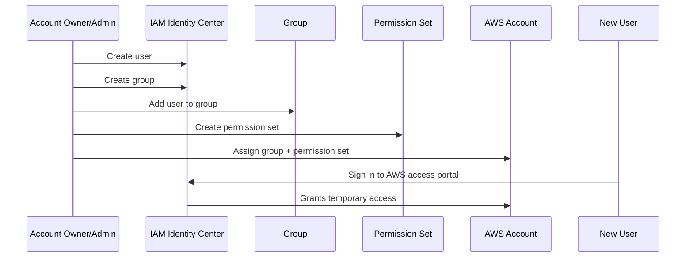

---

## Step 1: Enable IAM Identity Center

1. Open the AWS Console.
2. Search for **IAM Identity Center**.
3. Enable IAM Identity Center.
4. Choose the identity source:
   - Built-in Identity Center directory
   - External identity provider
   - Active Directory

For a small team, the built-in directory is usually enough.

---

## Step 2: Create groups

Create groups based on job roles:

```text
AWS-Admins
AWS-Developers
AWS-Testers
AWS-Operators
AWS-Finance
AWS-SecurityAuditors
AWS-ReadOnly
```

Group-based access is easier to manage than assigning permissions to every user individually.

---

## Step 3: Create users

Example users:

```text
admin@example.com
developer@example.com
tester@example.com
operator@example.com
finance@example.com
security@example.com
readonly@example.com
```

Then add each user to the appropriate group.

---

## Step 4: Create permission sets

Suggested permission sets:

| Permission Set Name | Attach Policy |
|---|---|
| `AdminAccess` | `AdministratorAccess` |
| `DeveloperAccess` | `PowerUserAccess` or custom developer policy |
| `TesterAccess` | Custom tester policy |
| `OperatorAccess` | Custom operator policy |
| `FinanceReadOnlyAccess` | `AWSBillingReadOnlyAccess` |
| `FinanceFullAccess` | `Billing` |
| `SecurityAuditAccess` | `SecurityAudit` + `ReadOnlyAccess` |
| `ReadOnlyAccess` | `ReadOnlyAccess` |

---

## Step 5: Assign groups to AWS accounts

Example:

| AWS Account | Group | Permission Set |
|---|---|---|
| Management | AWS-Admins | AdminAccess |
| Development | AWS-Developers | DeveloperAccess |
| Testing | AWS-Testers | TesterAccess |
| Production | AWS-Operators | OperatorAccess |
| Management | AWS-Finance | FinanceReadOnlyAccess |
| All accounts | AWS-SecurityAuditors | SecurityAuditAccess |
| All accounts | AWS-ReadOnly | ReadOnlyAccess |

---

# Method B: IAM User Fallback Setup

Use this only when IAM Identity Center is not available or your setup is very small.

## IAM User Fallback Flow

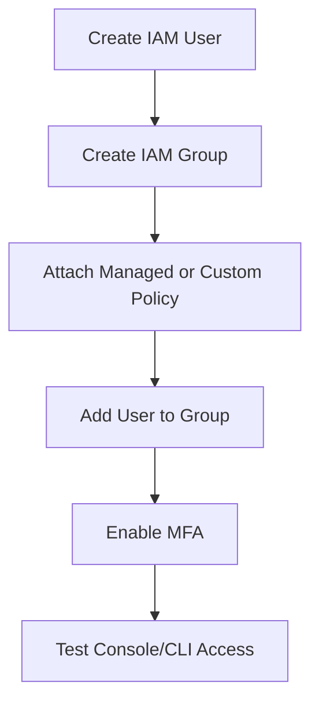

## Suggested IAM groups

```text
Admins
Developers
Testers
Operators
Finance
SecurityAuditors
ReadOnlyUsers
```

## Important

Avoid attaching policies directly to users.

Prefer:

```text
User → Group → Policy
```

instead of:

```text
User → Policy
```

---

# Admin Account Setup

Administrators can manage almost everything in the AWS account.

## Recommended permission

```text
AdministratorAccess
```

## Use admin access for

- IAM and permission management
- VPC/network setup
- Account-level service configuration
- Production incident response
- Security control setup
- Organization/account management

## Do not use admin access for

- Normal daily development
- Application testing
- Routine read-only inspection
- CI/CD deployment unless absolutely necessary

## IAM Identity Center setup

```text
Group: AWS-Admins
Permission set: AdminAccess
AWS managed policy: AdministratorAccess
```

## IAM fallback setup

```bash
aws iam create-group --group-name Admins

aws iam attach-group-policy \
  --group-name Admins \
  --policy-arn arn:aws:iam::aws:policy/AdministratorAccess

aws iam add-user-to-group \
  --user-name admin-john \
  --group-name Admins
```

## Admin access diagram

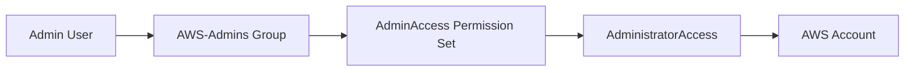

---

# Developer Account Setup

Developers usually need to create, update, and debug application resources, but they should not manage IAM or billing by default.

## Recommended permission

Start with:

```text
PowerUserAccess
```

Then reduce to custom least-privilege policies later.

## Developer can usually access

- EC2
- ECS
- ECR
- Lambda
- API Gateway
- S3 application buckets
- DynamoDB or RDS development resources
- CloudWatch logs
- Systems Manager for development servers

## Developer should usually not access

- Billing
- Root account settings
- IAM user/group administration
- Organization settings
- Production secrets unless explicitly required

## IAM Identity Center setup

```text
Group: AWS-Developers
Permission set: DeveloperAccess
AWS managed policy: PowerUserAccess
```

## Developer flow

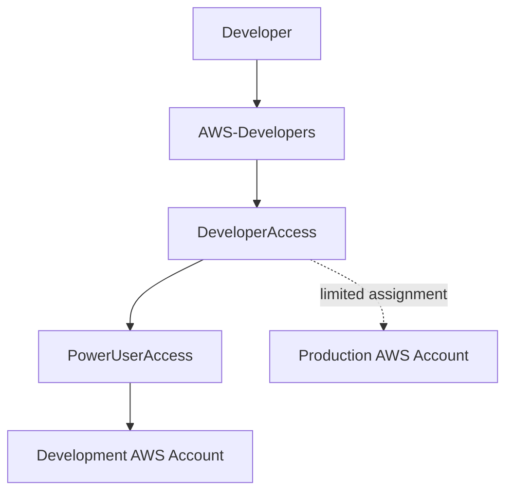

## IAM fallback setup

```bash
aws iam create-group --group-name Developers

aws iam attach-group-policy \
  --group-name Developers \
  --policy-arn arn:aws:iam::aws:policy/PowerUserAccess

aws iam add-user-to-group \
  --user-name dev-john \
  --group-name Developers
```

---

# Tester / QA Account Setup

Testers usually need to inspect application behavior, run test environments, view logs, and possibly trigger test deployments.

## Recommended permission

Use a custom QA policy.

For small teams, you can start with limited access to the testing account only.

## Tester can usually access

- Test environment resources
- CloudWatch logs
- S3 test buckets
- Test databases, limited
- API Gateway test stages
- Lambda test functions
- CodeBuild test jobs, if needed

## Tester should usually not access

- Production write actions
- Billing
- IAM management
- Secrets not needed for testing
- Account settings

## IAM Identity Center setup

```text
Group: AWS-Testers
Permission set: TesterAccess
Policy: Custom tester policy
Account assignment: Testing account
```

## Tester flow

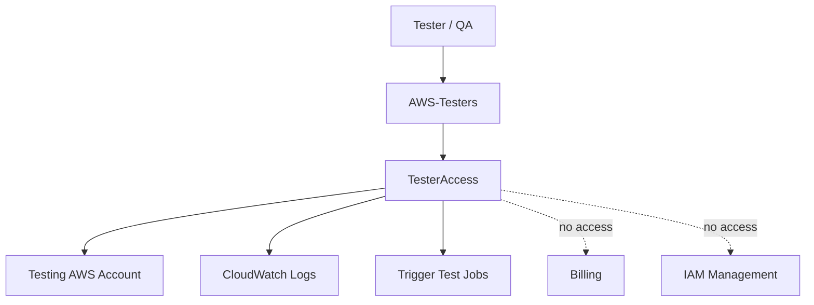

## Example tester policy concept

```json
{
  "Version": "2012-10-17",
  "Statement": [
    {
      "Sid": "ViewLogsAndMetrics",
      "Effect": "Allow",
      "Action": [
        "cloudwatch:Get*",
        "cloudwatch:List*",
        "logs:Get*",
        "logs:Describe*",
        "logs:FilterLogEvents"
      ],
      "Resource": "*"
    },
    {
      "Sid": "ReadApplicationResources",
      "Effect": "Allow",
      "Action": [
        "lambda:Get*",
        "lambda:List*",
        "apigateway:GET",
        "s3:GetObject",
        "s3:ListBucket",
        "dynamodb:Describe*",
        "dynamodb:List*",
        "rds:Describe*"
      ],
      "Resource": "*"
    }
  ]
}
```

---

# Operator / DevOps Account Setup

Operators manage running systems. They may need production access, but it should be controlled.

## Recommended permission

Use a custom operations policy.

## Operator can usually access

- CloudWatch logs and metrics
- ECS service restart/update
- EC2 start/stop/reboot
- Auto Scaling operations
- Systems Manager Session Manager
- Deployments through CodeDeploy/CodePipeline
- Incident response tools

## Operator should usually not access

- Billing
- Organization settings
- Unrestricted IAM administration
- Production data unless needed
- Root account

## IAM Identity Center setup

```text
Group: AWS-Operators
Permission set: OperatorAccess
Policy: Custom operator policy
Account assignment: Production and staging accounts
```

## Operator flow

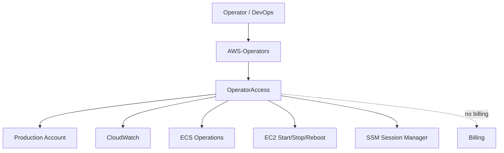

## Example operator policy concept

```json
{
  "Version": "2012-10-17",
  "Statement": [
    {
      "Sid": "Observe",
      "Effect": "Allow",
      "Action": [
        "cloudwatch:*",
        "logs:*",
        "xray:Get*",
        "xray:BatchGet*"
      ],
      "Resource": "*"
    },
    {
      "Sid": "OperateEC2",
      "Effect": "Allow",
      "Action": [
        "ec2:Describe*",
        "ec2:StartInstances",
        "ec2:StopInstances",
        "ec2:RebootInstances"
      ],
      "Resource": "*"
    },
    {
      "Sid": "OperateECS",
      "Effect": "Allow",
      "Action": [
        "ecs:Describe*",
        "ecs:List*",
        "ecs:UpdateService"
      ],
      "Resource": "*"
    }
  ]
}
```

---

# Finance / Billing Account Setup

Finance users need cost and billing visibility, not infrastructure administration.

## Recommended permissions

For read-only billing:

```text
AWSBillingReadOnlyAccess
```

For broader billing and cost management:

```text
Billing
```

## Finance can usually access

- Bills
- Cost Explorer
- Budgets
- Usage reports
- Invoices
- Payment information, if allowed

## Finance should usually not access

- EC2/S3/Lambda write actions
- IAM management
- Production infrastructure changes
- Secrets

## Important billing requirement

Billing access requires a root-level setting:

```text
Activate IAM access to Billing
```

Without this, IAM users and roles may not see billing information even with policies attached.

## Finance flow

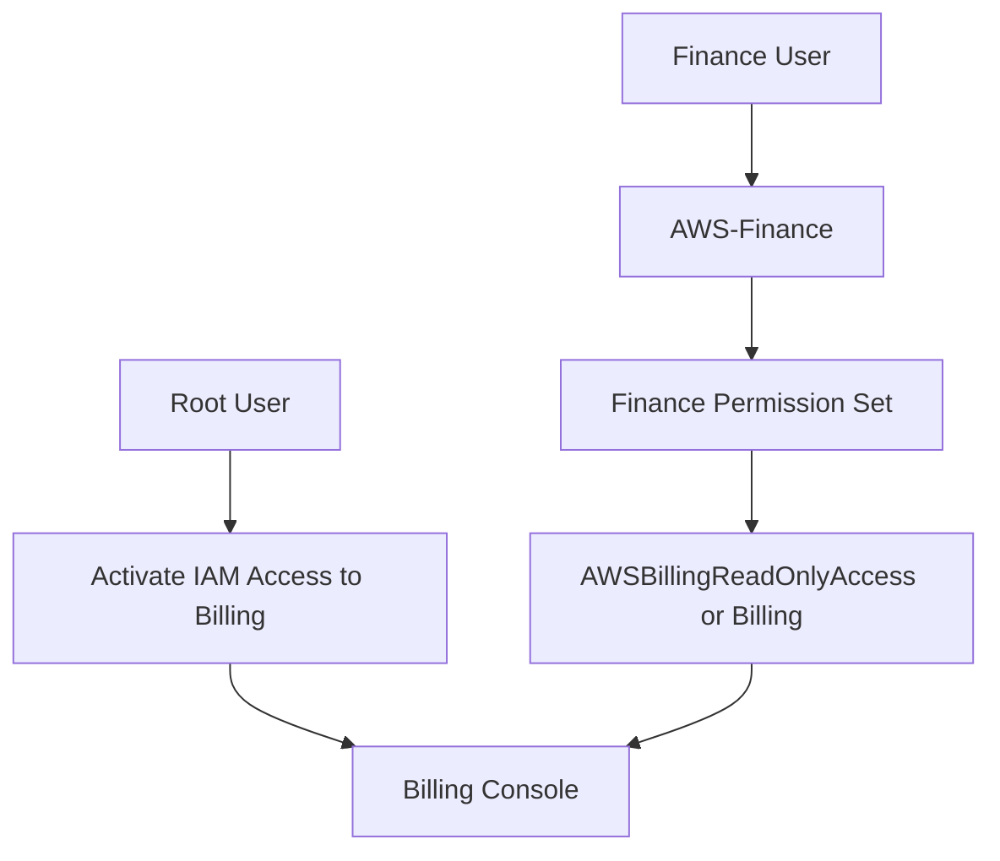

## IAM Identity Center setup

```text
Group: AWS-Finance
Permission set: FinanceReadOnlyAccess
AWS managed policy: AWSBillingReadOnlyAccess
```

or:

```text
Group: AWS-FinanceManagers
Permission set: FinanceFullAccess
AWS managed policy: Billing
```

---

# Security Auditor Account Setup

Security auditors need to inspect configuration, risks, and compliance posture.

## Recommended permissions

```text
SecurityAudit
ReadOnlyAccess
```

## Security auditor can usually access

- Security configuration metadata
- IAM policy information
- CloudTrail configuration
- GuardDuty findings
- Security Hub findings
- Config information
- Read-only resource configuration

## Security auditor should usually not access

- Resource modification
- IAM changes
- Billing changes
- Secret values unless explicitly approved

## Security auditor flow

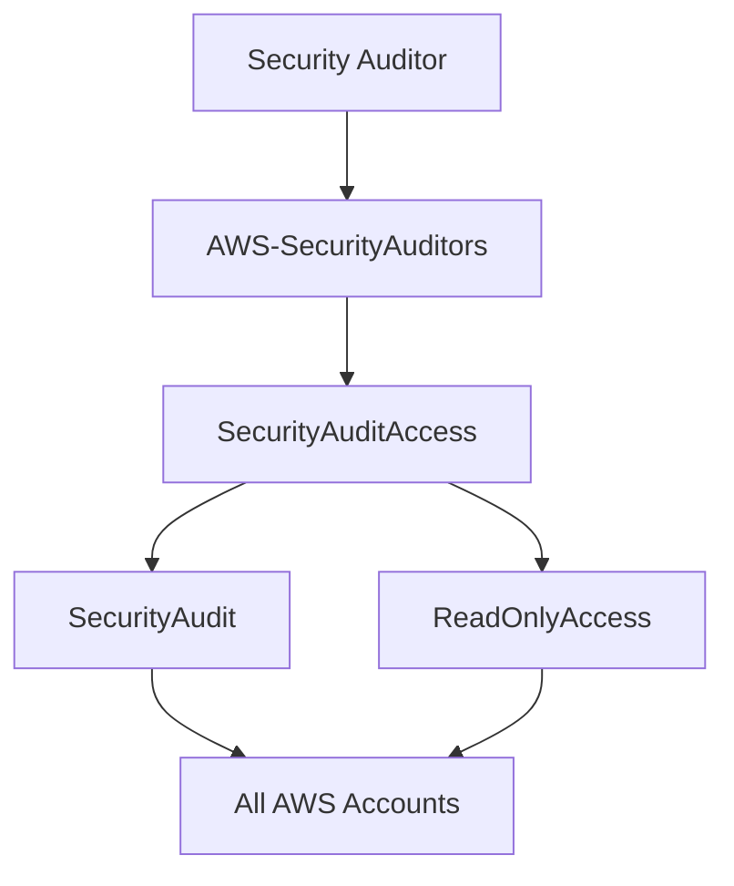

---

# Read-Only Account Setup

Read-only users can inspect AWS resources but cannot modify them.

## Recommended permission

```text
ReadOnlyAccess
```

## Read-only users can usually access

- Resource lists
- Configuration details
- Logs and metrics, depending on policy behavior
- Service dashboards

## Read-only users should not access

- Write/update/delete actions
- Billing, unless separately granted
- Sensitive secret values

## IAM Identity Center setup

```text
Group: AWS-ReadOnly
Permission set: ReadOnlyAccess
AWS managed policy: ReadOnlyAccess
```

## Read-only flow

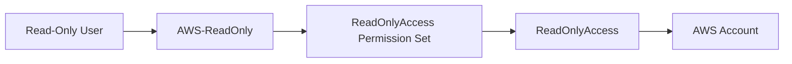

---

# CI/CD and Automation Access

Do not create normal human user accounts for CI/CD when possible.

Prefer IAM roles.

## Good model

```text
GitHub Actions / GitLab CI / Jenkins
→ Assume IAM role
→ Temporary credentials
→ Deploy only required resources
```

## Bad model

```text
CI/CD server
→ Long-term IAM user access key
→ AdministratorAccess
```

## CI/CD access flow

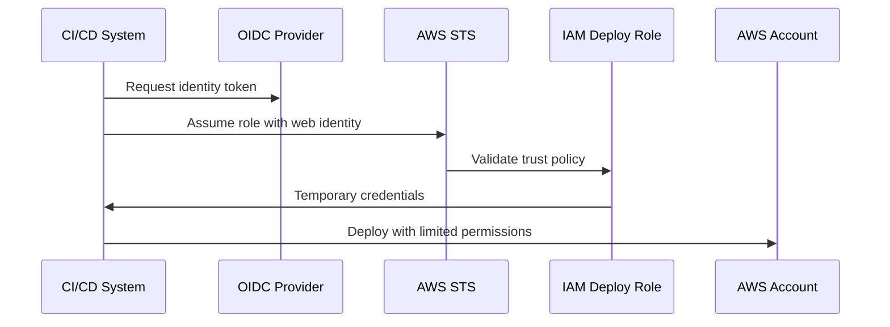

## CI/CD role recommendations

| Pipeline | Suggested Permission |
|---|---|
| Frontend deploy to S3/CloudFront | S3 write to one bucket + CloudFront invalidation |
| Lambda deploy | Lambda update + IAM PassRole for specific execution role |
| ECS deploy | ECS update service + ECR push + limited IAM PassRole |
| Terraform plan | Read-only + state access |
| Terraform apply | Scoped infrastructure permissions, preferably per environment |

---

# Environment-Based Access Design

For better security, separate environments.

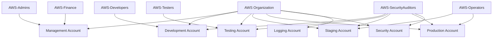

## Example access design

| Environment | Admin | Developer | Tester | Operator | Auditor | Finance |
|---|---:|---:|---:|---:|---:|---:|
| Management | Yes | No | No | No | Read-only | Billing |
| Development | Yes | Power user | Limited | Limited | Read-only | No |
| Testing | Yes | Limited | Test access | Limited | Read-only | No |
| Staging | Yes | Limited | Limited | Operator | Read-only | No |
| Production | Yes | Usually no | Usually no | Operator | Read-only | No |
| Security | Security admin | No | No | No | Read-only | No |

---

# Billing Visibility Setup

Even full administrators can get confused here.

## Important rule

To allow IAM users and roles to access Billing pages, the root user must activate IAM access to Billing.

## Steps

1. Sign in as the AWS account root user.
2. Open the AWS Console.
3. Click the account name in the top-right.
4. Choose **Account**.
5. Find:

```text
IAM User and Role Access to Billing Information
```

6. Choose **Edit**.
7. Select:

```text
Activate IAM Access
```

8. Save/update.

## Billing access decision tree

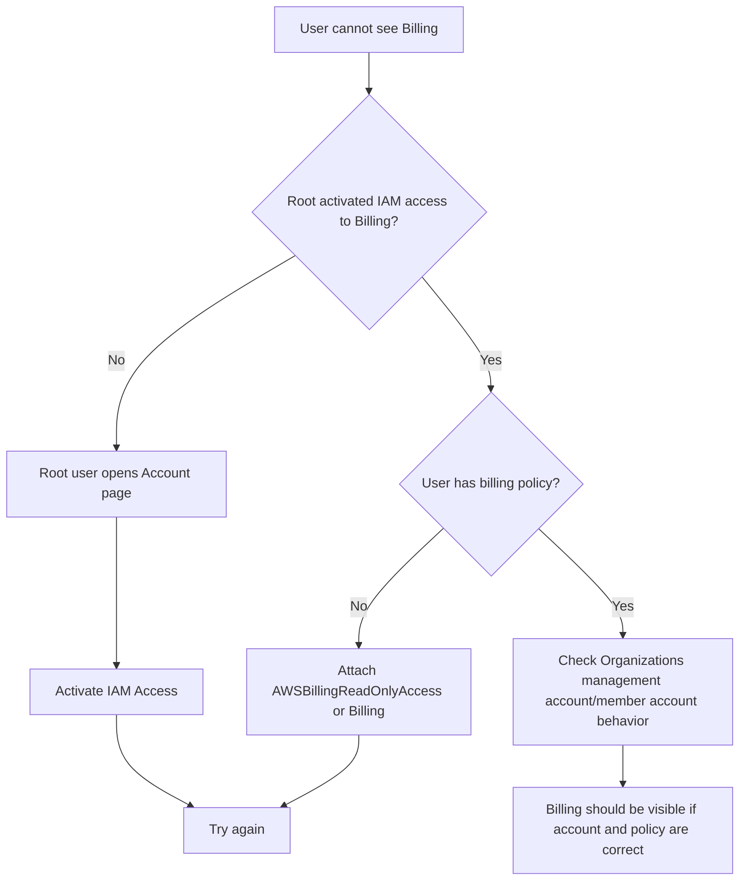

---

# MFA and Password Policy

## Minimum MFA requirements

Enable MFA for:

```text
Root user
Admins
Developers
Operators
Finance users
Security auditors
CI/CD admin maintainers
```

## MFA flow

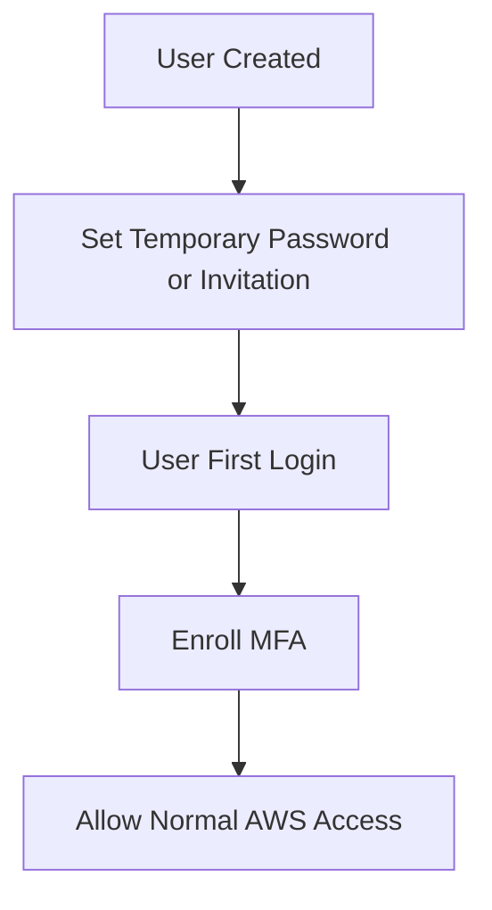

## Password policy

Recommended:

- Strong passwords
- Password reset on first login
- No shared accounts
- Remove users quickly when they leave
- Review unused access regularly

---

# CLI Access Setup

## IAM Identity Center CLI

Recommended for humans:

```bash
aws configure sso
```

Login:

```bash
aws sso login --profile dev
```

Verify:

```bash
aws sts get-caller-identity --profile dev
```

## IAM user CLI fallback

Only create access keys when necessary.

```bash
aws configure --profile dev-user
```

Verify:

```bash
aws sts get-caller-identity --profile dev-user
```

## Avoid

```text
Root access keys
Shared access keys
Long-term admin access keys
Access keys committed to Git
```

---

# Custom Policy Examples

## Example: S3-only developer

This allows a developer to work with one specific S3 bucket.

```json
{
  "Version": "2012-10-17",
  "Statement": [
    {
      "Sid": "ListSpecificBucket",
      "Effect": "Allow",
      "Action": [
        "s3:ListBucket"
      ],
      "Resource": "arn:aws:s3:::my-development-bucket"
    },
    {
      "Sid": "ObjectAccessInSpecificBucket",
      "Effect": "Allow",
      "Action": [
        "s3:GetObject",
        "s3:PutObject",
        "s3:DeleteObject"
      ],
      "Resource": "arn:aws:s3:::my-development-bucket/*"
    }
  ]
}
```

---

## Example: Lambda developer

This allows updating Lambda functions and reading logs.

```json
{
  "Version": "2012-10-17",
  "Statement": [
    {
      "Sid": "LambdaDevelopment",
      "Effect": "Allow",
      "Action": [
        "lambda:Get*",
        "lambda:List*",
        "lambda:UpdateFunctionCode",
        "lambda:UpdateFunctionConfiguration",
        "lambda:InvokeFunction"
      ],
      "Resource": "arn:aws:lambda:ap-northeast-2:123456789012:function:dev-*"
    },
    {
      "Sid": "ReadLambdaLogs",
      "Effect": "Allow",
      "Action": [
        "logs:Get*",
        "logs:Describe*",
        "logs:FilterLogEvents"
      ],
      "Resource": "*"
    }
  ]
}
```

---

## Example: Operator EC2 start/stop only

```json
{
  "Version": "2012-10-17",
  "Statement": [
    {
      "Sid": "DescribeEC2",
      "Effect": "Allow",
      "Action": [
        "ec2:Describe*"
      ],
      "Resource": "*"
    },
    {
      "Sid": "StartStopRebootTaggedInstances",
      "Effect": "Allow",
      "Action": [
        "ec2:StartInstances",
        "ec2:StopInstances",
        "ec2:RebootInstances"
      ],
      "Resource": "*",
      "Condition": {
        "StringEquals": {
          "aws:ResourceTag/Environment": "production"
        }
      }
    }
  ]
}
```

---

## Example: Billing read-only

For most finance users, prefer the AWS managed policy:

```text
AWSBillingReadOnlyAccess
```

You can also create custom billing policies, but billing permissions change over time, so use AWS managed policies where possible.

---

# Verification Checklist

## For every user

- [ ] User can sign in.
- [ ] User is in the correct group.
- [ ] MFA is enabled.
- [ ] User can access only the intended AWS account.
- [ ] User cannot access unnecessary accounts.
- [ ] User cannot access billing unless intended.
- [ ] User cannot manage IAM unless intended.

## Admin

- [ ] Can manage IAM.
- [ ] Can manage AWS services.
- [ ] Can access billing if required.
- [ ] MFA enabled.
- [ ] Not using root for daily work.

## Developer

- [ ] Can access development resources.
- [ ] Cannot manage IAM users/groups.
- [ ] Cannot access billing.
- [ ] Cannot modify production unless intended.
- [ ] Can use CLI through SSO.

## Tester

- [ ] Can inspect test resources.
- [ ] Can view logs.
- [ ] Can trigger test jobs if required.
- [ ] Cannot modify production.
- [ ] Cannot access billing/IAM.

## Operator

- [ ] Can view production metrics/logs.
- [ ] Can perform approved operations.
- [ ] Cannot perform unrestricted IAM changes.
- [ ] Cannot access billing unless intended.
- [ ] Actions are logged by CloudTrail.

## Finance

- [ ] Can view billing pages.
- [ ] Cannot modify infrastructure.
- [ ] IAM Billing access is activated by root.
- [ ] Correct billing policy attached.

## Security auditor

- [ ] Can view security configuration.
- [ ] Can view resources read-only.
- [ ] Cannot modify resources.
- [ ] Can access all required accounts.

---

# Troubleshooting

## User cannot see Billing

Check:

1. Was IAM access to Billing activated by root?
2. Is the user assigned a billing policy?
3. Is the user in the management account or a member account?
4. Has the user signed out and signed in again?

---

## User has PowerUserAccess but cannot manage IAM

That is expected.

`PowerUserAccess` gives broad access to AWS services and resources, but it does not allow management of IAM users and groups.

Use admin access only for trusted administrators.

---

## User cannot see the expected AWS account in IAM Identity Center

Check:

1. User is in the correct group.
2. Group is assigned to the AWS account.
3. Permission set is provisioned.
4. User is logging in through the correct AWS access portal.
5. The correct IAM Identity Center region is being used.

---

## CLI access does not work

Run:

```bash
aws sts get-caller-identity --profile your-profile
```

For IAM Identity Center:

```bash
aws sso login --profile your-profile
```

Check:

- Profile name
- SSO session
- AWS account
- Permission set
- Region
- Expired credentials

---

## User can do too much

Fix:

1. Remove broad managed policies.
2. Create custom least-privilege policies.
3. Assign access by environment.
4. Use resource tags and conditions.
5. Review access with IAM Access Analyzer and last accessed data.

---

# Best Practices

## 1. Use IAM Identity Center for humans

For people, use IAM Identity Center whenever possible.

```text
User → Group → Permission Set → AWS Account
```

---

## 2. Use IAM roles for machines

For CI/CD, apps, and automation, use IAM roles.

```text
Workload → Assume role → Temporary credentials
```

---

## 3. Use groups

Do not assign access one user at a time.

Good:

```text
Alice → AWS-Developers → DeveloperAccess
Bob → AWS-Developers → DeveloperAccess
```

Bad:

```text
Alice → custom permissions
Bob → different custom permissions
Charlie → direct policy attachment
```

---

## 4. Use least privilege

Start with AWS managed policies when learning, but reduce permissions over time.

Example evolution:

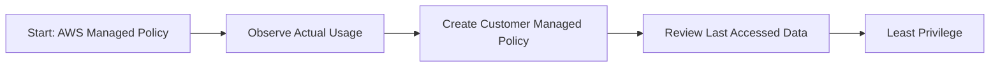

---

## 5. Separate environments

Avoid giving every developer production access.

Recommended:

```text
Development: broad developer access
Testing: tester and developer access
Staging: operator and limited developer access
Production: operator/admin access only
```

---

## 6. Protect the root user

Root user should be used rarely.

Use root only for:

- Root MFA setup
- Account recovery
- Some account-level settings
- Activating IAM access to Billing

---

## 7. Avoid shared accounts

Do not create accounts like:

```text
developer1
team-admin
shared-prod
```

Use individual named identities.

Good:

```text
john@example.com
sarah@example.com
minji@example.com
```

---

## 8. Audit regularly

Review:

- Users
- Groups
- Permission sets
- IAM roles
- Access keys
- Unused permissions
- CloudTrail logs
- Billing access

---

# Recommended Starting Setup

For a small team, start with this:

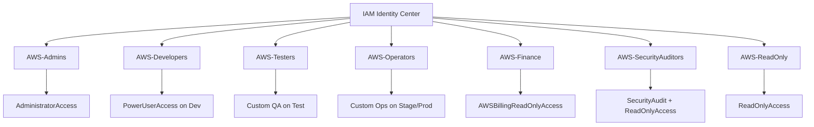

## Minimum groups

```text
AWS-Admins
AWS-Developers
AWS-ReadOnly
AWS-Finance
```

## Better groups

```text
AWS-Admins
AWS-Developers
AWS-Testers
AWS-Operators
AWS-Finance
AWS-SecurityAuditors
AWS-ReadOnly
AWS-EmergencyAdmins
```

---

# Quick Setup Summary

## Admin

```text
Group: AWS-Admins
Permission: AdministratorAccess
MFA: Required
Billing: Optional
```

## Developer

```text
Group: AWS-Developers
Permission: PowerUserAccess or custom
MFA: Required
Billing: No
Production: Usually no
```

## Tester

```text
Group: AWS-Testers
Permission: Custom QA policy
MFA: Required
Billing: No
Production: No
```

## Operator

```text
Group: AWS-Operators
Permission: Custom operations policy
MFA: Required
Billing: No
Production: Limited yes
```

## Finance

```text
Group: AWS-Finance
Permission: AWSBillingReadOnlyAccess or Billing
MFA: Required
Billing: Yes
Infrastructure: No
```

## Security Auditor

```text
Group: AWS-SecurityAuditors
Permission: SecurityAudit + ReadOnlyAccess
MFA: Required
Billing: No
Write access: No
```

## CI/CD

```text
Identity type: IAM Role
Permission: Custom deployment policy
Credential type: Temporary
AdministratorAccess: Avoid
```

---

# Reference Links

Official AWS documentation:

- IAM Identity Center permission sets  
  https://docs.aws.amazon.com/singlesignon/latest/userguide/permissionsets.html

- Manage AWS accounts with permission sets  
  https://docs.aws.amazon.com/singlesignon/latest/userguide/permissionsetsconcept.html

- Assign user or group access to AWS accounts  
  https://docs.aws.amazon.com/singlesignon/latest/userguide/assignusers.html

- IAM Identity Center users and groups  
  https://docs.aws.amazon.com/singlesignon/latest/userguide/users-groups-provisioning.html

- AWS managed policies for job functions  
  https://docs.aws.amazon.com/IAM/latest/UserGuide/access_policies_job-functions.html

- AdministratorAccess managed policy  
  https://docs.aws.amazon.com/aws-managed-policy/latest/reference/AdministratorAccess.html

- PowerUserAccess managed policy  
  https://docs.aws.amazon.com/aws-managed-policy/latest/reference/PowerUserAccess.html

- ReadOnlyAccess managed policy  
  https://docs.aws.amazon.com/aws-managed-policy/latest/reference/ReadOnlyAccess.html

- SecurityAudit managed policy  
  https://docs.aws.amazon.com/aws-managed-policy/latest/reference/SecurityAudit.html

- AWSBillingReadOnlyAccess managed policy  
  https://docs.aws.amazon.com/aws-managed-policy/latest/reference/AWSBillingReadOnlyAccess.html

- Billing managed policy  
  https://docs.aws.amazon.com/aws-managed-policy/latest/reference/Billing.html

- Control access to AWS Billing  
  https://docs.aws.amazon.com/awsaccountbilling/latest/aboutv2/control-access-billing.html

- Billing IAM access setup  
  https://docs.aws.amazon.com/IAM/latest/UserGuide/getting-started-account-iam.html

- Security best practices in IAM  
  https://docs.aws.amazon.com/IAM/latest/UserGuide/best-practices.html

- Prepare for least-privilege permissions  
  https://docs.aws.amazon.com/IAM/latest/UserGuide/getting-started-reduce-permissions.html

- IAM MFA  
  https://docs.aws.amazon.com/IAM/latest/UserGuide/id_credentials_mfa.html

- AWS managed policies vs inline policies  
  https://docs.aws.amazon.com/IAM/latest/UserGuide/access_policies_managed-vs-inline.html

---

# Final Recommendation

Use this default structure:

```text
IAM Identity Center
├── AWS-Admins              → AdministratorAccess
├── AWS-Developers          → PowerUserAccess on dev/test only
├── AWS-Testers             → Custom QA policy
├── AWS-Operators           → Custom production operations policy
├── AWS-Finance             → AWSBillingReadOnlyAccess or Billing
├── AWS-SecurityAuditors    → SecurityAudit + ReadOnlyAccess
├── AWS-ReadOnly            → ReadOnlyAccess
└── CI/CD                   → IAM roles, not human users
```

This gives you a clean, scalable, and safer AWS access model.