# Using AWS Cognito for Your App Service

A comprehensive guide for designing authentication and authorization with **Amazon Cognito**, **API Gateway**, **Lambda**, and your own application database.

_Last updated: 2026-05-04_

---

## 1. Executive Summary

Amazon Cognito is a good choice when your app service is primarily built on AWS and you want managed authentication, JWT-based API access, MFA, social login, and native integration with API Gateway and Lambda.

However, Cognito should usually **not** be your complete application user database. A better pattern is:

- **Cognito User Pool**: authentication, sign-up, sign-in, password reset, MFA, social login, JWTs.
- **Your app database**: profile, plan, permissions, workspace/team membership, billing status, preferences, business data.

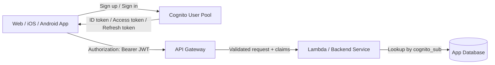

Recommended identity split:

| Data | Store in Cognito? | Store in app DB? |
|---|---:|---:|
| Email | Yes | Optional copy |
| Password hash | Yes | No |
| MFA settings | Yes | No |
| Social login identity | Yes | Optional reference |
| User display name | Optional | Yes |
| Subscription plan | No | Yes |
| Workspace/team membership | No | Yes |
| Fine-grained permissions | Usually no | Yes |
| Business data | No | Yes |

---

## 2. What Cognito Gives You

Amazon Cognito User Pools provide a managed user directory and authentication service for web and mobile apps. After users authenticate, Cognito issues JWTs that can be used to access APIs such as Amazon API Gateway.

Main features:

- Email/password sign-up and sign-in
- Hosted UI / managed login
- OAuth 2.0 and OpenID Connect flows
- Social login and external identity providers
- MFA and account recovery
- JWT issuance: ID token, access token, refresh token
- User groups and custom attributes
- Lambda triggers for custom workflows
- API Gateway integration
- Optional Cognito Identity Pools for temporary AWS credentials

Important distinction:

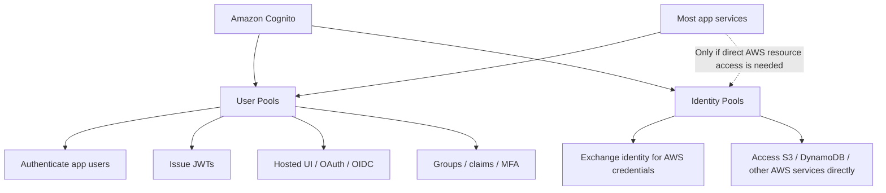

For most app services, start with **Cognito User Pools**. Add **Identity Pools** only if your client app needs temporary AWS credentials to call AWS services directly.

---

## 3. Recommended Architecture

### 3.1 Standard Web/Mobile App + API Gateway + Backend

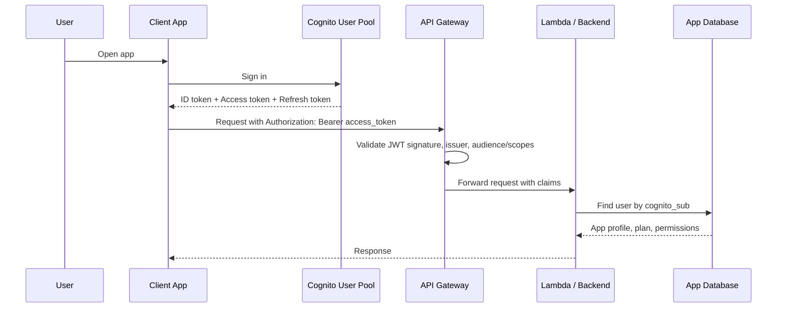

### 3.2 Database Model

Use Cognito's `sub` claim as the stable external identity key.

Example PostgreSQL table:

```sql
create table app_users (
  id uuid primary key default gen_random_uuid(),
  cognito_sub text unique not null,
  email text,
  display_name text,
  role text not null default 'user',
  billing_plan text not null default 'free',
  created_at timestamptz not null default now(),
  updated_at timestamptz not null default now()
);

create index idx_app_users_cognito_sub on app_users(cognito_sub);
```

Example multi-tenant tables:

```sql
create table workspaces (
  id uuid primary key default gen_random_uuid(),
  name text not null,
  created_at timestamptz not null default now()
);

create table workspace_members (
  workspace_id uuid not null references workspaces(id),
  user_id uuid not null references app_users(id),
  role text not null check (role in ('owner', 'admin', 'member', 'viewer')),
  created_at timestamptz not null default now(),
  primary key (workspace_id, user_id)
);
```

Why this matters:

- Cognito is not good for relational queries.
- Cognito custom attributes are not a replacement for app data.
- Your backend needs fast authorization checks by workspace, project, organization, plan, or role.

---

## 4. Token Types

When a user signs in, Cognito typically returns:

| Token | Purpose | Send to your API? |
|---|---|---:|
| ID token | User identity/profile claims | Sometimes, but not ideal for API authorization |
| Access token | API authorization, scopes, groups | Yes |
| Refresh token | Get new tokens | No, keep only in client/session storage |

Recommended API request:

```http
GET /v1/me HTTP/1.1
Host: api.example.com
Authorization: Bearer <cognito_access_token>
```

Typical useful JWT claims:

| Claim | Meaning |
|---|---|
| `sub` | Stable Cognito user ID |
| `iss` | Issuer URL for the user pool |
| `client_id` | App client ID, often in access token |
| `aud` | Audience, often in ID token |
| `exp` | Expiration time |
| `iat` | Issued-at time |
| `scope` | OAuth scopes |
| `cognito:groups` | Cognito groups, if configured |
| `email` | Usually in ID token; can be exposed depending on config |

---

## 5. Cognito User Pool Setup

### 5.1 Create a User Pool

Recommended baseline:

- Sign-in aliases: email
- Required attributes: email
- Password policy: strong enough for your app risk level
- MFA: optional or required depending on app sensitivity
- Account recovery: email
- Email verification: enabled
- Advanced security: consider if your risk level requires it

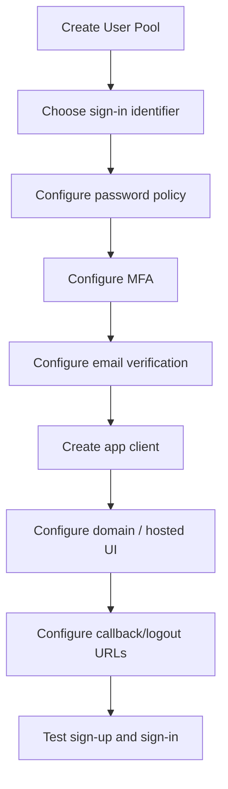

### 5.2 App Client

Create an app client for each app surface:

| App | App client type |
|---|---|
| Web SPA | Public client, no client secret |
| iOS / Android | Public client, no client secret |
| Server-rendered backend | Confidential client, client secret allowed |
| Machine-to-machine service | Separate app client / OAuth client credentials if needed |

For browser/mobile apps, do **not** use a client secret. Public clients cannot safely keep secrets.

### 5.3 Hosted UI vs Custom UI

| Option | Pros | Cons |
|---|---|---|
| Cognito Hosted UI | Faster, safer, less custom auth code | Less flexible design |
| Custom login UI using SDK | Full UX control | More responsibility for edge cases |

For production, Hosted UI is often safer unless you need deep branding or a custom onboarding flow.

---

## 6. API Gateway Integration

You have two common choices:

### 6.1 REST API + Cognito User Pool Authorizer

Use this if you are using API Gateway REST APIs.

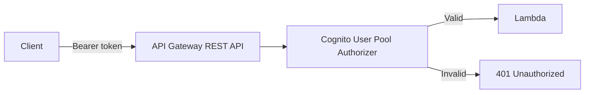

High-level steps:

1. Create Cognito User Pool.
2. Create API Gateway REST API.
3. Create a `COGNITO_USER_POOLS` authorizer.
4. Attach the authorizer to protected methods.
5. Deploy the API.
6. Call the API with `Authorization: Bearer <token>`.

### 6.2 HTTP API + JWT Authorizer

Use this if you are using API Gateway HTTP APIs.

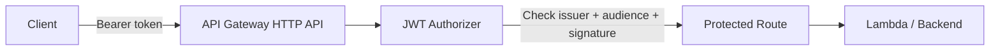

Typical HTTP API JWT authorizer values:

```text
Identity source: $request.header.Authorization
Issuer: https://cognito-idp.<region>.amazonaws.com/<user_pool_id>
Audience: <app_client_id>
```

For HTTP API, the JWT authorizer validates token signature, issuer, audience/client ID, expiration, and optionally scopes.

---

## 7. Backend Authorization Pattern

Do not stop at “JWT is valid.” Your backend still needs app-specific authorization.

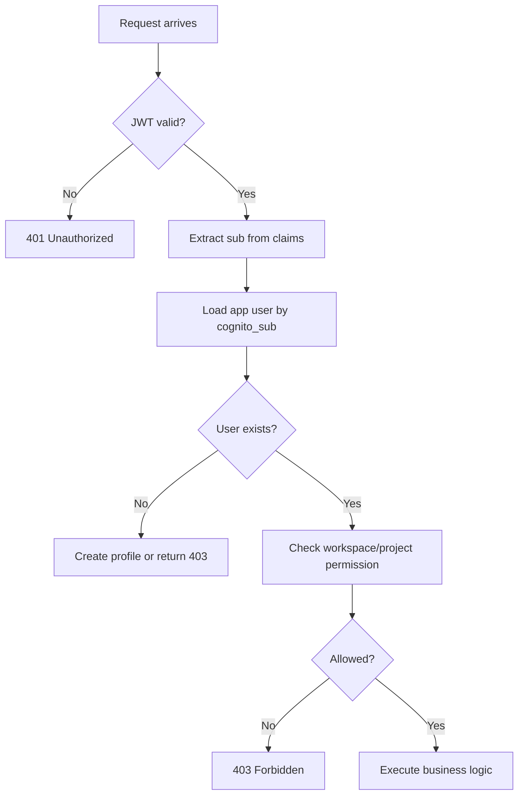

Example Lambda pseudocode:

```ts
export async function handler(event: any) {
  const claims = event.requestContext.authorizer?.jwt?.claims
    ?? event.requestContext.authorizer?.claims;

  const cognitoSub = claims?.sub;
  if (!cognitoSub) {
    return { statusCode: 401, body: 'Unauthorized' };
  }

  const user = await db.appUsers.findUnique({
    where: { cognito_sub: cognitoSub }
  });

  if (!user) {
    return { statusCode: 403, body: 'User profile not found' };
  }

  const allowed = await canAccessWorkspace(user.id, event.pathParameters.workspaceId);
  if (!allowed) {
    return { statusCode: 403, body: 'Forbidden' };
  }

  return {
    statusCode: 200,
    body: JSON.stringify({ userId: user.id })
  };
}
```

---

## 8. Creating App User Records

You need a strategy for creating your internal `app_users` row.

### Option A: Create on First API Call

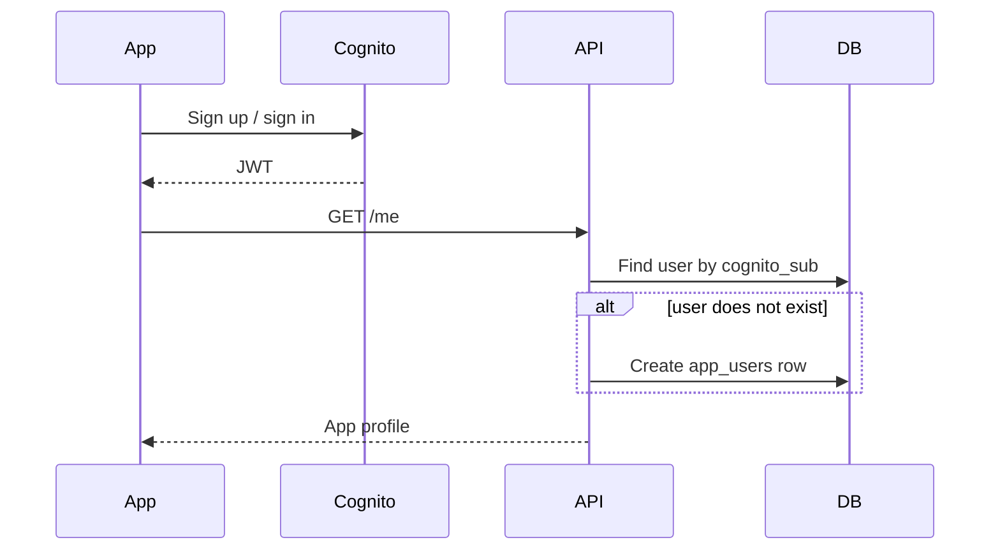

Pros:

- Simple
- Easy to debug
- No trigger complexity

Cons:

- User row is created only after first backend call

### Option B: Cognito Post Confirmation Trigger

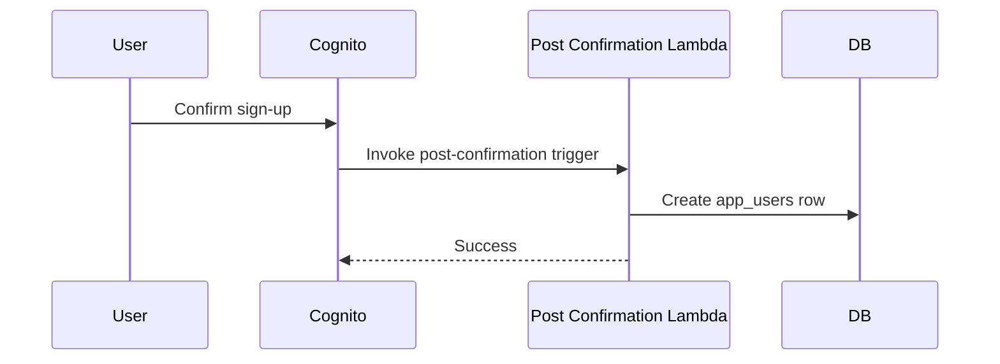

Pros:

- App user row is created immediately after sign-up confirmation

Cons:

- More moving parts
- Need idempotency and error handling
- DB connectivity from Lambda required

Recommended for many apps: **start with Option A**, then move to triggers if needed.

---

## 9. Groups, Roles, and Permissions

Cognito groups are useful for coarse-grained roles:

- `admin`
- `support`
- `beta_tester`
- `internal_staff`

But do not rely only on Cognito groups for complex business permissions.

Recommended split:

| Authorization type | Where to manage |
|---|---|
| Global admin/staff role | Cognito group or app DB |
| Workspace role | App DB |
| Project permission | App DB |
| Billing plan | App DB |
| Feature flags | App DB / feature flag service |
| API scopes | Cognito OAuth scopes / API Gateway route scopes |

Example:

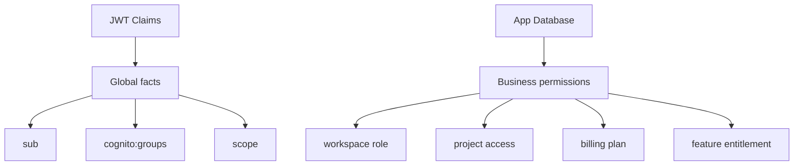

---

## 10. Frontend Integration Patterns

### 10.1 Web SPA

Common choices:

- AWS Amplify Auth
- Cognito Hosted UI with OAuth Authorization Code + PKCE
- Direct SDK integration

Recommended for modern browser apps:

- Use Authorization Code Flow with PKCE.
- Store tokens carefully.
- Avoid localStorage if possible for high-risk apps.
- Use short token lifetimes and refresh carefully.

### 10.2 iOS / Android

Recommended:

- Use OAuth Authorization Code Flow with PKCE.
- Store refresh tokens in secure platform storage.
  - iOS: Keychain
  - Android: Keystore-backed secure storage
- Prefer system browser/auth session over embedded web views.

### 10.3 Server-Rendered Web App

Recommended:

- Use Cognito Hosted UI.
- Exchange auth code on your server.
- Store session in secure, HTTP-only cookies.
- Keep tokens away from browser JavaScript when possible.

---

## 11. Security Checklist

### Cognito Configuration

- [ ] Enable email verification.
- [ ] Configure a strong password policy.
- [ ] Enable MFA for admin or sensitive accounts.
- [ ] Use separate app clients for web, mobile, and backend services.
- [ ] Do not use client secrets in browser/mobile apps.
- [ ] Configure allowed callback URLs exactly.
- [ ] Configure allowed logout URLs exactly.
- [ ] Use custom domain if needed for production UX.
- [ ] Review token expiration settings.

### API Security

- [ ] Use API Gateway authorizer for protected routes.
- [ ] Require `Authorization: Bearer <access_token>`.
- [ ] Validate app-specific permissions in backend.
- [ ] Never trust client-provided user IDs.
- [ ] Use JWT `sub` from verified claims as identity.
- [ ] Log auth failures without logging full tokens.
- [ ] Return `401` for unauthenticated, `403` for authenticated but forbidden.

### Database Security

- [ ] Store Cognito `sub` as unique key.
- [ ] Keep profile/business data in your DB.
- [ ] Make user creation idempotent.
- [ ] Avoid copying sensitive Cognito-only data unnecessarily.
- [ ] Audit admin role changes.

### Operational Security

- [ ] Monitor sign-in failures.
- [ ] Monitor API 401/403 rates.
- [ ] Set CloudWatch alarms for unusual spikes.
- [ ] Protect admin APIs separately.
- [ ] Have account recovery and support procedures.

---

## 12. Environment Design

Use separate Cognito User Pools per environment.

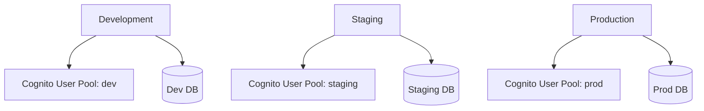

Recommended:

| Environment | User Pool | Database | Domain |
|---|---|---|---|
| dev | separate | separate | dev-auth.example.com |
| staging | separate | separate | staging-auth.example.com |
| prod | separate | separate | auth.example.com |

Avoid sharing production users with development systems.

---

## 13. Example End-to-End Setup

### Step 1: Create Cognito User Pool

Configure:

- Email sign-in
- Email verification
- Password policy
- MFA preference
- App client for your app
- Hosted UI domain
- Callback URLs
- Logout URLs

### Step 2: Create API Gateway

Choose one:

- REST API with Cognito User Pool Authorizer
- HTTP API with JWT Authorizer

### Step 3: Protect Routes

Example route policy:

| Route | Auth required? | Notes |
|---|---:|---|
| `GET /health` | No | Public health check |
| `POST /auth/webhook` | Special | Verify source separately |
| `GET /me` | Yes | Returns current app profile |
| `GET /workspaces/{id}` | Yes | Check workspace membership in DB |
| `POST /admin/users` | Yes | Require admin role |

### Step 4: Implement `/me`

`GET /me` should:

1. Read verified JWT claims from API Gateway context.
2. Extract `sub`.
3. Find or create `app_users` row.
4. Return app profile and permissions.

### Step 5: Add Authorization Middleware

Your backend should have a reusable authorization layer:

```ts
type AuthContext = {
  cognitoSub: string;
  appUserId: string;
  email?: string;
  groups: string[];
};

async function requireAuth(event: any): Promise<AuthContext> {
  const claims = event.requestContext.authorizer?.jwt?.claims
    ?? event.requestContext.authorizer?.claims;

  if (!claims?.sub) throw new Error('Unauthorized');

  const user = await findOrCreateUserFromClaims(claims);

  return {
    cognitoSub: claims.sub,
    appUserId: user.id,
    email: claims.email,
    groups: normalizeGroups(claims['cognito:groups'])
  };
}
```

---

## 14. Common Pitfalls

### Pitfall 1: Using Cognito as the Only User Database

Bad pattern:

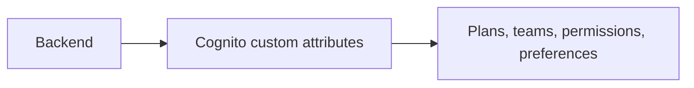

Better pattern:

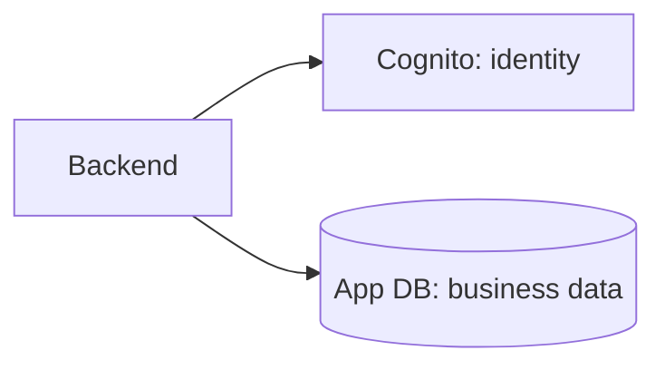

### Pitfall 2: Using ID Token for Everything

For API authorization, prefer the **access token**. The ID token is mainly for the client to understand who the user is.

### Pitfall 3: Trusting User IDs from Request Body

Bad:

```json
{
  "userId": "some-user-id-from-client"
}
```

Good:

```text
Use verified JWT claim: sub
Then map sub -> app_users.id in your DB
```

### Pitfall 4: Putting All Roles in Cognito

Cognito groups are fine for global roles, but workspace-level permissions belong in your app DB.

### Pitfall 5: Mixing Dev and Prod User Pools

Use separate user pools and app clients for each environment.

---

## 15. Cognito vs Supabase Auth

| Topic | Cognito | Supabase Auth |
|---|---|---|
| Best for | AWS-native apps | Supabase/Postgres apps |
| API Gateway integration | Excellent | Possible, but less native |
| Database security model | Not database-centered | Strong with Postgres RLS |
| User profile storage | Limited | Better with Supabase tables |
| Developer experience | Powerful but AWS-heavy | Simpler for many app teams |
| JWT verification | Native with AWS services | JWKS/asymmetric keys or custom verification |
| Authorization | Groups/scopes + backend logic | JWT claims + RLS + backend logic |

Recommendation:

- If your backend is **AWS API Gateway + Lambda + DynamoDB/RDS**, use Cognito.
- If your backend is **Supabase Postgres + RLS**, use Supabase Auth.
- If you already have Supabase Auth and only need to protect some AWS APIs, you may not need Cognito.

---

## 16. Alternatives

### 16.1 Supabase Auth

Best when:

- You use Supabase Postgres.
- You want Row Level Security policies.
- You want fast full-stack app development.
- You prefer SQL-centric authorization.

Tradeoffs:

- Less native with AWS API Gateway.
- For AWS services, you may need JWT authorizers or Lambda authorizers.

### 16.2 Auth0

Best when:

- You need mature enterprise identity features.
- You need B2B, SSO, SAML, enterprise connections.
- You want polished hosted login and extensive identity-provider support.

Tradeoffs:

- Can become expensive.
- Another vendor outside AWS.

### 16.3 Clerk

Best when:

- You build with React/Next.js/modern web frameworks.
- You want polished prebuilt user management UI.
- You want fast frontend integration.

Tradeoffs:

- Less AWS-native than Cognito.
- Pricing and lock-in should be reviewed carefully.

### 16.4 Firebase Authentication

Best when:

- You build mobile apps.
- You use Firebase/Google Cloud.
- You want easy social login and client SDKs.

Tradeoffs:

- Less native to AWS.
- Authorization still needs backend/database design.

### 16.5 Keycloak

Best when:

- You want open-source identity infrastructure.
- You can operate your own auth server.
- You need advanced federation/customization.

Tradeoffs:

- You operate and secure it yourself.
- More DevOps burden.

### 16.6 Self-Built Auth

Usually not recommended unless you have strong security expertise.

You must handle:

- Password hashing
- Password reset
- MFA
- Session management
- Token rotation
- Account recovery
- Abuse prevention
- Credential stuffing protection
- Security audits

---

## 17. Decision Matrix

| Requirement | Best choice |
|---|---|
| AWS-native API Gateway/Lambda backend | Cognito |
| Supabase/Postgres Row Level Security | Supabase Auth |
| Enterprise SSO/SAML-heavy B2B | Auth0 or Cognito, depending on AWS needs |
| Best frontend DX for Next.js | Clerk |
| Firebase mobile app stack | Firebase Auth |
| Full control / self-hosted IAM | Keycloak |
| Learning project only | Supabase Auth, Firebase Auth, or Cognito |
| Production app with AWS backend | Cognito + app DB |

My default recommendation for your AWS app service:

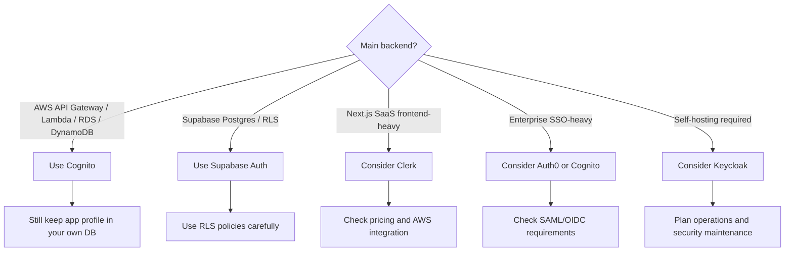

---

## 18. Recommended Production Design

For your app service, assuming AWS is the main backend:

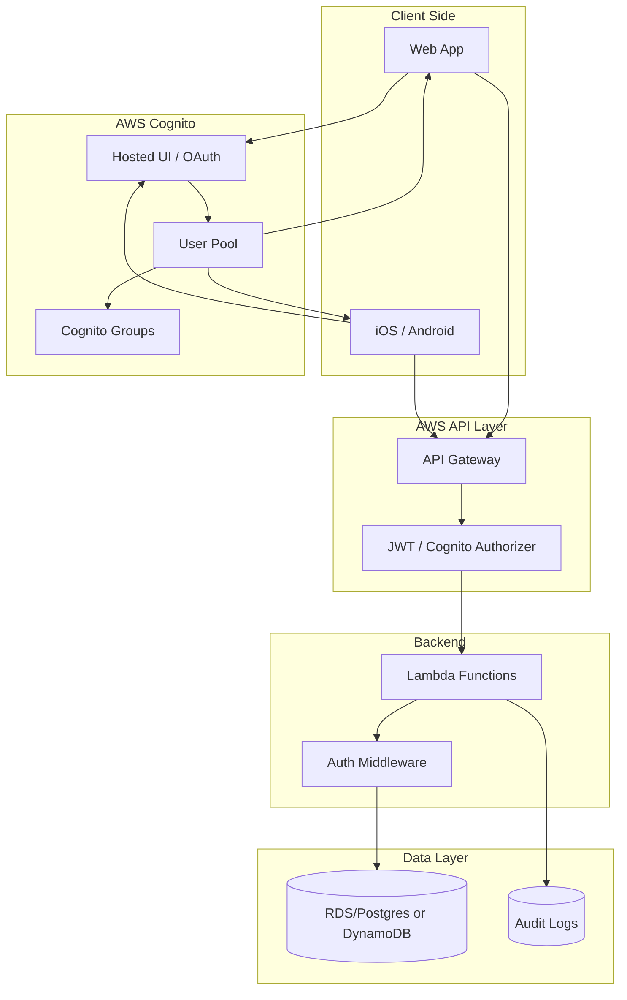

Core rule:

> Cognito authenticates the user. Your backend authorizes the action.

---

## 19. Implementation Checklist

### Phase 1: MVP

- [ ] Create Cognito User Pool.
- [ ] Create app client.
- [ ] Configure Hosted UI or SDK login.
- [ ] Create API Gateway authorizer.
- [ ] Protect `/me` route.
- [ ] Create `app_users` table.
- [ ] Map `claims.sub` to `app_users.cognito_sub`.
- [ ] Add basic 401/403 handling.

### Phase 2: Production Hardening

- [ ] Add custom domain.
- [ ] Configure MFA policy.
- [ ] Add monitoring for failed sign-ins.
- [ ] Add rate limits/WAF where needed.
- [ ] Add audit logs for admin actions.
- [ ] Separate dev/staging/prod user pools.
- [ ] Review token expiration.
- [ ] Review pricing tier and projected MAU.

### Phase 3: Advanced Authorization

- [ ] Add workspace/team membership tables.
- [ ] Add role-based middleware.
- [ ] Add admin-only route protection.
- [ ] Add OAuth scopes if needed.
- [ ] Add Cognito groups for global roles.
- [ ] Add support tooling for user lookup and account recovery.

---

## 20. Reference Links

### AWS Cognito

- Amazon Cognito User Pools Developer Guide: https://docs.aws.amazon.com/cognito/latest/developerguide/cognito-user-pools.html
- Understanding Cognito JWTs: https://docs.aws.amazon.com/cognito/latest/developerguide/amazon-cognito-user-pools-using-tokens-with-identity-providers.html
- Cognito User Pools API Reference: https://docs.aws.amazon.com/cognito-user-identity-pools/latest/APIReference/Welcome.html
- Amazon Cognito Pricing: https://aws.amazon.com/cognito/pricing/

### API Gateway + Cognito

- Control access to REST APIs with Cognito User Pools: https://docs.aws.amazon.com/apigateway/latest/developerguide/apigateway-integrate-with-cognito.html
- Integrate REST API with Cognito User Pool: https://docs.aws.amazon.com/apigateway/latest/developerguide/apigateway-enable-cognito-user-pool.html
- Create a Cognito User Pool for REST API: https://docs.aws.amazon.com/apigateway/latest/developerguide/apigateway-create-cognito-user-pool.html
- API Gateway HTTP API JWT Authorizer: https://docs.aws.amazon.com/apigateway/latest/developerguide/http-api-jwt-authorizer.html

### Alternatives

- Supabase Auth: https://supabase.com/docs/guides/auth
- Supabase JWT Signing Keys: https://supabase.com/docs/guides/auth/signing-keys
- Auth0 Universal Login: https://auth0.com/docs/authenticate/login/auth0-universal-login
- Clerk Docs: https://clerk.com/docs
- Firebase Authentication: https://firebase.google.com/docs/auth
- Keycloak Documentation: https://www.keycloak.org/documentation

---

## 21. Final Recommendation

Use **AWS Cognito** if your app service is mainly on AWS and you want API Gateway/Lambda integration.

But use it this way:

```text
Cognito = authentication and identity
Your DB = app user profile and business permissions
API Gateway = token validation
Backend = real authorization and business rules
```

This gives you the best balance of managed security, AWS-native integration, and long-term application flexibility.
