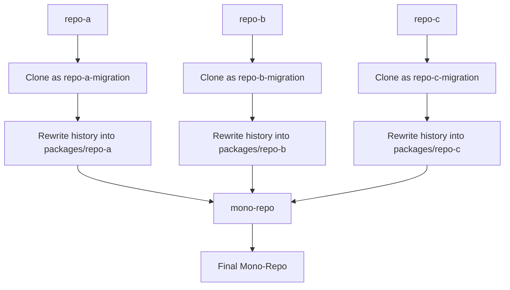
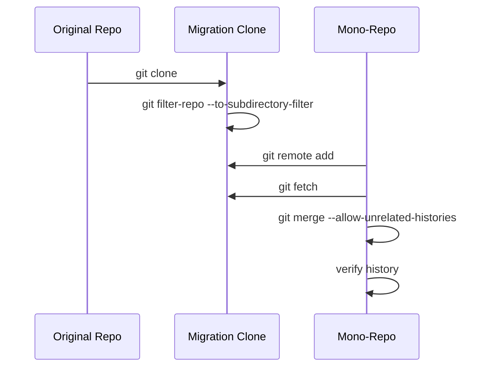
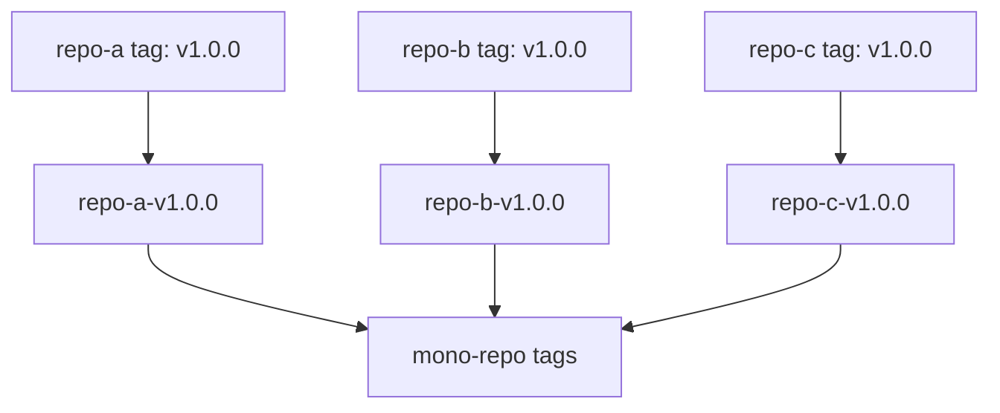
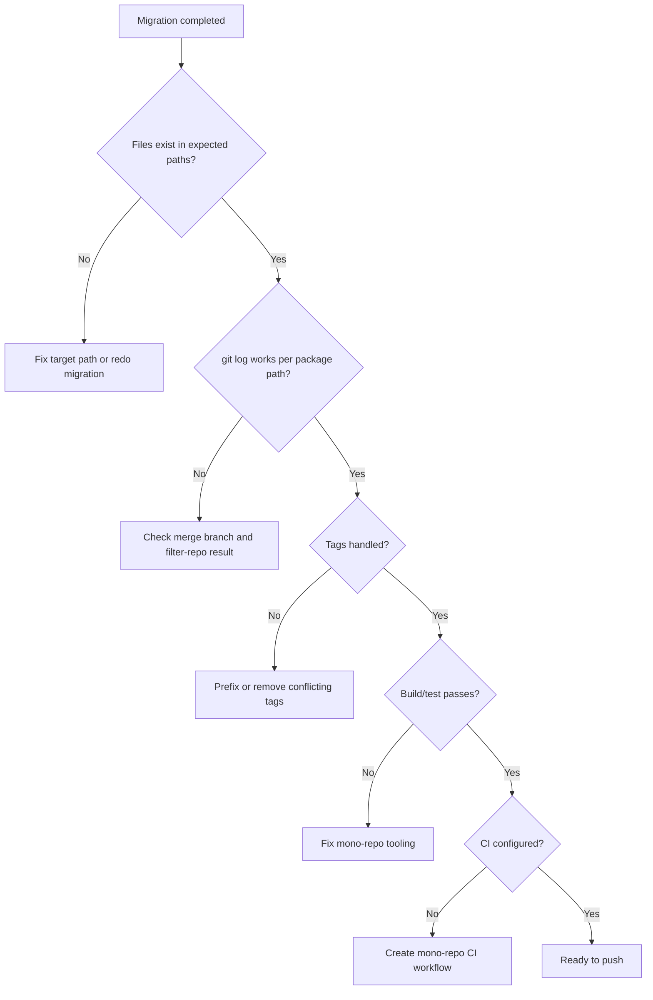
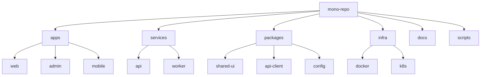
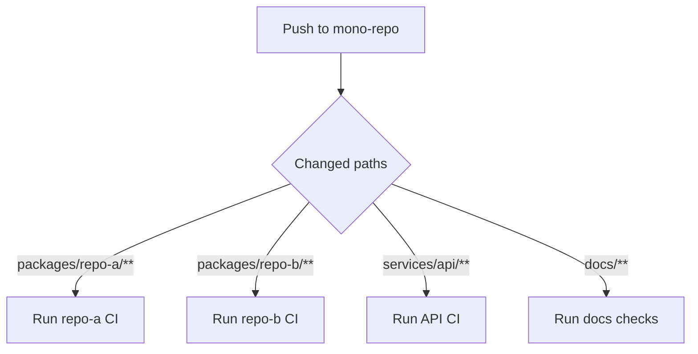
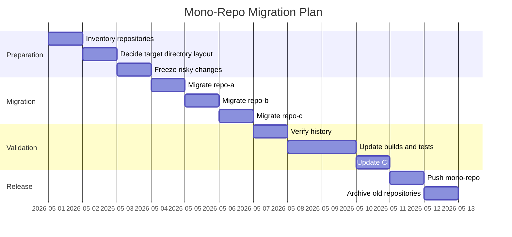

# Migrating Existing Git Repositories into a Mono-Repo While Preserving Git History

## 1. Overview

This guide explains how to move multiple existing Git repositories into a single mono-repo while preserving their commit history.

The recommended approach is:

```bash
git filter-repo --to-subdirectory-filter <target-path>
```

followed by importing the rewritten repository into the mono-repo using:

```bash
git merge --allow-unrelated-histories
```

This keeps the original commit history, authors, dates, and file history, while relocating each repository into a dedicated subdirectory inside the mono-repo.

---

## 2. Example Goal

Assume you currently have separate repositories:

```text
repo-a
repo-b
repo-c
```

You want to combine them into one repository:

```text
mono-repo/
  packages/
    repo-a/
    repo-b/
    repo-c/
```

Each repository should keep its historical commits.

---

## 3. Recommended Migration Strategy

### Why use `git filter-repo`?

`git filter-repo` rewrites the history of a repository so that all files appear under a subdirectory.

For example, this command:

```bash
git filter-repo --to-subdirectory-filter packages/repo-a
```

changes the history from:

```text
README.md
src/
package.json
```

to:

```text
packages/repo-a/README.md
packages/repo-a/src/
packages/repo-a/package.json
```

This is useful because after migration, every historical commit from `repo-a` lives cleanly under `packages/repo-a`.

---

## 4. High-Level Architecture



---

## 5. Important Concepts

### 5.1 History is preserved, but commit hashes change

When you rewrite history to move files into a subdirectory, Git creates new commits.

Preserved:

- Commit messages
- Author names
- Author dates
- Commit dates
- File changes
- File history
- Most branch structure, if migrated intentionally

Changed:

- Commit hashes
- Some merge relationships, depending on your migration method
- Tag references, if rewritten or renamed

This is normal.

---

### 5.2 Do not run history rewrite on the original repository

Always clone the original repository into a migration copy.

Recommended structure:

```text
migration-workspace/
  repo-a-migration/
  repo-b-migration/
  repo-c-migration/
  mono-repo/
```

Do not run `git filter-repo` directly inside your production repository clone unless you intentionally want to rewrite it.

---

## 6. Prerequisites

### 6.1 Install `git-filter-repo`

On macOS:

```bash
brew install git-filter-repo
```

Verify:

```bash
git filter-repo --help
```

If this command works, installation is complete.

---

### 6.2 Prepare a clean migration workspace

```bash
mkdir mono-repo-migration
cd mono-repo-migration
```

---

## 7. Basic Migration Flow



---

## 8. Step-by-Step Example: Migrating `repo-a`

### 8.1 Clone the existing repository

```bash
git clone git@github.com:your-org/repo-a.git repo-a-migration
cd repo-a-migration
```

Check the default branch:

```bash
git branch
```

Common default branch names are:

```text
main
master
develop
```

For this guide, assume the default branch is `main`.

---

### 8.2 Rewrite history into a subdirectory

```bash
git filter-repo --to-subdirectory-filter packages/repo-a
```

After this command, the repository history is rewritten so all files live under:

```text
packages/repo-a/
```

Confirm:

```bash
ls
```

Expected result:

```text
packages/
```

Inspect:

```bash
find packages/repo-a -maxdepth 2 -type f | head
```

---

### 8.3 Prepare the mono-repo

If the mono-repo already exists:

```bash
cd ..
git clone git@github.com:your-org/mono-repo.git mono-repo
cd mono-repo
```

If the mono-repo is new:

```bash
cd ..
mkdir mono-repo
cd mono-repo
git init
git checkout -b main
git commit --allow-empty -m "Initial mono-repo commit"
```

---

### 8.4 Add the rewritten repository as a temporary remote

From inside `mono-repo`:

```bash
git remote add repo-a ../repo-a-migration
git fetch repo-a
```

Check fetched branches:

```bash
git branch -r
```

You should see something like:

```text
repo-a/main
```

---

### 8.5 Merge the rewritten history into the mono-repo

```bash
git merge repo-a/main --allow-unrelated-histories -m "Merge repo-a into mono-repo"
```

If the source branch is `master`:

```bash
git merge repo-a/master --allow-unrelated-histories -m "Merge repo-a into mono-repo"
```

---

### 8.6 Remove the temporary remote

```bash
git remote remove repo-a
```

---

### 8.7 Verify the result

Check files:

```bash
ls packages/repo-a
```

Check history for the migrated path:

```bash
git log --oneline -- packages/repo-a
```

Check full graph:

```bash
git log --oneline --graph --all --decorate
```

---

## 9. Migrating Multiple Repositories

Repeat the same process for each repository.

Example structure:

```text
mono-repo/
  apps/
    web/
    admin/
  packages/
    shared-ui/
    api-client/
  services/
    backend/
```

Migration mapping:

| Source Repository | Target Path |
|---|---|
| `web-app` | `apps/web` |
| `admin-app` | `apps/admin` |
| `shared-ui` | `packages/shared-ui` |
| `api-client` | `packages/api-client` |
| `backend-service` | `services/backend` |

---

## 10. Example: Migrating `repo-b`

```bash
cd ..
git clone git@github.com:your-org/repo-b.git repo-b-migration
cd repo-b-migration

git filter-repo --to-subdirectory-filter packages/repo-b

cd ../mono-repo
git remote add repo-b ../repo-b-migration
git fetch repo-b
git merge repo-b/main --allow-unrelated-histories -m "Merge repo-b into mono-repo"
git remote remove repo-b
```

---

## 11. Example: Migrating `repo-c`

```bash
cd ..
git clone git@github.com:your-org/repo-c.git repo-c-migration
cd repo-c-migration

git filter-repo --to-subdirectory-filter packages/repo-c

cd ../mono-repo
git remote add repo-c ../repo-c-migration
git fetch repo-c
git merge repo-c/main --allow-unrelated-histories -m "Merge repo-c into mono-repo"
git remote remove repo-c
```

---

## 12. Full Manual Migration Example

```bash
mkdir mono-repo-migration
cd mono-repo-migration

# Clone mono-repo
git clone git@github.com:your-org/mono-repo.git mono-repo

# Migrate repo-a
git clone git@github.com:your-org/repo-a.git repo-a-migration
cd repo-a-migration
git filter-repo --to-subdirectory-filter packages/repo-a

cd ../mono-repo
git remote add repo-a ../repo-a-migration
git fetch repo-a
git merge repo-a/main --allow-unrelated-histories -m "Merge repo-a into mono-repo"
git remote remove repo-a

# Migrate repo-b
cd ..
git clone git@github.com:your-org/repo-b.git repo-b-migration
cd repo-b-migration
git filter-repo --to-subdirectory-filter packages/repo-b

cd ../mono-repo
git remote add repo-b ../repo-b-migration
git fetch repo-b
git merge repo-b/main --allow-unrelated-histories -m "Merge repo-b into mono-repo"
git remote remove repo-b

# Migrate repo-c
cd ..
git clone git@github.com:your-org/repo-c.git repo-c-migration
cd repo-c-migration
git filter-repo --to-subdirectory-filter packages/repo-c

cd ../mono-repo
git remote add repo-c ../repo-c-migration
git fetch repo-c
git merge repo-c/main --allow-unrelated-histories -m "Merge repo-c into mono-repo"
git remote remove repo-c
```

---

## 13. Automation Script

You can automate the migration.

### 13.1 Example script

Create `migrate-repos.sh`:

```bash
#!/usr/bin/env bash
set -euo pipefail

MONO_REPO_DIR="mono-repo"

# Format:
# source_repo_url target_path remote_name default_branch
REPOS=(
  "git@github.com:your-org/repo-a.git packages/repo-a repo-a main"
  "git@github.com:your-org/repo-b.git packages/repo-b repo-b main"
  "git@github.com:your-org/repo-c.git packages/repo-c repo-c main"
)

if [ ! -d "$MONO_REPO_DIR/.git" ]; then
  echo "ERROR: $MONO_REPO_DIR is not a Git repository."
  exit 1
fi

for item in "${REPOS[@]}"; do
  read -r REPO_URL TARGET_PATH REMOTE_NAME BRANCH <<< "$item"

  MIGRATION_DIR="${REMOTE_NAME}-migration"

  echo "========================================"
  echo "Migrating $REPO_URL"
  echo "Target path: $TARGET_PATH"
  echo "Branch: $BRANCH"
  echo "========================================"

  rm -rf "$MIGRATION_DIR"

  git clone "$REPO_URL" "$MIGRATION_DIR"

  pushd "$MIGRATION_DIR" > /dev/null
  git filter-repo --to-subdirectory-filter "$TARGET_PATH"
  popd > /dev/null

  pushd "$MONO_REPO_DIR" > /dev/null
  git remote remove "$REMOTE_NAME" 2>/dev/null || true
  git remote add "$REMOTE_NAME" "../$MIGRATION_DIR"
  git fetch "$REMOTE_NAME"
  git merge "$REMOTE_NAME/$BRANCH" \
    --allow-unrelated-histories \
    -m "Merge $REMOTE_NAME into mono-repo"
  git remote remove "$REMOTE_NAME"
  popd > /dev/null

  echo "Done: $REMOTE_NAME"
done

echo "All repositories migrated."
```

Run:

```bash
chmod +x migrate-repos.sh
./migrate-repos.sh
```

---

## 14. Migration Workflow Diagram

```mermaid
flowchart LR
    Start([Start]) --> Prepare[Prepare migration workspace]
    Prepare --> CloneMono[Clone or initialize mono-repo]
    CloneMono --> SelectRepo[Select source repository]

    SelectRepo --> CloneRepo[Clone source repo into migration copy]
    CloneRepo --> Rewrite[Rewrite history into target subdirectory]
    Rewrite --> AddRemote[Add migration repo as temp remote]
    AddRemote --> Fetch[Fetch migration branch]
    Fetch --> Merge[Merge with allow-unrelated-histories]
    Merge --> Verify[Verify files and git log]
    Verify --> More{More repos?}

    More -- Yes --> SelectRepo
    More -- No --> FinalCheck[Run final checks]
    FinalCheck --> Push[Push mono-repo]
    Push --> Done([Done])
```



---

## 15. Handling Branches

### 15.1 Migrating only the default branch

This is the simplest and most common option.

Recommended for many mono-repo migrations:

```text
Migrate only main/master
Archive old repositories
Keep old repositories read-only for historical branch references
```

Pros:

- Simple
- Less risk
- Easier to review
- Avoids old feature branch noise

Cons:

- Old feature branches are not available inside the mono-repo

---

### 15.2 Migrating multiple branches

If you want to migrate multiple branches, you need to rewrite each branch and fetch them.

First, make sure all branches are available:

```bash
git branch -a
```

Then run `git filter-repo` once. It rewrites all local branches and tags unless restricted.

After importing into the mono-repo, you may create namespaced branches:

```bash
git branch repo-a/main repo-a/main
git branch repo-a/develop repo-a/develop
```

However, for mono-repo migration, importing many old branches is often not worth the complexity.

Recommended approach:

```text
Import main branch into mono-repo
Archive the original repo
Only manually migrate active long-lived branches if truly needed
```

---

## 16. Handling Tags

### 16.1 Tag collision problem

Different repositories often have the same tag names:

```text
repo-a: v1.0.0
repo-b: v1.0.0
repo-c: v1.0.0
```

A single Git repository cannot have multiple different tags with the same name.

---

### 16.2 Recommended tag prefixing

Before importing, rename tags in each migration repository.

Example for `repo-a`:

```bash
git tag | while read tag; do
  git tag "repo-a-$tag" "$tag"
  git tag -d "$tag"
done
```

For `repo-b`:

```bash
git tag | while read tag; do
  git tag "repo-b-$tag" "$tag"
  git tag -d "$tag"
done
```

Result:

```text
repo-a-v1.0.0
repo-b-v1.0.0
repo-c-v1.0.0
```

---

### 16.3 Tag migration diagram



---

## 17. Handling GitHub, GitLab, or Bitbucket Pull Requests

Git history can be moved, but platform-specific metadata usually cannot be perfectly merged.

Usually preserved in Git:

- Commits
- Authors
- Dates
- Commit messages
- Tags, if migrated
- Branches, if migrated

Usually not automatically preserved in the new mono-repo:

- Pull request discussions
- Issue discussions
- Review comments
- CI build history
- Release pages
- Project boards
- Repository settings
- Branch protection rules
- Webhooks
- Secrets
- Deployment environments

Recommended action:

```text
Archive old repositories instead of deleting them.
Keep old PRs and issues available for reference.
Create a migration notice in each old repository.
```

---

## 18. Recommended Repository Archive Notice

Add this to the old repository's `README.md` before archiving:

````markdown
# Repository Archived

This repository has been migrated into the mono-repo.

New location:

```text
mono-repo/packages/repo-a
```

Please open new issues and pull requests in the mono-repo.
````

---

## 19. Conflict Handling

### 19.1 Why conflicts are usually rare

Because each repository is moved into its own subdirectory, file conflicts are uncommon.

For example:

```text
repo-a/package.json -> packages/repo-a/package.json
repo-b/package.json -> packages/repo-b/package.json
```

These do not conflict.

---

### 19.2 Common conflicts

Conflicts may still happen if multiple repos create the same top-level files after migration, such as:

```text
README.md
.gitignore
.github/workflows/ci.yml
package.json
```

But if you use `--to-subdirectory-filter`, these files should already be under separate directories.

Potential mono-repo-level conflicts usually come from files you manually add later, such as:

```text
package.json
pnpm-workspace.yaml
turbo.json
.github/workflows/*
```

---

## 20. Verifying History After Migration

### 20.1 Check path-specific history

```bash
git log --oneline -- packages/repo-a
```

### 20.2 Check full graph

```bash
git log --oneline --graph --all --decorate
```

### 20.3 Check author preservation

```bash
git log --format='%an <%ae>' -- packages/repo-a | sort | uniq
```

### 20.4 Check commit dates

```bash
git log --format='%h %ad %s' --date=short -- packages/repo-a | head -20
```

### 20.5 Check file history with rename detection

```bash
git log --follow -- packages/repo-a/README.md
```

---

## 21. Final Validation Checklist



Checklist:

- [ ] Every migrated repo exists under the correct path
- [ ] `git log -- <target-path>` shows old commits
- [ ] Commit authors are preserved
- [ ] Commit dates are preserved
- [ ] Tags are migrated or intentionally skipped
- [ ] Branch migration decision is documented
- [ ] Build passes
- [ ] Tests pass
- [ ] CI is updated
- [ ] Old repositories are archived
- [ ] Team knows the new repository location

---

## 22. Pushing the Final Mono-Repo

After verifying everything:

```bash
git status
git log --oneline --graph --all --decorate --max-count=50
```

Then push:

```bash
git push origin main
```

If you migrated tags:

```bash
git push origin --tags
```

If this is a new remote:

```bash
git remote add origin git@github.com:your-org/mono-repo.git
git push -u origin main
git push origin --tags
```

---

## 23. Alternative Method: `git subtree`

You can also use `git subtree`.

Example:

```bash
cd mono-repo

git remote add repo-a git@github.com:your-org/repo-a.git
git fetch repo-a

git subtree add --prefix=packages/repo-a repo-a main
```

---

## 24. `git filter-repo` vs `git subtree`

| Item | `git filter-repo` | `git subtree` |
|---|---|---|
| Best for one-time mono-repo migration | Excellent | Good |
| Preserves history | Yes | Yes |
| Rewrites paths throughout history | Yes | Not in the same clean way |
| Handles clean target directory history | Excellent | Good |
| Command simplicity | Medium | Simple |
| Recommended for large migration | Yes | Sometimes |
| Commit hashes change | Yes | Usually less intrusive for source repo, but merge commits are created |
| Good for ongoing sync | Not ideal | Better |

Recommended:

```text
Use git filter-repo for one-time migration into a mono-repo.
Use git subtree when you want simpler commands or possible future subtree sync workflows.
```

---

## 25. Alternative Method: Import Without Rewriting History

You can technically copy files manually and commit them:

```bash
cp -R ../repo-a packages/repo-a
git add packages/repo-a
git commit -m "Add repo-a"
```

This is not recommended if you need history.

Problem:

```text
The old commit history is not available inside the mono-repo path.
```

This loses most benefits of a proper migration.

---

## 26. Recommended Mono-Repo Structure

For JavaScript, TypeScript, frontend, backend, and shared libraries:

```text
mono-repo/
  apps/
    web/
    admin/
    mobile/
  services/
    api/
    worker/
  packages/
    shared-ui/
    api-client/
    config/
  tools/
    scripts/
  docs/
  package.json
  pnpm-workspace.yaml
  turbo.json
```

For mixed infrastructure and application repos:

```text
mono-repo/
  apps/
  services/
  packages/
  infra/
    terraform/
    docker/
    k8s/
  docs/
  scripts/
```

---

## 27. Example Mono-Repo Structure Diagram



---

## 28. Post-Migration Tasks

After Git history migration, you usually need to update project-level tooling.

### 28.1 Package manager workspace

For `pnpm`:

```yaml
packages:
  - "apps/*"
  - "services/*"
  - "packages/*"
```

File:

```text
pnpm-workspace.yaml
```

---

### 28.2 Root-level scripts

Example root `package.json`:

```json
{
  "scripts": {
    "build": "pnpm -r build",
    "test": "pnpm -r test",
    "lint": "pnpm -r lint"
  }
}
```

---

### 28.3 CI workflow update

Before migration:

```text
repo-a/.github/workflows/ci.yml
repo-b/.github/workflows/ci.yml
repo-c/.github/workflows/ci.yml
```

After migration:

```text
mono-repo/.github/workflows/ci.yml
```

You may use path filters:

```yaml
on:
  push:
    paths:
      - "packages/repo-a/**"
      - ".github/workflows/repo-a.yml"
```

---

## 29. CI Path Filter Example



---

## 30. Rollback Strategy

Before pushing the final result, rollback is easy:

```bash
cd mono-repo
git reset --hard origin/main
```

If the mono-repo is local only:

```bash
rm -rf mono-repo
```

If you already pushed and need to revert one imported repository merge:

```bash
git log --oneline --graph
```

Find the merge commit, then:

```bash
git revert -m 1 <merge-commit-hash>
```

Explanation:

```text
-m 1 means keep the first parent, which is usually the mono-repo branch.
```

Be careful with reverting merge commits after other work has been added on top.

---

## 31. Recommended Migration Plan for a Team



---

## 32. Team Communication Checklist

Before migration:

- [ ] Announce migration schedule
- [ ] Ask developers to merge or close old feature branches
- [ ] Freeze direct pushes during migration window
- [ ] Decide whether to migrate tags
- [ ] Decide whether to migrate old branches
- [ ] Decide target directory layout
- [ ] Decide new CI strategy

After migration:

- [ ] Share new clone URL
- [ ] Share new directory paths
- [ ] Update developer setup documentation
- [ ] Update CI/CD documentation
- [ ] Archive old repositories
- [ ] Update issue templates and PR templates
- [ ] Update deployment scripts
- [ ] Update external integrations and webhooks

---

## 33. Common Problems and Fixes

### Problem: `git: 'filter-repo' is not a git command`

Install it:

```bash
brew install git-filter-repo
```

Then retry:

```bash
git filter-repo --help
```

---

### Problem: `fatal: refusing to merge unrelated histories`

Use:

```bash
git merge <remote>/<branch> --allow-unrelated-histories
```

This is expected because the source repository and mono-repo do not share a common Git ancestor.

---

### Problem: Branch name is not `main`

Check remote branches:

```bash
git branch -r
```

Then merge the correct branch:

```bash
git merge repo-a/master --allow-unrelated-histories
```

or:

```bash
git merge repo-a/develop --allow-unrelated-histories
```

---

### Problem: Tags conflict

Rename tags before importing:

```bash
git tag | while read tag; do
  git tag "repo-a-$tag" "$tag"
  git tag -d "$tag"
done
```

---

### Problem: `git log -- packages/repo-a` shows nothing

Check whether the files are actually under that path:

```bash
find packages/repo-a -maxdepth 2 -type f | head
```

Check whether the correct branch was merged:

```bash
git branch -r
git log --oneline --graph --all --decorate --max-count=30
```

---

### Problem: Commit authors are wrong

If old commits have incorrect email addresses, fix author mapping before final migration.

Example using mailmap:

```text
Old Name <old@example.com> New Name <new@example.com>
```

Create `.mailmap` in the mono-repo if you only want display normalization.

If you need to rewrite author metadata, use `git filter-repo --mailmap`.

---

## 34. Recommended Final Command Summary

For each repository:

```bash
git clone <source-repo-url> <repo-name>-migration
cd <repo-name>-migration

git filter-repo --to-subdirectory-filter <target-path>

cd ../mono-repo
git remote add <repo-name> ../<repo-name>-migration
git fetch <repo-name>
git merge <repo-name>/<branch> --allow-unrelated-histories -m "Merge <repo-name> into mono-repo"
git remote remove <repo-name>
```

Concrete example:

```bash
git clone git@github.com:your-org/repo-a.git repo-a-migration
cd repo-a-migration

git filter-repo --to-subdirectory-filter packages/repo-a

cd ../mono-repo
git remote add repo-a ../repo-a-migration
git fetch repo-a
git merge repo-a/main --allow-unrelated-histories -m "Merge repo-a into mono-repo"
git remote remove repo-a
```

---

## 35. Recommended Decision Matrix

| Question | Recommended Choice |
|---|---|
| Do you need old commit history? | Use `git filter-repo` |
| Do you only need latest source code? | Copy files manually |
| Do you need old PR comments? | Keep old repo archived |
| Do multiple repos have same tag names? | Prefix tags |
| Do you need all old branches? | Usually no |
| Do you need active long-lived branches? | Migrate selectively |
| Do you want one-time migration? | `git filter-repo` |
| Do you want future sync with source repo? | Consider `git subtree` |

---

## 36. Final Recommendation

For a clean mono-repo migration while keeping Git history:

```text
Use git filter-repo.
Move each repository into a unique subdirectory.
Merge each rewritten repository into the mono-repo.
Prefix tags if needed.
Usually migrate only the default branch.
Archive old repositories instead of deleting them.
```

Most important commands:

```bash
git filter-repo --to-subdirectory-filter packages/repo-a
```

```bash
git merge repo-a/main --allow-unrelated-histories
```

This approach gives you a clean mono-repo structure while preserving the useful history of each original repository.
