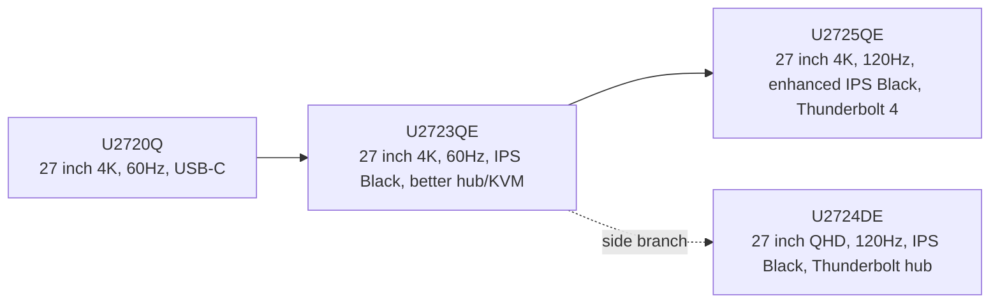
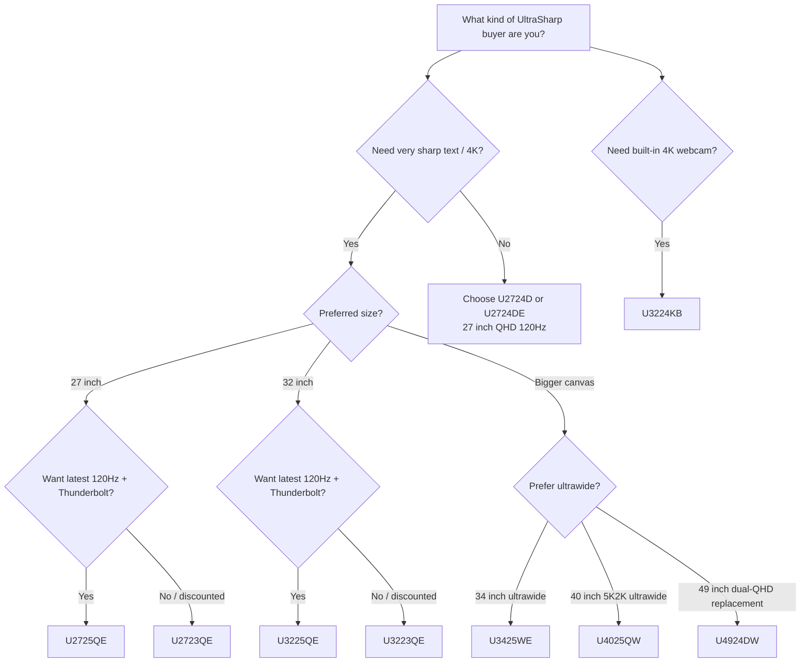
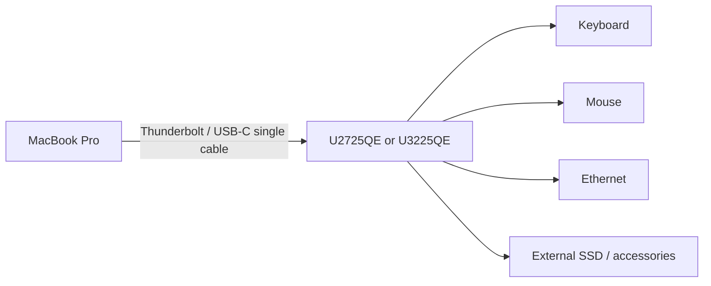
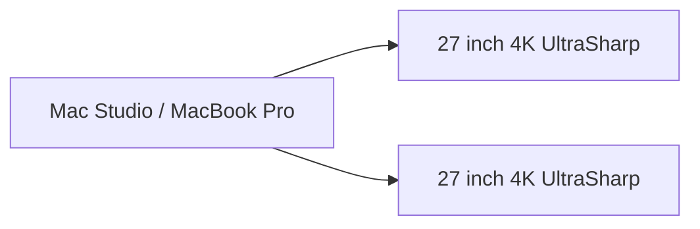

# Dell UltraSharp Monitor Buying Guide

**Version:** 2026-04-27  
**Audience:** People choosing a Dell UltraSharp monitor for productivity, software development, design, office work, Mac/Windows workstations, or multi-device desk setups.

> This guide focuses on practical buying decisions, not only raw specifications. Dell prices, local stock, and warranty details vary by country and retailer, so verify the final product page before purchase.

---

## 1. One-page recommendation

### Best default choice for most professional users

**Dell UltraSharp U2725QE**  
Choose this if you want a modern 27-inch 4K monitor with 120Hz, Thunderbolt 4, strong USB hub features, high text sharpness, and a clean single-cable laptop setup.

### Best larger 4K choice

**Dell UltraSharp U3225QE**  
Choose this if you want the same modern 4K/120Hz/Thunderbolt direction as the U2725QE, but with a larger 32-inch screen and more comfortable native UI sizing.

### Best value if discounted

**Dell UltraSharp U2723QE / U3223QE**  
Choose these if you can get them clearly cheaper than the 2025 models. They are still excellent 4K USB-C hub monitors, but they are 60Hz and have older IPS Black panels.

### Best smooth QHD office monitor

**Dell UltraSharp U2724DE**  
Choose this if you prefer 120Hz smoothness and hub features but do not need 4K. It is a strong coding/office monitor, but text will not be as crisp as 27-inch 4K.

### Best ultrawide workstation choice

**Dell UltraSharp U4025QW**  
Choose this if you want one large curved display instead of dual monitors. It gives a 40-inch 5120×2160 workspace at 120Hz.

### Best meeting / webcam-focused model

**Dell UltraSharp U3224KB**  
Choose this if video calls are a major part of your work and you want an integrated 6K monitor with webcam, microphones, and speakers.

---

## 2. How Dell UltraSharp model names work

Dell model names are not random. They usually encode size, generation, and feature tier.

```text
U2725QE
│ │ │└─ suffix: Q/E/DE/QE often indicates resolution and hub feature tier
│ │ └── generation year-ish: 25 = newer generation than 23/24/20
│ └──── size: 27-inch
└────── U = UltraSharp line
```

Common examples:

| Pattern | Meaning |
|---|---|
| `U` | UltraSharp professional/productivity line |
| `27`, `32`, `34`, `40`, `49` | Approximate screen size |
| `23`, `24`, `25` | Generation indicator |
| `Q` / `QE` | Often 4K or high-resolution + richer connectivity |
| `D` / `DE` | Often QHD/office branch; `E` usually indicates Ethernet/hub-oriented model |
| `W` | Wide / ultrawide family |

Important: Dell naming is helpful, but not perfectly universal. Always verify resolution, refresh rate, ports, power delivery, and panel type.

---

## 3. U2720Q lineage: what replaced it?

If you started from **U2720Q**, the clean upgrade path is:



Interpretation:

- **U2723QE** is the older direct productivity successor: better contrast and hub features, but still 60Hz.
- **U2725QE** is the modern direct successor: 4K + 120Hz + enhanced IPS Black + Thunderbolt 4.
- **U2724DE** is not a direct 4K successor; it is a QHD 120Hz side branch.

---

## 4. Decision tree



---

## 5. Current/relevant UltraSharp models to compare

This table focuses on models that are especially relevant for buyers considering a Dell UltraSharp monitor today.

| Model | Best for | Size | Resolution / refresh | Panel | Contrast | USB-C / Thunderbolt | Main strength | Main caution |
|---|---:|---:|---:|---|---:|---|---|---|
| **U2424H** | Small office / dual cheap setup | 24" | 1920×1080 / 120Hz | IPS | 1000:1 | No display USB-C; data USB-C only | Affordable UltraSharp ergonomics | FHD is not sharp by modern standards |
| **U2424HE** | 24" office with hub | 24" | 1920×1080 / 120Hz | IPS | 1000:1 | USB-C hub | Compact, clean office desk | FHD and 250-nit class brightness |
| **U2724D** | QHD 120Hz value | 27" | 2560×1440 / 120Hz | IPS Black | 2000:1 | Basic, no full hub focus | Smooth, good contrast | Not 4K |
| **U2724DE** | QHD 120Hz hub setup | 27" | 2560×1440 / 120Hz | IPS Black | 2000:1 | Thunderbolt hub, 90W PD | Smooth office/dev monitor | Text less crisp than 27" 4K |
| **U2723QE** | Discounted 27" 4K value | 27" | 3840×2160 / 60Hz | IPS Black | 2000:1 | USB-C hub, 90W PD | Proven 4K productivity | 60Hz, older generation |
| **U2725QE** | Best 27" all-rounder | 27" | 3840×2160 / 120Hz | Enhanced IPS Black | 3000:1 | Thunderbolt 4, 140W PD | 4K + 120Hz + strong hub | More expensive |
| **U3223QE** | Discounted 32" 4K value | 32" | 3840×2160 / 60Hz | IPS Black | 2000:1 | USB-C hub, 90W PD | Comfortable 32" 4K workspace | 60Hz |
| **U3225QE** | Best 32" 4K workstation | 32" | 3840×2160 / 120Hz | Enhanced IPS Black | 3000:1 | Thunderbolt 4, 140W PD | Large 4K + 120Hz | Higher price and desk depth needed |
| **U3425WE** | Ultrawide office/dev | 34" curved | 3440×1440 / 120Hz | IPS Black | 2000:1 | Thunderbolt hub | One-screen multitasking | Lower vertical resolution than 4K/5K2K |
| **U4025QW** | Premium ultrawide workstation | 40" curved | 5120×2160 / 120Hz | IPS Black | 2000:1 | Thunderbolt hub | Huge 5K2K workspace | Expensive; requires desk space |
| **U4924DW** | Dual-monitor replacement | 49" curved | 5120×1440 / 60Hz | IPS Black | 2000:1 | USB-C hub, 90W PD | Replaces two 27" QHD monitors | 60Hz; not as vertically tall as 4K |
| **U3224KB** | Video meetings + 6K | 32" | 6144×3456 / 60Hz | IPS Black | varies by mode/model spec | Thunderbolt, webcam/audio | Built-in 4K webcam, 6K canvas | Very expensive; niche |

---

## 6. What really matters when choosing

### 6.1 Resolution and text sharpness

Approximate pixel density:

| Screen type | Example | Approx. PPI | Practical feel |
|---|---|---:|---|
| 24" FHD | U2424H/HE | ~93 PPI | Usable office monitor, not sharp |
| 27" QHD | U2724D/DE | ~109 PPI | Comfortable native scale, decent text |
| 34" 3440×1440 | U3425WE | ~110 PPI | Similar sharpness to 27" QHD |
| 49" 5120×1440 | U4924DW | ~109 PPI | Like two 27" QHD monitors side by side |
| 32" 4K | U3223QE/U3225QE | ~138 PPI | Sharper, large workspace |
| 40" 5120×2160 | U4025QW | ~140 PPI | Similar density to 32" 4K, much wider |
| 27" 4K | U2723QE/U2725QE | ~163 PPI | Very sharp; excellent for coding and UI work |
| 32" 6K | U3224KB | ~223 PPI | Retina-like sharpness; premium niche |

For text-heavy work, 27-inch 4K is a strong sweet spot. For people who dislike small UI elements or heavy scaling, 32-inch 4K may feel more comfortable.

### 6.2 Refresh rate: 60Hz vs 120Hz

120Hz is not only for gaming. It makes scrolling, pointer movement, window animations, and long coding sessions feel smoother. For a monitor you will keep for years, 120Hz is now a meaningful productivity feature.

Choose 120Hz if:

- You are sensitive to scrolling smoothness.
- You use macOS, Windows, design tools, IDEs, browsers, and large documents all day.
- You want a monitor that feels modern for the next several years.

Choose 60Hz if:

- The price difference is large.
- You mainly edit static documents.
- You are buying a discounted older UltraSharp.

### 6.3 Panel type: IPS, IPS Black, enhanced IPS Black

| Panel type | Practical meaning |
|---|---|
| IPS | Wide viewing angles, reliable color, normal contrast |
| IPS Black | Better black levels and about 2000:1 class contrast |
| Enhanced IPS Black | Newer UltraSharp generation with about 3000:1 contrast on models such as U2725QE/U3225QE |

IPS Black is especially useful if you use dark mode, terminal windows, IDEs, or work at night.

### 6.4 HDR expectations

Do not buy most UltraSharp monitors primarily for HDR entertainment. They are productivity monitors first.

The newer U2725QE/U3225QE class is stronger than older models because it combines higher brightness, DisplayHDR 600, 120Hz, and enhanced IPS Black. Still, if your main goal is movie HDR or gaming HDR, OLED or Mini-LED gaming/creator monitors may be better.

### 6.5 USB-C vs Thunderbolt

| Feature | USB-C hub monitor | Thunderbolt hub monitor |
|---|---|---|
| Single cable display + charging | Yes | Yes |
| Typical laptop charging | Often 65W–90W | Often 90W–140W on newer models |
| High-bandwidth dock behavior | Good | Better |
| Daisy-chain / high-res multi-display workflows | Limited / model-dependent | Better, especially on Thunderbolt systems |
| Best for | Simple laptop desk | MacBook Pro, Mac Studio, workstation desk |

If you use a MacBook Pro, Mac Studio, or multiple machines, Thunderbolt models are usually worth considering.

### 6.6 KVM and multi-device workflow

A monitor with KVM can let you share keyboard/mouse/USB devices between two computers. This matters if you use combinations like:

- MacBook + Mac mini
- MacBook + Windows desktop
- Work laptop + personal machine
- Mac Studio + test device station

Look for these features:

- USB-C upstream and USB-B/USB-C upstream inputs
- Auto KVM or manual KVM switching
- Picture-by-Picture / Picture-in-Picture
- Ethernet pass-through
- Enough USB-A/USB-C downstream ports for your peripherals

---

## 7. Mac-specific buying advice

Dell UltraSharp monitors work well with Macs, but you should check three things before buying:

1. **Your Mac’s external display limits**  
   The number of external displays, maximum resolution, and maximum refresh rate depend on the Mac model and chip.

2. **Cable and port path**  
   For 4K/120Hz or 5K2K/120Hz, prefer the included Thunderbolt/USB-C cable or a certified cable. Avoid random cheap HDMI/USB-C adapters.

3. **Scaling preference**  
   macOS can scale 4K displays very well, but people differ in preferred UI size. A 27-inch 4K monitor is very sharp; a 32-inch 4K monitor gives larger default-feeling UI.

Recommended Mac pairings:

| Mac usage | Good UltraSharp choice |
|---|---|
| MacBook Air / simple office | U2723QE, U2725QE, U2424HE |
| MacBook Pro single-cable desk | U2725QE or U3225QE |
| Mac Studio development desk | U2725QE dual setup, U3225QE, or U4025QW |
| Xcode / SwiftUI / Figma | U2725QE, U3225QE, U4025QW |
| Many windows, fewer bezels | U4025QW or U4924DW |
| Video calls all day | U3224KB |

---

## 8. Recommended setups

### Setup A: Clean MacBook desk



Best models:

- U2725QE if you want sharper 27-inch text.
- U3225QE if you want a bigger canvas.
- U2723QE/U3223QE if discounted and 60Hz is acceptable.

### Setup B: Dual-monitor developer desk



Best models:

- Dual U2725QE if budget allows.
- Dual U2723QE if discounted.
- One 27-inch 4K + one vertical 27-inch QHD if you want a cheaper secondary monitor.

### Setup C: One-screen ultrawide workstation


Best model:

- U4025QW if you want one big screen with high vertical resolution.
- U3425WE if you want a smaller ultrawide.
- U4924DW if you want a dual-QHD-style huge horizontal canvas.

---

## 9. Which model should you buy?

### Choose U2725QE if…

- You want the safest modern 27-inch UltraSharp.
- You care about 4K sharpness and 120Hz smoothness.
- You use a MacBook Pro or Thunderbolt laptop.
- You want this monitor to last for many years.

### Choose U3225QE if…

- You want 4K, 120Hz, Thunderbolt, and more physical screen size.
- You prefer larger UI and more comfortable reading distance.
- Your desk is deep enough for a 32-inch monitor.

### Choose U2723QE if…

- You found a strong discount.
- You want 27-inch 4K and USB-C hub features.
- You do not care about 120Hz.

### Choose U2724DE if…

- You want 120Hz smoothness at a lower price.
- QHD is enough for you.
- You want a hub monitor but do not require 4K.

### Choose U4025QW if…

- You want to replace dual monitors with one premium display.
- You need lots of horizontal space but also want good vertical resolution.
- You work with code, documents, dashboards, timelines, or large spreadsheets.

### Choose U3224KB if…

- Video meetings are central to your day.
- You want integrated webcam/audio.
- You are willing to pay for a specialized all-in-one display.

---

## 10. Buying checklist

Before purchasing, verify:

- [ ] Exact model number, not only “Dell UltraSharp 27”.
- [ ] Resolution and refresh rate.
- [ ] USB-C or Thunderbolt power delivery wattage.
- [ ] Whether the monitor has KVM, Ethernet, and the ports you need.
- [ ] Included cables.
- [ ] Warranty region and whether it is official local stock or parallel import.
- [ ] Return policy for dead pixels, uniformity, coil noise, or backlight bleed.
- [ ] Desk depth and monitor arm/VESA compatibility.
- [ ] Mac/PC GPU support for the monitor’s full resolution and refresh rate.
- [ ] Whether you need speakers or a soundbar.

---

## 11. Used/refurbished buying checklist

Used UltraSharp monitors can be excellent value, but inspect carefully.

Check:

- [ ] Panel scratches or coating damage.
- [ ] Bright pixels and dark pixels.
- [ ] Uniformity on white/gray backgrounds.
- [ ] Backlight bleed in a normal-lit room.
- [ ] USB-C charging and display input.
- [ ] All ports: HDMI, DisplayPort, USB-C, USB-A, Ethernet.
- [ ] Stand height, pivot, tilt, and swivel.
- [ ] Original invoice or service tag / warranty transfer possibility.
- [ ] Whether the seller is actually sending the same model number shown in the listing.

Avoid:

- Listings that mix model names, such as “U2723QE/U2725QE replacement shipping,” unless the seller clearly guarantees the final model.
- Very cheap listings with no panel photos.
- Imported units with unclear warranty support.

---

## 12. Common mistakes

### Mistake 1: Buying by size only

“27-inch UltraSharp” can mean FHD, QHD, 4K, 60Hz, 120Hz, USB-C, or Thunderbolt depending on the model.

### Mistake 2: Assuming all USB-C ports are equal

Some USB-C ports only carry data. Some carry video and power. Some support KVM. Some have Thunderbolt. Check the actual port list.

### Mistake 3: Ignoring refresh rate

For years, many office monitors were 60Hz. Newer UltraSharp models with 120Hz feel noticeably smoother.

### Mistake 4: Buying UltraSharp for gaming HDR

UltraSharp monitors are excellent productivity displays, but Dell’s Alienware line or other OLED/Mini-LED monitors may be better for gaming and cinematic HDR.

### Mistake 5: Not checking Mac display limits

A monitor may support 4K/120Hz, but your Mac model, cable, hub, or dock must also support the chosen resolution and refresh rate.

---

## 13. Bottom-line recommendations

| Buyer type | Recommended model |
|---|---|
| Most people wanting a premium 27" monitor | U2725QE |
| Developer / designer using MacBook Pro | U2725QE or U3225QE |
| Wants bigger 4K workspace | U3225QE |
| Wants cheaper 4K UltraSharp | U2723QE or U3223QE, only if discounted |
| Wants smooth QHD | U2724DE |
| Wants one huge productivity screen | U4025QW |
| Wants dual-QHD replacement | U4924DW |
| Wants built-in webcam and 6K | U3224KB |
| Wants compact office monitor | U2424HE |

My default recommendation: **U2725QE** for 27-inch buyers, **U3225QE** for 32-inch buyers, and **U4025QW** for people replacing a dual-monitor desk.

---

## 14. Sources and reference links

These official pages and references were used to verify the model families and specs:

1. Dell U2725QE official product page  
   https://www.dell.com/en-us/shop/dell-ultrasharp-27-4k-thunderbolt-hub-monitor-u2725qe/apd/210-bqhr/monitors-monitor-accessories

2. Dell U3225QE official product page  
   https://www.dell.com/en-us/shop/dell-ultrasharp-32-4k-thunderbolt-hub-monitor-u3225qe/apd/210-bqhs/monitors-monitor-accessories

3. Dell U2723QE official product page  
   https://www.dell.com/en-us/shop/dell-ultrasharp-27-4k-usb-c-hub-monitor-u2723qe/apd/210-bdpf/monitors-monitor-accessories

4. Dell U3223QE official product page  
   https://www.dell.com/en-us/shop/dell-ultrasharp-32-4k-usb-c-hub-monitor-u3223qe/apd/210-bdph/monitors-monitor-accessories

5. Dell U2724DE official product page  
   https://www.dell.com/en-us/shop/dell-ultrasharp-27-thunderbolt-hub-monitor-u2724de/apd/210-bksj/monitors-monitor-accessories

6. Dell U2724D official product page  
   https://www.dell.com/en-us/shop/dell-ultrasharp-27-monitor-u2724d/apd/210-bksf/monitors-monitor-accessories

7. Dell U3425WE official product page  
   https://www.dell.com/en-us/shop/dell-ultrasharp-34-curved-thunderbolt-hub-monitor-u3425we/apd/210-bmds/monitors-monitor-accessories

8. Dell U4025QW product listing/spec reference  
   https://www.dell.com/en-nz/shop/dell-ultrasharp-40-curved-thunderbolt-hub-monitor-u4025qw/apd/210-bmcx/monitors-monitor-accessories

9. Dell U4924DW official product page  
   https://www.dell.com/en-us/shop/dell-ultrasharp-49-curved-usb-c-hub-monitor-u4924dw/apd/210-bgtz/monitors-monitor-accessories

10. Dell U3224KB official product page  
   https://www.dell.com/en-us/shop/dell-ultrasharp-32-6k-monitor-u3224kb/apd/210-bhbz/monitors-monitor-accessories

11. Dell U2424H official product page  
   https://www.dell.com/en-us/shop/dell-ultrasharp-24-monitor-u2424h/apd/210-bkrr/monitors-monitor-accessories

12. Dell U2424HE official product page  
   https://www.dell.com/en-us/shop/dell-ultrasharp-24-usb-c-hub-monitor-u2424he/apd/210-bkry/monitors-monitor-accessories

13. Dell UltraSharp monitor warranty / Premium Panel Exchange overview  
   https://www.dell.com/en-us/lp/dell-ultrasharp-monitors

14. Dell Display Pixel Guidelines  
   https://www.dell.com/support/kbdoc/en-us/000126004/dell-display-pixel-guidelines

15. Apple: Connect displays to your Mac  
   https://support.apple.com/en-us/102555

16. Apple: Displays settings and refresh rate behavior on Mac  
   https://support.apple.com/en-al/guide/mac-help/mh40768/mac

17. The Verge coverage of the 2025 UltraSharp 4K 120Hz refresh  
   https://www.theverge.com/2025/1/6/24336649/dell-ultrasharp-4k-office-monitors-120hz-price-availability
